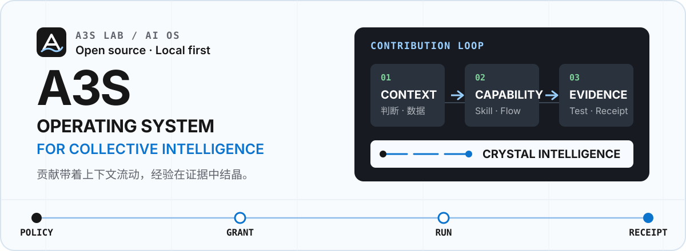
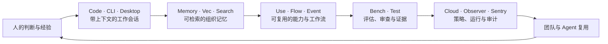

<div align="center">
  <p>
    
  </p>

  <h1>A3S Lab</h1>
  <p><strong>为 Agent 时代构建 AI 原生操作系统</strong></p>
  <p>让每一次个人贡献，都能沉淀为团队下一次可调用的晶体智力。</p>

  <p>
    <a href="https://a3s-lab.github.io/a3s/">🏠 网站</a> ·
    <a href="https://a3s-lab.github.io/a3s/download/">⬇️ 下载 A3S Desktop</a> ·
    <a href="https://github.com/A3S-Lab/a3s">📦 A3S OS 源码</a> ·
    <a href="https://github.com/orgs/A3S-Lab/repositories">🧩 全部项目</a>
  </p>
</div>

<p align="center">
  <a href="https://github.com/A3S-Lab/a3s/actions"></a>
  <a href="https://github.com/A3S-Lab/a3s/stargazers"></a>
  <a href="https://github.com/A3S-Lab/a3s/blob/main/LICENSE"></a>
  <a href="https://www.rust-lang.org/"></a>
</p>

A3S Lab 是一个开源实验室，专注于大规模、高可用的 AI Agent 基础设施。我们正在构建 **A3S OS**：一个 local-first 的运行时平台，让团队在自己的数据和权限边界内创建、运行、协作和运营 Agent。

A3S OS 把会话、模型、工具、记忆、工作流、隔离执行、观测和 Cloud 控制平面连接成一套明确的契约。你可以从一台电脑上的 `a3s code` 开始，按工作需要逐步加入能力编排、持久化记忆、沙箱、推理服务和团队治理。

> **我们的判断**：AI 的价值不只在于回答一次问题，而在于让每次经过验证的判断，都能成为组织下一次行动的起点。

## A3S OS：把 Agent 工作变成组织能力

传统软件把数据、流程和权限分散在不同系统里；早期 AI 工具又把经验困在一次性对话和个人账号中。A3S OS 提供一条可追溯的贡献链：



每个环节都有清晰的所有者：宿主决定策略，能力遵守授权，工作流保存状态，运行时负责生命周期，Provider 执行具体动作，证据回到发起这项工作的组织。系统因此可以渐进式部署，也可以在需要时替换模型、执行后端或基础设施。

## 两种理论：流体治理与晶体智力

### 流体治理 · Fluid Governance

**流体治理**把治理看成随工作流动的边界系统。组织不靠层层审批来维持秩序，而是让策略、权限、数据、工具、算力和责任围绕任务动态组合；任务结束，临时授权收回，状态与证据回到组织。

它包含四个动作：

1. **策略先于行动**：宿主拥有模型、工具、数据和权限的最终选择权，Agent 只能在明确的边界内行动。
2. **授权随任务流动**：能力通过类型化、可撤销的 grant 进入会话和工作流，最小权限跟随上下文，而不是永久绑定给个人或服务。
3. **执行保持可替换**：本地进程、容器、MicroVM、远程 Provider 通过契约连接，治理规则不会被某个供应商锁定。
4. **证据闭合回流**：身份、版本、摘要、健康状态、审批和执行回执被保留下来，形成可复盘、可回滚、可改进的闭环。

流体治理让“安全”与“速度”成为同一个系统问题：创造力可以快速流动，风险边界仍然清晰可见。

### 晶体智力 · Crystal Intelligence

**晶体智力**是团队在长期协作中形成的结构化、可验证、可复用的认知资产。它像晶体从成核点持续生长：一个人的判断带着上下文被记录，经过评估后变成 Skill、Tool、知识、记忆或工作流，再被更多成员和 Agent 调用。

晶体智力具备五个性质：

- **有上下文**：知道结论来自什么问题、数据、约束和决策。
- **可验证**：有测试、评估、人工审查或运行证据，而不是只有一句“模型说”。
- **可组合**：能力通过稳定接口连接，能够编排成更高阶的工作流。
- **可版本化**：变更、依赖、授权和回滚路径清晰，经验可以持续迭代。
- **有归属**：贡献者、团队和组织拥有相应的访问权、责任和收益。

模型提供通用的计算能力，晶体智力承载企业独有的判断、方法和记忆。前者可以采购，后者只能在真实工作中持续积累。

## 为什么企业需要 A3S OS

企业最稀缺的资产通常不在某一份文档里，而在专家做判断时使用的上下文、取舍和隐性流程。人员流动、部门壁垒和一次性 AI 试点，会让这些资产难以传承；没有治理的 Agent 又会把数据、权限和责任变成新的风险。

A3S OS 为企业提供一个可以共同建设的“晶体智力大脑”：

| 企业要解决的问题 | A3S OS 带来的能力 | 组织得到的结果 |
| --- | --- | --- |
| 经验散落在个人、文档和聊天记录中 | **Memory + Vec + Search** 保存上下文并提供可追溯检索 | 新成员能复用经过验证的经验，知识不会随人员离开而消失 |
| AI 试点彼此割裂，无法形成复利 | **Code + Use + Flow** 把会话、能力和流程变成共享资产 | 一次贡献可以被不同团队、应用和 Agent 组合使用 |
| 自动化越多，权限和合规越难控制 | **宿主策略 + 签名能力 + Box/Sandbox 隔离** | 每次行动都有边界、授权和责任，敏感数据可以留在本地 |
| 关键流程依赖人工盯守 | **Event + Lane + Cloud** 提供持久化编排、队列和控制平面 | 工作能恢复、重放、扩展和交接，运营从“盯任务”变成“管策略” |
| 被单一模型或基础设施供应商锁定 | **Runtime 的类型化契约与可替换 Provider** | 企业可以按成本、性能、合规和地域选择模型与执行环境 |
| 无法证明 AI 真的带来质量提升 | **Bench + Test + Observer + Sentry** 记录评估、运行和异常证据 | 改进有数据依据，发布与回滚有明确门槛 |

建设过程可以从一个团队开始：

1. 成员在本地 A3S 会话中完成真实工作，保留必要的上下文和权限。
2. 团队把高频判断提炼为 Skill、Tool、知识或工作流，并写入可读的契约。
3. 通过测试、评估和人工审查，让有效做法成为有版本的晶体。
4. 由 Cloud、策略和观测能力管理发布、访问、运行和回滚。
5. 让新的成员和 Agent 在授权范围内复用这些晶体，继续贡献下一层结构。

这就是企业需要 A3S OS 的原因：它把“大家都在用 AI”变成“组织拥有一个会生长、可治理、能传承的共同大脑”。

## 项目矩阵

每个项目独立演进，A3S OS 负责把它们组合成一条一致的工作路径。

| 方向 | 项目 | 解决什么问题 |
| --- | --- | --- |
| **入口与工作台** | [A3S](https://github.com/A3S-Lab/a3s) · [CLI](https://github.com/A3S-Lab/CLI) · [Code](https://github.com/A3S-Lab/Code) · [Desktop](https://github.com/A3S-Lab/a3s/tree/main/apps/desktop) | 从终端、SDK 和原生工作台启动 Agent 会话，管理模型、工具、上下文与权限 |
| **能力与编排** | [Use](https://github.com/A3S-Lab/Use) · [Flow](https://github.com/A3S-Lab/Flow) · [Event](https://github.com/A3S-Lab/Event) · [Lane](https://github.com/A3S-Lab/Lane) | 安装签名能力，编排持久化工作流、事件和队列 |
| **记忆与检索** | [Memory](https://github.com/A3S-Lab/Memory) · [Vec](https://github.com/A3S-Lab/Vec) · [Search](https://github.com/A3S-Lab/Search) | 保存长期上下文，提供向量、全文和混合检索 |
| **执行与隔离** | [Runtime](https://github.com/A3S-Lab/Runtime) · [Box](https://github.com/A3S-Lab/Box) · [Sandbox](https://github.com/A3S-Lab/Sandbox) · [OCI-Runtime](https://github.com/A3S-Lab/OCI-Runtime) | 以统一生命周期运行任务与服务，并隔离代码、网络和系统资源 |
| **推理与领域能力** | [Power](https://github.com/A3S-Lab/Power) · [MoE](https://github.com/A3S-Lab/MoE) · [Office](https://github.com/A3S-Lab/Office) · [Science](https://github.com/A3S-Lab/Science) | 管理模型服务、算力驻留，以及办公和科学工作的 Agent 能力 |
| **企业控制与治理** | [Cloud](https://github.com/A3S-Lab/Cloud) · [Gateway](https://github.com/A3S-Lab/Gateway) · [Observer](https://github.com/A3S-Lab/Observer) · [Sentry](https://github.com/A3S-Lab/Sentry) · [Updater](https://github.com/A3S-Lab/a3s/tree/main/crates/updater) | 提供自托管控制平面、流量、观测、策略执行和可信更新 |
| **质量与证据** | [Bench](https://github.com/A3S-Lab/Bench) · [Test](https://github.com/A3S-Lab/Test) · [ACL](https://github.com/A3S-Lab/ACL) | 用评估、测试和 A3S ACL 配置，让行为可重复、可审查、可发布 |

## 从这里开始

### 个人开发者

```bash
curl --proto '=https' --tlsv1.2 -LsSf \
  https://raw.githubusercontent.com/A3S-Lab/a3s/main/install.sh | sh

cd /path/to/your/project
a3s config init
a3s code
```

先在一个真实项目中完成一次工作，再按需加入检索、能力、工作流和隔离执行。查看 [安装说明](https://github.com/A3S-Lab/a3s#installation)、[CLI 参考](https://github.com/A3S-Lab/a3s/blob/main/docs/cli-reference.md) 和 [文档站](https://a3s-lab.github.io/a3s/)。

### 企业团队

从一个有明确边界的流程开始：让成员贡献带上下文的案例，定义可复用的能力，设置评估门槛，再将通过验证的晶体发布给团队。需要自托管控制平面时，阅读 [Cloud](https://github.com/A3S-Lab/Cloud) 与 [兼容性锁](https://github.com/A3S-Lab/a3s/blob/main/compat/cloud-stack.acl)。

## 参与建设

A3S Lab 以开放协作为默认方式。你可以：

- 从 [A3S OS](https://github.com/A3S-Lab/a3s) 或项目矩阵中选择一个仓库，阅读对应 README 和贡献指南。
- 在相关仓库提交 Issue，报告可复现的问题，或描述一个真实的 Agent 工作场景。
- 通过 Pull Request 改进代码、文档、测试和评估证据；让每个变更都能被理解、验证和复用。
- 在 [组织仓库列表](https://github.com/orgs/A3S-Lab/repositories) 中发现更多项目。

我们相信，最好的组织智能不是某个系统替团队思考，而是让每个人都能安全地贡献，让团队能够看见、验证并继承这些贡献。

<p align="center">
  <strong>Build the operating system for collective intelligence.</strong><br>
  <a href="https://a3s-lab.github.io/a3s/">开始探索 A3S OS →</a>
</p>
