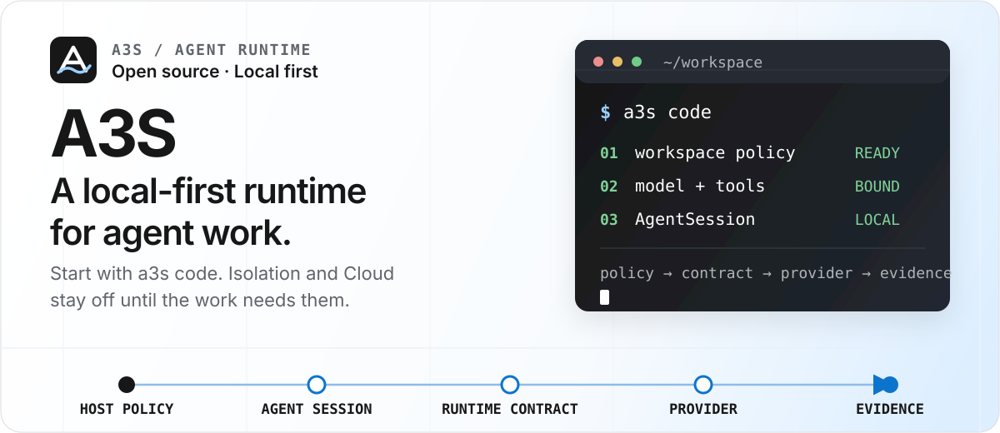
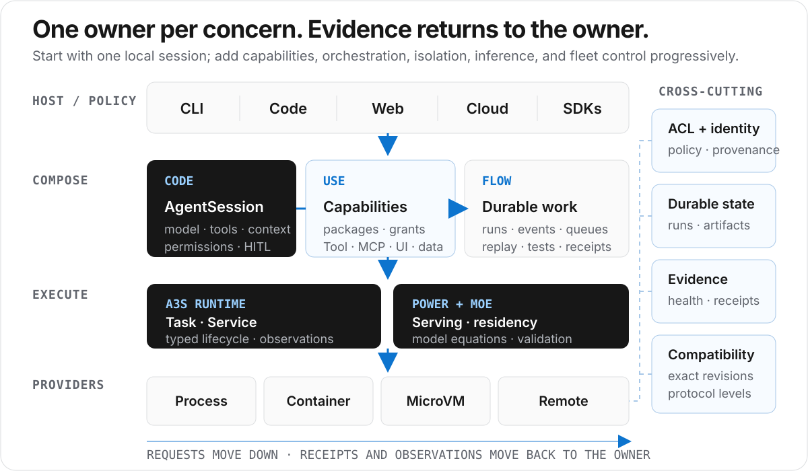

<p align="center">
  
</p>

<p align="center">
  <strong>Build, run, and operate agents through one explicit interface—from a local workspace to Box and Cloud.</strong>
</p>

<p align="center">
  <a href="https://github.com/A3S-Lab/a3s/actions/workflows/installers.yml"></a>
  <a href="https://github.com/A3S-Lab/CLI/releases/latest"></a>
  <a href="https://crates.io/crates/a3s"></a>
  <a href="https://www.rust-lang.org/"></a>
  <a href="LICENSE"></a>
</p>

<p align="center">
  <a href="#quick-start">Quick start</a> ·
  <a href="#how-a3s-grows-with-the-job">Architecture</a> ·
  <a href="#product-surfaces">Products</a> ·
  <a href="#repository-map">Repository map</a> ·
  <a href="https://a3s-lab.github.io/a3s/">Website &amp; Blog</a>
</p>

---

A3S treats an agent as a unit that can be **built, deployed, and operated**—not
as a chat box attached to an existing system. It gives sessions, models, tools,
state, workflows, execution, and permissions one interface while keeping every
external dependency visible.

A3S is the integration snapshot for independently versioned products and
libraries. The canonical [`a3s` CLI](crates/cli/) is pinned as a submodule; its
standalone repository owns source, CI, tags, releases, and detailed product
documentation. The monorepo root owns orchestration, integration gates,
installers, compatibility locks, and directly tracked applications—not a
second Rust package.

## Quick start

Install the latest stable CLI on macOS or glibc Linux, then launch Code inside a
project:

```bash
curl --proto '=https' --tlsv1.2 -LsSf \
  https://raw.githubusercontent.com/A3S-Lab/a3s/main/install.sh | sh

cd /path/to/project
a3s code
```

A model-backed session needs a configured provider or compatible local account.
The CLI itself, local configuration, component inspection, Web host, and
local-only research do not require an A3S OS login.

```bash
a3s config init
a3s config validate
a3s model list
a3s model use <provider>/<model>
```

Once configured, the same entrypoint supports interactive work, automation, a
local browser workbench, and evidence-backed research:

```bash
a3s code
a3s code exec "Check the API boundary and run its focused tests."
a3s web -d
a3s code research --web "Compare the current implementation with its design"
```

See [Installation](#installation) for Windows, Homebrew, Cargo, offline use, and
release-channel details.

Runtime-hosted Agent releases use the same bundled Code engine through the one
native process declared by the release contract:

~~~bash
a3s code harness --manifest /app/.a3s/asset.acl
~~~

This process exposes only the bounded Code command, event-page, and declared
health routes. Cloud, Fleet, and the Node Agent transport those contracts; they
do not own another Harness loop, run store, scheduler, or event log. If the
manifest declares `persistent_data = "external"`, the active Code ACL config
must point `sessions_dir` at an existing absolute Runtime-mounted directory.
`persistent_data = "none"` keeps Harness session and memory state process-local.

The complete TUI, permission, session, and component command reference lives in
the [pinned CLI reference](crates/cli/docs/cli-reference.md).

## Why A3S

- **Local first.** Ordinary work stays on the developer machine. Box and Cloud
  are explicit execution choices, not hidden defaults.
- **One boundary model.** ACL configuration, permissions, accounts, models, and
  component lifecycle are resolved by the umbrella CLI.
- **Durable work.** Sessions, events, artifacts, memory, workflow checkpoints,
  and evaluation results survive one conversation or process.
- **Composable contracts.** Hosts own policy; Runtime, capability, data, and
  infrastructure providers remain replaceable.
- **Evidence over implication.** Installation, authorization, activation,
  execution, health, and publication are separate states with separate proof.

## How A3S grows with the job

<p align="center">
  
</p>

The system expands progressively. A local Code session does not require the
whole platform, and adding a catalog entry does not silently activate a
capability or infrastructure dependency.

| Stage | Contract introduced | Projects that own it |
| --- | --- | --- |
| **Build** | Agent session, model, tools, context, permissions | [Code](crates/code/), [TUI](crates/tui/), [Web](apps/web/) |
| **Extend** | Typed capability and content packages | [Use](crates/use/), [Browser](crates/browser/), [Search](crates/search/), [OCR](crates/ocr/), [Parser](crates/parser/), [Office](packages/office/), [Science](packages/science/) |
| **Coordinate** | Replay-safe workflows, events, queues, verification | [Flow](crates/flow/), [Event](crates/event/), [Lane](crates/lane/), [Bench](crates/bench/), [Test](crates/test/) |
| **Execute** | Finite Tasks, long-running Services, isolation, model serving | [Runtime](crates/runtime/), [Box](crates/box/), [OCI Runtime](crates/oci-runtime/), [Power](crates/power/), [Boot](crates/boot/) |
| **Scale** | Traffic, desired state, placement, reconciliation | [Gateway](crates/gateway/), [Cloud](apps/cloud/), [ORM](crates/orm/) |
| **Govern** | Observation, enforcement decisions, signed updates | [Observer](crates/observer/), [Sentry](crates/sentry/), [Updater](crates/updater/) |

Five invariants keep those layers honest:

1. Product hosts own policy and select the models, tools, providers, and
   permissions they use.
2. Core interfaces stay replaceable; external services are never treated as
   invisible defaults.
3. Durable systems persist identity for sessions, workflows, runtime units,
   evaluations, and Cloud operations.
4. Policy and enforcement remain separate—for example, Code routes permission
   decisions while a sandbox provider enforces a local command boundary.
5. Configuration is ACL parsed and generated by [`a3s-acl`](crates/acl/). ACL
   is not HCL and must not be handled by an HCL parser.

The detailed command and process design lives in the
[CLI product design](crates/cli/docs/cli-product-design.md) and
[CLI technical architecture](crates/cli/docs/cli-technical-architecture.md).

## Product surfaces

The standalone CLI owns invocation context, shared configuration, output
policy, credentials, discovery, and lifecycle. Product behavior stays in the
component that implements it.

| Surface | Start here | Delivery boundary |
| --- | --- | --- |
| **Code** | `a3s code` | Bundled agent runtime and terminal host |
| **Web** | `a3s web` | Bundled loopback API plus Web assets when the release includes them |
| **Research** | `a3s code research --web "…"` | Bundled typed runner producing run-scoped Markdown and editable HTML evidence |
| **Top** | `a3s top` | Bundled view of agents, containers, sessions, and events |
| **Box** | `a3s box ps` | Managed product for explicit local isolation and OCI workloads |
| **Search** | `a3s search …` | Managed Browser-first search product with quality-gated fallbacks |
| **Use** | `a3s use capabilities --json` | Independently versioned AI-native package manager for signed dependency graphs and hot-pluggable Tool, MCP, OKF, A3S Flow, Skill, and UI surfaces |
| **Bench** | `a3s bench …` | Managed evaluation product; [v0.1.2](https://github.com/A3S-Lab/Bench/releases/tag/v0.1.2) ships compatible components for Linux x86_64 and macOS arm64 |
| **Cloud** | [`compat/cloud-stack.acl`](compat/cloud-stack.acl) | Self-hosted control plane governed by a revision and protocol compatibility lock |

Use has not shipped a supported cognitive-package product release. The pinned
preview accepts one contract line only: manifest v3, catalog v3, receipt v3,
plan v4, host protocol v4, manager tools v4, pending graph v2, enablement
state/operation v2, and CLI plugin operation record v3. Superseded preview
records are rejected with cleanup and reinstall guidance; SemVer,
`requires_use`, target, and provider checks remain package-manager correctness
rules.

One package generation may contain Tool, MCP, OKF, A3S Flow, Skill, and UI
surfaces. Lifecycle intents, Runtime/Flow/OKF bindings, Knowledge evidence, and
capability observations retain the complete `PlanScope { kind, id }`; User and
Workspace state remain disjoint even when their IDs match. The pinned CLI host
observes the Use-owned generation and performs reviewed enable or disable
without reinstalling package bytes or rewriting the dependency graph. CLI,
Web, and Code TUI `/packages` use the same persisted plan, collect confirmation,
and apply only its operation ID and canonical digest. Complete graph plans bind
the exact User/Workspace Grant scope and durable revision, apply host policy,
and forward unchanged authority and confirmation into Use-owned apply and
replay. Permission-bearing enablement uses the same Grant-before-publish and
hide/drain-before-revoke saga.

Code configuration and plugin authorization are separate trust boundaries. TUI
and each Web host create one `PluginManager`; every Web plugin route clones the
startup instance, while cross-process mutations retain the same durable file
lock. Detached Web and the read-only management MCP reparse only the
operator-selected ACL source under a normalized digest lock. An automatically
discovered workspace ACL cannot authorize plugin mutation, and an existing Web
process is reused only when its policy digest and offline mode match exactly.

The standalone Use host now persists a bounded named Registry set in the sole
canonical `state/use/registries.acl` document, with an enabled/default selection
and a content-derived configuration revision shared by CLI, Marketplace, Web,
MCP, and plan/apply. Install may select an explicit `registryName`; dependency
resolution uses the complete enabled set, while upgrade and uninstall remain
bound to installed provenance. Every reviewed plan reports the exact source
revision used, and a new apply intent rejects revision drift before mutation.
Each source identity binds its name, canonical URL, and pinned bootstrap-root
digest to an isolated TUF/cache datastore. Reviewed replacement, default
selection, enablement, disablement, and removal use revision-bound confirmation;
they do not rewrite installed provenance or delete prior source evidence.

The pinned Runtime/Use/CLI line now shares one managed execution lifecycle.
Running Services publish generation-bound typed loopback endpoints; retirement
drains the Gateway route, stops Runtime, removes the route, removes Runtime,
and deletes the exact binding receipt last. Code delegates to this shared Use
factory, but injects no production Runtime selection or Gateway adapter by
default, so release-backed Tool Services and HTTP MCP remain fail-closed rather
than falling back to a package-local launcher.

Signed OKF surfaces now project into a scope-aware local SQLite/FTS5 Knowledge
carrier. Restart, upgrade, disable, re-enable, and uninstall preserve or
withdraw the exact package generation, while cited read-only search hot-plugs
into current and replacement Code TUI/Web sessions. Each accepted query leases
the exact published package, manifest, and lifecycle generation through backend
search and final Registry revision verification, so it participates in Use
lifecycle drain; missing or conflicting lease evidence fails closed before
SQLite access. The composed backend now enforces receipt-accounted whole-scope
byte/projection quotas, bounded per-surface generations and tombstones, physical
SQLite/WAL cleanup, and exact User/Workspace usage diagnostics. Scope-bound
integrity audit verifies SQLite, foreign keys, receipts, accounting, identity,
and FTS evidence; confirmed repair can rebuild only the derived search rows.
Versioned non-overwriting backups bind
the exact scope and can be verified offline. A backup digest detects corruption
but is not a Registry signature or a whole-product recovery artifact. This
remains a local preview boundary: coordinated restore, authority recovery,
backup rotation, managed rollback semantics, distributed Knowledge placement,
and full cross-platform qualification are still release gates.

The standalone Use lifecycle composes real `a3s-flow` Native TypeScript
preflight only when `A3S_FLOW_NATIVE_TS_COMPILER` identifies an explicit
absolute compiler path. Failed preflight keeps the candidate installed-disabled
with no active named-surface projection; retry after provider repair resumes the
same durable plan and generation. Signed Unix and Windows x86_64 real-process
tests cover install, restart observation, exact upgrade, uninstall, failure,
and replay. The Windows gate also kills an upgrade after graph cutover and
proves restart cleanup does not republish or inflate the capability generation.
It now also runs the complete current non-Science Use workspace suite. A shared
host-metadata guard rejects Unix symbolic links and Windows reparse points
across package, Registry/cache, Grant, lifecycle, Runtime, Flow, MCP, and
Knowledge trust boundaries; Windows tests create a real directory junction and
prove package copying fails before external content is read.

Install, upgrade, and uninstall accept only verified catalog-v3 evidence with
complete Use-owned dependency locks. Reviewed apply runs through Use in the
host process; there is no child `a3s` mutation or direct Web package-toggle
fallback. Upgrade binds the exact prior and candidate locks, while graph-wide
add/replace/remove/retain preserves dependencies still owned by another root.
Registry mutations wait for a transient watcher reconciliation lock within a
bounded budget, while steady-state watcher reads remain non-blocking and a
genuinely concurrent writer still fails closed with `use.extension.busy`.

Use the machine-readable commands before scripting an optional product:

```bash
a3s list --installed
a3s info box
a3s doctor
a3s use knowledge usage --json
a3s use knowledge audit --json
a3s use knowledge backup ./user.a3s-okf-backup --json
a3s use knowledge verify-backup ./user.a3s-okf-backup --json
# Rebuild only a derived FTS index after authoritative state passes audit.
a3s use knowledge repair-search-index --yes --json
```

> [!NOTE]
> A catalog record describes discovery and installation policy. It does not
> prove that every platform or release channel currently contains a compatible
> artifact.

## Current release boundaries

The CLI release channel is owned by the standalone
[`A3S-Lab/CLI`](https://github.com/A3S-Lab/CLI) repository. These boundaries
describe the integration snapshot pinned by this repository's `main` branch:

| Area | Current boundary |
| --- | --- |
| Standalone CLI | Code, Web, Research, configuration, auth, models, diagnostics, reviewed plugin plan/apply, shared TUI/Web Plugin Manager policy, shared Use managed lifecycle composition, component lifecycle, CI, tags, and releases are owned by `A3S-Lab/CLI`; this repository pins one reviewed gitlink |
| Managed products | Box and Search install and run as independently versioned components; artifact availability is platform- and channel-specific |
| Use | `main` pins the single current preview baseline: manifest/catalog/receipt v3, plan/host/manager tools v4, CLI plugin operation record v3, exact SemVer dependency locks, the sole revision-addressed `state/use/registries.acl` source document with identity-isolated TUF/cache state, install-time Registry selection and provenance-pinned upgrade/uninstall, in-process reviewed Grants and graph apply, shared dependency ownership, restart-safe hot-plug across Tool, MCP, OKF, A3S Flow, Skill, and UI, typed Runtime Service endpoint consumption with Gateway drain → Runtime stop → route removal → Runtime removal, explicit standalone Flow preflight with exact replay, a scope-aware local SQLite/FTS5 OKF Knowledge carrier with cited TUI/Web search and exact published-generation query leases, receipt-accounted scope quota, bounded generations/tombstones, physical cleanup, usage diagnostics, scope-bound integrity audit, derived-index repair, versioned backup/offline verification, and a Windows x86_64 signed Registry/graph/Grant/Flow/OKF CLI lifecycle plus killed-process cutover-recovery gate. Managed Knowledge rollback, coordinated restore and authority recovery, backup rotation, distributed Knowledge placement, managed UI delivery, production Runtime provider selection and Gateway injection for Tool Service/HTTP MCP, distributed Flow recovery/retention, production Registry operations, and the complete cross-platform CLI/TUI/Web real-process matrix remain release gates. Use is not a released product. |
| Bench | [v0.1.2](https://github.com/A3S-Lab/Bench/releases/tag/v0.1.2) is installable on Linux x86_64 and macOS arm64; local runs require Docker and remain `local_unofficial` by governance |
| Cloud | R0–E0 is the verified cumulative baseline; later milestones remain tracked by the canonical [Cloud compatibility manifest](compat/cloud-stack.acl) |
| Early projects | Ash is pre-release, Parser is pre-alpha, Office is pre-1.0, and OCI Runtime's native Linux path is experimental rather than the default launch claim |

Release-bearing projects publish on their own cadence. Their manifests and
READMEs are the source of truth for feature flags, supported platforms, tests,
and maturity; this root README describes integration boundaries rather than
duplicating every component changelog.

## Installation

| Method | Command | Notes |
| --- | --- | --- |
| macOS / glibc Linux | `curl --proto '=https' --tlsv1.2 -LsSf https://raw.githubusercontent.com/A3S-Lab/a3s/main/install.sh \| sh` | Installs to `~/.local/bin` by default; does not edit shell profiles unless `A3S_MODIFY_PATH=1` |
| Homebrew | `brew install a3s-lab/tap/a3s` | Supported on macOS and Linux |
| Windows PowerShell 5.1+ | `irm https://raw.githubusercontent.com/A3S-Lab/a3s/main/install.ps1 \| iex` | Installs under `%LOCALAPPDATA%\Programs\a3s\bin` by default |
| Cargo | `cargo install a3s` | CLI-only installation; it does not bundle the complete Web workspace or WebView helper |

The release installers resolve one stable version, require one exact artifact
for the detected platform, verify GitHub's SHA-256 release digest and the staged
binary version, reject unsafe archive entries, and preserve the previous
installation if activation fails.

Use `A3S_OFFLINE=1` and `A3S_NO_AUTO_INSTALL=1` when automatic setup must perform
zero network access and zero component mutation. Standalone macOS and Linux
installs can use `a3s self update --check` and `a3s self update`; Homebrew-managed
installs should update through Homebrew. Windows currently upgrades by rerunning
the installer.

Full installer controls and platform notes are in the
[CLI reference](docs/cli-reference.md) and the standalone [CLI repository](crates/cli/).

Standalone versions 0.9.9 through 0.10.10 already read `A3S-Lab/CLI` releases.
Versions 0.11.0 and 0.11.1 briefly used the monorepo endpoint; a verified,
asset-only compatibility relay remains here so those clients can perform one
update back to the CLI-owned release channel.

## Repository map

The repository root is a monorepo integration point, not a Rust package or
Cargo workspace. Most components are external repositories tracked as git
submodules, while directly tracked applications and integration assets remain
root-owned.

| Group | Projects |
| --- | --- |
| Product hosts | [CLI](crates/cli/), [Code](crates/code/), [Ash](crates/ash/), [Web](apps/web/), [Windhole](apps/windhole/), [Cloud](apps/cloud/) |
| Capabilities and content | [Use](crates/use/), [Browser](crates/browser/), [Search](crates/search/), [OCR](crates/ocr/), [Parser](crates/parser/), [Office](packages/office/), [Science](packages/science/) |
| Runtime, coordination, and data | [Runtime](crates/runtime/), [Box](crates/box/), [OCI Runtime](crates/oci-runtime/), [Flow](crates/flow/), [Event](crates/event/), [Lane](crates/lane/), [Memory](crates/memory/), [ORM](crates/orm/) |
| Verification | [Bench](crates/bench/), [Test](crates/test/) |
| Services and interfaces | [Boot](crates/boot/), [Gateway](crates/gateway/), [Power](crates/power/), [AHP](crates/ahp/), [ACL](crates/acl/), [Common](crates/common/), [TUI](crates/tui/), [GUI](crates/gui/), [UI](packages/ui/), [WebView](crates/webview/) |
| Operations and distribution | [Observer](crates/observer/), [Sentry](crates/sentry/), [Updater](crates/updater/), [Website & Blog](apps/docs/), [Homebrew Tap](homebrew-tap/) |

The [CLI repository migration record](docs/cli-repository-migration.md)
documents the temporary 0.11.x root migration, restored standalone ownership,
and legacy-client release relay. The interactive
[project directory](https://a3s-lab.github.io/a3s/#ecosystem) lists each
project's responsibility, delivery stage, website, and source-code entrypoint.

## Development

Clone the exact integration snapshot:

```bash
git clone --recurse-submodules git@github.com:A3S-Lab/a3s.git
cd a3s
```

For an existing checkout, run `git submodule update --init --recursive`.

> [!IMPORTANT]
> The repository root is not a Rust package or Cargo workspace. Run Rust
> commands from the submodule that owns the code; the root `justfile` only
> orchestrates cross-project development and verification.

A typical CLI validation runs from the pinned CLI submodule:

```bash
cd crates/cli
cargo fmt --all -- --check
cargo test --all-targets
cargo clippy --all-targets -- -D warnings
```

Validate another Rust project from its owning submodule instead:

```bash
cd crates/<project>
cargo fmt --all -- --check
cargo test --all-targets
cargo clippy --all-targets -- -D warnings
```

The root `justfile` provides the common integration entrypoints:

```bash
just code
just web
just docs
just windhole
just use-hotplug-e2e
just cloud-stack-check
```

Submodules and the root repository have separate Git histories. Commit a
component change in its owning repository before updating its gitlink here, and
read [AGENTS.md](AGENTS.md) before changing repository structure.

## Documentation and community

- [A3S website and engineering blog](https://a3s-lab.github.io/a3s/)
- [CLI reference](docs/cli-reference.md)
- [CLI releases](https://github.com/A3S-Lab/CLI/releases)
- [Discord](https://discord.gg/XVg6Hu6H)

Each project README records its detailed APIs, feature flags, platform
requirements, verification commands, and remaining limitations.

## License

This integration repository is licensed under the [MIT License](LICENSE).
Independently versioned projects retain the license declared by their owning
repositories.
