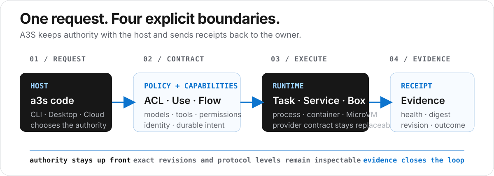

<p align="center">
  
</p>

<p align="center">
  <strong>语言 / Language:</strong>
  <a href="README.md">English</a> ·
  <a href="README.zh-CN.md">中文</a>
</p>

<p align="center">
  <a href="https://github.com/A3S-Lab/a3s/actions/workflows/installers.yml"></a>
  <a href="https://github.com/A3S-Lab/CLI/releases/latest"></a>
  <a href="https://crates.io/crates/a3s"></a>
  <a href="https://www.rust-lang.org/"></a>
  <a href="LICENSE"></a>
</p>

<p align="center">
  <a href="#起步">起步</a> ·
  <a href="#选择入口">入口</a> ·
  <a href="#一次请求如何流动">请求路径</a> ·
  <a href="#安装">安装</a> ·
  <a href="#仓库">仓库</a> ·
  <a href="https://a3s-lab.github.io/a3s/">网站</a>
</p>

A3S 是面向 Agent 工作的开源、本地优先运行时。会话自己声明模型、工具和权限；工作通过有类型的契约执行；隔离和 Cloud 只有在这次工作需要时才接入。

> [!IMPORTANT]
> 本仓库是已审阅的集成快照。多数产品以 git 子模块钉在这里。根仓库只负责安装器、编排、兼容性锁和这份首页。它不是 Rust workspace，也不是各产品的第二份拷贝。

## 起步

产品命令是 **`a3s`**。交互会话是 **`a3s code`**。只选一种安装渠道。

```bash
brew tap a3s-lab/tap https://github.com/A3S-Lab/homebrew-tap
brew install a3s
cd /path/to/project
a3s code
```

依赖模型的会话需要显式指定提供方：

```bash
a3s config init
a3s config validate
a3s model list
a3s model use <provider>/<model>
```

| 目的 | 命令 |
| --- | --- |
| 交互会话 | `a3s code` |
| 一次有界任务 | `a3s code exec "Check the API boundary and run its focused tests."` |
| 带证据的研究笔记 | `a3s code research --web "Compare the implementation with its design"` |
| 查看隔离工作负载 | `a3s box ps` |
| 查看已安装产品 | `a3s list --installed` |

需要原生窗口时，下载 [A3S Desktop](https://a3s-lab.github.io/a3s/download/)。它是基于本地 Code 内核的 Tauri 工作台，不是 `a3s` 二进制的外壳。其他安装渠道见[安装](#安装)。

## 选择入口

先用 Code。只有这项工作需要另一个所有者时，再接入对应入口。

| 入口 | 从这里开始 | 负责 | 不负责 |
| --- | --- | --- | --- |
| **Code** | `a3s code` | 本地 Agent 会话、工作区、记忆和提供方 | 隔离机制、控制面期望状态 |
| **Desktop** | [下载](https://a3s-lab.github.io/a3s/download/) · [源码](apps/desktop/) | 原生工作台：会话、文档、文件和科研设置 | 不能替代本机 Python 或 R。分析只在已发布的 a3s-box 镜像代次上运行。没有环境锁的清单名称不是已安装环境。 |
| **Box** | `a3s box ps` | 本地 MicroVM 隔离和 OCI 工作负载 | 不会因为装了 Code 就自动启用 |
| **Use** | `a3s use capabilities --json` | 已签名的能力图 | 不表示已安装、已激活或 Registry 可用。发现不是租约。预览阶段。 |
| **Cloud** | [`compat/cloud-stack.acl`](compat/cloud-stack.acl) | 精确兼容锁下的自托管控制面 | 不是本地会话的默认路径 |

> [!NOTE]
> 目录记录可以描述一个组件，但不证明每个平台或发布渠道都有兼容制品。

## 一次请求如何流动

<p align="center">
  
</p>

宿主选择权威。[ACL](crates/acl/) 和 [Use](crates/use/) 说明这次工作可以做什么。Code、Flow、Runtime 和 Box 执行它。健康状态、摘要、修订和回执作为证据回到所有者手中。ACL 是 Agent 配置语言，不是 HCL，必须用 `a3s-acl` 解析和生成。

<p align="center">
  
</p>

四条规则让部件可以替换：

1. 宿主拥有策略。后端不发明权威。
2. 一件事只有一个所有者。Cloud 拥有期望状态，Flow 拥有持久编排，Runtime 拥有与提供方无关的生命周期，具体提供方拥有强制执行。
3. 进程、容器、MicroVM 和远程提供方都走有类型的契约。它们都不是隐藏默认值。
4. 摘要、修订和回执是不同事实。安装不是授权，授权也不是一次已完成的运行。

支持范围以拥有该行为的组件为准。本页不给整个系统一个统一成熟度标签。

| 主张 | 事实所在 |
| --- | --- |
| CLI 发布与安装器 | [CLI](https://github.com/A3S-Lab/CLI) · [安装器 CI](.github/workflows/installers.yml) |
| Desktop 安装包与更新 | 本仓库标签 `desktop-vX.Y.Z`。签名、公证和更新源见[桌面发布](docs/desktop-release.md)。 |
| 命令隔离 | [Sandbox](crates/sandbox/) |
| Cloud 与工作流版本 | [Cloud 兼容锁](compat/cloud-stack.acl) |
| 能力 | [Use](crates/use/) · [Use Registry](use-registry/) |

## 安装

只选**一种**渠道并沿用它。`PATH` 上更靠前的另一份拷贝，是 `a3s` 看起来已安装却跑错二进制的常见原因。

| 系统 | 架构 | 渠道 |
| --- | --- | --- |
| macOS 12+ | Apple Silicon、Intel | 安装器、Homebrew、Cargo |
| Linux（glibc） | `x86_64`、`aarch64` | 安装器、Homebrew、Cargo |
| Windows 10/11 | 仅 `x64` | PowerShell 安装器、Cargo |

伞形 CLI 目前不提供：musl/Alpine、Windows ARM、MinGW、Cygwin。安装器解析一个 SemVer，要求对应平台制品，校验 SHA-256 和 `a3s --version`；激活失败则保留上一份安装。不会使用 `sudo` 或 UAC。

### Homebrew（macOS 和 Linux）

会安装 `a3s`、`a3s-webview`、随附的 `moli/` 运行时和 `libzvec`。

```bash
brew tap a3s-lab/tap https://github.com/A3S-Lab/homebrew-tap
brew install a3s
a3s --version
```

```bash
brew update && brew upgrade a3s
brew uninstall a3s
```

不要执行 `brew install a3s-code`。那是旧的独立二进制，不提供 `a3s`。tap 里的其他公式（`a3s-box`、`a3s-search`、`a3s-power`）是独立产品。

如果升级卡在 `a3s-webview` 符号链接，或旧的 `a3s-code` 公式还在：

```bash
brew uninstall a3s-code 2>/dev/null || true
brew uninstall a3s-webview 2>/dev/null || true
brew uninstall --force a3s 2>/dev/null || true
brew install a3s-lab/tap/a3s
```

### 安装器

在 macOS 和 glibc Linux 上，`PATH` 里有 Homebrew 就用 Homebrew，否则把 GitHub 归档装到 `~/.local/bin`。

```bash
curl --proto '=https' --tlsv1.2 -LsSf \
  https://raw.githubusercontent.com/A3S-Lab/a3s/main/install.sh | sh
```

```bash
# 只检查，不改动
curl --proto '=https' --tlsv1.2 -LsSf \
  https://raw.githubusercontent.com/A3S-Lab/a3s/main/install.sh | sh -s -- --dry-run
```

`--channel binary` 强制使用 GitHub 归档。`--channel brew` 在没有 Homebrew 时失败。可用变量：`A3S_VERSION`、`A3S_INSTALL_DIR`、`A3S_CHANNEL`、`A3S_YES`、`A3S_DRY_RUN`、`A3S_GITHUB_TOKEN`、`A3S_MODIFY_PATH=1`。

Homebrew 渠道用 `brew upgrade a3s` 更新。二进制渠道用 `a3s self update` 或重跑安装器。卸载二进制渠道：

```bash
rm -f ~/.local/bin/a3s ~/.local/bin/a3s-webview ~/.local/bin/a3s-code
rm -rf ~/.local/bin/moli
```

Windows x64（PowerShell 5.1+）安装到 `%LOCALAPPDATA%\Programs\a3s\bin`：

```powershell
irm https://raw.githubusercontent.com/A3S-Lab/a3s/main/install.ps1 | iex
```

运行前设置 `$env:A3S_MODIFY_PATH = '1'` 可更新用户 PATH。用同一条命令更新。卸载时先退出 `a3s`，删除该目录，并在你曾经添加时清掉 PATH 项。

### Cargo

```bash
cargo install a3s --locked
```

Cargo 从 crates.io 安装 CLI。不保证带上发布包里的 `a3s-webview` 和 `moli/`。需要完整布局时优先用 Homebrew 或安装器。

### 安装之后

```bash
a3s --version
which a3s
a3s code
```

卸载二进制不会删除 `~/.a3s/`（或 Windows 上的对应目录）。只有在你打算清掉本地配置和缓存时才删除它。

`A3S_OFFLINE=1` 和 `A3S_NO_AUTO_INSTALL=1` 会停止运行时组件安装和网络变更。它们不能把在线安装器变成离线安装器。

## 仓库

```text
a3s/
├── apps/          Cloud、Desktop、docs、Windhole
├── packages/      Office、Science、UI
├── crates/        宿主、能力、运行时、服务
├── compat/        精确修订与协议锁
├── use-registry/  钉住的已签名 Use Registry 部署
└── homebrew-tap/  发布公式
```

克隆完整快照，不要只拉半棵树：

```bash
git clone --recurse-submodules git@github.com:A3S-Lab/a3s.git
cd a3s
```

已有检出则执行 `git submodule update --init --recursive`。

> [!IMPORTANT]
> 不要在根目录添加 `Cargo.toml` 或运行 `cargo init`。在拥有该改动的组件里构建和测试。先在该组件自己的仓库提交，再在这里推进 gitlink。

根目录 `justfile` 只做编排。Desktop 的 JavaScript 依赖在 `apps/desktop/package-lock.json`；使用 desktop 配方前先执行一次 `cd apps/desktop && npm ci`。

```bash
just desktop
just desktop-check
just code
just docs
just cloud-stack-check
```

<details>
<summary><strong>组件索引</strong></summary>

| 分组 | 项目 |
| --- | --- |
| 宿主 | [CLI](crates/cli/)、[Code](crates/code/)、[Desktop](apps/desktop/)、[Cloud](apps/cloud/)、[Ash](crates/ash/)、[Windhole](apps/windhole/) |
| 能力与内容 | [Use](crates/use/)、[Browser](crates/browser/)、[Search](crates/search/)、[OCR](crates/ocr/)、[Parser](crates/parser/)、[Office](packages/office/)、[Science](packages/science/) |
| 执行 | [Runtime](crates/runtime/)、[Sandbox](crates/sandbox/)、[Box](crates/box/)、[OCI Runtime](crates/oci-runtime/)、[Power](crates/power/)、[MoE](crates/moe/) |
| 协调 | [Flow](crates/flow/)、[Event](crates/event/)、[Lane](crates/lane/)、[Memory](crates/memory/)、[ORM](crates/orm/)、[Gateway](crates/gateway/) |
| 界面 | [ACL](crates/acl/)、[Boot](crates/boot/)、[TUI](crates/tui/)、[GUI](crates/gui/)、[WebView](crates/webview/)、[UI](packages/ui/) |
| 验证与运维 | [Bench](crates/bench/)、[Test](crates/test/)、[Observer](crates/observer/)、[Sentry](crates/sentry/)、[Updater](crates/updater/) |

</details>

[项目目录](https://a3s-lab.github.io/a3s/#ecosystem)列出每个项目的角色、阶段和发布渠道。[AGENTS.md](AGENTS.md) 是这个根仓库的贡献约定。

## 延伸阅读

- [网站](https://a3s-lab.github.io/a3s/)
- [Desktop 下载](https://a3s-lab.github.io/a3s/download/)
- [CLI 参考](docs/cli-reference.md)
- [Desktop 发布](docs/desktop-release.md)
- [Cloud 兼容锁](compat/cloud-stack.acl)
- [Discord](https://discord.gg/XVg6Hu6H)

## 许可证

本集成仓库采用 [MIT](LICENSE)。被钉住的项目保留各自所属仓库声明的许可证。
