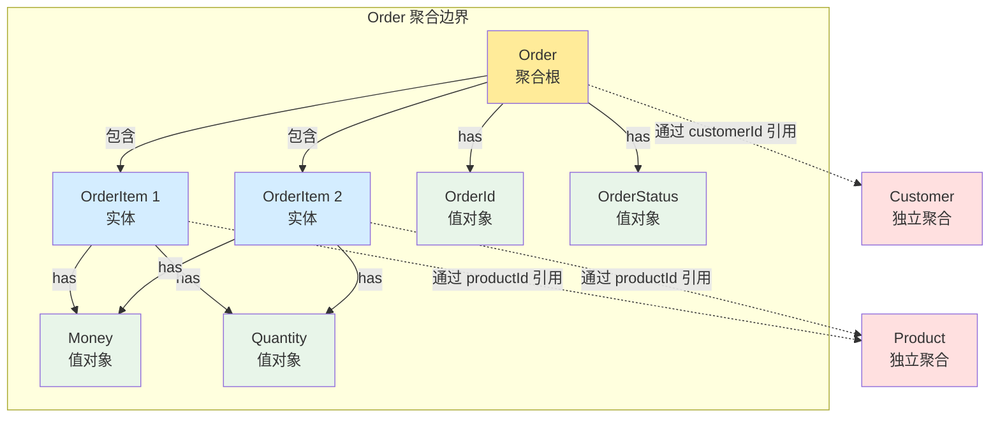
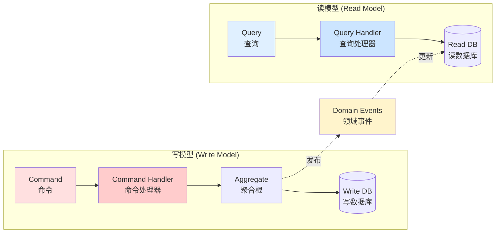
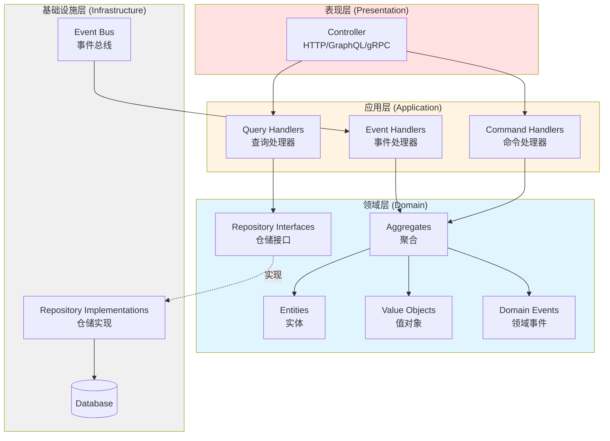
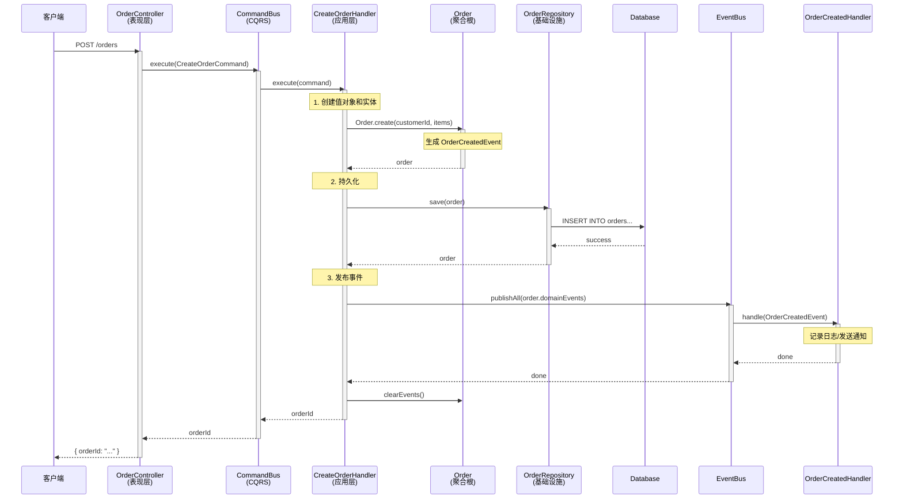
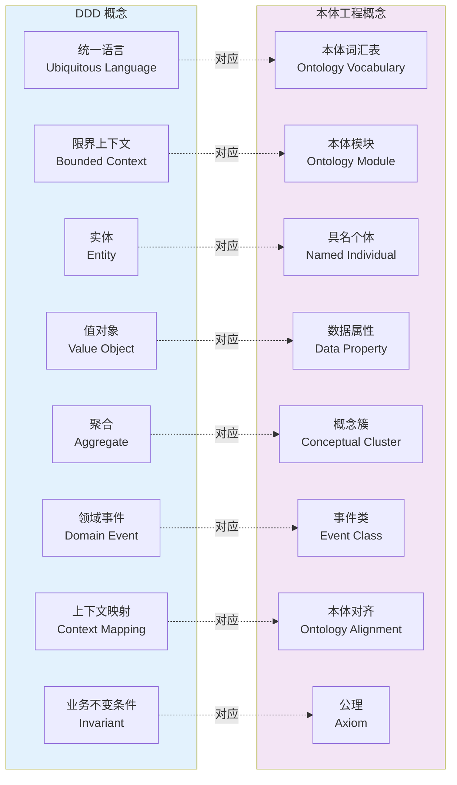

# 领域驱动设计：回归本质的工程实践

---

## 目录

1. [引言：为什么需要领域驱动设计](#一引言为什么需要领域驱动设计)
2. [回归本质：软件是什么](#二回归本质软件是什么)
3. [DDD 的核心哲学与战略设计](#三ddd-的核心哲学与战略设计)
4. [战术设计：构建块详解](#四战术设计构建块详解)
5. [值对象（Value Object）：不可变性的力量](#五值对象value-object不可变性的力量)
6. [实体（Entity）：身份的连续性](#六实体entity身份的连续性)
7. [聚合与聚合根（Aggregate & Aggregate Root）](#七聚合与聚合根aggregate--aggregate-root)
8. [领域事件（Domain Event）：捕获变化的本质](#八领域事件domain-event捕获变化的本质)
9. [CQRS：命令与查询职责分离](#九cqrs命令与查询职责分离)
10. [事件溯源（Event Sourcing）：时间的完整记忆](#十事件溯源event-sourcing时间的完整记忆)
11. [仓储模式（Repository）：持久化的抽象屏障](#十一仓储模式repository持久化的抽象屏障)
12. [领域服务（Domain Service）：跨聚合的业务逻辑](#十二领域服务domain-service跨聚合的业务逻辑)
13. [分层架构：关注点分离的工程实现](#十三分层架构关注点分离的工程实现)
14. [防腐层与异常处理：领域的自我保护](#十四防腐层与异常处理领域的自我保护)
15. [依赖注入与模块化：DDD 在 NestJS 中的落地](#十五依赖注入与模块化ddd-在-nestjs-中的落地)
16. [从理论到实践：完整订单领域的实现路径](#十六从理论到实践完整订单领域的实现路径)
17. [本体工程与 DDD：知识建模的两条路径](#十七本体工程与-ddd知识建模的两条路径)
18. [总结与反思](#十八总结与反思)

---

## 一、引言：为什么需要领域驱动设计

在软件工程的历史长河中，我们反复遇到同一个根本性难题：**软件的复杂性不在于技术本身，而在于业务领域的复杂性**。

Eric Evans 在 2003 年出版的《Domain-Driven Design: Tackling Complexity in the Heart of Software》中，提出了一个看似简单却极为深刻的观点：要想构建真正解决业务问题的软件系统，开发者必须深入理解业务领域，并让代码结构忠实反映领域知识。这就是领域驱动设计（Domain-Driven Design，简称 DDD）的起源。

然而，二十多年过去了，DDD 在实际工程中的落地依然充满挑战。很多团队要么将 DDD 当作一套"技术模式"生搬硬套，要么在面对复杂业务时不知从何下手。问题的根源在于：**大多数人学习 DDD 时，学的是"怎么做"，而不是"为什么这么做"。**

本文将回归 DDD 的本质动机，追根溯源，结合 Nestify 项目（一个基于 NestJS 的 DDD 实践项目）的完整源码，逐层拆解领域驱动设计的每一个核心概念。我们不仅要知道每个模式的实现方式，更要理解它们存在的根本原因。

---

## 二、回归本质：软件是什么

### 2.1 追根溯源的思考方式

要真正理解 DDD，需要一种将问题分解到最基本事实、然后从根基重新推理的思维方式。当我们用这种方式来思考软件设计时，需要问几个根本性的问题：

**问题一：软件是什么？**

软件的本质是对现实世界某个领域的**数字化建模**。一个电商系统是对"商品交易"这个领域的建模；一个医疗系统是对"诊疗流程"这个领域的建模。无论技术栈如何变化——从单体到微服务，从 REST 到 GraphQL，从 SQL 到 NoSQL——这个本质不会改变。

**问题二：软件复杂性的根源是什么？**

Fred Brooks 在《没有银弹》中区分了两种复杂性：
- **本质复杂性（Essential Complexity）**：来自业务领域本身。一个保险产品的定价规则就是复杂的，这不是你换个框架能解决的。
- **偶然复杂性（Accidental Complexity）**：来自我们选择的技术方案。数据库表结构设计不当、框架滥用、过度抽象——这些是我们自己造成的。

DDD 的核心目标正是：**最大限度地降低偶然复杂性，同时让软件结构与本质复杂性保持一致。**

**问题三：代码腐化的根本原因是什么？**

几乎所有的大型系统都会经历"代码腐化"——随着时间推移，代码越来越难以理解和修改。这背后的根本原因是：**代码结构与业务概念之间的映射关系被破坏了。**

当一个业务概念（比如"订单"）散落在十几个不同的服务、控制器和工具函数中时，任何业务变更都需要在多个位置进行修改，遗漏任何一处都会导致 bug。DDD 通过"聚合"等概念来确保业务概念在代码中有清晰的、集中的表达。

### 2.2 从根本推导 DDD 的核心原则

基于以上思考，我们可以推导出 DDD 的核心原则：

**原则一：代码应该说业务的语言。**
如果领域专家说"确认订单"，代码中就应该有一个 `confirm()` 方法，而不是 `updateStatus(STATUS_CONFIRMED)`。这就是"统一语言"（Ubiquitous Language）的由来。

**原则二：业务规则应该住在领域模型中，而不是散落在服务层。**
"待处理的订单才能被确认"——这是一条业务规则。它应该由 Order 实体自己守护，而不是由某个 Service 在外部检查。这就是"充血模型"的核心思想。

**原则三：技术关注点不应该侵入业务逻辑。**
Order 实体不应该知道自己是被存储在 PostgreSQL 还是 MongoDB 中。数据库是基础设施，不是业务。这就是"分层架构"和"依赖倒置"的动机。

**原则四：变化应该被显式捕获。**
"订单被创建了"、"订单被确认了"——这些是业务上有意义的事实。将它们显式建模为"领域事件"，不仅使系统更加透明，还为事件溯源和跨服务通信打开了大门。

---

## 三、DDD 的核心哲学与战略设计

### 3.1 统一语言（Ubiquitous Language）

DDD 最重要的概念不是任何技术模式，而是**统一语言**。它要求开发团队与业务专家使用同一套语言来描述系统。这套语言应该：

- 出现在需求讨论中
- 出现在代码的类名和方法名中
- 出现在测试用例的描述中
- 出现在文档和 API 设计中

让我们看 Nestify 项目中是如何践行这一原则的：

```typescript
// 业务专家说："创建一个订单"
// 代码中就有：
const order = Order.create(customerId, orderItems);

// 业务专家说："确认这个订单"
// 代码中就有：
order.confirm();

// 业务专家说："取消这个订单"
// 代码中就有：
order.cancel();

// 业务专家说："订单总金额"
// 代码中就有：
const total = order.getTotalAmount();
```

注意这里的方法名不是 `setStatus('confirmed')` 或 `updateOrderState(OrderState.CANCELLED)`，而是直接使用业务术语 `confirm()` 和 `cancel()`。这看似微小的命名差异，实际上反映了一个深刻的设计哲学：**代码不只是给机器执行的指令，更是团队共享的知识载体。**

### 3.2 限界上下文（Bounded Context）

在一个复杂的业务系统中，同一个词在不同的上下文中可能有完全不同的含义。比如"产品"这个概念：

- 在**商品目录**上下文中，产品是一个有名称、描述、图片的展示对象。
- 在**库存管理**上下文中，产品是一个有 SKU、库存数量的库存单元。
- 在**订单管理**上下文中，产品被简化为一个 `productId` 引用和价格。

试图用一个统一的 `Product` 类来满足所有上下文的需求，必然导致一个臃肿、难以维护的"上帝类"。限界上下文的核心思想是：**承认不同的业务子领域需要不同的模型，并为每个模型划定清晰的边界。**

在 Nestify 项目中，我们可以看到订单模块（Order Module）就是一个清晰的限界上下文：

```
modules/order/
├── application/          # 应用层：用例编排
│   ├── commands/         # 命令（写操作）
│   ├── queries/          # 查询（读操作）
│   └── event-handlers/   # 事件处理器
├── domain/               # 领域层：核心业务逻辑
│   ├── entities/         # 实体
│   ├── value-objects/    # 值对象
│   ├── events/           # 领域事件
│   ├── exceptions/       # 领域异常
│   ├── repositories/     # 仓储接口
│   └── services/         # 领域服务
├── infrastructure/       # 基础设施层：技术实现
│   ├── persistence/      # 数据持久化
│   └── cache/            # 缓存服务
└── presentation/         # 表现层：API 接口
    └── order.controller.ts
```

这个目录结构本身就是统一语言的一种体现——任何一个新加入团队的开发者，只需看目录结构就能理解系统的业务边界和架构分层。

### 3.3 上下文映射（Context Mapping）

当系统包含多个限界上下文时，它们之间必然存在交互。上下文映射描述了这些交互关系的模式：

- **共享内核（Shared Kernel）**：两个上下文共享一部分模型。在 Nestify 中，`shared/domain/` 目录就扮演了共享内核的角色，提供了 `Entity`、`ValueObject`、`AggregateRoot`、`DomainEvent` 等基础构建块。
- **防腐层（Anti-Corruption Layer）**：当与外部系统或遗留系统交互时，通过适配层来隔离外部模型的影响。
- **发布/订阅（Published Language）**：通过领域事件在上下文之间传递信息，保持松耦合。

---

## 四、战术设计：构建块详解

DDD 的战术设计提供了一组用于构建领域模型的"构建块"（Building Blocks）。这些构建块不是凭空发明的设计模式，而是对真实业务世界中概念的直接映射：

| 构建块 | 现实世界类比 | 核心特征 |
|--------|-------------|---------|
| 值对象（Value Object） | 一张 100 元人民币 | 由值定义，可替换，不可变 |
| 实体（Entity） | 一个人 | 由身份定义，可变，有生命周期 |
| 聚合（Aggregate） | 一个家庭 | 一组紧密关联的对象，由聚合根统一管理 |
| 领域事件（Domain Event） | "婚礼举行了" | 业务上有意义的历史事实 |
| 仓储（Repository） | 图书馆 | 提供对聚合的存取，隐藏持久化细节 |
| 领域服务（Domain Service） | 公证处 | 不属于任何单一实体的业务操作 |

让我们逐一深入每个构建块，结合 Nestify 的源码来理解它们的设计思想和实现方式。

---

## 五、值对象（Value Object）：不可变性的力量

### 5.1 从本质理解值对象

在现实世界中，有些概念是由它们的属性值来定义的，而不是由某种身份来定义的。两张 100 元人民币，即使序列号不同，在大多数业务场景中它们是"等价"的——你不会在乎收到的是哪张具体的 100 元。这就是值对象的本质：**它的意义由它的值决定，而非由身份决定。**

值对象有三个核心特征：
1. **不可变性（Immutability）**：一旦创建，就不会改变。如果需要不同的值，创建一个新的。
2. **值相等性（Value Equality）**：两个值对象如果所有属性值都相同，那它们就是"相等"的。
3. **自我验证（Self-Validation）**：值对象在创建时验证自身的有效性，确保永远处于合法状态。

### 5.2 Nestify 中值对象的基类设计

Nestify 项目定义了一个优雅的值对象基类：

```typescript
// shared/domain/value-object.ts
export interface ValueObjectProps {
    [index: string]: any;
}

export abstract class ValueObject<T extends ValueObjectProps> {
    protected readonly props: T;

    constructor(props: T) {
        this.props = Object.freeze(props);
    }

    public equals(vo?: ValueObject<T>): boolean {
        if (vo === null || vo === undefined) {
            return false;
        }
        if (vo.props === undefined) {
            return false;
        }
        return JSON.stringify(this.props) === JSON.stringify(vo.props);
    }
}
```

这段代码虽然简洁，但蕴含了深刻的设计思想：

- `Object.freeze(props)` 确保了**不可变性**——任何试图修改属性的操作都会在运行时被阻止（严格模式下会抛出错误）。这不是一种"约定"，而是一种"强制"。从值语义的本质来看，如果一个值可以被修改，那它就不再是"那个值"了——100 元被修改成 200 元，那它就不再是 100 元。不可变性是值语义的数学本质。

- `equals()` 方法实现了**值相等性**——两个值对象是否相等，取决于它们的内容，而不是它们在内存中的地址。这与 JavaScript 默认的引用相等形成了鲜明对比。

### 5.3 Money 值对象：业务概念的精确建模

让我们看一个具体的值对象实现——`Money`（金额）：

```typescript
// modules/order/domain/value-objects/money.vo.ts
import { ValueObject } from '@/shared/domain/value-object';
import { Guard } from '@/shared/utils/guard';

interface MoneyProps {
    amount: number;
    currency: string;
}

export class Money extends ValueObject<MoneyProps> {
    get amount(): number {
        return this.props.amount;
    }

    get currency(): string {
        return this.props.currency;
    }

    private constructor(props: MoneyProps) {
        super(props);
    }

    public static create(amount: number, currency: string = 'USD'): Money {
        const guardResult = Guard.againstNullOrUndefined(amount, 'amount');
        if (!guardResult.succeeded) {
            throw new Error(guardResult.message);
        }

        if (amount < 0) {
            throw new Error('Money amount cannot be negative');
        }

        return new Money({ amount, currency });
    }

    public add(money: Money): Money {
        if (this.currency !== money.currency) {
            throw new Error('Cannot add money with different currencies');
        }
        return Money.create(this.amount + money.amount, this.currency);
    }

    public multiply(multiplier: number): Money {
        return Money.create(this.amount * multiplier, this.currency);
    }
}
```

这个 `Money` 类体现了值对象设计的几个关键实践：

**私有构造函数 + 静态工厂方法：** 构造函数是 `private` 的，外部只能通过 `Money.create()` 来创建实例。这样做的好处是将验证逻辑集中在工厂方法中，确保每一个 `Money` 实例在创建时就是合法的——金额不能为负，不能为 null。**一个非法的 Money 实例永远不会存在于系统中。**

**封装业务运算：** `add()` 和 `multiply()` 方法不是简单的数学操作，它们包含了业务规则——你不能把美元和人民币直接相加。如果用原始的 `number` 类型来表示金额，这条规则就只能靠程序员的"记忆"来遵守。而用 `Money` 值对象，这条规则被编码到了类型系统中。

**返回新实例而非修改自身：** `add()` 方法返回一个新的 `Money` 实例，而不是修改当前实例的 `amount`。这遵循了不可变性原则，也使得代码更加安全——你永远不用担心某处代码"意外"修改了你正在使用的金额。

### 5.4 OrderStatus 值对象：用类型代替魔法字符串

```typescript
// modules/order/domain/value-objects/order-status.vo.ts
import { ValueObject } from '@/shared/domain/value-object';

export enum OrderStatusEnum {
    PENDING = 'PENDING',
    CONFIRMED = 'CONFIRMED',
    CANCELLED = 'CANCELLED',
    COMPLETED = 'COMPLETED',
}

interface OrderStatusProps {
    value: OrderStatusEnum;
}

export class OrderStatus extends ValueObject<OrderStatusProps> {
    get value(): OrderStatusEnum {
        return this.props.value;
    }

    private constructor(props: OrderStatusProps) {
        super(props);
    }

    public static pending(): OrderStatus {
        return new OrderStatus({ value: OrderStatusEnum.PENDING });
    }

    public static confirmed(): OrderStatus {
        return new OrderStatus({ value: OrderStatusEnum.CONFIRMED });
    }

    public static cancelled(): OrderStatus {
        return new OrderStatus({ value: OrderStatusEnum.CANCELLED });
    }

    public static completed(): OrderStatus {
        return new OrderStatus({ value: OrderStatusEnum.COMPLETED });
    }

    public isPending(): boolean {
        return this.value === OrderStatusEnum.PENDING;
    }

    public isConfirmed(): boolean {
        return this.value === OrderStatusEnum.CONFIRMED;
    }

    public isCancelled(): boolean {
        return this.value === OrderStatusEnum.CANCELLED;
    }

    public isCompleted(): boolean {
        return this.value === OrderStatusEnum.COMPLETED;
    }
}
```

这个设计比直接使用 `string` 类型来表示状态要高明得多：

1. **编译时安全**：你不可能创建一个 `OrderStatus.create('INVALID_STATUS')`，编译器会阻止你。
2. **语义化工厂方法**：`OrderStatus.pending()` 比 `OrderStatus.create(OrderStatusEnum.PENDING)` 更加清晰直观，读起来就像自然语言。
3. **行为封装**：`isPending()`、`isConfirmed()` 等方法将状态查询封装在值对象内部，而不是让外部代码去做 `status === 'PENDING'` 这样的比较。

### 5.5 OrderId 和 Quantity：更多值对象的实践

```typescript
// modules/order/domain/value-objects/order-id.vo.ts
export class OrderId extends ValueObject<OrderIdProps> {
    get value(): string {
        return this.props.value;
    }

    public static create(id?: string): OrderId {
        return new OrderId({ value: id || uuidv4() });
    }
}

// modules/order/domain/value-objects/quantity.vo.ts
export class Quantity extends ValueObject<QuantityProps> {
    get value(): number {
        return this.props.value;
    }

    public static create(value: number): Quantity {
        if (value < 1) {
            throw new Error('Quantity must be at least 1');
        }
        if (!Number.isInteger(value)) {
            throw new Error('Quantity must be an integer');
        }
        return new Quantity({ value });
    }
}
```

`Quantity` 值对象是一个很好的例子来说明"为什么不直接用 `number`"：数量必须是正整数，而 `number` 类型允许负数、小数、`NaN`、`Infinity`。通过将数量封装为值对象，我们在类型层面就消除了一整类潜在的 bug。

**值对象的设计原则总结：**
- 用值对象替代原始类型（Primitive Obsession 反模式）
- 在创建时验证，确保始终有效
- 不可变——需要改变时创建新实例
- 封装与该值相关的业务操作
- 使用静态工厂方法而非公开构造函数

---

## 六、实体（Entity）：身份的连续性

### 6.1 实体与值对象的根本区别

如果值对象由"值"定义，那么实体就由"身份"定义。一个人即使改了名字、换了住址、甚至做了整容手术，他/她仍然是"那个人"——因为身份证号没变。在软件系统中，一个订单从创建、确认到完成，它的状态在不断变化，但它始终是"那个订单"——因为订单 ID 没变。

这就是实体的核心特征：**具有唯一身份，且在其生命周期中身份保持不变。**

### 6.2 Nestify 的实体基类

```typescript
// shared/domain/entity.ts
export abstract class Entity<T> {
    protected readonly _id: T;

    constructor(id: T) {
        this._id = id;
    }

    get id(): T {
        return this._id;
    }

    public equals(object?: Entity<T>): boolean {
        if (object === null || object === undefined) {
            return false;
        }

        if (this === object) {
            return true;
        }

        if (!(object instanceof Entity)) {
            return false;
        }

        return this._id === object._id;
    }
}
```

对比值对象的 `equals()` 方法，实体的 `equals()` 方法只比较 `_id`，而不比较所有属性。这体现了实体与值对象的根本区别：

| 维度 | 值对象 | 实体 |
|------|--------|------|
| 相等性判断 | 所有属性值相同即相等 | 只要 ID 相同即相等 |
| 可变性 | 不可变 | 可变（在业务规则约束下） |
| 生命周期 | 无（随用随创建） | 有（创建、修改、持久化、销毁） |
| 持久化 | 作为实体的组成部分 | 独立持久化 |

### 6.3 OrderItem 实体

```typescript
// modules/order/domain/entities/order-item.entity.ts
export class OrderItem extends Entity<string> {
    private _productId: string;
    private _quantity: Quantity;
    private _unitPrice: Money;

    private constructor(props: OrderItemProps) {
        super(props.id);
        this._productId = props.productId;
        this._quantity = props.quantity;
        this._unitPrice = props.unitPrice;
    }

    public static create(props: OrderItemProps): OrderItem {
        return new OrderItem(props);
    }

    public getTotalPrice(): Money {
        return this._unitPrice.multiply(this._quantity.value);
    }

    public updateQuantity(quantity: Quantity): void {
        this._quantity = quantity;
    }
}
```

注意 `OrderItem` 的属性使用了值对象类型（`Quantity`、`Money`），而不是原始类型（`number`）。这种组合方式体现了 DDD 的核心思想：**用领域概念（值对象）而非技术类型（number、string）来构建实体。**

`getTotalPrice()` 方法展示了实体如何封装业务计算——单价乘以数量得到总价。这个计算逻辑"住在"实体内部，而不是散落在某个 service 或 controller 中。

---

## 七、聚合与聚合根（Aggregate & Aggregate Root）

### 7.1 为什么需要聚合

在一个真实的业务系统中，实体之间存在复杂的关联关系。一个订单包含多个订单项，每个订单项关联一个产品。如果任何外部代码都能直接修改任意实体的状态，系统很快就会陷入混乱——谁来保证业务规则的一致性？

聚合（Aggregate）的核心思想是：**将一组紧密关联的对象视为一个整体，通过一个"聚合根"来统一管理外部对它们的访问。**

这就像一个家庭——外界要与这个家庭打交道，通常通过家长（聚合根）。你不会直接去修改别人家孩子的教育方式，而是通过与家长沟通来达成。

### 7.2 聚合根基类

```typescript
// shared/domain/aggregate-root.ts
import { Entity } from './entity';
import { DomainEvent } from './domain-event';

export abstract class AggregateRoot<T> extends Entity<T> {
    private _domainEvents: DomainEvent[] = [];

    get domainEvents(): DomainEvent[] {
        return this._domainEvents;
    }

    protected addDomainEvent(domainEvent: DomainEvent): void {
        this._domainEvents.push(domainEvent);
    }

    public clearEvents(): void {
        this._domainEvents = [];
    }
}
```

`AggregateRoot` 继承自 `Entity`，因为聚合根首先是一个实体——它有唯一身份和生命周期。但它额外承担了两个关键职责：

1. **事务边界**：一个聚合内部的所有变更应该在同一个事务中完成。
2. **事件收集**：聚合根收集在业务操作过程中产生的领域事件，在持久化完成后统一发布。

`_domainEvents` 数组就是一个"事件收集器"。聚合根在执行业务操作时，不直接发布事件，而是先将事件添加到内部列表中。这种设计确保了：如果持久化失败（事务回滚），事件不会被错误地发布出去。

### 7.3 Order 聚合根：完整的业务逻辑载体

`Order` 类是整个订单领域的聚合根，也是 Nestify 项目中最核心的领域对象。让我们逐段分析它的设计：

```typescript
// modules/order/domain/entities/order.entity.ts
export class Order extends AggregateRoot<string> {
    private _customerId: string;
    private _items: OrderItem[];
    private _status: OrderStatus;
    private _createdAt: Date;
    private _updatedAt: Date;

    // ... getters 省略

    private constructor(props: OrderProps) {
        super(props.id.value);
        this._customerId = props.customerId;
        this._items = props.items;
        this._status = props.status;
        this._createdAt = props.createdAt;
        this._updatedAt = props.updatedAt;
    }
```

**私有构造函数**：这是 DDD 中聚合根的标准做法。不允许外部代码通过 `new Order(...)` 来创建实例，因为直接 `new` 会绕过业务规则。所有创建入口都必须经过工厂方法。

```typescript
    public static create(customerId: string, items: OrderItem[], id?: OrderId): Order {
        const orderId = id || OrderId.create();
        const now = new Date();

        const order = new Order({
            id: orderId,
            customerId,
            items,
            status: OrderStatus.pending(),
            createdAt: now,
            updatedAt: now,
        });

        order.addDomainEvent(
            new OrderCreatedEvent(orderId.value, customerId, order.getTotalAmount())
        );

        return order;
    }
```

**`create()` 工厂方法**：这是创建新订单的唯一正确方式。它做了几件关键的事情：

1. 自动生成 OrderId（如果未提供）
2. 设置初始状态为 `PENDING`
3. 记录创建时间
4. **发出 `OrderCreatedEvent` 领域事件**

注意第 4 点——创建订单不仅仅是构造一个对象，它还要"宣告"这件事发生了。这是事件驱动架构的基础。

```typescript
    public static reconstitute(props: OrderProps): Order {
        return new Order(props);
    }
```

**`reconstitute()` 方法**：从数据库加载一个已存在的订单时使用。注意它不会发出 `OrderCreatedEvent`——因为这个订单之前就已经被创建过了，我们只是在"重建"它，而不是"创建"它。**创建（create）和重建（reconstitute）是两个完全不同的业务概念。**

```typescript
    public confirm(): void {
        if (!this._status.isPending()) {
            throw new InvalidOrderStateException(
                `Cannot confirm order. Current status: ${this._status.value}`
            );
        }

        this._status = OrderStatus.confirmed();
        this._updatedAt = new Date();

        this.addDomainEvent(new OrderConfirmedEvent(this.id));
    }

    public cancel(): void {
        if (this._status.isCancelled() || this._status.isCompleted()) {
            throw new InvalidOrderStateException(
                `Cannot cancel order. Current status: ${this._status.value}`
            );
        }

        this._status = OrderStatus.cancelled();
        this._updatedAt = new Date();

        this.addDomainEvent(new OrderCancelledEvent(this.id));
    }
```

**`confirm()` 和 `cancel()` 方法**：这是"充血模型"的典型体现。业务规则不是在某个外部 service 中用 `if-else` 检查，而是**由实体自己守护**：

- 只有 `PENDING` 状态的订单才能被确认
- 已取消或已完成的订单不能再被取消

如果违反了业务规则，会抛出 `InvalidOrderStateException`——一个领域异常。这比返回一个 `boolean` 或者默默忽略操作要好得多：它明确告诉调用者"你试图做的事情在业务上是不允许的"。

```typescript
    public addItem(item: OrderItem): void {
        if (!this._status.isPending()) {
            throw new InvalidOrderStateException(
                'Cannot add items to a non-pending order'
            );
        }
        this._items.push(item);
        this._updatedAt = new Date();
    }

    public removeItem(itemId: string): void {
        if (!this._status.isPending()) {
            throw new InvalidOrderStateException(
                'Cannot remove items from a non-pending order'
            );
        }
        this._items = this._items.filter(item => item.id !== itemId);
        this._updatedAt = new Date();
    }
```

**`addItem()` 和 `removeItem()`**：这两个方法展示了聚合根如何控制对内部实体（`OrderItem`）的修改。外部代码不能直接操作 `order._items` 数组，必须通过聚合根的方法来进行。这确保了：

1. 业务规则被统一执行（只有待处理订单才能修改商品）
2. 所有修改都会更新 `_updatedAt` 时间戳
3. 聚合根始终知道内部发生了什么变化

### 7.4 聚合的边界设计原则

如何确定聚合的边界是 DDD 中最具挑战性的设计决策之一。Nestify 项目中的 Order 聚合给出了一个优秀的示范：



**Order 聚合包含：**
- `Order`（聚合根）
- `OrderItem`（内部实体）
- `OrderId`、`OrderStatus`、`Money`、`Quantity`（值对象）

**Order 聚合不包含：**
- `Customer`（独立的聚合，通过 `customerId` 引用）
- `Product`（属于另一个限界上下文，通过 `productId` 引用）

聚合边界的设计准则：
1. **真正的不变条件（True Invariants）**：聚合内部的对象必须满足的一致性规则。例如"订单的总金额等于所有订单项金额之和"，这个规则涉及 Order 和 OrderItem，因此它们应该在同一个聚合中。
2. **尽量小**：聚合越大，并发冲突越多，性能问题越严重。只把真正需要保持一致性的对象放在一起。
3. **通过 ID 引用其他聚合**：不要在 Order 中持有 Customer 对象的引用，只持有 `customerId`。这保持了聚合的独立性。

---

## 八、领域事件（Domain Event）：捕获变化的本质

### 8.1 为什么需要领域事件

回归本质来看：现实世界中的业务流程是由一系列"事件"驱动的——客户下了订单、订单被确认、支付完成、商品发货。这些事件不仅描述了"发生了什么"，还驱动了后续的业务流程。

领域事件将这些"已发生的事实"显式建模到代码中，带来了几个重要的好处：

1. **解耦**：下单后需要发送通知邮件。如果在 `CreateOrderHandler` 中直接调用邮件服务，订单模块就依赖了通知模块。通过发出 `OrderCreatedEvent`，让通知模块自行订阅处理，两个模块完全解耦。
2. **审计追踪**：每个事件都记录了"什么时候发生了什么"，天然形成审计日志。
3. **事件溯源的基础**：如果把所有事件都持久化，就可以通过回放事件来重建任意时刻的系统状态。

### 8.2 领域事件的定义

```typescript
// shared/domain/domain-event.ts
export interface IDomainEvent {
    occurredOn: Date;
    getAggregateId(): string;
}

export abstract class DomainEvent implements IDomainEvent {
    public readonly occurredOn: Date;

    constructor() {
        this.occurredOn = new Date();
    }

    abstract getAggregateId(): string;
}
```

每个领域事件携带两个基本信息：
- `occurredOn`：事件发生的时间戳。这是不可变的历史事实。
- `getAggregateId()`：产生该事件的聚合根 ID。用于关联事件与聚合。

### 8.3 具体领域事件的实现

```typescript
// modules/order/domain/events/order-created.event.ts
export class OrderCreatedEvent extends DomainEvent {
    constructor(
        public readonly orderId: string,
        public readonly customerId: string,
        public readonly totalAmount: Money,
    ) {
        super();
    }

    getAggregateId(): string {
        return this.orderId;
    }
}

// modules/order/domain/events/order-confirmed.event.ts
export class OrderConfirmedEvent extends DomainEvent {
    constructor(public readonly orderId: string) {
        super();
    }

    getAggregateId(): string {
        return this.orderId;
    }
}

// modules/order/domain/events/order-cancelled.event.ts
export class OrderCancelledEvent extends DomainEvent {
    constructor(public readonly orderId: string) {
        super();
    }

    getAggregateId(): string {
        return this.orderId;
    }
}
```

注意不同事件携带的信息量不同：
- `OrderCreatedEvent` 携带了 `orderId`、`customerId`、`totalAmount`——因为其他系统可能需要这些信息来处理新订单。
- `OrderConfirmedEvent` 只携带 `orderId`——因为确认操作不会改变订单的其他属性。

**事件的命名应该使用过去时态**（`OrderCreated` 而非 `CreateOrder`），因为事件描述的是**已经发生的事实**，而不是待执行的命令。

### 8.4 事件的发布与处理

Nestify 项目实现了一个基于 `@nestjs/cqrs` 的事件总线：

```typescript
// shared/infrastructure/messaging/event-bus.interface.ts
export interface IEventBus {
    publish(event: DomainEvent): Promise<void>;
    publishAll(events: DomainEvent[]): Promise<void>;
}

export const EVENT_BUS = Symbol('EVENT_BUS');

// shared/infrastructure/messaging/event-bus.service.ts
@Injectable()
export class EventBusService implements IEventBus {
    constructor(private readonly eventBus: NestEventBus) {}

    async publish(event: DomainEvent): Promise<void> {
        await this.eventBus.publish(event);
    }

    async publishAll(events: DomainEvent[]): Promise<void> {
        await Promise.all(events.map(event => this.eventBus.publish(event)));
    }
}
```

使用 `Symbol('EVENT_BUS')` 作为注入令牌是 DDD 依赖倒置的体现：领域层定义接口（`IEventBus`），基础设施层提供实现（`EventBusService`）。领域层不知道事件总线的具体实现——它可能是内存中的事件总线，也可能是 RabbitMQ、Kafka 等消息中间件。

### 8.5 事件处理器

```typescript
// modules/order/application/event-handlers/order-created.handler.ts
@EventsHandler(OrderCreatedEvent)
export class OrderCreatedHandler implements IEventHandler<OrderCreatedEvent> {
    private readonly logger = new Logger(OrderCreatedHandler.name);

    async handle(event: OrderCreatedEvent) {
        this.logger.log(
            `Order created: ${event.orderId} for customer ${event.customerId} ` +
            `with total ${event.totalAmount.amount}`,
        );
    }
}

// modules/order/application/event-handlers/order-confirmed.handler.ts
@EventsHandler(OrderConfirmedEvent)
export class OrderConfirmedHandler implements IEventHandler<OrderConfirmedEvent> {
    private readonly logger = new Logger(OrderConfirmedHandler.name);

    async handle(event: OrderConfirmedEvent) {
        this.logger.log(`Order confirmed: ${event.orderId}`);
    }
}
```

目前这些事件处理器只做了日志记录，但在真实系统中，它们可以：
- 发送通知邮件或短信
- 更新搜索索引
- 触发库存扣减
- 更新统计数据
- 同步到其他微服务

关键在于：**这些后续操作完全不需要修改 Order 聚合或 CreateOrderHandler 的代码。** 只需添加新的事件处理器并注册到模块中即可。这就是事件驱动架构带来的扩展性。

---

## 九、CQRS：命令与查询职责分离

### 9.1 CQRS 的本质逻辑

CQRS（Command Query Responsibility Segregation）的核心思想源于一个简单的观察：**读和写在本质上是不同的操作。**



回归本质来看：
- **写操作（Command）**需要强一致性、业务规则验证、事务支持。写操作改变系统状态。
- **读操作（Query）**需要高性能、灵活的数据组装、可能的数据聚合。读操作不改变系统状态。

把这两种本质不同的操作用同一套模型来处理，必然导致妥协——要么读的性能受写的模型制约，要么写的一致性被读的需求侵蚀。CQRS 通过分离两者的职责来消除这种妥协。

### 9.2 命令（Command）：表达意图

在 Nestify 项目中，每个命令都是一个简单的数据类，表达用户的操作意图：

```typescript
// 创建订单的命令
export class CreateOrderCommand {
    constructor(
        public readonly customerId: string,
        public readonly items: Array<{
            productId: string;
            quantity: number;
            unitPrice: number;
        }>,
    ) {}
}

// 确认订单的命令
export class ConfirmOrderCommand {
    constructor(public readonly orderId: string) {}
}

// 取消订单的命令
export class CancelOrderCommand {
    constructor(public readonly orderId: string) {}
}
```

命令的特征：
- **命令式命名**：`CreateOrder`、`ConfirmOrder`、`CancelOrder`——它们表达的是"做什么"，不是"发生了什么"（后者是事件）。
- **不可变数据载体**：只携带执行操作所需的最少信息。
- **不返回查询结果**：严格来说，命令要么成功、要么失败，不应该返回数据。（`CreateOrderCommand` 返回 `orderId` 是一个常见的实用主义妥协。）

### 9.3 命令处理器（Command Handler）：编排业务流程

```typescript
// modules/order/application/commands/create-order/create-order.handler.ts
@CommandHandler(CreateOrderCommand)
export class CreateOrderHandler implements ICommandHandler<CreateOrderCommand> {
    constructor(
        @Inject(ORDER_REPOSITORY)
        private readonly orderRepository: IOrderRepository,
        @Inject(EVENT_BUS)
        private readonly eventBus: IEventBus,
    ) {}

    async execute(command: CreateOrderCommand): Promise<string> {
        // 1. 将原始数据转换为领域对象
        const orderItems = command.items.map(item =>
            OrderItem.create({
                id: OrderId.create().value,
                productId: item.productId,
                quantity: Quantity.create(item.quantity),
                unitPrice: Money.create(item.unitPrice),
            }),
        );

        // 2. 调用聚合根的工厂方法创建订单
        const order = Order.create(command.customerId, orderItems);

        // 3. 持久化
        await this.orderRepository.save(order);

        // 4. 发布领域事件
        await this.eventBus.publishAll(order.domainEvents);
        order.clearEvents();

        // 5. 返回结果
        return order.id;
    }
}
```

这个命令处理器展示了一个清晰的职责分工：

- **命令处理器负责编排**：协调领域对象、仓储、事件总线的交互。
- **领域对象负责业务逻辑**：`Order.create()` 内部处理了状态初始化和事件生成。
- **仓储负责持久化**：`orderRepository.save()` 隐藏了数据库操作细节。
- **事件总线负责事件分发**：`eventBus.publishAll()` 将事件传递给所有订阅者。

命令处理器的一个关键设计细节是**事件发布的时机**：先保存（`save`），再发布事件（`publishAll`），最后清除事件（`clearEvents`）。这确保了：如果保存失败，事件不会被错误地发布。

再看确认订单的处理器：

```typescript
// modules/order/application/commands/confirm-order/confirm-order.handler.ts
@CommandHandler(ConfirmOrderCommand)
export class ConfirmOrderHandler implements ICommandHandler<ConfirmOrderCommand> {
    constructor(
        @Inject(ORDER_REPOSITORY)
        private readonly orderRepository: IOrderRepository,
        @Inject(EVENT_BUS)
        private readonly eventBus: IEventBus,
    ) {}

    async execute(command: ConfirmOrderCommand): Promise<void> {
        const order = await this.orderRepository.findById(command.orderId);

        if (!order) {
            throw new OrderNotFoundException(command.orderId);
        }

        order.confirm();

        await this.orderRepository.save(order);

        await this.eventBus.publishAll(order.domainEvents);
        order.clearEvents();
    }
}
```

注意这里的流程模式是一致的：**加载聚合 → 执行业务操作 → 保存 → 发布事件**。这是 DDD 应用层的标准模式。

### 9.4 查询（Query）：独立的读取路径

```typescript
// modules/order/application/queries/get-order/get-order.query.ts
export class GetOrderQuery {
    constructor(public readonly orderId: string) {}
}

// modules/order/application/queries/get-order/get-order.handler.ts
@QueryHandler(GetOrderQuery)
export class GetOrderHandler implements IQueryHandler<GetOrderQuery> {
    constructor(
        @Inject(ORDER_REPOSITORY)
        private readonly orderRepository: IOrderRepository,
    ) {}

    async execute(query: GetOrderQuery): Promise<OrderResponseDto> {
        const order = await this.orderRepository.findById(query.orderId);

        if (!order) {
            throw new OrderNotFoundException(query.orderId);
        }

        return {
            id: order.id,
            customerId: order.customerId,
            items: order.items.map(item => ({
                id: item.id,
                productId: item.productId,
                quantity: item.quantity.value,
                unitPrice: item.unitPrice.amount,
                totalPrice: item.getTotalPrice().amount,
            })),
            status: order.status.value,
            totalAmount: order.getTotalAmount().amount,
            createdAt: order.createdAt,
            updatedAt: order.updatedAt,
        };
    }
}
```

查询处理器有几个值得注意的设计点：

1. **不依赖事件总线**：查询不会产生副作用，不会改变系统状态，因此不需要事件发布。
2. **返回 DTO 而非领域对象**：返回 `OrderResponseDto` 而不是 `Order` 实体。这是一道重要的防线——防止表现层直接操作领域对象。
3. **数据转换在查询层完成**：将值对象的内部值（如 `item.quantity.value`）展开为原始类型，适合 JSON 序列化。

### 9.5 CQRS 与 DTO：数据传输对象的角色

```typescript
// 输入 DTO（命令的参数）
export class CreateOrderDto {
    @ApiProperty({ example: 'customer-456' })
    @IsString()
    customerId: string;

    @ApiProperty({ type: [CreateOrderItemDto] })
    @IsArray()
    @ValidateNested({ each: true })
    @Type(() => CreateOrderItemDto)
    items: CreateOrderItemDto[];
}

// 输出 DTO（查询的返回值）
export class OrderResponseDto {
    @ApiProperty()
    id: string;

    @ApiProperty()
    customerId: string;

    @ApiProperty({ type: [OrderItemResponseDto] })
    items: OrderItemResponseDto[];

    @ApiProperty()
    status: string;

    @ApiProperty()
    totalAmount: number;

    @ApiProperty()
    createdAt: Date;

    @ApiProperty()
    updatedAt: Date;
}
```

DTO 使用了 `class-validator` 和 `@nestjs/swagger` 装饰器来进行输入验证和 API 文档生成。注意 DTO 中使用的都是原始类型（`string`、`number`），而不是值对象类型（`Money`、`Quantity`）。这是因为 DTO 是"外部契约"，需要能够被序列化/反序列化为 JSON。值对象的使用范围仅限于领域层内部。

---

## 十、事件溯源（Event Sourcing）：时间的完整记忆

### 10.1 事件溯源的根本动机

传统的数据持久化方式是"状态存储"——我们只保存实体的当前状态。订单从 `PENDING` 变成 `CONFIRMED`，数据库中的 `status` 字段被更新为 `CONFIRMED`，`PENDING` 这个历史状态就永远丢失了。

但在很多业务场景中，**过程和历史与结果同样重要**。银行账户不仅需要知道当前余额是多少，还需要知道每一笔交易的详细记录。保险公司不仅需要知道保单的当前状态，还需要知道每次变更的完整历史。

事件溯源（Event Sourcing）的核心思想是：**不存储状态，而存储导致状态变化的事件序列。当前状态可以通过回放所有历史事件来重建。**

这就像会计记账——会计不是在一个单元格中不断覆盖余额数字，而是记录每一笔借方和贷方。总余额随时可以通过加总所有记录来计算。

### 10.2 事件溯源的核心组件

完整的事件溯源实现通常包含以下核心组件：

1. **Aggregate（聚合）**：事件溯源中的聚合不仅产生事件，还能从事件序列中重建自身状态。每个聚合都有一个 `version` 属性来追踪事件的序列号。

2. **Event Store（事件存储）**：持久化事件流的存储引擎。可以基于 PostgreSQL、MongoDB 等多种数据库后端实现。

3. **Snapshot Store（快照存储）**：为了避免每次都从第一个事件开始回放，定期保存聚合的状态快照。重建时先加载最近的快照，再回放快照之后的事件。

4. **Event Envelope（事件信封）**：包装事件的元数据容器，包含事件类型、聚合 ID、版本号、时间戳等信息。

5. **Event Stream（事件流）**：一个聚合实例的所有事件形成一个有序的事件流。

### 10.3 事件溯源与传统存储的对比

让我们通过一个具体例子来对比两种方式：

```mermaid
graph TB
    subgraph Traditional["传统状态存储"]
        StateDB[(Database)]
        StateRecord["{ id: 'ord-123'<br/>status: 'CONFIRMED'<br/>total: 299.99<br/>updated_at: '2024-01-15' }"]
        StateDB --> StateRecord
        Note1[只知道当前状态<br/>历史信息丢失]
        StateRecord -.-> Note1
    end

    subgraph EventSourcing["事件溯源"]
        EventStore[(Event Store)]
        Event1["OrderCreated<br/>v1, 2024-01-10"]
        Event2["ItemAdded<br/>v2, 2024-01-11"]
        Event3["ItemRemoved<br/>v3, 2024-01-12"]
        Event4["OrderConfirmed<br/>v4, 2024-01-15"]

        EventStore --> Event1
        Event1 --> Event2
        Event2 --> Event3
        Event3 --> Event4

        CurrentState["当前状态 = <br/>回放所有事件"]
        Event4 -.-> CurrentState
        Note2[完整的变更历史<br/>可重建任意时刻状态]
        CurrentState -.-> Note2
    end

    style Traditional fill:#ffe0e0
    style EventSourcing fill:#e0ffe0
    style StateRecord fill:#ffcccc
    style Event1 fill:#ccffcc
    style Event2 fill:#ccffcc
    style Event3 fill:#ccffcc
    style Event4 fill:#ccffcc
```



**传统状态存储：**
```
// 数据库中 orders 表的一行记录
{ id: "ord-123", status: "CONFIRMED", total: 299.99, updated_at: "2024-01-15" }
```
我们只知道当前状态，不知道这个订单经历了什么。

**事件溯源：**
```
// 事件存储中的事件序列
[
  { type: "OrderCreated",   aggregateId: "ord-123", version: 1, data: { customerId: "cust-456", total: 299.99 }, timestamp: "2024-01-10" },
  { type: "ItemAdded",      aggregateId: "ord-123", version: 2, data: { productId: "prod-789", quantity: 1 }, timestamp: "2024-01-11" },
  { type: "ItemRemoved",    aggregateId: "ord-123", version: 3, data: { productId: "prod-111" }, timestamp: "2024-01-12" },
  { type: "OrderConfirmed", aggregateId: "ord-123", version: 4, data: {}, timestamp: "2024-01-15" },
]
```
我们不仅知道当前状态，还知道完整的变更历史。

### 10.4 在 Nestify 中实现事件溯源

Nestify 项目当前使用的是传统的状态存储方式，但其领域模型的设计已经具备了向事件溯源演进的基础。让我们看看如何基于现有代码结构来实现事件溯源。

首先，`AggregateRoot` 基类已经具备了事件收集机制：

```typescript
export abstract class AggregateRoot<T> extends Entity<T> {
    private _domainEvents: DomainEvent[] = [];

    protected addDomainEvent(domainEvent: DomainEvent): void {
        this._domainEvents.push(domainEvent);
    }

    public clearEvents(): void {
        this._domainEvents = [];
    }
}
```

要支持事件溯源，我们需要扩展它，增加版本追踪和事件回放能力。扩展后的聚合根可以这样设计：

```typescript
// 基于事件溯源理念的聚合根
export abstract class EventSourcedAggregate<T> extends Entity<T> {
    private _domainEvents: DomainEvent[] = [];
    private _version: number = 0;

    get version(): number {
        return this._version;
    }

    get domainEvents(): DomainEvent[] {
        return this._domainEvents;
    }

    // 应用事件并记录
    protected apply(event: DomainEvent): void {
        this.when(event);          // 更新状态
        this._version++;
        this._domainEvents.push(event);
    }

    // 从历史事件回放（不记录到未提交事件列表）
    public loadFromHistory(events: DomainEvent[]): void {
        for (const event of events) {
            this.when(event);
            this._version++;
        }
    }

    // 子类实现：根据事件类型更新状态
    protected abstract when(event: DomainEvent): void;

    public clearEvents(): void {
        this._domainEvents = [];
    }
}
```

这里的关键区别是：
- `apply()` 用于新的业务操作——既更新状态，又记录事件。
- `loadFromHistory()` 用于从事件存储重建聚合——只更新状态，不记录事件（因为这些事件已经被持久化过了）。
- `when()` 是纯粹的状态转换方法——根据事件更新聚合的内部状态。

### 10.5 快照（Snapshot）：性能优化策略

随着事件数量的增长，每次从第一个事件开始回放会越来越慢。快照机制通过定期保存聚合的完整状态来解决这个问题：

```
初始状态 → Event1 → Event2 → ... → Event100 → [快照] → Event101 → Event102 → 当前状态
```

重建时：加载快照 + 回放 Event101 和 Event102，而不需要回放全部 102 个事件。这是在实际生产环境中使用事件溯源不可或缺的性能优化手段。

### 10.6 事件溯源的权衡

事件溯源不是银弹，它带来的好处和成本都很显著：

**好处：**
- 完整的审计追踪
- 可以重建任意时间点的状态（"时间旅行"调试）
- 自然支持事件驱动架构
- 不会丢失任何信息

**成本：**
- 查询当前状态更复杂（需要回放或维护读模型）
- 事件 schema 的演化需要谨慎处理
- 存储空间需求更大
- 学习曲线陡峭

**什么时候应该考虑事件溯源：**
- 审计要求严格的领域（金融、医疗、法律）
- 需要"撤销"操作的系统
- 需要复杂的时间维度分析
- 多个下游系统需要以不同方式消费变更

---

## 十一、仓储模式（Repository）：持久化的抽象屏障

### 11.1 仓储模式的本质动机

从领域模型的角度来看，持久化是一个"透明"的操作——业务专家不会说"把订单序列化成 JSON 然后插入 PostgreSQL 的 orders 表"，他们只会说"保存这个订单"。仓储模式的目标就是实现这种透明性：**领域层只需要告诉仓储"存什么"或"取什么"，完全不关心具体的存储技术。**

这是依赖倒置原则（DIP）的典型应用：领域层定义接口，基础设施层提供实现。

### 11.2 仓储接口（领域层）

```typescript
// modules/order/domain/repositories/order.repository.interface.ts
import { Order } from '../entities/order.entity';

export interface IOrderRepository {
    findById(id: string): Promise<Order | null>;
    findByCustomerId(customerId: string): Promise<Order[]>;
    save(order: Order): Promise<Order>;
    delete(id: string): Promise<void>;
}

export const ORDER_REPOSITORY = Symbol('ORDER_REPOSITORY');
```

这个接口定义在**领域层**，而不是基础设施层。这意味着领域层拥有对接口的"定义权"，基础设施层必须遵循领域层定义的契约。

`Symbol('ORDER_REPOSITORY')` 作为注入令牌，使得具体实现可以在模块配置时灵活替换——可以是 Kysely 实现、TypeORM 实现、或者测试用的内存实现。

同时注意通用仓储接口的设计：

```typescript
// shared/infrastructure/persistence/repository.interface.ts
export interface IRepository<T> {
    findById(id: string): Promise<T | null>;
    save(entity: T): Promise<T>;
    delete(id: string): Promise<void>;
}
```

`IOrderRepository` 比通用的 `IRepository<T>` 多了一个 `findByCustomerId()` 方法。这说明仓储接口应该根据领域的实际查询需求来设计，而不是机械地遵循 CRUD 模式。

### 11.3 仓储实现（基础设施层）

```typescript
// modules/order/infrastructure/persistence/kysely-order.repository.ts
@Injectable()
export class OrderRepository implements IOrderRepository {
    constructor(private readonly db: KyselyService<Database>) {}

    async findById(id: string): Promise<Order | null> {
        const orderRow = await this.db
            .selectFrom('orders')
            .where('id', '=', id)
            .selectAll()
            .executeTakeFirst();

        if (!orderRow) {
            return null;
        }

        const itemRows = await this.db
            .selectFrom('order_items')
            .where('order_id', '=', id)
            .selectAll()
            .execute();

        return this.toDomain(orderRow, itemRows);
    }

    async save(order: Order): Promise<Order> {
        return await this.db.transaction().execute(async (trx) => {
            const existingOrder = await trx
                .selectFrom('orders')
                .where('id', '=', order.id)
                .select('id')
                .executeTakeFirst();

            // ... 插入或更新逻辑
            return order;
        });
    }

    private toDomain(orderRow, itemRows): Order {
        const items = itemRows.map((itemRow) =>
            OrderItem.create({
                id: itemRow.id,
                productId: itemRow.product_id,
                quantity: Quantity.create(itemRow.quantity),
                unitPrice: Money.create(itemRow.unit_price),
            }),
        );

        return Order.reconstitute({
            id: OrderId.create(orderRow.id),
            customerId: orderRow.customer_id,
            items,
            status: OrderStatus.create(this.mapStatusFromDb(orderRow.status)),
            createdAt: orderRow.created_at,
            updatedAt: orderRow.updated_at,
        });
    }
}
```

仓储实现中有几个关键的设计点值得深入讨论：

**1. `toDomain()` 方法——数据映射的桥梁**

数据库中存储的是扁平的行数据（`snake_case` 字段名、原始类型），而领域模型使用的是丰富的对象（`camelCase` 属性名、值对象类型）。`toDomain()` 方法负责这两个世界之间的翻译：

- `itemRow.quantity`（`number`）→ `Quantity.create(itemRow.quantity)`（`Quantity` 值对象）
- `itemRow.unit_price`（`number`）→ `Money.create(itemRow.unit_price)`（`Money` 值对象）
- `orderRow.status`（`string`）→ `OrderStatus.create(...)`（`OrderStatus` 值对象）

这种翻译看似增加了代码量，但它确保了领域模型的纯粹性——领域对象不需要知道数据库字段的命名规范或数据类型。

**2. 使用 `reconstitute()` 而非 `create()`**

从数据库加载已有订单时，使用 `Order.reconstitute()` 而不是 `Order.create()`。这是一个容易被忽视但极为重要的区分：`create()` 代表业务上的"创建新订单"，会触发 `OrderCreatedEvent`；而 `reconstitute()` 只是技术上的"从存储中重建对象"，不应该触发任何事件。

**3. 事务使用**

`save()` 方法使用了数据库事务来确保订单和订单项的原子性——要么全部保存成功，要么全部回滚。这是聚合"事务边界"原则的具体体现。

**4. 状态映射**

```typescript
private mapStatusToDb(status: OrderStatusEnum): 'pending' | 'confirmed' | 'cancelled' {
    switch (status) {
        case OrderStatusEnum.PENDING:
            return 'pending';
        case OrderStatusEnum.CONFIRMED:
            return 'confirmed';
        case OrderStatusEnum.CANCELLED:
            return 'cancelled';
        default:
            return 'pending';
    }
}
```

领域模型中使用大写枚举（`PENDING`），数据库中使用小写字符串（`pending`）。这种映射隔离了领域模型与数据库表示之间的差异，使两者可以独立演化。

---

## 十二、领域服务（Domain Service）：跨聚合的业务逻辑

### 12.1 何时需要领域服务

有些业务逻辑不自然地属于任何一个实体或值对象。比如"计算订单折扣"——折扣规则可能涉及客户等级、促销活动、订单金额等多个因素，这些因素分布在不同的聚合中。强行把这种逻辑塞进某一个实体，会破坏实体的内聚性。

领域服务的定位是：**封装不属于任何单一实体的业务逻辑，但仍然是领域逻辑的一部分。**

### 12.2 Nestify 中的领域服务

```typescript
// modules/order/domain/services/order-pricing.service.ts
import { Injectable } from '@nestjs/common';
import { Order } from '../entities/order.entity';
import { Money } from '../value-objects/money.vo';

@Injectable()
export class OrderPricingService {
    calculateTotal(order: Order): Money {
        return order.getTotalAmount();
    }

    applyDiscount(total: Money, discountPercent: number): Money {
        if (discountPercent < 0 || discountPercent > 100) {
            throw new Error('Discount percent must be between 0 and 100');
        }

        const discountMultiplier = 1 - discountPercent / 100;
        return Money.create(total.amount * discountMultiplier, total.currency);
    }
}
```

`OrderPricingService` 的 `applyDiscount()` 方法是领域服务的典型用例：

- 折扣计算涉及到 `Money` 值对象和折扣百分比
- 它包含了业务规则验证（折扣比例必须在 0-100 之间）
- 它返回一个新的 `Money` 值对象（保持不可变性）
- 它不属于 `Order` 实体的核心职责

**领域服务 vs 应用服务的区别：**

| 维度 | 领域服务 | 应用服务（命令处理器） |
|------|----------|----------------------|
| 关注点 | 纯业务逻辑 | 用例编排 |
| 依赖 | 只依赖领域对象 | 依赖仓储、事件总线等 |
| 位置 | `domain/services/` | `application/commands/` |
| 示例 | 折扣计算、定价策略 | 创建订单、确认订单 |

---

## 十三、分层架构：关注点分离的工程实现

### 13.1 洋葱架构的核心原则

Nestify 项目采用的分层架构遵循"洋葱架构"（Onion Architecture）的原则。其核心思想是：**依赖关系只能从外层指向内层，内层不知道外层的存在。**



### 13.2 各层的职责

**领域层（Domain）** —— 最内层，最稳定

```
domain/
├── entities/            # Order, OrderItem
├── value-objects/       # Money, Quantity, OrderId, OrderStatus
├── events/             # OrderCreatedEvent, OrderConfirmedEvent
├── exceptions/         # InvalidOrderStateException
├── repositories/       # IOrderRepository（仅接口）
└── services/           # OrderPricingService
```

领域层的代码完全不依赖任何框架或基础设施。`Order` 类不知道 NestJS 的存在，不知道用的是什么数据库，不知道 HTTP 请求的存在。这意味着：
- 可以在纯 Node.js 环境中测试，无需启动任何框架
- 如果未来要从 NestJS 迁移到其他框架，领域层代码完全不需要修改
- 业务逻辑的变更不会影响基础设施代码，反之亦然

**应用层（Application）** —— 编排用例

```
application/
├── commands/           # 命令及其处理器
├── queries/            # 查询及其处理器
└── event-handlers/     # 事件处理器
```

应用层负责编排一个完整的用例流程：接收命令/查询 → 调用领域对象 → 协调仓储和事件总线。它依赖领域层（使用 `Order`、`IOrderRepository`），但不依赖具体的基础设施实现。

**基础设施层（Infrastructure）** —— 技术实现

```
infrastructure/
├── persistence/        # KyselyOrderRepository（仓储实现）
└── cache/              # OrderCacheService（缓存实现）
```

基础设施层提供领域层和应用层所需接口的具体实现。它是唯一"知道"数据库类型、缓存引擎、消息队列等技术细节的层。

**表现层（Presentation）** —— 外部入口

```
presentation/
└── order.controller.ts
```

表现层负责处理外部请求（HTTP、GraphQL、gRPC 等），将请求转换为命令/查询，并将结果格式化返回。

### 13.3 Controller 中的 CQRS 体现

```typescript
// modules/order/presentation/order.controller.ts
@ApiTags('orders')
@Controller('orders')
export class OrderController {
    constructor(
        private readonly commandBus: CommandBus,
        private readonly queryBus: QueryBus,
    ) {}

    @Post()
    async createOrder(@Body() dto: CreateOrderDto): Promise<{ orderId: string }> {
        const command = new CreateOrderCommand(dto.customerId, dto.items);
        const orderId = await this.commandBus.execute(command);
        return { orderId };
    }

    @Get(':id')
    async getOrder(@Param('id') id: string): Promise<OrderResponseDto> {
        const query = new GetOrderQuery(id);
        return this.queryBus.execute(query);
    }

    @Post(':id/confirm')
    @HttpCode(HttpStatus.NO_CONTENT)
    async confirmOrder(@Param('id') id: string): Promise<void> {
        const command = new ConfirmOrderCommand(id);
        await this.commandBus.execute(command);
    }

    @Post(':id/cancel')
    @HttpCode(HttpStatus.NO_CONTENT)
    async cancelOrder(@Param('id') id: string): Promise<void> {
        const command = new CancelOrderCommand(id);
        await this.commandBus.execute(command);
    }
}
```

Controller 的职责极为精简：
1. 接收 HTTP 请求
2. 将请求数据转换为命令或查询对象
3. 通过总线（`commandBus`/`queryBus`）分发
4. 返回结果

Controller 不包含任何业务逻辑，不直接调用仓储，不操作领域对象。它是一个纯粹的"适配器"，将 HTTP 协议适配到 CQRS 模式。

---

## 十四、防腐层与异常处理：领域的自我保护

### 14.1 领域异常

```typescript
// shared/presentation/filters/domain-exception.filter.ts
export class DomainException extends Error {
    constructor(message: string) {
        super(message);
        this.name = this.constructor.name;
        Error.captureStackTrace(this, this.constructor);
    }
}

// modules/order/domain/exceptions/invalid-order-state.exception.ts
export class InvalidOrderStateException extends DomainException {
    constructor(message: string) {
        super(message);
    }
}

// modules/order/domain/exceptions/order-not-found.exception.ts
export class OrderNotFoundException extends DomainException {
    constructor(orderId: string) {
        super(`Order with id ${orderId} not found`);
    }
}
```

领域异常是领域层自我保护的重要机制。当业务规则被违反时，领域对象主动抛出具有明确语义的异常：

- `InvalidOrderStateException`：告诉调用者"你试图做的状态转换在业务上不合法"
- `OrderNotFoundException`：告诉调用者"你请求的订单不存在"

这比返回 `null`、`false` 或者通用的 `Error('something went wrong')` 要好得多——每种异常类型都携带了明确的业务含义。

### 14.2 异常过滤器：将领域异常转换为 HTTP 响应

```typescript
// shared/presentation/filters/domain-exception.filter.ts
@Catch(DomainException)
export class DomainExceptionFilter implements ExceptionFilter {
    private readonly logger = new Logger(DomainExceptionFilter.name);

    catch(exception: DomainException, host: ArgumentsHost) {
        const ctx = host.switchToHttp();
        const response = ctx.getResponse<Response>();
        const request = ctx.getRequest();

        const errorResponse = {
            statusCode: HttpStatus.BAD_REQUEST,
            timestamp: new Date().toISOString(),
            path: request.url,
            method: request.method,
            message: exception.message,
            type: exception.name,
        };

        this.logger.error(
            `Domain Exception: ${exception.name} - ${exception.message}`
        );

        response.status(HttpStatus.BAD_REQUEST).json(errorResponse);
    }
}
```

`DomainExceptionFilter` 是一个"翻译器"——它将领域层的异常翻译成 HTTP 层的错误响应。领域层不需要知道 HTTP 状态码的存在，表现层也不需要 `try-catch` 每一个领域异常。NestJS 的异常过滤器机制在这里完美地充当了防腐层的角色。

### 14.3 Guard 工具类

```typescript
// shared/utils/guard.ts
export class Guard {
    public static againstNullOrUndefined(argument: any, argumentName: string): Result {
        if (argument === null || argument === undefined) {
            return { succeeded: false, message: `${argumentName} is null or undefined` };
        }
        return { succeeded: true };
    }

    public static inRange(num: number, min: number, max: number, argumentName: string): Result {
        const isInRange = num >= min && num <= max;
        if (!isInRange) {
            return {
                succeeded: false,
                message: `${argumentName} is not within range ${min} to ${max}.`,
            };
        }
        return { succeeded: true };
    }
    // ... 更多守卫方法
}
```

`Guard` 类提供了一组通用的验证工具，被值对象的工厂方法广泛使用。它体现了"防御式编程"的思想——在系统的边界处进行严格的输入验证，确保非法数据不会进入领域模型。

### 14.4 Result 模式

```typescript
// shared/utils/result.ts
export class Result<T> {
    public isSuccess: boolean;
    public isFailure: boolean;
    public error: string | null;
    private _value: T | null;

    public static ok<U>(value?: U): Result<U> {
        return new Result<U>(true, undefined, value);
    }

    public static fail<U>(error: string): Result<U> {
        return new Result<U>(false, error);
    }

    public static combine(results: Result<any>[]): Result<any> {
        for (const result of results) {
            if (result.isFailure) return result;
        }
        return Result.ok();
    }
}
```

`Result` 模式提供了一种比 `try-catch` 更优雅的错误处理方式。它将操作的成功或失败编码到返回类型中，让调用者必须显式处理两种情况。`Result.combine()` 方法特别有用——当需要执行多个可能失败的操作时，可以将它们的结果合并检查。

---

## 十五、依赖注入与模块化：DDD 在 NestJS 中的落地

### 15.1 模块定义

```typescript
// modules/order/order.module.ts
const CommandHandlers = [CreateOrderHandler, ConfirmOrderHandler, CancelOrderHandler];
const QueryHandlers = [GetOrderHandler, ListOrdersHandler];
const EventHandlers = [OrderCreatedHandler, OrderConfirmedHandler];

@Module({
    imports: [CqrsModule],
    controllers: [OrderController],
    providers: [
        ...CommandHandlers,
        ...QueryHandlers,
        ...EventHandlers,
        OrderPricingService,
        OrderCacheService,
        {
            provide: ORDER_REPOSITORY,
            useClass: OrderRepository,
        },
        {
            provide: EVENT_BUS,
            useClass: EventBusService,
        },
    ],
    exports: [OrderCacheService],
})
export class OrderModule {}
```

这段模块定义代码是 DDD 在 NestJS 中落地的"总装配"：

**1. Symbol 令牌实现依赖倒置**

```typescript
{
    provide: ORDER_REPOSITORY,      // 领域层定义的接口令牌
    useClass: OrderRepository,      // 基础设施层提供的实现
},
{
    provide: EVENT_BUS,
    useClass: EventBusService,
},
```

领域层通过 Symbol 定义了"我需要什么"（`ORDER_REPOSITORY`、`EVENT_BUS`），模块配置决定了"谁来提供"（`OrderRepository`、`EventBusService`）。如果要切换数据库实现，只需要在这里替换 `useClass`，整个领域层和应用层的代码完全不受影响。

**2. 清晰的组件分组**

将 `CommandHandlers`、`QueryHandlers`、`EventHandlers` 分组声明，不仅使代码更加整洁，也明确表达了系统的 CQRS 结构。

**3. 选择性导出**

`exports: [OrderCacheService]` 只导出了缓存服务，而不是仓储或领域服务。这体现了封装原则——模块的内部实现细节对外部是隐藏的，只暴露必要的公共接口。

### 15.2 应用级模块组装

```typescript
// app.module.ts
@Module({
    imports: [
        ConfigModule.forRoot({
            isGlobal: true,
            envFilePath: '.env',
        }),
        DatabaseModule,
        RedisModule,
        OrderModule,       // 订单限界上下文
    ],
})
export class AppModule {}
```

在应用级别，每个限界上下文（如 `OrderModule`）作为一个独立的模块被导入。随着系统的增长，可以添加更多的模块（如 `CustomerModule`、`InventoryModule`、`PaymentModule`），每个模块都是一个自包含的限界上下文，有自己的领域模型、应用服务、基础设施实现。

---

## 十六、从理论到实践：完整订单领域的实现路径

### 16.1 一次完整的业务流程追踪

让我们追踪一个完整的"创建订单"业务流程，看看请求是如何在各层之间流转的：



这个流程清晰地展示了每一层的职责：
- **表现层**只做协议转换
- **应用层**只做用例编排
- **领域层**守护业务规则
- **基础设施层**提供技术实现

### 16.2 测试策略

分层架构的一个重大好处是：每一层都可以独立测试。

**领域层测试**——最重要，也最容易写：

```typescript
describe('Order', () => {
    it('should create order with PENDING status', () => {
        const items = [OrderItem.create({
            id: 'item-1',
            productId: 'prod-1',
            quantity: Quantity.create(2),
            unitPrice: Money.create(10),
        })];

        const order = Order.create('customer-1', items);

        expect(order.status.isPending()).toBe(true);
        expect(order.domainEvents).toHaveLength(1);
        expect(order.domainEvents[0]).toBeInstanceOf(OrderCreatedEvent);
    });

    it('should throw when confirming non-pending order', () => {
        const order = createConfirmedOrder(); // 辅助方法
        expect(() => order.confirm()).toThrow(InvalidOrderStateException);
    });

    it('should calculate total amount correctly', () => {
        const items = [
            OrderItem.create({ id: '1', productId: 'p1', quantity: Quantity.create(2), unitPrice: Money.create(10) }),
            OrderItem.create({ id: '2', productId: 'p2', quantity: Quantity.create(3), unitPrice: Money.create(5) }),
        ];

        const order = Order.create('cust-1', items);
        expect(order.getTotalAmount().amount).toBe(35); // 2*10 + 3*5
    });
});
```

这些测试不需要数据库、不需要 NestJS 框架、不需要 HTTP 服务器——纯粹的单元测试，运行速度极快，测试覆盖的是最核心的业务逻辑。

**值对象测试**——验证不变条件：

```typescript
describe('Money', () => {
    it('should not allow negative amount', () => {
        expect(() => Money.create(-1)).toThrow();
    });

    it('should not add different currencies', () => {
        const usd = Money.create(10, 'USD');
        const eur = Money.create(20, 'EUR');
        expect(() => usd.add(eur)).toThrow();
    });
});

describe('Quantity', () => {
    it('should not allow zero quantity', () => {
        expect(() => Quantity.create(0)).toThrow();
    });

    it('should not allow decimal quantity', () => {
        expect(() => Quantity.create(1.5)).toThrow();
    });
});
```

### 16.3 缓存层的设计

```typescript
// modules/order/infrastructure/cache/order-cache.service.ts
@Injectable()
export class OrderCacheService {
    constructor(private readonly redisson: RedissonService) {}

    async cacheOrder(order: Order, ttl: number = DEFAULT_TTL): Promise<void> {
        const key = `${ORDER_CACHE_PREFIX}${order.id}`;
        const data = this.serializeOrder(order);
        await this.redisson.setJSON(key, data, ttl);
    }

    async withOrderLock<T>(
        orderId: string,
        operation: () => Promise<T>,
        waitTime: number = 5000,
        leaseTime: number = 10000,
    ): Promise<T> {
        const lockKey = `lock:order:${orderId}`;
        return this.redisson.withLock(lockKey, operation, waitTime, leaseTime);
    }
}
```

缓存服务展示了基础设施层如何在不侵入领域模型的前提下提供性能优化。`withOrderLock()` 方法使用分布式锁来防止并发修改同一订单时的竞争条件——这是一个纯粹的技术关注点，完全隔离在基础设施层中。

### 16.4 工作单元（Unit of Work）

```typescript
// shared/infrastructure/persistence/unit-of-work.interface.ts
export interface IUnitOfWork {
    start(): Promise<void>;
    commit(): Promise<void>;
    rollback(): Promise<void>;
}
```

工作单元接口为需要跨多个仓储操作的事务场景提供了统一的抽象。在更复杂的业务场景中（如"创建订单同时更新库存"），工作单元确保所有操作要么全部成功，要么全部回滚。

---

## 十七、本体工程与 DDD：知识建模的两条路径

本体工程（Ontology Engineering）源于人工智能与语义网领域，是一种对领域知识进行**形式化、显式化建模**的方法论。它与 DDD 有着惊人的相似之处，却走了一条截然不同的路。理解两者的关联，能帮助我们更深刻地认识"领域建模"这件事本身的本质。

### 17.1 什么是本体

在哲学与计算机科学中，**本体（Ontology）是对某个领域概念及其关系的形式化规范**。一个本体回答三个核心问题：

- 这个领域中存在哪些**类型的事物**（类/概念）？
- 这些事物之间存在哪些**关系**（属性/关联）？
- 什么约束条件必须始终成立（公理/不变条件）？

例如，一个电商本体可能定义：
- `Order`（订单）是一种 `BusinessTransaction`（商业交易）
- `Order` 与 `Customer` 之间存在 `placedBy` 关系
- 每个 `Order` 至少包含一个 `OrderItem`（基数约束）
- 每个 `OrderItem` 必须有正整数的 `quantity`（值域约束）

这些描述用 OWL（Web Ontology Language）或 RDF 等形式语言表达，可以被推理引擎自动校验和推断。

### 17.2 本体工程与 DDD 的概念对照

两者在核心概念上存在深刻的对应关系：



| DDD 概念 | 本体工程概念 | 对应关系 |
|----------|------------|---------|
| 统一语言（Ubiquitous Language） | 本体词汇表（Ontology Vocabulary） | 都是领域共享语言的精确化 |
| 限界上下文（Bounded Context） | 本体模块/命名空间（Ontology Module） | 同一概念在不同上下文有不同定义 |
| 实体（Entity） | 具名个体（Named Individual） | 有唯一标识的领域对象 |
| 值对象（Value Object） | 数据属性/字面量（Data Property） | 由值定义，无独立身份 |
| 聚合（Aggregate） | 概念簇/部分-整体关系（Part-of Relation） | 定义有意义的对象边界 |
| 领域事件（Domain Event） | 事件类（Event Class） | 对发生在领域中的事实的显式建模 |
| 上下文映射（Context Mapping） | 本体对齐（Ontology Alignment） | 跨边界的概念映射与转换 |
| 业务不变条件（Invariant） | 公理（Axiom） | 必须始终成立的领域约束 |

### 17.3 统一语言：从约定到形式化

DDD 的统一语言是一种"实践性协议"——由团队约定，体现在代码的命名和文档中，但通常**不是形式化的**。你无法用一段统一语言的描述来自动推断"这个操作会导致什么状态变化"。

本体工程将这种约定推向更严格的一步：用形式逻辑来表达概念定义，使得：

- **机器可读**：推理引擎可以检查模型的一致性，发现隐含的矛盾。
- **可推断**：基于已知的类层次和属性约束，可以自动推断实例所属的类别。
- **跨系统共享**：通过标准化的 URI 引用，不同系统可以共用同一套概念定义。

在实践中，这意味着：如果你的 DDD 模型已经足够成熟，它本身就是一个"非正式本体"。将其形式化为 OWL 本体，可以用来：
- 自动生成数据库 schema 或 API 契约
- 验证跨系统的数据一致性
- 构建知识图谱，支持复杂查询与语义搜索

### 17.4 限界上下文与本体模块化

本体工程早于 DDD 就认识到"同一概念在不同语境下有不同含义"的问题，并用**本体模块化（Ontology Modularization）**来解决它：

- **产品目录本体**中，`Product` 有 `hasImage`、`hasDescription` 等属性
- **库存本体**中，`Product` 有 `hasSKU`、`stockQuantity` 等属性
- **订单本体**中，`Product` 只是一个通过 `productId` 引用的轻量标识符

这与 DDD 限界上下文的思路完全一致。不同之处在于，本体工程提供了**本体对齐（Ontology Alignment）**作为标准化工具，用于在不同模块之间建立精确的概念映射关系——这相当于 DDD 上下文映射的形式化版本。

### 17.5 聚合与本体中的部分-整体关系

哲学本体论对"部分-整体关系"（Mereology）的研究已有数百年历史。现代信息本体（如 BFO、DOLCE）将这种研究引入计算机科学，定义了：

- **`hasPart`**：A 包含 B（`Order hasPart OrderItem`）
- **`isComponentOf`**：B 是 A 的功能性组成部分
- **`constitutes`**：A 由 B 构成，但 A 不等同于 B

DDD 聚合的核心——"将紧密相关的对象视为整体，并通过聚合根统一管理"——正是这种部分-整体关系在工程层面的直接体现。**聚合边界的本质是：哪些对象需要在同一"整体概念"下保持一致性。**

本体工程的视角能帮助我们更清晰地回答 DDD 中最难的问题——"聚合边界应该画在哪里"：**当两个对象之间存在强的部分-整体关系（如 Order 和 OrderItem），且这种关系蕴含着领域不变条件时，它们属于同一聚合。**

### 17.6 领域事件与事件本体

本体工程中有专门的事件建模传统：
- **PROV-O**（W3C 溯源本体）定义了活动（Activity）、实体（Entity）、智能体（Agent）之间的溯源关系
- **Time Ontology** 定义了时间区间和时间点的关系
- **Event Ontology** 将事件建模为连接时间、地点、参与者和结果的结构化事实

DDD 的领域事件与这些本体概念高度吻合：`OrderCreatedEvent` 是一个**活动（Activity）**，发生在特定时间点（`occurredOn`），由特定智能体（客户）触发，产生了一个新的实体（订单）。

事件溯源存储的事件序列，本质上是一个**溯源图（Provenance Graph）**——完整记录了每个状态变化的来源。在需要严格合规或跨系统审计的场景下，将 DDD 领域事件与 PROV-O 等标准本体对齐，可以自动生成符合国际标准的审计报告。

### 17.7 两种路径的根本差异

理解了相似性，同样重要的是理解根本差异：

| 维度 | DDD | 本体工程 |
|------|-----|---------|
| **核心产物** | 代码（TypeScript/Java/Rust） | 本体文件（OWL/RDF/Turtle） |
| **主要关注** | 行为（方法、命令、事件） | 结构（类、属性、关系） |
| **执行方式** | 程序运行 | 逻辑推理 |
| **适用场景** | 软件系统实现 | 知识表示、语义集成 |
| **演化方式** | 随代码迭代 | 追求稳定复用 |
| **工具链** | IDE、测试框架、CI/CD | 本体编辑器（Protégé）、推理引擎（Pellet/HermiT） |

DDD 是**务实的**：不追求数学上的完备性，代码能正确反映业务意图即可。本体工程是**严格的**：概念定义在逻辑上必须无歧义，可以被自动化工具验证。

### 17.8 实践启示：两者结合的可能性

在以下场景中，本体工程的思路可以显著增强 DDD 实践：

**1. 统一语言的文档化：** 用轻量级本体工具（如 Protégé 或简单的 RDF 三元组）将统一语言形式化，使领域词汇表能被非技术人员浏览和验证，降低沟通成本。

**2. 跨服务的语义一致性：** 在微服务架构中，不同服务对同一概念的定义可能随时间漂移。用共享本体作为"语义锚点"，可以自动检测跨服务的概念不一致。

**3. 知识图谱作为读模型：** 在 CQRS 架构中，可以将领域事件实时写入知识图谱（如 Neo4j 或基于 RDF 的三元组存储），支持远超传统关系型数据库的复杂语义查询——例如"查找所有在促销期间下单、且包含至少一件退货商品的高价值客户"。

**4. AI 驱动的领域发现：** 大语言模型可以从领域文档中自动提取概念和关系，生成初始本体草稿，为建立统一语言提供起点。这是 AI 与 DDD 工程化结合的新兴方向。

领域驱动设计告诉我们"代码应该说业务的语言"；本体工程则进一步追问"这门语言的形式语法是什么"。两者不是竞争关系，而是**从不同抽象层次对同一问题的回答**：DDD 在实现层解决问题，本体工程在知识表示层解决问题。当系统足够复杂、需要跨越组织边界共享知识时，将两者结合起来往往能产生远超单独使用任一方法的效果。

---

## 十八、总结与反思

### 18.1 DDD 的核心价值

回顾整篇文章，DDD 的核心价值可以用三句话来概括：

1. **让代码成为业务知识的精确表达。** 通过统一语言、聚合、值对象等概念，代码结构与业务概念保持一致，降低了业务变更的成本。

2. **让业务规则不可能被绕过。** 通过私有构造函数、聚合根的访问控制、值对象的自我验证，业务规则被编码到类型系统中，而不是依赖开发者的"记忆"和"自觉"。

3. **让技术决策成为可替换的细节。** 通过分层架构和依赖倒置，数据库、缓存、消息队列等技术组件可以被独立替换，而不影响核心业务逻辑。

### 18.2 DDD 落地的核心实践模式

通过本文的分析，可以提炼出几个 DDD 在任何技术栈中落地都需要坚守的核心实践模式：

1. **目录结构反映领域分层**：`domain/`、`application/`、`infrastructure/`、`presentation/` 的分层应该在项目最初就确定，并严格维护。目录结构本身就是活的架构文档。
2. **用值对象消灭原始类型偏执**：任何在多处重复出现的原始类型（金额、状态、ID、数量），都应该是值对象的候选。值对象将散落各处的业务规则归拢到一处。
3. **聚合根是业务规则的最后防线**：所有对聚合内部状态的修改，必须通过聚合根上具有业务语义的方法进行。绝不允许直接操作内部集合或绕过聚合根设置属性。
4. **接口定义权属于领域层**：仓储接口、事件总线接口应该定义在领域层，基础设施层只是实现者。这是依赖倒置原则的关键体现，也是可测试性的基础。
5. **领域事件是扩展的开口**：当你需要在业务流程完成后触发额外操作时，首先考虑领域事件，而不是直接调用。事件让系统在不修改已有代码的情况下持续扩展。

### 18.3 事件溯源的进阶展望

事件溯源是 DDD 的进阶方向。当项目需要更强的审计追踪、时间旅行调试或复杂的事件驱动集成时，可以考虑引入事件溯源模式。生产级事件溯源实现通常需要：

- 多数据库后端支持（PostgreSQL、MongoDB 等）
- 快照机制优化回放性能
- 多租户支持
- 事件序列化与版本管理策略

这些能力共同使事件溯源在实际生产环境中变得切实可行。

### 18.4 何时不该用 DDD

最后，值得强调的是：**DDD 不是万能的，也不是所有项目都需要 DDD。**

DDD 适合的场景：
- 业务逻辑复杂、规则多变的系统
- 需要长期维护和演进的产品
- 团队需要与业务专家紧密协作
- 多个限界上下文需要清晰的边界

DDD 过度使用的场景：
- 简单的 CRUD 应用
- 原型验证和 MVP
- 纯数据管道或 ETL 系统
- 生命周期短的一次性脚本

回归本质：**如果你的系统的核心复杂性不在于业务逻辑，而在于数据处理量、并发性能或界面交互，那么 DDD 可能不是最需要投入精力的方向。** 工具应该服务于问题，而不是反过来。

### 18.5 结语

领域驱动设计不是一套可以机械套用的模板，而是一种**以业务为中心的软件设计哲学**。它要求我们首先成为业务领域的学习者，然后才是技术方案的设计者。它要求我们不断追问"为什么"——为什么需要值对象？为什么需要聚合？为什么需要事件？当我们真正理解了每个概念存在的根本动机，就能在实际项目中灵活运用，而不是生搬硬套。

Nestify 项目以其优雅的代码结构和清晰的分层设计，为我们提供了一个从理论到实践的完整参照。希望本文能帮助读者不仅理解 DDD 的"How"，更能领悟其背后的"Why"。

---

> **参考资源**
> - Eric Evans, *Domain-Driven Design: Tackling Complexity in the Heart of Software*, 2003
> - Vaughn Vernon, *Implementing Domain-Driven Design*, 2013
> - Nestify 项目: https://github.com/A3S-Lab/nestify
> - Martin Fowler, *Patterns of Enterprise Application Architecture*, 2002
> - Fred Brooks, *No Silver Bullet*, 1986
