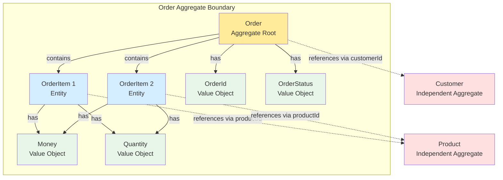
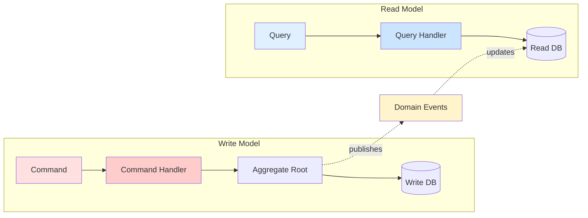
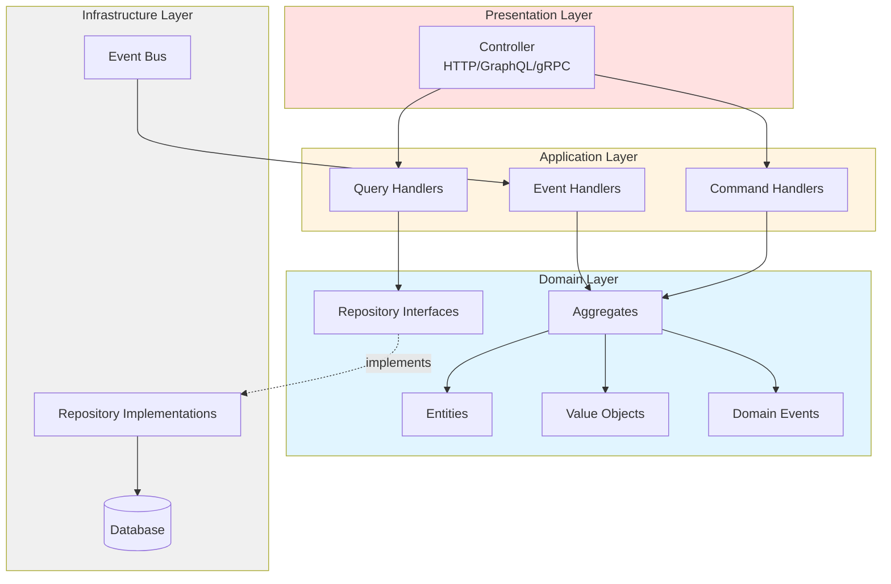
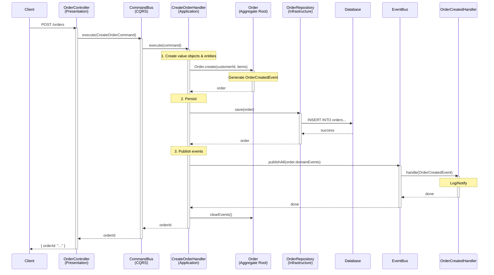
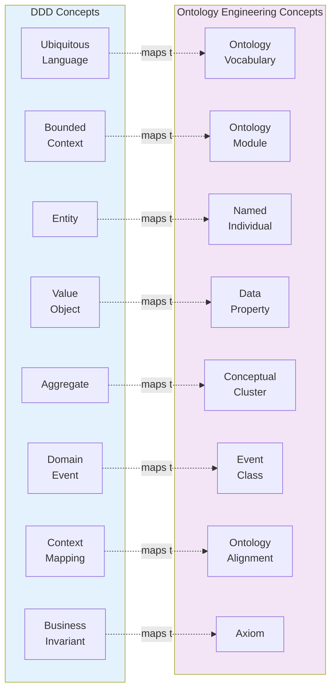

# Domain-Driven Design: Engineering Practice from the Ground Up

---

## Table of Contents

1. [Introduction: Why Domain-Driven Design](#introduction-why-domain-driven-design)
2. [Back to Basics: What Is Software](#back-to-basics-what-is-software)
3. [Core Philosophy and Strategic Design](#core-philosophy-and-strategic-design)
4. [Tactical Design: The Building Blocks](#tactical-design-the-building-blocks)
5. [Value Objects: The Power of Immutability](#value-objects-the-power-of-immutability)
6. [Entities: The Continuity of Identity](#entities-the-continuity-of-identity)
7. [Aggregates and Aggregate Roots](#aggregates-and-aggregate-roots)
8. [Domain Events: Capturing Change at Its Core](#domain-events-capturing-change-at-its-core)
9. [CQRS: Command Query Responsibility Segregation](#cqrs-command-query-responsibility-segregation)
10. [Event Sourcing: The Complete Memory of Time](#event-sourcing-the-complete-memory-of-time)
11. [The Repository Pattern: An Abstraction Barrier for Persistence](#the-repository-pattern-an-abstraction-barrier-for-persistence)
12. [Domain Services: Business Logic Across Aggregates](#domain-services-business-logic-across-aggregates)
13. [Layered Architecture: Engineering Separation of Concerns](#layered-architecture-engineering-separation-of-concerns)
14. [Anti-Corruption Layers and Exception Handling](#anti-corruption-layers-and-exception-handling)
15. [Dependency Injection and Modularity: DDD in NestJS](#dependency-injection-and-modularity-ddd-in-nestjs)
16. [From Theory to Practice: Implementing a Complete Order Domain](#from-theory-to-practice-implementing-a-complete-order-domain)
17. [Ontology Engineering and DDD: Two Paths to Knowledge Modeling](#ontology-engineering-and-ddd-two-paths-to-knowledge-modeling)
18. [Summary and Reflection](#summary-and-reflection)

---

## Introduction: Why Domain-Driven Design

Throughout the history of software engineering, we repeatedly run into the same fundamental problem: **the complexity of software lies not in the technology itself, but in the complexity of the business domain**.

In his 2003 book *Domain-Driven Design: Tackling Complexity in the Heart of Software*, Eric Evans proposed a deceptively simple yet profound idea: to build software systems that genuinely solve business problems, developers must deeply understand the business domain and let the code structure faithfully reflect domain knowledge. This is the origin of Domain-Driven Design (DDD).

Yet more than twenty years later, applying DDD in real-world engineering remains a significant challenge. Many teams either treat DDD as a set of "technical patterns" to copy mechanically, or feel lost when faced with complex business requirements. The root cause is: **most people learn DDD by focusing on "how to do it", not "why to do it".**

This article traces DDD back to its fundamental motivations. Combined with the complete source code of the Nestify project (a DDD practice project built on NestJS), we will systematically deconstruct every core concept of domain-driven design. We want to understand not just how each pattern is implemented, but why it exists in the first place.

---

## Back to Basics: What Is Software

### 1.1 Reasoning from the Ground Up

To truly understand DDD, you need a way of thinking that breaks problems down to their most fundamental facts and reasons upward from there. When we apply this to software design, we need to ask several essential questions:

**Question 1: What is software?**

Software is fundamentally a **digital model of some real-world domain**. An e-commerce system models the domain of "product transactions"; a medical system models the domain of "clinical workflows". No matter how the technology stack changes — monolith to microservices, REST to GraphQL, SQL to NoSQL — this essence does not change.

**Question 2: What is the root cause of software complexity?**

Fred Brooks, in *No Silver Bullet*, distinguished two kinds of complexity:
- **Essential Complexity**: comes from the business domain itself. The pricing rules for an insurance product are inherently complex — swapping frameworks won't fix that.
- **Accidental Complexity**: comes from the technical choices we make. Poor database schema design, framework misuse, over-abstraction — these are problems we create ourselves.

DDD's core goal is precisely this: **minimize accidental complexity while aligning the software structure with essential complexity.**

**Question 3: What fundamentally causes code rot?**

Almost every large system eventually experiences "code rot" — the codebase grows harder to understand and modify over time. The root cause is: **the mapping between code structure and business concepts has been broken.**

When a business concept (such as "order") is scattered across a dozen different services, controllers, and utility functions, any business change requires modifications in multiple places — and missing even one creates a bug. DDD uses concepts like "aggregates" to ensure business concepts have clear, centralized expression in code.

### 1.2 Deriving DDD's Core Principles from the Ground Up

Based on the above reasoning, we can derive DDD's core principles:

**Principle 1: Code should speak the language of the business.**
If the domain expert says "confirm the order", there should be a `confirm()` method in the code — not `updateStatus(STATUS_CONFIRMED)`. This is the origin of "Ubiquitous Language".

**Principle 2: Business rules should live in the domain model, not be scattered across a service layer.**
"Only a pending order can be confirmed" — this is a business rule. It should be enforced by the Order entity itself, not checked externally by some service. This is the core idea behind the "rich domain model".

**Principle 3: Technical concerns must not invade business logic.**
The Order entity should not know whether it's stored in PostgreSQL or MongoDB. Databases are infrastructure, not business. This is the motivation for "layered architecture" and "dependency inversion".

**Principle 4: Changes must be captured explicitly.**
"An order was created", "An order was confirmed" — these are meaningful business facts. Modeling them explicitly as "domain events" makes the system more transparent and opens the door for event sourcing and cross-service communication.

---

## Core Philosophy and Strategic Design

### 2.1 Ubiquitous Language

The most important concept in DDD is not any technical pattern — it is **Ubiquitous Language**. It requires the development team and business experts to use the same language to describe the system. This language should appear:

- In requirements discussions
- In the class and method names in code
- In the descriptions of test cases
- In documentation and API design

Here is how the Nestify project puts this principle into practice:

```typescript
// Domain expert says: "create an order"
// Code has:
const order = Order.create(customerId, orderItems);

// Domain expert says: "confirm this order"
// Code has:
order.confirm();

// Domain expert says: "cancel this order"
// Code has:
order.cancel();

// Domain expert says: "order total amount"
// Code has:
const total = order.getTotalAmount();
```

Notice the method names are not `setStatus('confirmed')` or `updateOrderState(OrderState.CANCELLED)`, but directly use business terms like `confirm()` and `cancel()`. This seemingly minor naming difference reflects a profound design philosophy: **code is not just instructions for machines — it is shared knowledge for the team.**

### 2.2 Bounded Contexts

In a complex business system, the same word can mean completely different things in different contexts. Consider the concept of "product":

- In the **product catalog** context, a product is a display object with a name, description, and images.
- In the **inventory management** context, a product is a stock unit with a SKU and inventory count.
- In the **order management** context, a product is simplified to a `productId` reference and a price.

Trying to use one unified `Product` class to serve all contexts inevitably leads to a bloated, unmaintainable "god class". The core idea of bounded contexts is: **acknowledge that different business subdomains need different models, and draw clear boundaries around each model.**

In Nestify, the Order Module is a clear bounded context:

```
modules/order/
├── application/          # Application layer: use case orchestration
│   ├── commands/         # Commands (write operations)
│   ├── queries/          # Queries (read operations)
│   └── event-handlers/   # Event handlers
├── domain/               # Domain layer: core business logic
│   ├── entities/         # Entities
│   ├── value-objects/    # Value objects
│   ├── events/           # Domain events
│   ├── exceptions/       # Domain exceptions
│   ├── repositories/     # Repository interfaces
│   └── services/         # Domain services
├── infrastructure/       # Infrastructure layer: technical implementations
│   ├── persistence/      # Data persistence
│   └── cache/            # Cache services
└── presentation/         # Presentation layer: API endpoints
    └── order.controller.ts
```

This directory structure is itself a form of ubiquitous language — any developer joining the team can understand the business boundaries and architectural layers just by reading the structure.

### 2.3 Context Mapping

When a system contains multiple bounded contexts, they inevitably interact. Context mapping describes the patterns of these interactions:

- **Shared Kernel**: Two contexts share a portion of the model. In Nestify, the `shared/domain/` directory plays this role, providing base building blocks like `Entity`, `ValueObject`, `AggregateRoot`, and `DomainEvent`.
- **Anti-Corruption Layer**: When integrating with external systems or legacy systems, use an adapter layer to isolate the influence of external models.
- **Published Language**: Pass information between contexts via domain events, maintaining loose coupling.

---

## Tactical Design: The Building Blocks

DDD's tactical design provides a set of "building blocks" for constructing domain models. These blocks are not arbitrarily invented design patterns — they are direct mappings of real-world business concepts:

| Building Block | Real-World Analogy | Core Characteristic |
|---------------|-------------------|---------------------|
| Value Object | A ¥100 banknote | Defined by its value, substitutable, immutable |
| Entity | A person | Defined by identity, mutable, has a lifecycle |
| Aggregate | A family | A cluster of closely related objects, managed by an aggregate root |
| Domain Event | "The wedding took place" | A historically significant business fact |
| Repository | A library | Provides access to aggregates, hides persistence details |
| Domain Service | A notary office | Business operations that don't belong to any single entity |

Let's dive into each building block, combining Nestify's source code to understand the design thinking and implementation.

---

## Value Objects: The Power of Immutability

### 3.1 Understanding Value Objects at Their Core

In the real world, some concepts are defined by their attribute values rather than by some identity. Two ¥100 banknotes, even with different serial numbers, are "equivalent" in most business contexts — you don't care which specific note you receive. This is the essence of a value object: **its meaning is determined by its value, not by identity.**

Value objects have three core characteristics:
1. **Immutability**: Once created, never changed. If you need a different value, create a new instance.
2. **Value Equality**: Two value objects are "equal" if all their attribute values are identical.
3. **Self-Validation**: A value object validates itself on creation, ensuring it is always in a valid state.

### 3.2 The Value Object Base Class in Nestify

```typescript
// shared/domain/value-object.ts
export interface ValueObjectProps {
    [index: string]: any;
}

export abstract class ValueObject<T extends ValueObjectProps> {
    protected readonly props: T;

    constructor(props: T) {
        this.props = Object.freeze(props);
    }

    public equals(vo?: ValueObject<T>): boolean {
        if (vo === null || vo === undefined) {
            return false;
        }
        if (vo.props === undefined) {
            return false;
        }
        return JSON.stringify(this.props) === JSON.stringify(vo.props);
    }
}
```

This concise code contains deep design thinking:

- `Object.freeze(props)` enforces **immutability** — any attempt to modify a property is blocked at runtime (throws in strict mode). This is not a "convention" but an "enforcement". From the perspective of value semantics: if a value can be changed, it is no longer "that value" — ¥100 modified to ¥200 is no longer ¥100. Immutability is the mathematical essence of value semantics.

- The `equals()` method implements **value equality** — whether two value objects are equal depends on their content, not their address in memory. This is a sharp contrast to JavaScript's default reference equality.

### 3.3 The Money Value Object: Precise Modeling of Business Concepts

```typescript
// modules/order/domain/value-objects/money.vo.ts
import { ValueObject } from '@/shared/domain/value-object';
import { Guard } from '@/shared/utils/guard';

interface MoneyProps {
    amount: number;
    currency: string;
}

export class Money extends ValueObject<MoneyProps> {
    get amount(): number {
        return this.props.amount;
    }

    get currency(): string {
        return this.props.currency;
    }

    private constructor(props: MoneyProps) {
        super(props);
    }

    public static create(amount: number, currency: string = 'USD'): Money {
        const guardResult = Guard.againstNullOrUndefined(amount, 'amount');
        if (!guardResult.succeeded) {
            throw new Error(guardResult.message);
        }

        if (amount < 0) {
            throw new Error('Money amount cannot be negative');
        }

        return new Money({ amount, currency });
    }

    public add(money: Money): Money {
        if (this.currency !== money.currency) {
            throw new Error('Cannot add money with different currencies');
        }
        return Money.create(this.amount + money.amount, this.currency);
    }

    public multiply(multiplier: number): Money {
        return Money.create(this.amount * multiplier, this.currency);
    }
}
```

This `Money` class demonstrates several key value object design practices:

**Private constructor + static factory method:** The constructor is `private`; external code can only create instances through `Money.create()`. This centralizes validation logic in the factory method, ensuring every `Money` instance is valid upon creation — amount cannot be negative, cannot be null. **An invalid Money instance can never exist in the system.**

**Encapsulating business operations:** `add()` and `multiply()` are not simple math operations — they encode business rules. You cannot simply add USD and CNY together. If you used a raw `number` type for amounts, this rule would depend on the programmer's memory. With the `Money` value object, the rule is encoded into the type system.

**Returning new instances instead of modifying self:** `add()` returns a new `Money` instance rather than modifying the current one. This upholds the immutability principle and makes code safer — you never need to worry about code "accidentally" modifying an amount you're using.

### 3.4 OrderStatus: Replacing Magic Strings with Types

```typescript
// modules/order/domain/value-objects/order-status.vo.ts
export enum OrderStatusEnum {
    PENDING = 'PENDING',
    CONFIRMED = 'CONFIRMED',
    CANCELLED = 'CANCELLED',
    COMPLETED = 'COMPLETED',
}

export class OrderStatus extends ValueObject<{ value: OrderStatusEnum }> {
    get value(): OrderStatusEnum {
        return this.props.value;
    }

    private constructor(props: { value: OrderStatusEnum }) {
        super(props);
    }

    public static pending(): OrderStatus {
        return new OrderStatus({ value: OrderStatusEnum.PENDING });
    }

    public static confirmed(): OrderStatus {
        return new OrderStatus({ value: OrderStatusEnum.CONFIRMED });
    }

    public static cancelled(): OrderStatus {
        return new OrderStatus({ value: OrderStatusEnum.CANCELLED });
    }

    public static completed(): OrderStatus {
        return new OrderStatus({ value: OrderStatusEnum.COMPLETED });
    }

    public isPending(): boolean { return this.value === OrderStatusEnum.PENDING; }
    public isConfirmed(): boolean { return this.value === OrderStatusEnum.CONFIRMED; }
    public isCancelled(): boolean { return this.value === OrderStatusEnum.CANCELLED; }
    public isCompleted(): boolean { return this.value === OrderStatusEnum.COMPLETED; }
}
```

This design is far superior to using raw `string` for status:

1. **Compile-time safety**: You cannot create an `OrderStatus.create('INVALID_STATUS')` — the compiler stops you.
2. **Semantic factory methods**: `OrderStatus.pending()` is clearer than `OrderStatus.create(OrderStatusEnum.PENDING)` — it reads like natural language.
3. **Behavior encapsulation**: Methods like `isPending()` encapsulate status queries inside the value object, rather than letting external code do `status === 'PENDING'` comparisons.

### 3.5 OrderId and Quantity

```typescript
// modules/order/domain/value-objects/order-id.vo.ts
export class OrderId extends ValueObject<{ value: string }> {
    get value(): string { return this.props.value; }
    public static create(id?: string): OrderId {
        return new OrderId({ value: id || uuidv4() });
    }
}

// modules/order/domain/value-objects/quantity.vo.ts
export class Quantity extends ValueObject<{ value: number }> {
    get value(): number { return this.props.value; }
    public static create(value: number): Quantity {
        if (value < 1) throw new Error('Quantity must be at least 1');
        if (!Number.isInteger(value)) throw new Error('Quantity must be an integer');
        return new Quantity({ value });
    }
}
```

`Quantity` is a great example of "why not just use `number`": quantity must be a positive integer, while `number` allows negatives, decimals, `NaN`, and `Infinity`. By encapsulating quantity as a value object, we eliminate an entire class of potential bugs at the type level.

**Value object design principles summary:**
- Replace primitive types with value objects (avoid Primitive Obsession)
- Validate on creation to ensure always-valid state
- Immutable — create a new instance when you need to change
- Encapsulate business operations related to the value
- Use static factory methods instead of public constructors

---

## Entities: The Continuity of Identity

### 4.1 The Fundamental Difference Between Entities and Value Objects

If value objects are defined by "value", entities are defined by "identity". A person who changes their name, address, or even appearance is still "that person" — because their ID number hasn't changed. In a software system, an order that transitions from created, to confirmed, to completed keeps changing state, but it remains "that order" — because the order ID hasn't changed.

This is the core characteristic of an entity: **it has a unique identity that remains constant throughout its lifecycle.**

### 4.2 The Entity Base Class in Nestify

```typescript
// shared/domain/entity.ts
export abstract class Entity<T> {
    protected readonly _id: T;

    constructor(id: T) {
        this._id = id;
    }

    get id(): T {
        return this._id;
    }

    public equals(object?: Entity<T>): boolean {
        if (object === null || object === undefined) return false;
        if (this === object) return true;
        if (!(object instanceof Entity)) return false;
        return this._id === object._id;
    }
}
```

Compared to a value object's `equals()`, an entity's `equals()` only compares `_id`, not all properties. This reflects the fundamental difference:

| Dimension | Value Object | Entity |
|-----------|-------------|--------|
| Equality | Equal if all attribute values match | Equal if IDs match |
| Mutability | Immutable | Mutable (within business rule constraints) |
| Lifecycle | None (create and discard) | Has one (create, modify, persist, destroy) |
| Persistence | As part of an entity | Persisted independently |

### 4.3 The OrderItem Entity

```typescript
// modules/order/domain/entities/order-item.entity.ts
export class OrderItem extends Entity<string> {
    private _productId: string;
    private _quantity: Quantity;
    private _unitPrice: Money;

    private constructor(props: OrderItemProps) {
        super(props.id);
        this._productId = props.productId;
        this._quantity = props.quantity;
        this._unitPrice = props.unitPrice;
    }

    public static create(props: OrderItemProps): OrderItem {
        return new OrderItem(props);
    }

    public getTotalPrice(): Money {
        return this._unitPrice.multiply(this._quantity.value);
    }

    public updateQuantity(quantity: Quantity): void {
        this._quantity = quantity;
    }
}
```

Note that `OrderItem`'s properties use value object types (`Quantity`, `Money`) rather than primitive types (`number`). This combination reflects DDD's core idea: **build entities with domain concepts (value objects), not technical types (number, string).**

The `getTotalPrice()` method shows how entities encapsulate business calculations. This logic "lives inside" the entity, rather than being scattered across some service or controller.

---

## Aggregates and Aggregate Roots

### 5.1 Why Aggregates Are Needed

In a real business system, entities have complex relationships. An order contains multiple order items, each of which references a product. If any external code can directly modify the state of any entity, the system quickly descends into chaos — who enforces business rule consistency?

The core idea of an Aggregate is: **treat a cluster of closely related objects as a unit, managing all external access through a single "aggregate root".**

Think of a family — to interact with the family, you normally go through the head of household (the aggregate root). You don't directly change how someone else's child is educated — you communicate with the parent.

### 5.2 The Aggregate Root Base Class

```typescript
// shared/domain/aggregate-root.ts
export abstract class AggregateRoot<T> extends Entity<T> {
    private _domainEvents: DomainEvent[] = [];

    get domainEvents(): DomainEvent[] {
        return this._domainEvents;
    }

    protected addDomainEvent(domainEvent: DomainEvent): void {
        this._domainEvents.push(domainEvent);
    }

    public clearEvents(): void {
        this._domainEvents = [];
    }
}
```

`AggregateRoot` extends `Entity`, because an aggregate root is first and foremost an entity — it has a unique identity and lifecycle. But it takes on two additional responsibilities:

1. **Transaction boundary**: All changes within an aggregate should complete in a single transaction.
2. **Event collection**: The aggregate root collects domain events produced during business operations and publishes them after persistence completes.

The `_domainEvents` array is an "event collector". When executing business operations, the aggregate root doesn't publish events directly — it first adds them to its internal list. This design ensures: if persistence fails (transaction rollback), events won't be erroneously published.

### 5.3 The Order Aggregate Root: A Complete Business Logic Carrier

The `Order` class is the aggregate root for the entire order domain — the most central domain object in Nestify:

```typescript
// modules/order/domain/entities/order.entity.ts
export class Order extends AggregateRoot<string> {
    private _customerId: string;
    private _items: OrderItem[];
    private _status: OrderStatus;
    private _createdAt: Date;
    private _updatedAt: Date;

    private constructor(props: OrderProps) {
        super(props.id.value);
        this._customerId = props.customerId;
        this._items = props.items;
        this._status = props.status;
        this._createdAt = props.createdAt;
        this._updatedAt = props.updatedAt;
    }

    public static create(customerId: string, items: OrderItem[], id?: OrderId): Order {
        const orderId = id || OrderId.create();
        const now = new Date();

        const order = new Order({
            id: orderId,
            customerId,
            items,
            status: OrderStatus.pending(),
            createdAt: now,
            updatedAt: now,
        });

        order.addDomainEvent(
            new OrderCreatedEvent(orderId.value, customerId, order.getTotalAmount())
        );

        return order;
    }

    public static reconstitute(props: OrderProps): Order {
        return new Order(props);
    }

    public confirm(): void {
        if (!this._status.isPending()) {
            throw new InvalidOrderStateException(
                `Cannot confirm order. Current status: ${this._status.value}`
            );
        }
        this._status = OrderStatus.confirmed();
        this._updatedAt = new Date();
        this.addDomainEvent(new OrderConfirmedEvent(this.id));
    }

    public cancel(): void {
        if (this._status.isCancelled() || this._status.isCompleted()) {
            throw new InvalidOrderStateException(
                `Cannot cancel order. Current status: ${this._status.value}`
            );
        }
        this._status = OrderStatus.cancelled();
        this._updatedAt = new Date();
        this.addDomainEvent(new OrderCancelledEvent(this.id));
    }

    public addItem(item: OrderItem): void {
        if (!this._status.isPending()) {
            throw new InvalidOrderStateException('Cannot add items to a non-pending order');
        }
        this._items.push(item);
        this._updatedAt = new Date();
    }

    public removeItem(itemId: string): void {
        if (!this._status.isPending()) {
            throw new InvalidOrderStateException('Cannot remove items from a non-pending order');
        }
        this._items = this._items.filter(item => item.id !== itemId);
        this._updatedAt = new Date();
    }
}
```

Key design decisions to highlight:

**Private constructor:** External code cannot create an `Order` directly via `new Order(...)`, because doing so would bypass business rules. All creation must go through factory methods.

**`create()` vs `reconstitute()`:** `create()` represents the business act of "creating a new order" — it sets the initial state to `PENDING` and emits an `OrderCreatedEvent`. `reconstitute()` is purely technical — "rebuild the object from storage" — and emits no events. **Creating and reconstituting are two completely different business concepts.**

**`confirm()` and `cancel()`:** This is the "rich domain model" in action. Business rules are enforced by the entity itself, not by external `if-else` checks in some service:
- Only `PENDING` orders can be confirmed
- Cancelled or completed orders cannot be cancelled again

Violations throw `InvalidOrderStateException` — a domain exception that clearly communicates "what you're trying to do is not allowed by the business."

### 5.4 Aggregate Boundary Design Principles



**Order aggregate includes:**
- `Order` (aggregate root)
- `OrderItem` (internal entity)
- `OrderId`, `OrderStatus`, `Money`, `Quantity` (value objects)

**Order aggregate does NOT include:**
- `Customer` (an independent aggregate, referenced only by `customerId`)
- `Product` (belongs to another bounded context, referenced only by `productId`)

Boundary design guidelines:
1. **True Invariants**: Rules that must hold across all objects in the aggregate (e.g., "total order amount equals sum of all item amounts"). Objects involved in the same invariant belong in the same aggregate.
2. **Keep it small**: Larger aggregates mean more concurrency conflicts and performance issues. Only include what truly needs consistency enforcement.
3. **Reference other aggregates by ID**: Never hold a direct reference to a `Customer` object inside `Order` — only hold `customerId`. This preserves aggregate independence.

---

## Domain Events: Capturing Change at Its Core

### 6.1 Why Domain Events

At the core of it: real-world business processes are driven by a series of "events" — a customer placed an order, the order was confirmed, payment completed, goods shipped. These events not only describe "what happened" — they drive subsequent business processes.

Domain events explicitly model these "already-happened facts" in code, providing several important benefits:

1. **Decoupling**: After placing an order, we need to send a notification email. If `CreateOrderHandler` directly calls the email service, the order module depends on the notification module. By emitting `OrderCreatedEvent` and letting the notification module subscribe independently, the two modules are fully decoupled.
2. **Audit trail**: Each event records "what happened and when", naturally forming an audit log.
3. **Foundation for event sourcing**: Persisting all events enables rebuilding system state at any point in time by replaying events.

### 6.2 Domain Event Definition

```typescript
// shared/domain/domain-event.ts
export abstract class DomainEvent {
    public readonly occurredOn: Date;

    constructor() {
        this.occurredOn = new Date();
    }

    abstract getAggregateId(): string;
}
```

Every domain event carries two pieces of fundamental information:
- `occurredOn`: The timestamp when the event occurred — an immutable historical fact.
- `getAggregateId()`: The ID of the aggregate root that produced this event.

### 6.3 Concrete Domain Events

```typescript
export class OrderCreatedEvent extends DomainEvent {
    constructor(
        public readonly orderId: string,
        public readonly customerId: string,
        public readonly totalAmount: Money,
    ) { super(); }

    getAggregateId(): string { return this.orderId; }
}

export class OrderConfirmedEvent extends DomainEvent {
    constructor(public readonly orderId: string) { super(); }
    getAggregateId(): string { return this.orderId; }
}

export class OrderCancelledEvent extends DomainEvent {
    constructor(public readonly orderId: string) { super(); }
    getAggregateId(): string { return this.orderId; }
}
```

Note the difference in information carried by each event:
- `OrderCreatedEvent` carries `orderId`, `customerId`, and `totalAmount` — because downstream systems may need all this to handle a new order.
- `OrderConfirmedEvent` carries only `orderId` — confirming doesn't change any other order attributes.

**Events should be named in the past tense** (`OrderCreated`, not `CreateOrder`), because events describe **facts that have already happened**, not commands yet to be executed.

### 6.4 Event Publishing and Handling

```typescript
// Event bus interface (domain layer defines the contract)
export interface IEventBus {
    publish(event: DomainEvent): Promise<void>;
    publishAll(events: DomainEvent[]): Promise<void>;
}

export const EVENT_BUS = Symbol('EVENT_BUS');

// Event bus implementation (infrastructure layer provides the implementation)
@Injectable()
export class EventBusService implements IEventBus {
    constructor(private readonly eventBus: NestEventBus) {}

    async publish(event: DomainEvent): Promise<void> {
        await this.eventBus.publish(event);
    }

    async publishAll(events: DomainEvent[]): Promise<void> {
        await Promise.all(events.map(event => this.eventBus.publish(event)));
    }
}
```

Using `Symbol('EVENT_BUS')` as the injection token is dependency inversion in action: the domain layer defines the interface (`IEventBus`), and the infrastructure layer provides the implementation (`EventBusService`). The domain layer has no idea how the event bus is implemented — it could be an in-memory bus, or RabbitMQ, or Kafka.

---

## CQRS: Command Query Responsibility Segregation

### 7.1 The Core Logic of CQRS

The core idea of CQRS stems from a simple observation: **reads and writes are fundamentally different operations.**



At their core:
- **Write operations (Commands)** require strong consistency, business rule validation, and transaction support. Commands change system state.
- **Read operations (Queries)** require high performance, flexible data assembly, and possible aggregation. Queries don't change system state.

Handling these two fundamentally different operations with the same model inevitably leads to compromise — either read performance is constrained by the write model, or write consistency is compromised by read requirements. CQRS eliminates this compromise by separating the two responsibilities.

### 7.2 Commands: Expressing Intent

```typescript
export class CreateOrderCommand {
    constructor(
        public readonly customerId: string,
        public readonly items: Array<{
            productId: string;
            quantity: number;
            unitPrice: number;
        }>,
    ) {}
}

export class ConfirmOrderCommand {
    constructor(public readonly orderId: string) {}
}

export class CancelOrderCommand {
    constructor(public readonly orderId: string) {}
}
```

Command characteristics:
- **Imperative naming**: `CreateOrder`, `ConfirmOrder`, `CancelOrder` — they express "what to do", not "what happened" (that's events).
- **Immutable data carriers**: They carry only the minimum information needed to execute the operation.
- **Don't return query results**: Strictly, a command either succeeds or fails; it shouldn't return data.

### 7.3 Command Handlers: Orchestrating Business Flows

```typescript
@CommandHandler(CreateOrderCommand)
export class CreateOrderHandler implements ICommandHandler<CreateOrderCommand> {
    constructor(
        @Inject(ORDER_REPOSITORY) private readonly orderRepository: IOrderRepository,
        @Inject(EVENT_BUS) private readonly eventBus: IEventBus,
    ) {}

    async execute(command: CreateOrderCommand): Promise<string> {
        // 1. Convert raw data to domain objects
        const orderItems = command.items.map(item =>
            OrderItem.create({
                id: OrderId.create().value,
                productId: item.productId,
                quantity: Quantity.create(item.quantity),
                unitPrice: Money.create(item.unitPrice),
            }),
        );

        // 2. Call aggregate root's factory method
        const order = Order.create(command.customerId, orderItems);

        // 3. Persist
        await this.orderRepository.save(order);

        // 4. Publish domain events
        await this.eventBus.publishAll(order.domainEvents);
        order.clearEvents();

        // 5. Return result
        return order.id;
    }
}
```

This handler shows a clear division of responsibilities:
- **Handler is responsible for orchestration**: coordinating domain objects, repository, and event bus.
- **Domain objects are responsible for business logic**: `Order.create()` handles state initialization and event generation internally.
- **Repository is responsible for persistence**: `orderRepository.save()` hides database details.
- **Event bus handles event dispatch**: `eventBus.publishAll()` delivers events to all subscribers.

A critical design detail is **the timing of event publishing**: save first (`save`), then publish events (`publishAll`), then clear events (`clearEvents`). This ensures that if saving fails, events won't be erroneously published.

### 7.4 Queries: An Independent Read Path

```typescript
@QueryHandler(GetOrderQuery)
export class GetOrderHandler implements IQueryHandler<GetOrderQuery> {
    constructor(
        @Inject(ORDER_REPOSITORY) private readonly orderRepository: IOrderRepository,
    ) {}

    async execute(query: GetOrderQuery): Promise<OrderResponseDto> {
        const order = await this.orderRepository.findById(query.orderId);

        if (!order) {
            throw new OrderNotFoundException(query.orderId);
        }

        return {
            id: order.id,
            customerId: order.customerId,
            items: order.items.map(item => ({
                id: item.id,
                productId: item.productId,
                quantity: item.quantity.value,
                unitPrice: item.unitPrice.amount,
                totalPrice: item.getTotalPrice().amount,
            })),
            status: order.status.value,
            totalAmount: order.getTotalAmount().amount,
            createdAt: order.createdAt,
            updatedAt: order.updatedAt,
        };
    }
}
```

Key design points:
1. **No event bus dependency**: Queries produce no side effects, so no event publishing is needed.
2. **Returns DTO, not domain objects**: Returns `OrderResponseDto` rather than an `Order` entity — this is an important guard against the presentation layer directly manipulating domain objects.
3. **Data transformation in the query layer**: Unpacks value object values (like `item.quantity.value`) to primitive types suitable for JSON serialization.

---

## Event Sourcing: The Complete Memory of Time

### 8.1 The Fundamental Motivation for Event Sourcing

Traditional data persistence uses "state storage" — we only save the current state of an entity. When an order transitions from `PENDING` to `CONFIRMED`, the `status` field is updated to `CONFIRMED`, and the `PENDING` state is gone forever.

But in many business scenarios, **the process and history matter as much as the outcome**. A bank account needs to know not just the current balance, but the details of every transaction. An insurance company needs not just the current policy state, but the complete history of every change.

Event Sourcing's core idea is: **instead of storing state, store the sequence of events that caused the state changes. The current state can be rebuilt by replaying all historical events.**

This is like accounting — accountants don't overwrite a balance in a single cell, they record every debit and credit. The total balance can be calculated at any time by summing all records.

### 8.2 Core Components of Event Sourcing

A complete event sourcing implementation typically includes the following core components:

1. **Aggregate**: In event sourcing, an aggregate not only produces events but can also rebuild its own state from an event sequence. Each aggregate has a `version` property to track event sequence numbers.

2. **Event Store**: The persistence engine for event streams. Can be implemented on top of various backends such as PostgreSQL or MongoDB.

3. **Snapshot Store**: To avoid replaying from the first event every time, periodically save a snapshot of the aggregate's state. When rebuilding, load the most recent snapshot and replay only subsequent events.

4. **Event Envelope**: A metadata container wrapping events, containing event type, aggregate ID, version number, timestamp, and more.

5. **Event Stream**: All events for a single aggregate instance form an ordered event stream.

### 8.3 State Storage vs Event Sourcing: A Concrete Comparison

```mermaid
graph TB
    subgraph Traditional["Traditional State Storage"]
        StateDB[(Database)]
        StateRecord["{ id: 'ord-123'<br/>status: 'CONFIRMED'<br/>total: 299.99<br/>updated_at: '2024-01-15' }"]
        StateDB --> StateRecord
        Note1[Only current state known<br/>History lost]
        StateRecord -.-> Note1
    end

    subgraph EventSourcing["Event Sourcing"]
        EventStore[(Event Store)]
        Event1["OrderCreated<br/>v1, 2024-01-10"]
        Event2["ItemAdded<br/>v2, 2024-01-11"]
        Event3["ItemRemoved<br/>v3, 2024-01-12"]
        Event4["OrderConfirmed<br/>v4, 2024-01-15"]

        EventStore --> Event1
        Event1 --> Event2
        Event2 --> Event3
        Event3 --> Event4

        CurrentState["Current State = <br/>Replay all events"]
        Event4 -.-> CurrentState
        Note2[Complete change history<br/>Rebuild any point in time]
        CurrentState -.-> Note2
    end

    style Traditional fill:#ffe0e0
    style EventSourcing fill:#e0ffe0
    style StateRecord fill:#ffcccc
    style Event1 fill:#ccffcc
    style Event2 fill:#ccffcc
    style Event3 fill:#ccffcc
    style Event4 fill:#ccffcc
```



**Traditional state storage:**
```
// A single row in the orders table
{ id: "ord-123", status: "CONFIRMED", total: 299.99, updated_at: "2024-01-15" }
```
We only know the current state — we have no idea what the order went through.

**Event sourcing:**
```
// Event sequence in the event store
[
  { type: "OrderCreated",   aggregateId: "ord-123", version: 1, data: { customerId: "cust-456", total: 299.99 }, timestamp: "2024-01-10" },
  { type: "ItemAdded",      aggregateId: "ord-123", version: 2, data: { productId: "prod-789", quantity: 1 }, timestamp: "2024-01-11" },
  { type: "ItemRemoved",    aggregateId: "ord-123", version: 3, data: { productId: "prod-111" }, timestamp: "2024-01-12" },
  { type: "OrderConfirmed", aggregateId: "ord-123", version: 4, data: {}, timestamp: "2024-01-15" },
]
```
We know not just the current state, but the complete change history.

### 8.4 An Event-Sourced Aggregate Root

Based on the event sourcing approach, an event-sourced aggregate root might look like this:

```typescript
export abstract class EventSourcedAggregate<T> extends Entity<T> {
    private _domainEvents: DomainEvent[] = [];
    private _version: number = 0;

    get version(): number { return this._version; }
    get domainEvents(): DomainEvent[] { return this._domainEvents; }

    // Apply event and record it
    protected apply(event: DomainEvent): void {
        this.when(event);   // Update state
        this._version++;
        this._domainEvents.push(event);
    }

    // Replay from historical events (don't add to uncommitted events list)
    public loadFromHistory(events: DomainEvent[]): void {
        for (const event of events) {
            this.when(event);
            this._version++;
        }
    }

    // Subclass implements: update state based on event type
    protected abstract when(event: DomainEvent): void;

    public clearEvents(): void { this._domainEvents = []; }
}
```

Key differences:
- `apply()` is for new business operations — updates state and records the event.
- `loadFromHistory()` is for rebuilding from the event store — only updates state, doesn't record events (they're already persisted).
- `when()` is a pure state transition method — updates the aggregate's internal state based on the event.

### 8.5 Trade-offs of Event Sourcing

**Benefits:**
- Complete audit trail
- Ability to rebuild state at any point in time ("time-travel" debugging)
- Natural support for event-driven architecture
- No information is ever lost

**Costs:**
- Querying current state is more complex (requires replay or maintaining a read model)
- Event schema evolution must be handled carefully
- Greater storage requirements
- Steep learning curve

**When to consider event sourcing:**
- Domains with strict audit requirements (finance, healthcare, legal)
- Systems that need "undo" operations
- Systems requiring complex temporal analysis
- Multiple downstream systems consuming changes in different ways

---

## The Repository Pattern: An Abstraction Barrier for Persistence

### 9.1 The Core Motivation for the Repository Pattern

From the domain model's perspective, persistence is a "transparent" operation — a domain expert would never say "serialize the order to JSON and insert it into the PostgreSQL orders table". They would simply say "save this order". The repository pattern's goal is to achieve this transparency: **the domain layer only needs to tell the repository "what to store" or "what to retrieve", and doesn't care at all about the specific storage technology.**

This is a classic application of the Dependency Inversion Principle (DIP): the domain layer defines the interface, and the infrastructure layer provides the implementation.

### 9.2 Repository Interface (Domain Layer)

```typescript
// modules/order/domain/repositories/order.repository.interface.ts
export interface IOrderRepository {
    findById(id: string): Promise<Order | null>;
    findByCustomerId(customerId: string): Promise<Order[]>;
    save(order: Order): Promise<Order>;
    delete(id: string): Promise<void>;
}

export const ORDER_REPOSITORY = Symbol('ORDER_REPOSITORY');
```

This interface is defined in the **domain layer**, not the infrastructure layer. This means the domain layer "owns" the interface definition, and the infrastructure layer must conform to the domain layer's contract.

`Symbol('ORDER_REPOSITORY')` as the injection token allows the concrete implementation to be swapped flexibly at module configuration time — a Kysely implementation, a TypeORM implementation, or an in-memory implementation for testing.

### 9.3 Repository Implementation (Infrastructure Layer)

```typescript
@Injectable()
export class OrderRepository implements IOrderRepository {
    constructor(private readonly db: KyselyService<Database>) {}

    async findById(id: string): Promise<Order | null> {
        const orderRow = await this.db
            .selectFrom('orders')
            .where('id', '=', id)
            .selectAll()
            .executeTakeFirst();

        if (!orderRow) return null;

        const itemRows = await this.db
            .selectFrom('order_items')
            .where('order_id', '=', id)
            .selectAll()
            .execute();

        return this.toDomain(orderRow, itemRows);
    }

    async save(order: Order): Promise<Order> {
        return await this.db.transaction().execute(async (trx) => {
            // ... insert or update logic
            return order;
        });
    }

    private toDomain(orderRow, itemRows): Order {
        const items = itemRows.map((itemRow) =>
            OrderItem.create({
                id: itemRow.id,
                productId: itemRow.product_id,
                quantity: Quantity.create(itemRow.quantity),
                unitPrice: Money.create(itemRow.unit_price),
            }),
        );

        return Order.reconstitute({
            id: OrderId.create(orderRow.id),
            customerId: orderRow.customer_id,
            items,
            status: OrderStatus.create(this.mapStatusFromDb(orderRow.status)),
            createdAt: orderRow.created_at,
            updatedAt: orderRow.updated_at,
        });
    }
}
```

Key design points:

**`toDomain()` — the data mapping bridge**: The database stores flat row data (snake_case field names, primitive types), while the domain model uses rich objects (camelCase properties, value object types). `toDomain()` translates between these two worlds:
- `itemRow.quantity` (`number`) → `Quantity.create(itemRow.quantity)` (`Quantity` value object)
- `itemRow.unit_price` (`number`) → `Money.create(itemRow.unit_price)` (`Money` value object)

**`reconstitute()` not `create()`**: When loading an existing order from the database, use `Order.reconstitute()`, not `Order.create()`. `create()` represents the business act of creating a new order and triggers `OrderCreatedEvent`; `reconstitute()` is only the technical act of rebuilding an object from storage — no events should fire.

**Transaction usage**: The `save()` method uses a database transaction to ensure atomicity of order and order items — either everything saves successfully, or everything rolls back. This is the concrete embodiment of the aggregate "transaction boundary" principle.

---

## Domain Services: Business Logic Across Aggregates

### 10.1 When Domain Services Are Needed

Some business logic doesn't naturally belong to any single entity or value object. For example, "calculate an order discount" — discount rules might involve customer tier, promotions, and order amount, all of which live in different aggregates. Forcing this logic into one entity would break that entity's cohesion.

Domain services are positioned to: **encapsulate business logic that doesn't belong to any single entity, while still being part of the domain logic.**

```typescript
@Injectable()
export class OrderPricingService {
    calculateTotal(order: Order): Money {
        return order.getTotalAmount();
    }

    applyDiscount(total: Money, discountPercent: number): Money {
        if (discountPercent < 0 || discountPercent > 100) {
            throw new Error('Discount percent must be between 0 and 100');
        }
        const discountMultiplier = 1 - discountPercent / 100;
        return Money.create(total.amount * discountMultiplier, total.currency);
    }
}
```

**Domain services vs. application services:**

| Dimension | Domain Service | Application Service (Command Handler) |
|-----------|---------------|--------------------------------------|
| Focus | Pure business logic | Use case orchestration |
| Dependencies | Only domain objects | Repository, event bus, etc. |
| Location | `domain/services/` | `application/commands/` |
| Examples | Discount calculation, pricing strategies | Create order, confirm order |

---

## Layered Architecture: Engineering Separation of Concerns

### 11.1 The Core Principle of the Onion Architecture

Nestify uses a layered architecture following the "Onion Architecture" principle. Its core idea is: **dependencies can only flow from outer layers toward inner layers; inner layers know nothing of outer layers.**



**Domain layer (innermost, most stable):** The `Order` class doesn't know NestJS exists, doesn't know what database is used, doesn't know about HTTP requests. This means:
- It can be unit-tested in pure Node.js without starting any framework.
- If you ever migrate from NestJS to another framework, the domain layer code requires zero changes.
- Business logic changes don't affect infrastructure code, and vice versa.

**Application layer (use case orchestration):** Receives commands/queries → calls domain objects → coordinates repository and event bus. Depends on the domain layer but not on specific infrastructure implementations.

**Infrastructure layer (technical implementations):** The only layer that "knows" what database, cache engine, or message queue is in use.

**Presentation layer (external entry point):** Handles external requests, translates them to commands/queries, and formats responses.

### 11.2 CQRS in the Controller

```typescript
@Controller('orders')
export class OrderController {
    constructor(
        private readonly commandBus: CommandBus,
        private readonly queryBus: QueryBus,
    ) {}

    @Post()
    async createOrder(@Body() dto: CreateOrderDto): Promise<{ orderId: string }> {
        const command = new CreateOrderCommand(dto.customerId, dto.items);
        const orderId = await this.commandBus.execute(command);
        return { orderId };
    }

    @Get(':id')
    async getOrder(@Param('id') id: string): Promise<OrderResponseDto> {
        return this.queryBus.execute(new GetOrderQuery(id));
    }

    @Post(':id/confirm')
    @HttpCode(HttpStatus.NO_CONTENT)
    async confirmOrder(@Param('id') id: string): Promise<void> {
        await this.commandBus.execute(new ConfirmOrderCommand(id));
    }

    @Post(':id/cancel')
    @HttpCode(HttpStatus.NO_CONTENT)
    async cancelOrder(@Param('id') id: string): Promise<void> {
        await this.commandBus.execute(new CancelOrderCommand(id));
    }
}
```

The controller's responsibilities are minimal: receive HTTP requests, convert to command/query objects, dispatch through the bus, return results. The controller contains zero business logic and is a pure "adapter" translating HTTP protocol to CQRS patterns.

---

## Anti-Corruption Layers and Exception Handling

### 12.1 Domain Exceptions

```typescript
export class DomainException extends Error {
    constructor(message: string) {
        super(message);
        this.name = this.constructor.name;
        Error.captureStackTrace(this, this.constructor);
    }
}

export class InvalidOrderStateException extends DomainException {
    constructor(message: string) { super(message); }
}

export class OrderNotFoundException extends DomainException {
    constructor(orderId: string) {
        super(`Order with id ${orderId} not found`);
    }
}
```

Domain exceptions are an important self-protection mechanism for the domain layer. When a business rule is violated, the domain object actively throws an exception with clear semantics:

- `InvalidOrderStateException`: tells the caller "the state transition you're attempting is not allowed by the business"
- `OrderNotFoundException`: tells the caller "the order you requested doesn't exist"

This is far better than returning `null`, `false`, or a generic `Error('something went wrong')` — each exception type carries an explicit business meaning.

### 12.2 Exception Filter: Translating Domain Exceptions to HTTP Responses

```typescript
@Catch(DomainException)
export class DomainExceptionFilter implements ExceptionFilter {
    private readonly logger = new Logger(DomainExceptionFilter.name);

    catch(exception: DomainException, host: ArgumentsHost) {
        const ctx = host.switchToHttp();
        const response = ctx.getResponse<Response>();
        const request = ctx.getRequest();

        const errorResponse = {
            statusCode: HttpStatus.BAD_REQUEST,
            timestamp: new Date().toISOString(),
            path: request.url,
            method: request.method,
            message: exception.message,
            type: exception.name,
        };

        this.logger.error(`Domain Exception: ${exception.name} - ${exception.message}`);
        response.status(HttpStatus.BAD_REQUEST).json(errorResponse);
    }
}
```

`DomainExceptionFilter` is a "translator" — it converts domain layer exceptions into HTTP error responses. The domain layer doesn't need to know about HTTP status codes, and the presentation layer doesn't need to `try-catch` every domain exception. NestJS's exception filter mechanism perfectly plays the anti-corruption layer role here.

### 12.3 The Guard Utility and Result Pattern

```typescript
// Guard: centralized input validation
export class Guard {
    public static againstNullOrUndefined(argument: any, argumentName: string): Result {
        if (argument === null || argument === undefined) {
            return { succeeded: false, message: `${argumentName} is null or undefined` };
        }
        return { succeeded: true };
    }
}

// Result: encode success/failure in the return type
export class Result<T> {
    public isSuccess: boolean;
    public isFailure: boolean;
    public error: string | null;
    private _value: T | null;

    public static ok<U>(value?: U): Result<U> {
        return new Result<U>(true, undefined, value);
    }

    public static fail<U>(error: string): Result<U> {
        return new Result<U>(false, error);
    }

    public static combine(results: Result<any>[]): Result<any> {
        for (const result of results) {
            if (result.isFailure) return result;
        }
        return Result.ok();
    }
}
```

The `Result` pattern provides a more elegant error handling approach than `try-catch`, forcing callers to explicitly handle both success and failure cases. `Result.combine()` is especially useful when multiple potentially-failing operations need to be checked together.

---

## Dependency Injection and Modularity: DDD in NestJS

### 13.1 Module Definition

```typescript
@Module({
    imports: [CqrsModule],
    controllers: [OrderController],
    providers: [
        ...CommandHandlers,
        ...QueryHandlers,
        ...EventHandlers,
        OrderPricingService,
        OrderCacheService,
        {
            provide: ORDER_REPOSITORY,    // Token defined by domain layer
            useClass: OrderRepository,    // Implementation provided by infrastructure layer
        },
        {
            provide: EVENT_BUS,
            useClass: EventBusService,
        },
    ],
    exports: [OrderCacheService],
})
export class OrderModule {}
```

This module definition is the "final assembly" of DDD in NestJS:

**Symbol tokens implement dependency inversion:** The domain layer defines "what I need" (`ORDER_REPOSITORY`, `EVENT_BUS`), and module configuration decides "who provides it" (`OrderRepository`, `EventBusService`). To switch database implementations, only change `useClass` here — the entire domain and application layer code is unaffected.

**Clear component grouping:** Declaring `CommandHandlers`, `QueryHandlers`, `EventHandlers` as separate groups makes the code cleaner and explicitly expresses the system's CQRS structure.

**Selective exports:** `exports: [OrderCacheService]` exports only the cache service, not the repository or domain services. This reflects the encapsulation principle — a module's internal implementation details are hidden from the outside world.

---

## From Theory to Practice: Implementing a Complete Order Domain

### 14.1 Tracing a Complete Business Flow

Let's trace the complete "create order" business flow to see how a request moves through each layer:



This flow clearly shows each layer's responsibility:
- **Presentation layer**: protocol translation only
- **Application layer**: use case orchestration only
- **Domain layer**: guards business rules
- **Infrastructure layer**: provides technical implementations

### 14.2 Testing Strategy

A major benefit of layered architecture is that each layer can be tested independently.

**Domain layer tests — most important, easiest to write:**

```typescript
describe('Order', () => {
    it('should create order with PENDING status', () => {
        const items = [OrderItem.create({
            id: 'item-1',
            productId: 'prod-1',
            quantity: Quantity.create(2),
            unitPrice: Money.create(10),
        })];

        const order = Order.create('customer-1', items);

        expect(order.status.isPending()).toBe(true);
        expect(order.domainEvents).toHaveLength(1);
        expect(order.domainEvents[0]).toBeInstanceOf(OrderCreatedEvent);
    });

    it('should throw when confirming non-pending order', () => {
        const order = createConfirmedOrder();
        expect(() => order.confirm()).toThrow(InvalidOrderStateException);
    });

    it('should calculate total amount correctly', () => {
        const items = [
            OrderItem.create({ id: '1', productId: 'p1', quantity: Quantity.create(2), unitPrice: Money.create(10) }),
            OrderItem.create({ id: '2', productId: 'p2', quantity: Quantity.create(3), unitPrice: Money.create(5) }),
        ];
        const order = Order.create('cust-1', items);
        expect(order.getTotalAmount().amount).toBe(35); // 2*10 + 3*5
    });
});
```

These tests require no database, no NestJS framework, no HTTP server — pure unit tests running at maximum speed, covering the most critical business logic.

**Value object tests — verify invariants:**

```typescript
describe('Money', () => {
    it('should not allow negative amount', () => {
        expect(() => Money.create(-1)).toThrow();
    });

    it('should not add different currencies', () => {
        const usd = Money.create(10, 'USD');
        const eur = Money.create(20, 'EUR');
        expect(() => usd.add(eur)).toThrow();
    });
});

describe('Quantity', () => {
    it('should not allow zero quantity', () => {
        expect(() => Quantity.create(0)).toThrow();
    });

    it('should not allow decimal quantity', () => {
        expect(() => Quantity.create(1.5)).toThrow();
    });
});
```

---

## 17. Ontology Engineering and DDD: Two Paths to Knowledge Modeling

Ontology Engineering originates from artificial intelligence and the Semantic Web — it is a methodology for **formally and explicitly modeling domain knowledge**. It shares striking similarities with DDD, yet takes a fundamentally different path. Understanding the connection between the two helps us appreciate what "domain modeling" really means at its core.

### 17.1 What Is an Ontology

In philosophy and computer science, an **ontology is a formal specification of the concepts in a domain and their relationships**. An ontology answers three core questions:

- What **types of things** exist in this domain (classes/concepts)?
- What **relationships** exist between these things (properties/associations)?
- What constraints must always hold (axioms/invariants)?

For example, an e-commerce ontology might define:
- `Order` is a kind of `BusinessTransaction`
- `Order` has a `placedBy` relationship with `Customer`
- Every `Order` must contain at least one `OrderItem` (cardinality constraint)
- Every `OrderItem` must have a positive integer `quantity` (range constraint)

These descriptions are expressed in formal languages like OWL (Web Ontology Language) or RDF, and can be automatically validated and reasoned about by inference engines.

### 17.2 Conceptual Mapping Between DDD and Ontology Engineering

The two disciplines share deep conceptual correspondences:



| DDD Concept | Ontology Engineering Concept | Relationship |
|------------|------------------------------|-------------|
| Ubiquitous Language | Ontology Vocabulary | Both are precise, shared languages for a domain |
| Bounded Context | Ontology Module / Namespace | Same concept defined differently across contexts |
| Entity | Named Individual | Domain object with a unique identity |
| Value Object | Data Property / Literal | Defined by value, no independent identity |
| Aggregate | Conceptual Cluster / Part-of Relation | Defines meaningful object boundaries |
| Domain Event | Event Class | Explicit modeling of facts that occur in the domain |
| Context Mapping | Ontology Alignment | Cross-boundary concept mapping and translation |
| Business Invariant | Axiom | Domain constraint that must always hold |

### 17.3 Ubiquitous Language: From Convention to Formalization

DDD's ubiquitous language is a "practical agreement" — established by the team, reflected in code naming and documentation, but typically **not formal**. You cannot use a description in ubiquitous language to automatically infer what state changes a given operation will cause.

Ontology engineering takes that convention one step further by expressing concept definitions in formal logic, enabling:

- **Machine-readable**: Inference engines can check model consistency and detect hidden contradictions.
- **Inferrable**: Based on known class hierarchies and property constraints, an instance's type can be automatically inferred.
- **Cross-system shared**: Through standardized URI references, different systems can share the same concept definitions.

In practice, this means: if your DDD model is mature enough, it already is an "informal ontology". Formalizing it into an OWL ontology enables:
- Automatically generating database schemas or API contracts
- Validating data consistency across systems
- Building knowledge graphs to support complex queries and semantic search

### 17.4 Bounded Contexts and Ontology Modularity

Ontology engineering recognized the problem of "the same concept means different things in different contexts" long before DDD, and addressed it with **ontology modularization**:

- In the **product catalog ontology**, `Product` has `hasImage`, `hasDescription` attributes
- In the **inventory ontology**, `Product` has `hasSKU`, `stockQuantity` attributes
- In the **order ontology**, `Product` is a lightweight reference identified only by `productId`

This is entirely consistent with the DDD bounded context approach. The difference is that ontology engineering provides **ontology alignment** as a standardized tool for establishing precise conceptual mappings between different modules — the formal counterpart to DDD's context mapping.

### 17.5 Aggregates and Part-Whole Relations in Ontology

Philosophical ontology has studied "part-whole relations" (mereology) for centuries. Modern information ontologies such as BFO and DOLCE bring this research into computer science, defining relationships like:

- **`hasPart`**: A contains B (`Order hasPart OrderItem`)
- **`isComponentOf`**: B is a functional component of A
- **`constitutes`**: A is constituted by B, but A is not identical to B

The core of DDD aggregates — "treat closely related objects as a unit, managed through an aggregate root" — is a direct engineering expression of these part-whole relationships. **The essence of an aggregate boundary is: which objects need to maintain consistency under the same "whole concept".**

The ontology engineering perspective helps us more clearly answer the hardest question in DDD — "where should aggregate boundaries be drawn?": **When two objects have a strong part-whole relationship (such as Order and OrderItem), and this relationship implies domain invariants, they belong in the same aggregate.**

### 17.6 Domain Events and Event Ontologies

Ontology engineering has a dedicated tradition of event modeling:
- **PROV-O** (W3C Provenance Ontology) defines provenance relationships between Activities, Entities, and Agents
- **Time Ontology** defines relationships between time intervals and instants
- **Event Ontology** models events as structured facts connecting time, place, participants, and outcomes

DDD's domain events align closely with these ontology concepts: `OrderCreatedEvent` is an **Activity** that occurred at a specific time (`occurredOn`), triggered by a specific agent (the customer), and produced a new entity (the order).

The event sequence stored in event sourcing is fundamentally a **provenance graph** — a complete record of every state change's origin. In scenarios requiring strict compliance or cross-system auditing, aligning DDD domain events with standard ontologies like PROV-O can automatically generate audit reports compliant with international standards.

### 17.7 The Fundamental Differences

Understanding the similarities, it's equally important to understand the fundamental differences:

| Dimension | DDD | Ontology Engineering |
|-----------|-----|---------------------|
| **Primary artifact** | Code (TypeScript/Java/Rust) | Ontology files (OWL/RDF/Turtle) |
| **Main focus** | Behavior (methods, commands, events) | Structure (classes, properties, relations) |
| **Execution** | Program runtime | Logical inference |
| **Primary use** | Software system implementation | Knowledge representation, semantic integration |
| **Evolution** | Iterates with code | Aims for stability and reuse |
| **Toolchain** | IDE, test frameworks, CI/CD | Ontology editors (Protégé), reasoners (Pellet/HermiT) |

DDD is **pragmatic**: it doesn't pursue mathematical completeness — code correctly reflecting business intent is sufficient. Ontology engineering is **rigorous**: concept definitions must be logically unambiguous and verifiable by automated tools.

### 17.8 Practical Implications: Combining Both Approaches

In the following scenarios, ontology engineering thinking can significantly enhance DDD practice:

**1. Documenting ubiquitous language:** Use lightweight ontology tools (such as Protégé or simple RDF triples) to formalize the ubiquitous language, making the domain vocabulary browsable and validatable by non-technical stakeholders.

**2. Semantic consistency across services:** In microservice architectures, different services' definitions of the same concept can drift over time. Using a shared ontology as a "semantic anchor" enables automatic detection of cross-service conceptual inconsistencies.

**3. Knowledge graph as a read model:** In CQRS architectures, domain events can be streamed in real time into a knowledge graph (such as Neo4j or an RDF triple store), supporting complex semantic queries far beyond what traditional relational databases offer — for example, "find all high-value customers who placed orders during a promotion and had at least one returned item."

**4. AI-driven domain discovery:** Large language models can automatically extract concepts and relationships from domain documents, generating initial ontology drafts that provide a starting point for establishing ubiquitous language. This is an emerging direction for combining AI with DDD engineering.

Domain-Driven Design tells us "code should speak the language of the business"; ontology engineering goes further and asks "what is the formal grammar of that language?". The two are not competing — they are **answers to the same problem from different levels of abstraction**: DDD solves it at the implementation level, ontology engineering solves it at the knowledge representation level. When a system is complex enough to need cross-organizational knowledge sharing, combining the two often produces results far beyond what either approach achieves alone.

---

## 18. Summary and Reflection

### 18.1 The Core Value of DDD

Looking back at this entire article, the core value of DDD can be summarized in three statements:

1. **Make code a precise expression of business knowledge.** Through ubiquitous language, aggregates, and value objects, code structure stays aligned with business concepts, reducing the cost of business changes.

2. **Make business rules impossible to bypass.** Through private constructors, aggregate root access control, and value object self-validation, business rules are encoded into the type system — not dependent on developers' memory and discipline.

3. **Make technical decisions replaceable details.** Through layered architecture and dependency inversion, databases, caches, message queues, and other technical components can be independently replaced without affecting core business logic.

### 18.2 Core Practice Patterns for DDD Implementation

Through the analysis in this article, we can distill several core practice patterns that must be upheld when implementing DDD in any tech stack:

1. **Directory structure reflects domain layers**: The `domain/`, `application/`, `infrastructure/`, `presentation/` layering should be established from the very beginning and strictly maintained. The directory structure itself is a living architecture document.
2. **Use value objects to eliminate primitive obsession**: Any primitive type that appears repeatedly in multiple places (amounts, statuses, IDs, quantities) is a candidate for a value object. Value objects consolidate scattered business rules into one place.
3. **The aggregate root is the last line of defense for business rules**: All modifications to an aggregate's internal state must go through methods on the aggregate root that carry business semantics. Never directly manipulate internal collections or set properties by bypassing the aggregate root.
4. **Interface ownership belongs to the domain layer**: Repository interfaces and event bus interfaces should be defined in the domain layer; the infrastructure layer is only the implementor. This is the key expression of the Dependency Inversion Principle and the foundation of testability.
5. **Domain events are the extension point**: When you need to trigger additional operations after a business flow completes, consider domain events first rather than direct calls. Events allow the system to continuously extend without modifying existing code.

### 18.3 The Advanced Path: Event Sourcing

Event sourcing represents an advanced direction for DDD. When a project needs stronger audit trails, time-travel debugging, or complex event-driven integration, it's worth considering event sourcing. A production-ready event sourcing implementation typically requires:

- Multi-database backend support (PostgreSQL, MongoDB, etc.)
- Snapshot mechanism for optimizing replay performance
- Multi-tenant support
- Event serialization and version management strategies

These capabilities together make event sourcing practically viable in production environments.

### 18.4 When NOT to Use DDD

Finally, it's worth emphasizing: **DDD is not a silver bullet, and not every project needs it.**

DDD fits well when:
- Business logic is complex and rules change frequently
- The product needs long-term maintenance and evolution
- The team needs close collaboration with domain experts
- Multiple bounded contexts need clear boundaries

DDD is overkill for:
- Simple CRUD applications
- Prototype validation and MVPs
- Pure data pipeline or ETL systems
- Short-lived, one-off scripts

At its core: **if your system's complexity is not in business logic — but in data processing volume, concurrency performance, or UI interactions — then DDD may not be where the investment pays off most.** Tools should serve the problem, not the other way around.

### 18.5 Closing Thoughts

Domain-Driven Design is not a template to be mechanically applied — it is a **business-centric software design philosophy**. It requires us to first become learners of the business domain, then designers of technical solutions. It asks us to constantly ask "why" — why value objects? Why aggregates? Why events? When we truly understand the fundamental motivation behind each concept, we can apply it flexibly in real projects rather than copying it blindly.

The Nestify project, with its elegant code structure and clear architectural layers, provides us with a complete reference from theory to practice. This article aims to help readers understand not just the "How" of DDD, but to internalize the "Why" beneath it.

---

> **References**
> - Eric Evans, *Domain-Driven Design: Tackling Complexity in the Heart of Software*, 2003
> - Vaughn Vernon, *Implementing Domain-Driven Design*, 2013
> - Nestify Project: https://github.com/A3S-Lab/nestify
> - Martin Fowler, *Patterns of Enterprise Application Architecture*, 2002
> - Fred Brooks, *No Silver Bullet*, 1986
