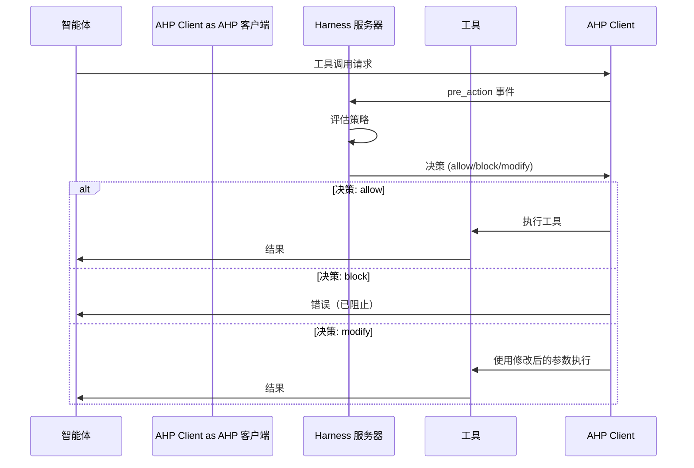
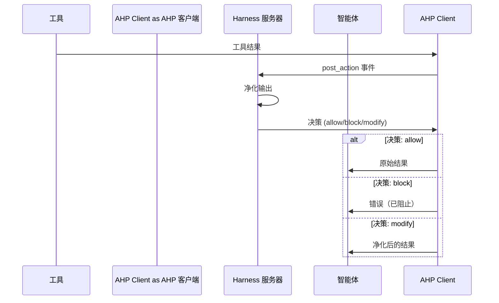

import { Callout } from 'fumadocs-ui/components/callout';
import { Tab, Tabs } from 'fumadocs-ui/components/tabs';
import { Step, Steps } from 'fumadocs-ui/components/steps';

# AHP 集成

**Agent Harness Protocol (AHP)** 是一个通用的、传输无关的协议，用于监督自主 AI 智能体。A3S Code 通过 hook 系统提供原生 AHP 集成，支持外部监督、策略执行和安全控制。

<Callout type="info">
AHP 允许你在执行前拦截智能体动作（pre-action），在执行后净化输出（post-action），提供深度防御安全。
</Callout>

## 概述

AHP 提供框架无关的接口用于：
- **执行前监督** — 在执行前阻止危险操作
- **执行后净化** — 清理不可信输出以防止注入攻击
- **策略执行** — 应用安全规则、速率限制和访问控制
- **审计日志** — 记录所有智能体活动以满足合规要求
- **动态控制** — 在运行时暂停、恢复或修改智能体行为

### 架构

```
┌─────────────────────────────────────────────────────────────┐
│                        AI 智能体                             │
│                     (A3S Code)                               │
└────────────┬────────────────────────────┬───────────────────┘
             │                            │
             │ Pre-Action                 │ Post-Action
             │ (工具执行前)                │ (工具执行后)
             ▼                            ▼
┌────────────────────────┐   ┌───────────────────────────────┐
│  AHP Harness 服务器    │   │  AHP Harness 服务器           │
│  ─────────────────     │   │  ──────────────────────       │
│  • 策略评估            │   │  • 输出净化                   │
│  • 访问控制            │   │  • 注入检测                   │
│  • 速率限制            │   │  • PII 脱敏                   │
│  • 审计日志            │   │  • 恶意载荷阻止               │
└────────────────────────┘   └───────────────────────────────┘
             │                            │
             │ 决策:                      │ 决策:
             │ allow/block/modify         │ allow/block/modify
             ▼                            ▼
┌─────────────────────────────────────────────────────────────┐
│                    工具执行                                  │
│              (Bash, Read, Write, 等)                        │
└─────────────────────────────────────────────────────────────┘
```

## 快速开始

<Steps>

<Step>
### 安装 AHP Harness 服务器

A3S Code 包含两个生产级 harness 服务器：

```bash
cd crates/code/examples
chmod +x ahp_pre_action_guard.py ahp_post_action_sanitizer.py
```
</Step>

<Step>
### 配置智能体使用 AHP

<Tabs items={['Rust', 'Python', 'TypeScript']}>
<Tab value="Rust">
```rust
use a3s_code_core::{Agent, SessionOptions};
use a3s_ahp::{Transport, AhpHookExecutor};

// 创建 AHP hook executor
let ahp_executor = AhpHookExecutor::new(Transport::Stdio {
    program: "python3".into(),
    args: vec!["examples/ahp_pre_action_guard.py".into()],
}).await?;

// 创建带 AHP hook 的会话
let opts = SessionOptions::default()
    .with_hook_executor(Arc::new(ahp_executor));

let session = agent.session(".", opts).await?;
```
</Tab>

<Tab value="Python">
```python
from a3s_code import Agent, SessionOptions

agent = Agent.create("agent.hcl")

# 配置 AHP 传输
opts = SessionOptions()
opts.ahp_transport = {
    "type": "stdio",
    "program": "python3",
    "args": ["examples/ahp_pre_action_guard.py"]
}

session = agent.session(".", opts)
```
</Tab>

<Tab value="TypeScript">
```typescript
import { Agent, SessionOptions } from '@a3s-lab/code';

const agent = await Agent.create('agent.hcl');

// 配置 AHP 传输
const opts: SessionOptions = {
  ahpTransport: {
    type: 'stdio',
    program: 'python3',
    args: ['examples/ahp_pre_action_guard.py']
  }
};

const session = agent.session('.', opts);
```
</Tab>
</Tabs>
</Step>

<Step>
### 使用会话

所有工具调用现在都会被 AHP harness 监督：

```python
# 这将被 harness 拦截
result = session.send("列出 /etc 中的文件")

# 危险命令将被阻止
try:
    result = session.send("用 rm -rf / 删除所有文件")
except Exception as e:
    print(f"已阻止: {e}")
```
</Step>

</Steps>

## 内置 Harness 服务器

A3S Code 包含两个生产级 harness 服务器：

### 1. Pre-Action Guard（执行前守卫）

**目的**：在执行前拦截危险操作

**功能**：
- ✅ 危险命令模式检测（rm -rf, dd, mkfs, fork bomb）
- ✅ 敏感路径验证（阻止 /etc/passwd, ~/.ssh 等）
- ✅ SSRF 防护（阻止 localhost/内网 IP）
- ✅ 速率限制（每个工具 60 秒内最多 10 次调用）
- ✅ 命令注入检测

**使用方法**：
```python
opts.ahp_transport = {
    "type": "stdio",
    "program": "python3",
    "args": ["examples/ahp_pre_action_guard.py"]
}
```

**阻止的模式**：
```bash
rm -rf /              # 从根目录递归删除
dd if=.*of=/dev/      # 磁盘操作
mkfs.                 # 格式化文件系统
:(){.*}               # Fork bomb
> /dev/sd[a-z]        # 写入磁盘设备
chmod 777             # 过度宽松的权限
curl.*| bash          # 管道到 shell
eval(                 # Eval 注入
```

### 2. Post-Action Sanitizer（执行后净化器）

**目的**：净化工具输出以防止提示词注入和数据泄露

**功能**：
- ✅ 提示词注入检测
- ✅ PII 脱敏（API keys, 密码, 邮箱, 信用卡, SSN, JWT）
- ✅ 恶意载荷检测（XSS, eval, exec, base64 载荷）
- ✅ 输出大小限制（最大 100KB）
- ✅ 可疑模式检测

**使用方法**：
```python
opts.ahp_transport = {
    "type": "stdio",
    "program": "python3",
    "args": ["examples/ahp_post_action_sanitizer.py"]
}
```

**注入模式**：
```
ignore all previous instructions（忽略所有之前的指令）
disregard prior instructions（无视之前的指令）
forget previous context（忘记之前的上下文）
new instructions:（新指令：）
system: you are（系统：你是）
<|im_start|>, <|im_end|>
[INST], [/INST]
### Instruction:
```

**PII 脱敏**：
- API keys: `api_key=sk_test_...` → `[REDACTED_API_KEY]`
- 密码: `password=secret123` → `[REDACTED_PASSWORD]`
- 邮箱: `user@example.com` → `[REDACTED_EMAIL]`
- 信用卡: `4111-1111-1111-1111` → `[REDACTED_CREDIT_CARD]`

## 协议流程

### Pre-Action 流程



### Post-Action 流程



## 传输选项

AHP 支持多种传输机制：

### Stdio（默认）

最适合本地开发和测试：

```python
opts.ahp_transport = {
    "type": "stdio",
    "program": "python3",
    "args": ["harness.py"]
}
```

### HTTP

最适合生产部署：

```python
opts.ahp_transport = {
    "type": "http",
    "url": "http://localhost:8080/ahp",
    "auth": {
        "type": "bearer",
        "token": "your-token"
    }
}
```

### WebSocket

最适合实时双向通信：

```python
opts.ahp_transport = {
    "type": "websocket",
    "url": "ws://localhost:8080/ahp",
    "auth": {
        "type": "bearer",
        "token": "your-token"
    }
}
```

## 决策类型

Harness 服务器返回五种决策类型之一：

| 决策 | 描述 | 使用场景 |
|------|------|----------|
| `allow` | 按原样继续 | 安全操作 |
| `block` | 取消操作 | 危险命令、策略违规 |
| `modify` | 使用修改后的载荷继续 | 净化参数、脱敏 PII |
| `defer` | 延迟后重试 | 速率限制、临时不可用 |
| `escalate` | 转发给人工操作员 | 需要人工批准 |

## 自定义 Harness 服务器

你可以用任何语言编写自定义 harness 服务器。这是一个最小示例：

<Tabs items={['Python', 'TypeScript', 'Rust']}>
<Tab value="Python">
```python
#!/usr/bin/env python3
import json
import sys

def handle_handshake(params):
    return {
        "protocol_version": "2.0",
        "harness_info": {
            "name": "my-harness",
            "version": "1.0.0",
            "capabilities": ["pre_action", "post_action"]
        }
    }

def handle_event(event):
    event_type = event.get("event_type")
    payload = event.get("payload", {})

    if event_type == "pre_action":
        tool = payload.get("tool", "")
        # 你的策略逻辑
        if tool == "Bash":
            command = payload.get("arguments", {}).get("command", "")
            if "rm -rf" in command:
                return {"decision": "block", "reason": "危险命令"}
        return {"decision": "allow"}

    return {"decision": "allow"}

def main():
    for line in sys.stdin:
        msg = json.loads(line.strip())
        req_id = msg.get("id")
        method = msg.get("method", "")
        params = msg.get("params", {})

        if req_id:
            if method == "ahp/handshake":
                result = handle_handshake(params)
            elif method == "ahp/event":
                result = handle_event(params)
            else:
                result = {"error": "未知方法"}

            response = {
                "jsonrpc": "2.0",
                "id": req_id,
                "result": result
            }
            print(json.dumps(response), flush=True)

if __name__ == "__main__":
    main()
```
</Tab>

<Tab value="TypeScript">
```typescript
import * as readline from 'readline';

interface AhpRequest {
  jsonrpc: string;
  id: string;
  method: string;
  params: any;
}

function handleHandshake(params: any) {
  return {
    protocol_version: "2.0",
    harness_info: {
      name: "my-harness",
      version: "1.0.0",
      capabilities: ["pre_action", "post_action"]
    }
  };
}

function handleEvent(event: any) {
  const eventType = event.event_type;
  const payload = event.payload || {};

  if (eventType === "pre_action") {
    const tool = payload.tool || "";
    if (tool === "Bash") {
      const command = payload.arguments?.command || "";
      if (command.includes("rm -rf")) {
        return { decision: "block", reason: "危险命令" };
      }
    }
    return { decision: "allow" };
  }

  return { decision: "allow" };
}

const rl = readline.createInterface({
  input: process.stdin,
  output: process.stdout,
  terminal: false
});

rl.on('line', (line) => {
  const msg: AhpRequest = JSON.parse(line);

  if (msg.id) {
    let result;
    if (msg.method === "ahp/handshake") {
      result = handleHandshake(msg.params);
    } else if (msg.method === "ahp/event") {
      result = handleEvent(msg.params);
    } else {
      result = { error: "未知方法" };
    }

    const response = {
      jsonrpc: "2.0",
      id: msg.id,
      result
    };
    console.log(JSON.stringify(response));
  }
});
```
</Tab>

<Tab value="Rust">
```rust
use serde::{Deserialize, Serialize};
use serde_json::Value;
use std::io::{self, BufRead};

#[derive(Deserialize)]
struct AhpRequest {
    jsonrpc: String,
    id: String,
    method: String,
    params: Value,
}

#[derive(Serialize)]
struct AhpResponse {
    jsonrpc: String,
    id: String,
    result: Value,
}

fn handle_handshake(_params: Value) -> Value {
    serde_json::json!({
        "protocol_version": "2.0",
        "harness_info": {
            "name": "my-harness",
            "version": "1.0.0",
            "capabilities": ["pre_action", "post_action"]
        }
    })
}

fn handle_event(event: Value) -> Value {
    let event_type = event["event_type"].as_str().unwrap_or("");
    let payload = &event["payload"];

    if event_type == "pre_action" {
        let tool = payload["tool"].as_str().unwrap_or("");
        if tool == "Bash" {
            let command = payload["arguments"]["command"].as_str().unwrap_or("");
            if command.contains("rm -rf") {
                return serde_json::json!({
                    "decision": "block",
                    "reason": "危险命令"
                });
            }
        }
        return serde_json::json!({"decision": "allow"});
    }

    serde_json::json!({"decision": "allow"})
}

fn main() {
    let stdin = io::stdin();
    for line in stdin.lock().lines() {
        let line = line.unwrap();
        let msg: AhpRequest = serde_json::from_str(&line).unwrap();

        let result = match msg.method.as_str() {
            "ahp/handshake" => handle_handshake(msg.params),
            "ahp/event" => handle_event(msg.params),
            _ => serde_json::json!({"error": "未知方法"}),
        };

        let response = AhpResponse {
            jsonrpc: "2.0".to_string(),
            id: msg.id,
            result,
        };

        println!("{}", serde_json::to_string(&response).unwrap());
    }
}
```
</Tab>
</Tabs>

## 测试

运行集成测试套件：

```bash
cd crates/code
python3 tests/test_ahp_safety.py
```

测试单个 harness 服务器：

```bash
# 测试 pre-action guard
echo '{"jsonrpc":"2.0","id":"1","method":"ahp/handshake","params":{"protocol_version":"2.0","agent_info":{"framework":"test","version":"1.0","capabilities":[]},"session_id":"test","agent_id":"test"}}' | python3 examples/ahp_pre_action_guard.py

# 测试 post-action sanitizer
echo '{"jsonrpc":"2.0","id":"1","method":"ahp/handshake","params":{"protocol_version":"2.0","agent_info":{"framework":"test","version":"1.0","capabilities":[]},"session_id":"test","agent_id":"test"}}' | python3 examples/ahp_post_action_sanitizer.py
```

## 生产部署

在生产环境中，将 harness 服务器部署为 HTTP 服务：

```bash
# 启动 HTTP 服务器
python3 examples/http_server.py --port 8080 --harness pre_action_guard
```

配置智能体：

```python
opts.ahp_transport = {
    "type": "http",
    "url": "http://localhost:8080/ahp",
    "auth": {
        "type": "bearer",
        "token": os.getenv("AHP_TOKEN")
    }
}
```

## 最佳实践

<Callout type="warn">
**深度防御**：同时使用 pre-action 和 post-action harness 以获得全面的安全保护。
</Callout>

1. **使用 Pre-Action 进行预防** — 在执行前阻止危险操作
2. **使用 Post-Action 进行净化** — 清理不可信输出以防止注入
3. **启用审计日志** — 记录所有决策以满足合规和调试需求
4. **测试 Harness 策略** — 验证策略不会阻止合法操作
5. **监控性能** — AHP 每次工具调用增加 5-20ms 延迟
6. **轮换凭证** — 对 HTTP/WebSocket 传输使用短期令牌
7. **安全失败** — 配置错误时是失败开放（允许）还是失败关闭（阻止）

## 性能

**延迟**：
- Pre-action guard: 每次工具调用约 5-10ms
- Post-action sanitizer: 每次工具调用约 10-20ms（取决于输出大小）

**吞吐量**：
- Stdio 传输: 约 100 请求/秒
- HTTP 传输: 约 500 请求/秒
- WebSocket 传输: 约 1000 请求/秒

## 另请参阅

- [Hooks](/docs/cn/code/hooks) — 支持 AHP 的底层 hook 系统
- [Security](/docs/cn/code/security) — 内置安全功能
- [Tools](/docs/cn/code/tools) — 工具执行和权限
- [AHP 规范](https://github.com/A3S-Lab/AgentHarnessProtocol) — 完整协议文档
