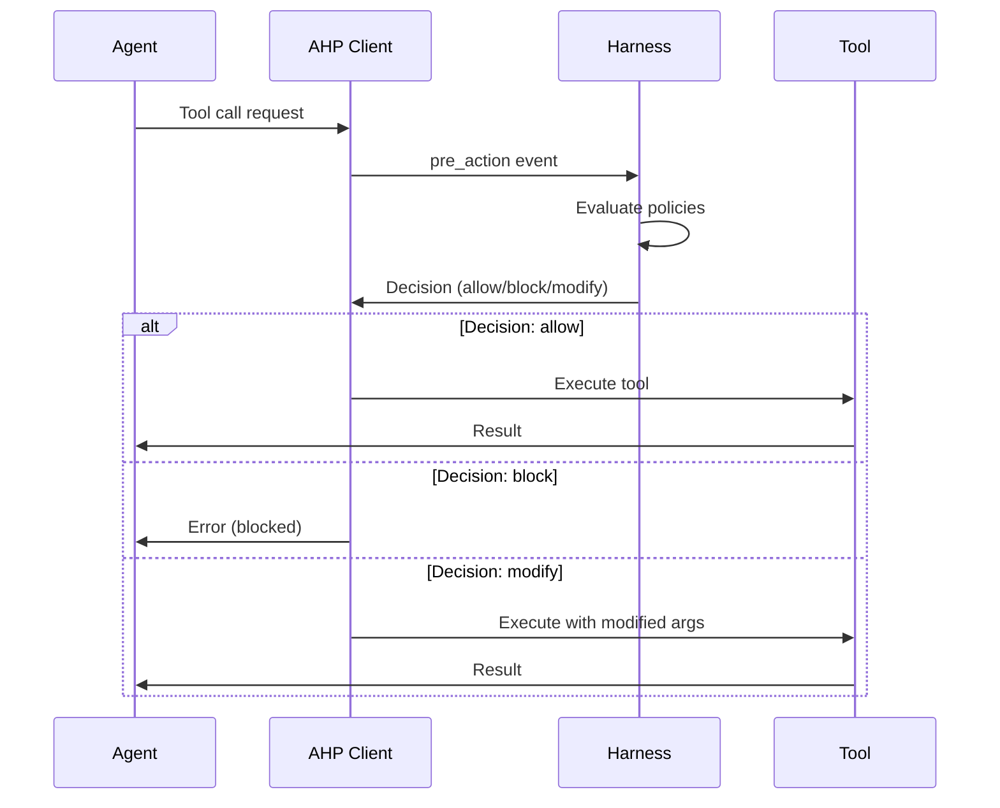
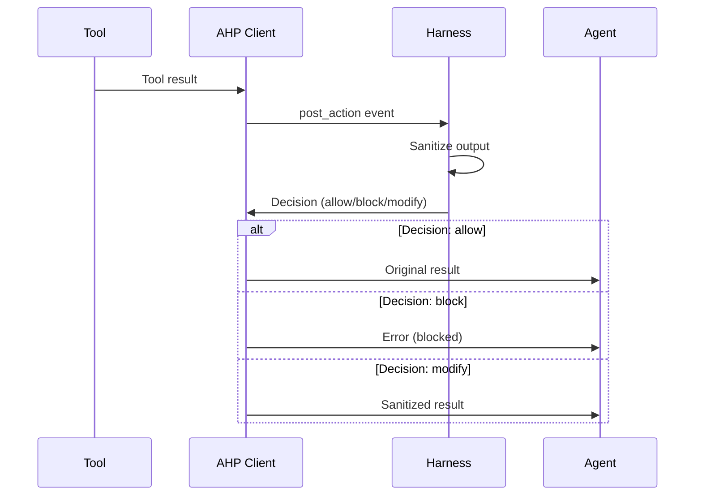

import { Callout } from 'fumadocs-ui/components/callout';
import { Tab, Tabs } from 'fumadocs-ui/components/tabs';
import { Step, Steps } from 'fumadocs-ui/components/steps';

# AHP Integration

**Agent Harness Protocol (AHP)** is a universal, transport-agnostic protocol for supervising autonomous AI agents. A3S Code provides native AHP integration through the hook system, enabling external supervision, policy enforcement, and security controls.

<Callout type="info">
AHP allows you to intercept agent actions before execution (pre-action) and sanitize outputs after execution (post-action), providing defense-in-depth security.
</Callout>

## Overview

AHP provides a framework-agnostic interface for:
- **Pre-action supervision** — Block dangerous operations before execution
- **Post-action sanitization** — Clean untrusted outputs to prevent injection attacks
- **Policy enforcement** — Apply security rules, rate limits, and access controls
- **Audit logging** — Record all agent activities for compliance
- **Dynamic control** — Pause, resume, or modify agent behavior at runtime

### Architecture Types

A3S Code supports two AHP architectures:

1. **Agent Monitors Agent** (Recommended) — Use an independent A3S Code agent as AHP Server
2. **Pattern-Based Harness** — Fast rule-based checks using regex patterns

#### Agent Monitors Agent Architecture (Recommended)

```
┌─────────────────────────────────────────────────────────────┐
│                      Business Agent                          │
│                  (A3S Code Agent + Kimi)                    │
│                                                             │
│  - Executes actual business tasks                          │
│  - Calls tools (Bash, Read, Write, etc.)                   │
│  - Configured with AHP transport to AHP Server             │
└─────────────────────────────────────────────────────────────┘
                          │
                          │ AHP Protocol (JSON-RPC 2.0)
                          │ stdio transport
                          ↓
┌─────────────────────────────────────────────────────────────┐
│                   AHP Server Agent                           │
│                  (A3S Code Agent + Kimi)                    │
│                                                             │
│  - Receives pre_action/post_action events                  │
│  - Uses LLM to analyze security risks                      │
│  - Makes allow/block decisions                             │
│  - Returns decisions to business agent                     │
└─────────────────────────────────────────────────────────────┘
```

**Advantages**:
- Context-aware analysis: Understands operation intent, not just pattern matching
- Adaptive learning: Improves from historical decisions
- Natural language reasoning: Provides clear decision rationale
- Complex threat detection: Catches attacks that bypass regex
- Independent agents: AHP Server agent is fully independent, can have its own config and policies

**Example**: See [AHP Safety Harness Example](/docs/en/code/examples/ahp-safety#agent-monitors-agent-architecture-recommended)

#### Pattern-Based Architecture

```
┌─────────────────────────────────────────────────────────────┐
│                        AI Agent                              │
│                     (A3S Code)                               │
└────────────┬────────────────────────────┬───────────────────┘
             │                            │
             │ Pre-Action                 │ Post-Action
             │ (before tool exec)         │ (after tool exec)
             ▼                            ▼
┌────────────────────────┐   ┌───────────────────────────────┐
│  AHP Harness Server    │   │  AHP Harness Server           │
│  ─────────────────     │   │  ──────────────────────       │
│  • Policy evaluation   │   │  • Output sanitization        │
│  • Access control      │   │  • Injection detection        │
│  • Rate limiting       │   │  • PII redaction              │
│  • Audit logging       │   │  • Malicious payload blocking │
└────────────────────────┘   └───────────────────────────────┘
             │                            │
             │ Decision:                  │ Decision:
             │ allow/block/modify         │ allow/block/modify
             ▼                            ▼
┌─────────────────────────────────────────────────────────────┐
│                    Tool Execution                            │
│              (Bash, Read, Write, etc.)                       │
└─────────────────────────────────────────────────────────────┘
```

## Quick Start

<Steps>

<Step>
### Install AHP Harness Server

A3S Code includes two production-ready harness servers:

```bash
cd crates/code/examples
chmod +x ahp_pre_action_guard.py ahp_post_action_sanitizer.py
```
</Step>

<Step>
### Configure Agent with AHP

<Tabs items={['Rust', 'Python', 'TypeScript']}>
<Tab value="Rust">
```rust
use a3s_code_core::{Agent, SessionOptions};
use a3s_ahp::{Transport, AhpHookExecutor};

// Create AHP hook executor
let ahp_executor = AhpHookExecutor::new(Transport::Stdio {
    program: "python3".into(),
    args: vec!["examples/ahp_pre_action_guard.py".into()],
}).await?;

// Create session with AHP hook
let opts = SessionOptions::default()
    .with_hook_executor(Arc::new(ahp_executor));

let session = agent.session(".", opts).await?;
```
</Tab>

<Tab value="Python">
```python
from a3s_code import Agent, SessionOptions

agent = Agent.create("agent.hcl")

# Configure AHP transport
opts = SessionOptions()
opts.ahp_transport = {
    "type": "stdio",
    "program": "python3",
    "args": ["examples/ahp_pre_action_guard.py"]
}

session = agent.session(".", opts)
```
</Tab>

<Tab value="TypeScript">
```typescript
import { Agent, SessionOptions } from '@a3s-lab/code';

const agent = await Agent.create('agent.hcl');

// Configure AHP transport
const opts: SessionOptions = {
  ahpTransport: {
    type: 'stdio',
    program: 'python3',
    args: ['examples/ahp_pre_action_guard.py']
  }
};

const session = agent.session('.', opts);
```
</Tab>
</Tabs>
</Step>

<Step>
### Use the Session

All tool calls are now supervised by the AHP harness:

```python
# This will be intercepted by the harness
result = session.send("List files in /etc")

# Dangerous commands will be blocked
try:
    result = session.send("Delete all files with rm -rf /")
except Exception as e:
    print(f"Blocked: {e}")
```
</Step>

</Steps>

## Built-in Harness Servers

A3S Code includes two production-ready harness servers:

### 1. Pre-Action Guard

**Purpose**: Intercept dangerous operations before execution

**Features**:
- ✅ Dangerous command pattern detection (rm -rf, dd, mkfs, fork bombs)
- ✅ Sensitive path validation (blocks /etc/passwd, ~/.ssh, etc.)
- ✅ SSRF prevention (blocks localhost/internal IPs)
- ✅ Rate limiting (10 calls per 60 seconds per tool)
- ✅ Command injection detection

**Usage**:
```python
opts.ahp_transport = {
    "type": "stdio",
    "program": "python3",
    "args": ["examples/ahp_pre_action_guard.py"]
}
```

**Blocked Patterns**:
```bash
rm -rf /              # Recursive delete from root
dd if=.*of=/dev/      # Disk operations
mkfs.                 # Format filesystem
:(){.*}               # Fork bomb
> /dev/sd[a-z]        # Write to disk device
chmod 777             # Overly permissive permissions
curl.*| bash          # Pipe to shell
eval(                 # Eval injection
```

### 2. Post-Action Sanitizer

**Purpose**: Sanitize tool outputs to prevent prompt injection and data leakage

**Features**:
- ✅ Prompt injection detection
- ✅ PII redaction (API keys, passwords, emails, credit cards, SSNs, JWTs)
- ✅ Malicious payload detection (XSS, eval, exec, base64 payloads)
- ✅ Output size limiting (100KB max)
- ✅ Suspicious pattern detection

**Usage**:
```python
opts.ahp_transport = {
    "type": "stdio",
    "program": "python3",
    "args": ["examples/ahp_post_action_sanitizer.py"]
}
```

**Injection Patterns**:
```
ignore all previous instructions
disregard prior instructions
forget previous context
new instructions:
system: you are
<|im_start|>, <|im_end|>
[INST], [/INST]
### Instruction:
```

**PII Redaction**:
- API keys: `api_key=sk_test_...` → `[REDACTED_API_KEY]`
- Passwords: `password=secret123` → `[REDACTED_PASSWORD]`
- Emails: `user@example.com` → `[REDACTED_EMAIL]`
- Credit cards: `4111-1111-1111-1111` → `[REDACTED_CREDIT_CARD]`

## Protocol Flow

### Pre-Action Flow



### Post-Action Flow



## Transport Options

AHP supports multiple transport mechanisms:

### Stdio (Default)

Best for local development and testing:

```python
opts.ahp_transport = {
    "type": "stdio",
    "program": "python3",
    "args": ["harness.py"]
}
```

### HTTP

Best for production deployments:

```python
opts.ahp_transport = {
    "type": "http",
    "url": "http://localhost:8080/ahp",
    "auth": {
        "type": "bearer",
        "token": "your-token"
    }
}
```

### WebSocket

Best for real-time bidirectional communication:

```python
opts.ahp_transport = {
    "type": "websocket",
    "url": "ws://localhost:8080/ahp",
    "auth": {
        "type": "bearer",
        "token": "your-token"
    }
}
```

## Decision Types

Harness servers return one of five decision types:

| Decision | Description | Use Case |
|----------|-------------|----------|
| `allow` | Proceed as-is | Safe operation |
| `block` | Cancel operation | Dangerous command, policy violation |
| `modify` | Proceed with modified payload | Sanitize arguments, redact PII |
| `defer` | Retry after delay | Rate limiting, temporary unavailability |
| `escalate` | Forward to human operator | Requires manual approval |

## Custom Harness Servers

You can write custom harness servers in any language. Here's a minimal example:

<Tabs items={['Python', 'TypeScript', 'Rust']}>
<Tab value="Python">
```python
#!/usr/bin/env python3
import json
import sys

def handle_handshake(params):
    return {
        "protocol_version": "2.0",
        "harness_info": {
            "name": "my-harness",
            "version": "1.0.0",
            "capabilities": ["pre_action", "post_action"]
        }
    }

def handle_event(event):
    event_type = event.get("event_type")
    payload = event.get("payload", {})

    if event_type == "pre_action":
        tool = payload.get("tool", "")
        # Your policy logic here
        if tool == "Bash":
            command = payload.get("arguments", {}).get("command", "")
            if "rm -rf" in command:
                return {"decision": "block", "reason": "Dangerous command"}
        return {"decision": "allow"}

    return {"decision": "allow"}

def main():
    for line in sys.stdin:
        msg = json.loads(line.strip())
        req_id = msg.get("id")
        method = msg.get("method", "")
        params = msg.get("params", {})

        if req_id:
            if method == "ahp/handshake":
                result = handle_handshake(params)
            elif method == "ahp/event":
                result = handle_event(params)
            else:
                result = {"error": "Unknown method"}

            response = {
                "jsonrpc": "2.0",
                "id": req_id,
                "result": result
            }
            print(json.dumps(response), flush=True)

if __name__ == "__main__":
    main()
```
</Tab>

<Tab value="TypeScript">
```typescript
import * as readline from 'readline';

interface AhpRequest {
  jsonrpc: string;
  id: string;
  method: string;
  params: any;
}

function handleHandshake(params: any) {
  return {
    protocol_version: "2.0",
    harness_info: {
      name: "my-harness",
      version: "1.0.0",
      capabilities: ["pre_action", "post_action"]
    }
  };
}

function handleEvent(event: any) {
  const eventType = event.event_type;
  const payload = event.payload || {};

  if (eventType === "pre_action") {
    const tool = payload.tool || "";
    if (tool === "Bash") {
      const command = payload.arguments?.command || "";
      if (command.includes("rm -rf")) {
        return { decision: "block", reason: "Dangerous command" };
      }
    }
    return { decision: "allow" };
  }

  return { decision: "allow" };
}

const rl = readline.createInterface({
  input: process.stdin,
  output: process.stdout,
  terminal: false
});

rl.on('line', (line) => {
  const msg: AhpRequest = JSON.parse(line);

  if (msg.id) {
    let result;
    if (msg.method === "ahp/handshake") {
      result = handleHandshake(msg.params);
    } else if (msg.method === "ahp/event") {
      result = handleEvent(msg.params);
    } else {
      result = { error: "Unknown method" };
    }

    const response = {
      jsonrpc: "2.0",
      id: msg.id,
      result
    };
    console.log(JSON.stringify(response));
  }
});
```
</Tab>

<Tab value="Rust">
```rust
use serde::{Deserialize, Serialize};
use serde_json::Value;
use std::io::{self, BufRead};

#[derive(Deserialize)]
struct AhpRequest {
    jsonrpc: String,
    id: String,
    method: String,
    params: Value,
}

#[derive(Serialize)]
struct AhpResponse {
    jsonrpc: String,
    id: String,
    result: Value,
}

fn handle_handshake(_params: Value) -> Value {
    serde_json::json!({
        "protocol_version": "2.0",
        "harness_info": {
            "name": "my-harness",
            "version": "1.0.0",
            "capabilities": ["pre_action", "post_action"]
        }
    })
}

fn handle_event(event: Value) -> Value {
    let event_type = event["event_type"].as_str().unwrap_or("");
    let payload = &event["payload"];

    if event_type == "pre_action" {
        let tool = payload["tool"].as_str().unwrap_or("");
        if tool == "Bash" {
            let command = payload["arguments"]["command"].as_str().unwrap_or("");
            if command.contains("rm -rf") {
                return serde_json::json!({
                    "decision": "block",
                    "reason": "Dangerous command"
                });
            }
        }
        return serde_json::json!({"decision": "allow"});
    }

    serde_json::json!({"decision": "allow"})
}

fn main() {
    let stdin = io::stdin();
    for line in stdin.lock().lines() {
        let line = line.unwrap();
        let msg: AhpRequest = serde_json::from_str(&line).unwrap();

        let result = match msg.method.as_str() {
            "ahp/handshake" => handle_handshake(msg.params),
            "ahp/event" => handle_event(msg.params),
            _ => serde_json::json!({"error": "Unknown method"}),
        };

        let response = AhpResponse {
            jsonrpc: "2.0".to_string(),
            id: msg.id,
            result,
        };

        println!("{}", serde_json::to_string(&response).unwrap());
    }
}
```
</Tab>
</Tabs>

## Testing

Run the integration test suite:

```bash
cd crates/code
python3 tests/test_ahp_safety.py
```

Test individual harness servers:

```bash
# Test pre-action guard
echo '{"jsonrpc":"2.0","id":"1","method":"ahp/handshake","params":{"protocol_version":"2.0","agent_info":{"framework":"test","version":"1.0","capabilities":[]},"session_id":"test","agent_id":"test"}}' | python3 examples/ahp_pre_action_guard.py

# Test post-action sanitizer
echo '{"jsonrpc":"2.0","id":"1","method":"ahp/handshake","params":{"protocol_version":"2.0","agent_info":{"framework":"test","version":"1.0","capabilities":[]},"session_id":"test","agent_id":"test"}}' | python3 examples/ahp_post_action_sanitizer.py
```

## Production Deployment

For production, deploy harness servers as HTTP services:

```bash
# Start HTTP server
python3 examples/http_server.py --port 8080 --harness pre_action_guard
```

Configure agent:

```python
opts.ahp_transport = {
    "type": "http",
    "url": "http://localhost:8080/ahp",
    "auth": {
        "type": "bearer",
        "token": os.getenv("AHP_TOKEN")
    }
}
```

## Best Practices

<Callout type="warn">
**Defense in Depth**: Use both pre-action and post-action harnesses together for comprehensive security.
</Callout>

1. **Use Pre-Action for Prevention** — Block dangerous operations before they execute
2. **Use Post-Action for Sanitization** — Clean untrusted outputs to prevent injection
3. **Enable Audit Logging** — Record all decisions for compliance and debugging
4. **Test Harness Policies** — Verify policies don't block legitimate operations
5. **Monitor Performance** — AHP adds 5-20ms latency per tool call
6. **Rotate Credentials** — Use short-lived tokens for HTTP/WebSocket transports
7. **Fail Securely** — Configure whether to fail open (allow) or fail closed (block) on errors

## Performance

**Latency**:
- Pre-action guard: ~5-10ms per tool call
- Post-action sanitizer: ~10-20ms per tool call (depends on output size)

**Throughput**:
- Stdio transport: ~100 requests/sec
- HTTP transport: ~500 requests/sec
- WebSocket transport: ~1000 requests/sec

## See Also

- [Hooks](/docs/en/code/hooks) — Low-level hook system that powers AHP
- [Security](/docs/en/code/security) — Built-in security features
- [Tools](/docs/en/code/tools) — Tool execution and permissions
- [AHP Specification](https://github.com/A3S-Lab/AgentHarnessProtocol) — Full protocol documentation
