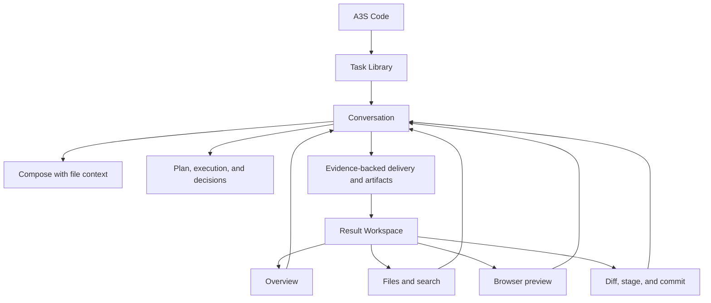

# A3S Code Functional Specification

## Objective

A3S Code Web enables a developer to complete a local coding task without
learning terminal command syntax:

```text
Describe → supervise → decide → inspect results → correct → validate → commit
```

The current release supports one local user, one served workspace, one A3S Code
agent identity, and multiple durable tasks. It is desktop-only. A3S OS account
connection is optional.

The super-app direction is documented in [SUPER_APP.md](SUPER_APP.md), but only
Code is active in this release.

## Functional success criteria

- A user can start a useful task without opening Help.
- Every task shows whether it is running, waiting, stopped, failed, completed,
  or ready for the next instruction.
- File context can be inspected before it is attached.
- Sensitive operations explain the requested decision inside the execution that
  needs it.
- Follow-up instructions remain visible and editable.
- A material completion distinguishes verified, pending, failed, and residual
  risk instead of claiming success from prose alone.
- Selecting a result opens the relevant file, preview, diff, or overview beside
  the same Conversation.
- Closing and reopening the Result Workspace restores task-scoped inspection
  state without losing drafts, tabs, or unsaved edits.
- Review never attributes unrelated workspace changes to the selected task.
- A user can inspect, correct, stage, and commit without losing task context.
- Disconnect, refresh, failed mutation, preview failure, and editor conflict
  recovery are honest.
- The complete journey works at 1440 px and compact desktop around 1024 px.

## Functional map



## F1 — Service and workspace

- Bootstrap health, account, model catalog, sessions, effort levels, root files,
  Git state, preview capabilities, and active-task detail from the local service.
- Treat the model catalog as version-tolerant: when an older service lacks the
  dedicated route, derive the same qualified model list from configured
  Providers without blocking startup.
- Merge valid local Claude Code, Codex, and WorkBuddy account models into that
  catalog by reusing the TUI's discovery authority, and route a selected
  account model to its real account-backed runtime client without exposing
  credentials. WorkBuddy model refresh and execution use its installed
  CodeBuddy CLI and existing account state, matching the TUI provider.
- Return the local account fallback catalog during bootstrap and refresh
  WorkBuddy entitlements in the background; account CLI startup must not delay
  the transition into the task workspace.
- Use the same authoritative reload path for initial load and reconnect.
- Show a bounded startup transition for loading and an actionable recovery card
  for connection or page/service version failures; keep raw request details
  collapsed.
- Show service disconnect as a persistent banner with retry.
- Preserve unsaved browser state while disconnected.
- Show the actual workspace root, config path, version, and account state.

Acceptance: health-only success cannot dismiss a disconnect banner; a missing
active task returns safely to the new-task draft; missing preview capability
does not create a disabled Browser mode.

## F2 — Task library and identity

- Present new-task preparation as a focused Composer with concise guidance and
  editable Code scenario starters.
- Hide task identity, result actions, and operational status until a task exists.
- Create a task from the current new-task draft on first send.
- Search and select tasks; rename and delete directly inside the affected row
  with keyboard save/cancel and inline failure recovery.
- Persist active task, titles, drafts, queues, and task-scoped Result Workspace
  state on a best-effort basis.
- Keep running status scoped to the real running task.
- Preserve the current draft when switching tasks.

Acceptance: opening another task while one runs offers a direct return to the
running task and never marks the selected idle task as running. An unresolved
dirty artifact blocks the task switch before selection changes.

## F3 — Compose and execute

- Accept natural-language goals, constraints, and acceptance conditions.
- Attach workspace files through a lazy, type-colored `@` tree or Files-mode
  selection.
- Copy dropped files and folders into the workspace without overwriting existing
  top-level paths; preserve hierarchy, expose progress, roll back failed
  imports, refresh Files, and add imported roots to task context.
- Offer enabled Skills and the pinned `/goal` control through `/`; filter and
  rank as the user types, highlight visible matches, and intercept `/goal
  <target>` and `/goal clear` instead of transporting or queuing them.
- Highlight recognized command tokens such as `/goal` inside the editor while
  preserving plain-text transport.
- Reject paths outside the served workspace.
- Render assistant Markdown incrementally through Streamdown, including Shiki
  syntax highlighting for fenced code in light and dark themes.
- Create a semantic execution stream from messages, plans, merged tool
  lifecycle events, permissions, replies, verification, and artifact references.
- Preserve selected Skill and workspace-file context in restored user
  instructions; Continue editing restores those resources with the text.
- Anchor each assistant turn with a stable Code identity row, local pending
  state, timestamp, and copy feedback; render reasoning through the same
  Markdown pipeline in a lifecycle-aware disclosure.
- Stop forced transcript and tool-output scrolling when the reader leaves the
  bottom, and expose an explicit return-to-latest action.
- Keep detailed operational activity in the execution that produced it; do not
  require a separate Activity page.
- Morph the primary Send action into Stop in place during execution; Enter
  continues to add follow-up instructions to the visible queue.
- Queue, reorder, edit, and remove follow-up instructions.
- Expose the selected execution mode and its distinct icon on the closed
  trigger, provider-tabbed model selection, an independent Effort slider with
  English values and Chinese descriptions, goal state, context usage, and a
  directly adjacent manual compaction action.
- Keep persisted live `/goal` duration as a passive footer status. Expose the
  upper-right task-runtime floating panel only after the runtime publishes a
  non-empty plan or a real subagent lifecycle; project its checklist,
  completed/total state, elapsed time, and parallel subagent evidence without
  placeholders or invented plan rows. A wide Conversation reserves a
  non-overlapping transcript rail and expands new runtime evidence there. A
  narrow Conversation or side-by-side Result Workspace uses a docked compact
  summary whose detail opens only on explicit request, while collapse never
  moves the Composer. Restore completed elapsed time from durable message
  timestamps when volatile timing is unavailable.
- Reflect model, Effort, execution-mode, HITL, cancellation, queue, and compact
  success through local state rather than redundant global success toasts.

Acceptance: live output never leaks across tasks; duplicate persisted and live
tool blocks are removed; complete tool output remains available without
permanent truncation; stopped queues do not auto-run; execution detail can be
expanded without moving the user away from the Conversation; compaction
refreshes both messages and usage while preserving task identity. Tool-level
failure and permission recovery render once inside the owning execution rather
than being repeated as a global notice.

## F4 — Decisions, recovery, delivery, and artifact entry

- Show permission scope, operation, reason, timeout, and allow/deny decisions in
  the requesting execution block.
- Prevent stale confirmations from affecting a later execution.
- On denial or timeout, offer a safer continuation instead of reversing the
  user's choice.
- Show recovery guidance for interruption, failure, cancellation, or service
  loss.
- Render a delivery summary only from verification evidence.
- Render artifact entries for addressable files, diffs, previews, reports, and
  verification results.
- Open an artifact in its relevant Result Workspace mode while preserving
  Conversation and Composer state.

Acceptance: conversational answers remain ordinary transcript content;
delivery math cannot become negative or exceed required checks; an artifact
entry cannot open an unrelated task's state.

## F5 — Result Workspace shell

- Keep the Result Workspace closed until a task action opens a meaningful result.
- Provide one shared header with artifact tabs, full-screen, and close actions.
- Provide one compact mode switcher for Overview, Files, Browser, and Changes.
- Give each mode a mode-specific navigator and a dominant artifact viewport.
- Focus an existing tab when the same artifact is opened twice.
- Persist selected mode, tabs, selected artifact, navigator width, workspace
  width, and scroll positions in task scope where practical.
- Restore full Conversation width on close and restore the workspace state on
  reopen.
- Overlay Conversation around 1024 px instead of crushing the two surfaces.

Acceptance: a task with no artifacts shows no empty Result Workspace; close and
full-screen are reversible; switching modes never discards unrelated open tabs
or unsaved edits; keyboard focus returns to the opening control on close.

## F6 — Overview and Files

- Group task results by files, changes, previews, and verification in Overview.
- Browse directories and open text files in Files.
- Use a locally bundled, lazy-loaded Monaco editor with syntax highlighting,
  folding, exact line/column reveal, and per-document view state.
- Open files and Git comparisons in one multi-tab strip; preserve independent
  drafts while switching and guard only dirty tab closure.
- Search workspace text and open an exact line and column.
- Open file and directory operations from a VS Code-style pointer or keyboard
  context menu rather than hover-revealed row buttons. Keep create, rename,
  copy, delete confirmation, busy state, and recoverable errors at the affected
  tree location after an operation is chosen.
- Edit and save text with dirty-state protection.
- Detect external changes and let the user reload or overwrite explicitly.
- Render binary files as non-editable metadata.
- Validate supported configuration files and invalidate validation after edit.
- Confirm replacement scope and use the displayed result set's searched query.

Acceptance: file read failure preserves the previous artifact; same-file
selection does not reread a dirty draft; Save and Close, Don't Save, and Cancel
protect dirty tab closure; parent rename rebases all affected tabs; Replace is
disabled for stale results or affected unsaved content.

## F7 — Browser preview

- Show Browser mode only when the service provides at least one valid preview
  target.
- List available targets and remember the selected target per task.
- Show starting, ready, stopped, failed, and disconnected states.
- Refresh and reopen the current preview without rebuilding the task context.
- Keep preview controls separate from arbitrary public Web navigation.
- Provide useful diagnostics and retry when startup or navigation fails.

Acceptance: a preview failure preserves the selected target and Conversation;
refresh cannot start duplicate preview processes; the Browser mode cannot escape
the backend-defined preview boundary without an explicit future security design.

## F8 — Changes and commit

- Show authoritative workspace-wide Git branch and changed files.
- Display status plus additions and deletions in the Changes navigator.
- Inspect complete original and modified file documents in a Monaco diff tab,
  with automatic inline presentation at constrained widths, and open the
  related file without leaving the Result Workspace.
- Stage and unstage individual files.
- Confirm commit message and staged scope.
- Prevent refresh, close, and duplicate submission during mutations.
- Show a successful commit receipt and refreshed status.

Acceptance: failed mutations retain mode, file, diff, staging selection, and
retry context; a diff closes only after another artifact opens successfully;
Git state is never labelled as selected-task provenance.

## F9 — Settings and help

- Open Settings as a global modal over the current Code surface; do not replace,
  unmount, or reset that surface.
- Configure account and appearance.
- Configure the default model, providers, model capabilities, runtime limits,
  and locally held credentials.
- Configure Agent execution limits, Skill and Agent directories, automatic
  delegation, and optional Lane queue behavior.
- Configure session storage, memory paths, relevance, extraction, and pruning.
- Configure A3S OS address, Web search and headless browsing, document parsing,
  OCR, cache, MCP transports, environment, OAuth, and tool timeouts.
- Check and install updates from the About tab.
- Surface catalog warnings, missing configuration, disconnected service, and
  update failures with a useful retry.
- Explain the Conversation-to-Result-Workspace workflow and keyboard entry
  points, including `?` Help.
- Keep common configuration rows aligned and labelled, show numeric units,
  preserve disclosure state and focus while editable Provider names or model IDs
  change, and never offer to reveal a secret value the browser did not receive.

Acceptance: the dialog follows the quiet two-column WorkBuddy settings pattern
with neutral controls and A3S blue used only as an accent; close and Escape
restore the underlying Code hash and invoking focus; Help is a searchable
Settings tab at `#settings/help` and never becomes a separate full-screen
surface; sign-in does not imply unavailable runtime tools are active; About
shows actual service state; update install remains non-dismissible by buttons
or shell shortcuts; each configuration category is lazy, retryable, and saved
independently; a failed save preserves the local draft and authoritative saved
state; secrets are masked and are never returned to the browser; effect labels
distinguish new-task changes from restart-required changes; Help does not teach
slash commands as the primary Web interaction.

## Excluded from this release

- Work and Science product workspaces;
- task branching, archive/restore, and conversation clearing;
- image attachments, direct shell-command Composer syntax, and input history;
- memory browsing, context search, knowledge-base management, and manual
  consolidation workflows; configuration of the memory runtime is supported;
- automation assets, plugins, global processes, and deployment activity;
- unrestricted public browsing, remote filesystems, shared teams, roles, and
  mobile layouts.

Excluded capabilities remain available through established CLI/TUI paths when
supported. They do not receive placeholder Web components or unused API
wrappers.

## Global acceptance

- Run Biome formatting/lint, TypeScript, tests, and production build.
- Browser-test complete journeys, not isolated controls.
- Inspect browser console errors.
- Verify keyboard focus and duplicate-submission guards.
- Verify populated, empty, loading, error, reconnect, and compact desktop states.
- Verify each artifact entry opens the correct mode, tab, and selection.
- Stop temporary servers and close browser sessions after QA.
