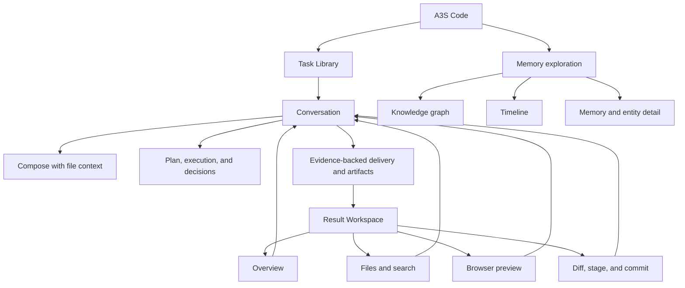

# A3S Code Functional Specification

## Objective

A3S Code Web enables a developer to complete a local coding task without
learning terminal command syntax:

```text
Describe → supervise → decide → inspect results → correct → validate → commit
```

The current release supports one local user, one served workspace, one A3S Code
agent identity, and multiple durable tasks. It is desktop-only. A3S OS account
connection is optional.

The super-app direction is documented in [SUPER_APP.md](SUPER_APP.md). Code and
the first Work local-files surface are active; this document defines Code.

## Functional success criteria

- A user can start a useful task without opening Help.
- Every task shows whether it is running, waiting, stopped, failed, completed,
  or ready for the next instruction.
- File context can be inspected before it is attached.
- Sensitive operations explain the requested decision inside the execution that
  needs it.
- Follow-up instructions remain visible and editable.
- A material completion distinguishes verified, pending, failed, and residual
  risk instead of claiming success from prose alone.
- Selecting a result opens the relevant file, preview, diff, or overview beside
  the same Conversation.
- Closing and reopening the Result Workspace restores task-scoped inspection
  state without losing drafts, tabs, or unsaved edits.
- Review never attributes unrelated workspace changes to the selected task.
- A user can inspect, correct, stage, and commit without losing task context.
- A user can search and filter the complete local memory store, move between
  graph and timeline views, and inspect a memory or entity without mutating it.
- Disconnect, refresh, failed mutation, preview failure, and editor conflict
  recovery are honest.
- The complete journey works at 1440 px and compact desktop around 1024 px.

## Functional map



## F1 — Service and workspace

- Bootstrap health, account, model catalog, sessions, effort levels, root files,
  Git state, preview capabilities, and active-task detail from the local service.
- Treat the model catalog as version-tolerant: when an older service lacks the
  dedicated route, derive the same qualified model list from configured
  Providers without blocking startup.
- Merge valid local Claude Code, Codex, and WorkBuddy account models into that
  catalog by reusing the TUI's discovery authority, and route a selected
  account model to its real account-backed runtime client without exposing
  credentials. WorkBuddy model refresh and execution use its installed
  CodeBuddy CLI and existing account state, matching the TUI provider.
- Return the local account fallback catalog during bootstrap and refresh
  WorkBuddy entitlements in the background; account CLI startup must not delay
  the transition into the task workspace.
- Let the Account Settings surface refresh the same runtime catalog explicitly;
  preserve the previous usable catalog on failure and never reset a still-valid
  Composer model selection.
- Use the same authoritative reload path for initial load and reconnect.
- Show a bounded startup transition for loading and an actionable recovery card
  for connection or page/service version failures; keep raw request details
  collapsed.
- Show service disconnect as a persistent banner with retry.
- Preserve unsaved browser state while disconnected.
- Show the actual workspace root, config path, version, and account state.

Acceptance: health-only success cannot dismiss a disconnect banner; a missing
active task returns safely to the new-task draft; missing preview capability
does not create a disabled Browser mode.

## F2 — Task library and identity

- Present new-task preparation as a focused Composer with concise guidance and
  editable Code scenario starters.
- Hide task identity, result actions, and operational status until a task exists.
- Create a task from the current new-task draft on first send, promote the
  prepared Composer and Result Workspace state into that task, and leave the
  next new-task slot empty.
- Search and select tasks; rename and delete directly inside the affected row
  with keyboard save/cancel and inline failure recovery.
- Persist active task, titles, drafts, queues, and task-scoped Result Workspace
  state across a normal browser refresh on a best-effort basis. Flush the active
  snapshot on `pagehide`, reject malformed stored state, and prioritize dirty
  drafts over rebuildable caches if browser capacity is constrained.
- Keep running status scoped to the real running task.
- Preserve the current draft when switching tasks.

Acceptance: opening another task while one runs offers a direct return to the
running task and never marks the selected idle task as running. Switching tasks
captures and restores dirty drafts inside the originating task, including when
both tasks use the same workspace, so selection changes without a destructive
prompt. Close, reload, replace, or overwrite still requires explicit resolution
when it would discard unsaved content. Refresh restores the active task's dirty
tabs without writing them to disk.

## F3 — Compose and execute

- Accept natural-language goals, constraints, and acceptance conditions.
- Attach workspace files through a lazy, type-colored `@` tree or Files-mode
  selection.
- Copy dropped files and folders into the workspace without overwriting existing
  top-level paths; preserve hierarchy, expose progress, roll back failed
  imports, refresh Files, and add imported roots to task context.
- Offer enabled Skills and the pinned `/goal` control through `/`; filter and
  rank as the user types, highlight visible matches, and intercept `/goal
  <target>` and `/goal clear` instead of transporting or queuing them.
- Highlight recognized command tokens such as `/goal` inside the editor while
  preserving plain-text transport.
- Reject paths outside the served workspace.
- Render assistant Markdown incrementally through Streamdown with deliberate
  typography and spacing for headings, paragraphs, nested and task lists,
  quotes, links, tables, media, and inline code. Fenced code uses Shiki in light
  and dark themes, visible line numbers, bounded scrolling, and localized copy
  controls.
- Create a semantic execution stream from messages, plans, merged tool
  lifecycle events, permissions, replies, verification, and artifact references.
- Present shell tools as readable command lines with TUI-aligned token roles,
  working-directory context, copy action, running state, and live output line
  count. Present generic tools with the same visual grammar and a compact
  typed-argument signature. Keep raw arguments and complete output available as
  secondary disclosures, and retain a concise output excerpt when a completed
  call is collapsed.
- Preserve selected Skill and workspace-file context in restored user
  instructions; Continue editing restores those resources with the text.
- Anchor each assistant turn with a stable Code identity row, local pending
  state, timestamp, and copy feedback; render reasoning through the same
  Markdown pipeline in a lifecycle-aware disclosure.
- Stop forced transcript and tool-output scrolling when the reader leaves the
  bottom, and expose an explicit return-to-latest action.
- Keep detailed operational activity in the execution that produced it; do not
  require a separate Activity page.
- Morph the primary Send action into Stop in place during execution; Enter
  continues to add follow-up instructions to the visible queue.
- Queue, reorder, edit, and remove follow-up instructions.
- Expose the selected execution mode and its distinct icon on the closed
  trigger, provider-tabbed model selection, an independent Effort slider with
  English values and Chinese descriptions, goal state, context usage, and a
  directly adjacent manual compaction action.
- Keep persisted live `/goal` duration as a passive footer status. Expose the
  upper-right task-runtime floating panel only after the runtime publishes a
  non-empty plan or a real subagent lifecycle; project its checklist,
  completed/total state, elapsed time, and parallel subagent evidence without
  placeholders or invented plan rows. A wide Conversation reserves a
  non-overlapping transcript rail and expands new runtime evidence there. A
  narrow Conversation or side-by-side Result Workspace uses a docked compact
  summary whose detail opens only on explicit request, while collapse never
  moves the Composer. Restore completed elapsed time from durable message
  timestamps when volatile timing is unavailable.
- Reflect model, Effort, execution-mode, HITL, cancellation, queue, and compact
  success through local state rather than redundant global success toasts.

Acceptance: live output never leaks across tasks; duplicate persisted and live
tool blocks are removed; complete tool output remains available without
permanent truncation; shell commands, generic calls, cwd, and output progress
remain legible without opening raw JSON; stopped queues do not auto-run;
execution detail can be expanded without moving the user away from the
Conversation; compaction refreshes both messages and usage while preserving
task identity. Tool-level failure and permission recovery render once inside
the owning execution rather than being repeated as a global notice.

## F4 — Decisions, recovery, delivery, and artifact entry

- Show permission scope, operation, reason, timeout, and allow/deny decisions in
  the requesting execution block.
- Prevent stale confirmations from affecting a later execution.
- On denial or timeout, offer a safer continuation instead of reversing the
  user's choice.
- Show recovery guidance for interruption, failure, cancellation, or service
  loss.
- Render a delivery summary only from verification evidence.
- Render artifact entries for addressable files, diffs, previews, reports, and
  verification results.
- Open an artifact in its relevant Result Workspace mode while preserving
  Conversation and Composer state.

Acceptance: conversational answers remain ordinary transcript content;
delivery math cannot become negative or exceed required checks; an artifact
entry cannot open an unrelated task's state.

## F5 — Result Workspace shell

- Keep the Result Workspace closed until a task action opens a meaningful result.
- Provide one shared header with artifact tabs, full-screen, and close actions.
- Remove the Conversation header's context launchers while the shared workspace
  header owns navigation, presentation, and close, including at overlay widths.
- Expand the mounted workspace in place, keep the obscured Conversation out of
  the focus order, persist presentation per task, and let Escape restore the
  docked layout.
- Move keyboard focus into the active workspace mode when it opens unless its
  mounted content already owns a more specific focus target.
- Provide one compact mode switcher for Overview, Files, Browser, and Changes.
- Give each mode a mode-specific navigator and a dominant artifact viewport.
- Focus an existing tab when the same artifact is opened twice.
- Persist selected mode, tabs, selected artifact, navigator width, workspace
  width, and scroll positions in task scope where practical.
- Restore full Conversation width on close and restore the workspace state on
  reopen.
- Overlay Conversation around 1024 px instead of crushing the two surfaces.

Acceptance: a task with no artifacts shows no empty Result Workspace; close and
full-screen are reversible; switching modes never discards unrelated open tabs
or unsaved edits; keyboard focus enters the opened workspace and returns to the
opening control on close.

## F6 — Overview and Files

- Group task results by files, changes, previews, and verification in Overview.
- Browse directories and open text files in Files.
- Open a keyboard-first file picker with `Cmd/Ctrl+P` from Monaco or the task
  surface. Rank exact filenames, path fragments, and fuzzy subsequences; place
  already-open tabs first before a query and reuse their browser-local drafts.
  Bound every response, report truncation, ignore repository metadata,
  dependency caches, and common build outputs, and let a failed lookup retry
  without replacing the active editor.
- Use a locally bundled, lazy-loaded Monaco editor with syntax highlighting,
  folding, exact line/column reveal, and per-document view state.
- Keep the editor activation graph scoped to Monaco's complete standalone
  editor/diff surface, the existing JSON/CSS/HTML/TypeScript language services,
  and tokenizers for product-supported source files. Do not import the broad
  package entry or ship unused bundled language registrations and protocol
  clients as part of editor activation.
- Keep one mounted code editor while file tabs switch between task-isolated
  Monaco models. Within a live page, retain each referenced model's undo/redo
  stack, cursor and selections, folding, and scroll state across file and task
  switches. Consume an explicit navigation location once so a later tab return
  restores model view state instead of repeating an old jump.
- Before rebasing an open tab for a successful file or parent-directory rename,
  bind its new logical path to the same immutable Monaco model URI. Preserve
  editor readiness, live status, undo/redo, cursor and selections, folding, and
  scroll state. If the old path is opened again while that model is retained,
  allocate a distinct model URI so the two documents cannot share state.
- Retain a model only while an active-task tab or inactive-task snapshot owns
  it. Cancelling a dirty-close guard keeps that ownership; confirmed close,
  task-snapshot removal, or workspace replacement must dispose every orphaned
  model without affecting another task that opened the same path. Browser
  refresh restores persisted drafts, not the previous in-memory undo stack.
- Expose saved-document definition, declaration, references, implementations,
  and file outline from one visible editor-toolbar menu while retaining Monaco
  shortcuts and context-menu actions.
- Keep a bounded location history for normal file selection, exact search
  matches, and semantic targets. Toolbar controls and `Ctrl+-` / `Ctrl+Shift+-`
  move backward and forward to the exact saved caret without rereading an open
  draft. A new navigation clears the forward branch; rename rebases stored
  paths, delete prunes them, and an unreadable closed target never replaces the
  active editor.
- Fall back to Monaco-local language features when native Code Intelligence has
  no profile for the selected file, without presenting the unsupported response
  as a runtime failure or hiding genuine service failures.
- Open files and Git comparisons in one multi-tab strip; preserve independent
  drafts while switching tabs or tasks, and require explicit resolution only
  when an operation would discard or overwrite a dirty draft.
- Localize Monaco's built-in editor menu and A3S semantic navigation actions in
  Simplified Chinese.
- Open a tab menu through pointer right-click, the Context Menu key, or
  `Shift+F10`; offer close, close others, close right, close all, copy path, and
  copy relative path in Chinese. Batch close requests must resolve every dirty
  tab in order rather than silently skipping protected documents.
- Keep unique filenames compact, but add the shortest unique workspace-parent
  suffix when two open tabs have the same visible name. Apply the same
  disambiguation to the tab, its accessible name, and its close action.
- Keep the tab and close actions as separate semantic buttons. Use one roving
  tab stop with automatic Arrow Left/Right, Home, and End activation; let Delete
  follow the normal close guard. When closing removes the focused document,
  move focus to the surviving active tab or the empty editor's Quick Open
  action. Never steal focus from a still-connected Explorer or dialog control.
- Apply save, close-tab, and tab-switch keyboard commands only while focus is
  inside the Result Workspace so the Conversation composer keeps its own input
  behavior. When `Ctrl+Tab` or `Ctrl+Shift+Tab` starts in Monaco, move focus
  into the newly active file or diff editor after that editor mounts. Preserve
  a still-connected workspace control instead; if switching replaces that
  control, fall back to the newly active tab rather than the document body.
- Let `Cmd/Ctrl+B` collapse or restore the task sidebar while Monaco owns focus,
  while preserving the same chord for editable Conversation content.
- Reserve `Cmd/Ctrl+P` for file quick open only when an active task and
  workspace exist; otherwise preserve the browser's print shortcut.
- Report the active Monaco cursor, selected-character count, multiple cursors,
  and actual model line ending in the editor status bar. Do not claim text
  encoding or line-ending metadata before a text model exists.
- Let an editable text tab convert between LF and CRLF from the status bar.
  Conversion must use Monaco's undo history, update the browser-local draft,
  and follow normal dirty/save guards; read-only review keeps the control
  visible but disabled.
- Search workspace text and open an exact line and column. Exclude repository
  metadata, dependency caches, and common build outputs by default; expose one
  explicit control that includes them and reruns the current query. Search
  responses use bounded match context and Monaco-compatible UTF-16 columns so
  generated single-line files cannot inflate the result payload without bound.
- Open file and directory operations from a VS Code-style pointer or keyboard
  context menu rather than hover-revealed row buttons. Keep create, rename,
  copy, delete confirmation, busy state, and recoverable errors at the affected
  tree location after an operation is chosen. Rename every loaded descendant
  and preserve expanded state; delete every cached descendant immediately.
  Ignore superseded directory reads so late responses cannot restore stale
  paths after a successful mutation.
- Give the Explorer tree one roving tab stop. Move through rendered rows with
  Arrow Up/Down and Home/End; use Arrow Right to expand or enter the first child
  and Arrow Left to collapse or return to the parent. Navigation must not open
  files or persist filter-only expansion. Keep focus inside the inline flow and
  return it to the originating or nearest surviving row after completion.
- Create files with an atomic create-only backend operation. If the path already
  exists, retain its bytes, keep the inline operation retryable, and report the
  conflict instead of routing creation through the destructive save endpoint.
- Edit and save text with dirty-state protection. Track the content revision
  returned by every read and successful write; normal saves submit it as a
  server-side precondition without a read-before-write round trip. Restored
  legacy tabs submit their last saved content as the compatibility precondition.
- Treat HTTP 412 as an external-change conflict, preserve the local draft, fetch
  the latest disk content for comparison, and let the user reload or overwrite
  explicitly. Only the explicit overwrite action may issue an unconditional
  write.
- Render binary files as non-editable metadata. Explorer directory entries and
  quick-open results must use the same backend classification contract.
- Keep common source, configuration, module, and lockfile formats on the text
  path. Use known binary extensions as fast hints and sample unfamiliar
  extensions instead of treating every unlisted extension as binary.
- Validate supported configuration files and invalidate validation after edit.
- Confirm replacement scope and use the displayed result set's searched query.
- Render no more than 300 search matches; when an additional match proves the
  result set is truncated, show a narrowing prompt and prohibit replacement.

Acceptance: file read failure preserves the previous artifact; same-file
selection does not reread a dirty draft; Save and Close, Don't Save, and Cancel
protect dirty tab closure, including batch-close operations; pointer and
keyboard menus stay within the viewport and restore focus after dismissal;
semantic navigation always has a visible entry and
labels dirty-buffer results as saved-document results; an unsupported native
language leaves local editing and file outline usable without raw backend text;
editor shortcuts never consume Conversation keystrokes; parent rename rebases
all affected tabs and navigation locations while each open text document keeps
its immutable model identity, live editor status, undo/redo history, selections,
folding, and scroll; reopening the former path creates a non-colliding model;
backward and forward navigation restores the exact caret without discarding
drafts; cursor and line-ending status follows the active Monaco model;
same-named tabs remain distinguishable without hover; normal edits, undo/redo
history, selections, folding, and scroll survive live file and task switches
without leaking between tasks; stale navigation locations are not replayed;
closing the last owner releases its model; line-ending conversion is undoable and
makes the tab dirty; only the latest search response may update results;
Replace is disabled when the query, directory scope, or workspace differs from
the successful result set, while search is running, or when affected content is
unsaved; a result set with more than 300 matches renders only the first 300 and
cannot be replaced.

## F7 — Browser preview

- Show Browser mode only when the service provides at least one valid preview
  target.
- List available targets and remember the selected target per task.
- Show starting, ready, stopped, failed, and disconnected states.
- Refresh and reopen the current preview without rebuilding the task context.
- Keep preview controls separate from arbitrary public Web navigation.
- Provide useful diagnostics and retry when startup or navigation fails.

Acceptance: a preview failure preserves the selected target and Conversation;
refresh cannot start duplicate preview processes; the Browser mode cannot escape
the backend-defined preview boundary without an explicit future security design.

## F8 — Changes and commit

- Show authoritative workspace-wide Git branch and changed files.
- Display status plus additions and deletions in the Changes navigator.
- Inspect complete original and modified file documents in a Monaco diff tab,
  with automatic inline presentation at constrained widths, and open the
  related file without leaving the Result Workspace.
- Stage and unstage individual files.
- Confirm commit message and staged scope.
- Prevent refresh, close, and duplicate submission during mutations.
- Show a successful commit receipt and refreshed status.

Acceptance: failed mutations retain mode, file, diff, staging selection, and
retry context; a diff closes only after another artifact opens successfully;
Git state is never labelled as selected-task provenance.

## F9 — Settings and help

- Open Settings as a global modal over the current Code surface; do not replace,
  unmount, or reset that surface.
- Configure the optional A3S OS account and appearance.
- Show Claude Code, Codex, and WorkBuddy local account state from qualified
  runtime catalog sources, with model counts, truthful sign-in guidance, and one
  in-place refresh action. Do not infer account login from a configured
  Anthropic or OpenAI Provider.
- Configure the default model, providers, model capabilities, runtime limits,
  and locally held credentials.
- Configure Agent execution limits, Skill and Agent directories, automatic
  delegation, and optional Lane queue behavior.
- Configure session storage, memory paths, relevance, extraction, and pruning.
- Configure A3S OS address, Web search and headless browsing, document parsing,
  OCR, cache, MCP transports, environment, OAuth, and tool timeouts.
- Configure the connector through either the OOMOL hosted MCP endpoint or a self-hosted
  OpenConnector endpoint. Hosted authentication sends the OOMOL API key as the
  raw `Authorization` value; self-hosted authentication sends the runtime token
  as `Bearer <token>`. Existing secrets remain masked, and switching between
  modes clears a server-held secret that cannot be transformed safely.
- Check and install updates from the About tab.
- Surface catalog warnings, missing configuration, disconnected service, and
  update failures with a useful retry.
- Explain the Conversation-to-Result-Workspace workflow and keyboard entry
  points, including `?` Help.
- Keep common configuration rows aligned and labelled, show numeric units,
  preserve disclosure state and focus while editable Provider names or model IDs
  change, and never offer to reveal a secret value the browser did not receive.

Acceptance: the dialog follows the quiet two-column WorkBuddy settings pattern
with neutral controls and A3S blue used only as an accent; close and Escape
restore the underlying Code hash and invoking focus; Help is a searchable
Settings tab at `#settings/help` and never becomes a separate full-screen
surface; sign-in does not imply unavailable runtime tools are active; About
shows actual service state; update install remains non-dismissible by buttons
or shell shortcuts; each configuration category is lazy, retryable, and saved
independently; a failed save preserves the local draft and authoritative saved
state; secrets are masked and are never returned to the browser; effect labels
distinguish new-task changes from restart-required changes; Help does not teach
slash commands as the primary Web interaction; local account refresh failure
retains the previous catalog and stays inline in the Account section. The
connector setup produces a standard enabled `streamable-http` MCP server named
`oomol-connector`, uses the documented endpoint and authorization format for the
selected deployment, and makes the connector catalog, connection management, API-key,
and self-hosting destinations explicit.

## F10 — Memory exploration

- Open Memory as a dedicated Code surface from the Activity Bar, command
  palette, or `#code/memory`; do not mount it as a Result Workspace mode or
  discard the current task state.
- Retrieve all memory-entry pages for search, filtering, timeline, and complete
  graph projection while fetching the full graph topology only once.
- Summarize total memories, entities, relations, aliases, retention tiers,
  high-importance entries, tags, extraction, consolidation, conflicts, and
  forgetting candidates.
- Search content, previews, tags, metadata, sources, entity names, and aliases.
- Combine time, memory-type, source, retention-tier, forgetting-signal, and
  lifecycle filters, and provide one truthful reset action.
- Default the graph to a capped focused projection with accurate rendered/total
  counts. Offer an explicit whole-store panorama whose connected,
  selection-aware render sample remains bounded at 600 nodes and 4,000
  relations. Lazy-load the 3D scene and provide rotation, pan, wheel zoom,
  reset, pointer selection, neighbourhood highlighting, and a keyboard
  accessible node browser outside WebGL.
- Switch to a chronological timeline without losing filters or inspector
  selection.
- Inspect memory content, type, tags, importance, access activity, retention,
  lifecycle, metadata, linked entities, aliases, relations, and linked
  memories.
- Keep the surface read-only. It must not imply that selecting a forgetting
  candidate deletes it or that a lifecycle badge triggers consolidation.
- Provide honest initial loading, empty-store, no-results, initial error,
  stale-after-refresh-failure, retry, disconnected, and compact-layout states.

Acceptance: the visible result count reflects the complete store; both graph
modes report totals from all filtered events rather than their render caps; a
failed refresh preserves the last successful snapshot; an aborted or
superseded request cannot settle newer loading state; invalid selections are
cleared after refresh; graph nodes and view controls are keyboard operable
without relying on canvas semantics; the surface remains usable at wide
desktop and compact widths.

## Excluded from this release

- hardcoded vertical-product Activity destinations such as Research or Finance;
  installed packages can contribute sandboxed views under
  [PLUGINS.md](PLUGINS.md), while the built-in Work route is governed by
  [WORK_OFFICE.md](WORK_OFFICE.md);
- task branching, archive/restore, and conversation clearing;
- image attachments, direct shell-command Composer syntax, and input history;
- memory deletion, manual forgetting or consolidation, context search, and
  knowledge-base management; read-only memory exploration and runtime
  configuration are supported;
- automation assets, callable plugin UI actions, global processes, and
  deployment activity;
- unrestricted public browsing, remote filesystems, shared teams, roles, and
  mobile layouts.

Excluded capabilities remain available through established CLI/TUI paths when
supported. They do not receive placeholder Web components or unused API
wrappers.

## Global acceptance

- Run Biome formatting/lint, TypeScript, tests, and production build.
- Browser-test complete journeys, not isolated controls.
- Inspect browser console errors.
- Verify keyboard focus and duplicate-submission guards.
- Verify populated, empty, loading, error, reconnect, and compact desktop states.
- Verify each artifact entry opens the correct mode, tab, and selection.
- Stop temporary servers and close browser sessions after QA.
