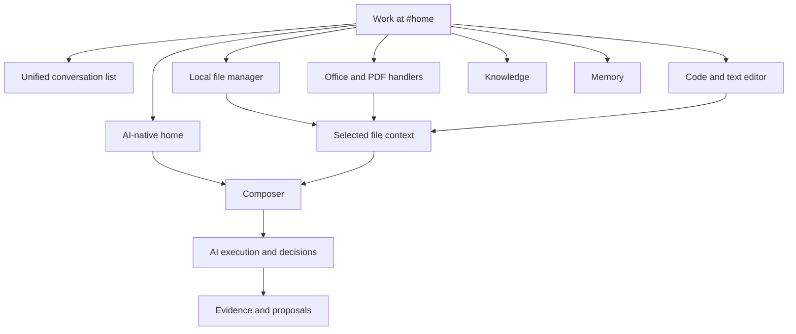

# A3S Web Functional Specification

## Objective

A3S Web is a local-first AI workspace for completing work against real files:

```text
Describe → inspect context → execute → review evidence → edit → validate → deliver
```

Work is the only task workbench. File management, Office editing, coding, and
AI execution are scenes within Work, not separate products or conversation
stores. The canonical Work route is `#home`.

The current release supports one local user, multiple durable conversations,
one active local workspace per conversation, and optional A3S OS connectivity.
It is desktop-first and remains useful without an A3S OS account.

## Canonical routes

| Route | Surface |
| --- | --- |
| `#home` | Unified Work home and all Work scenes |
| `#memory` | Memory exploration |
| `#knowledge` | Knowledge-base management and editing |
| `#plugins` | Verified plugin marketplace |
| `#plugin/<key>` | Enabled plugin contribution |
| `#settings/<tab>` | Settings dialog over the current product |
| `#settings/channels/<channel>` | Channel settings |

Unknown and removed product-prefixed routes normalize to `#home`. A scene
change inside Work does not create a route or a second product identity.

## Functional success criteria

- A user lands at `#home` and can start useful work without choosing between
  Office and Code.
- The left sidebar always represents the same conversation collection.
- Home, files, Office editors, and code editors preserve the same active
  conversation, draft, context, queue, model, effort, and workspace.
- Every running conversation reports whether it is waiting, executing,
  interrupted, failed, or complete.
- File context is visible before submission and destructive changes remain
  explicit and reviewable.
- Common file operations are inline or contextual; modal dialogs are reserved
  for destructive or compatibility-sensitive decisions.
- Disconnect, refresh, failed mutation, external file change, and editor
  conflict recovery are honest and preserve unsaved browser state.
- Knowledge-base creation and knowledge compilation remain separate actions.
- The complete journey works at 1440 px and compact desktop widths.

## Functional map


```mermaid
flowchart TB
    Work[Work at #home]
    Work --> Sessions[Unified conversation list]
    Work --> Home[AI-native home]
    Work --> Files[Local file manager]
    Work --> Office[Office and PDF handlers]
    Work --> Code[Code and text editor]
    Home --> Compose[Composer]
    Files --> Context[Selected file context]
    Office --> Context
    Code --> Context
    Context --> Compose
    Compose --> Execute[AI execution and decisions]
    Execute --> Evidence[Evidence and proposals]
    Work --> Knowledge[Knowledge]
    Work --> Memory[Memory]
```

## F1 — Shell, service, and routing

- Bootstrap health, account state, model catalog, conversations, workspace,
  plugin catalog, and product-specific data from the local service.
- Default an empty or unknown location to `#home`.
- Keep Work as the first and only task entry in the Activity Bar. Knowledge and
  enabled plugin contributions follow; Memory, Marketplace, and Settings stay
  in the system section.
- Show a bounded startup transition and an actionable connection-recovery
  state. Raw request details remain collapsed.
- Keep unsaved browser state available while the service is disconnected.
- Settings opens over the active product and closes back to its canonical
  route.

Acceptance: neither startup nor browser navigation can expose the deleted Code
or Office product shells.

## F2 — Unified conversations and identity

- Show all existing Code- and Work-originated conversations in one list so
  previous user data is not hidden.
- Create every new conversation with the default agent identity.
- Persist one active conversation key and one new-conversation draft.
- Search, select, rename, and delete conversations directly in the sidebar;
  rename and delete recovery remain in the affected row.
- Preserve drafts, selected context, model, effort, queue state, and workspace
  when switching conversations.
- Correlate asynchronous conversation creation with its initiating draft so a
  late response cannot replace a conversation selected in the meantime.

Acceptance: moving among Work scenes never changes conversation identity, and
selecting a historical conversation restores its own workspace and draft.

## F3 — AI-native home and composer

- Make the durable task composer the primary home action.
- Keep execution mode, model, effort, `@` workspace references, `$` Skill
  mentions, built-in `/` commands,
  drag-and-drop context, queueing, and keyboard submission available.
- Provide shortcuts only for implemented actions: create a document,
  spreadsheet, or presentation; open files; prepare analysis or organization
  drafts; and enter the local file workspace.
- Keep prompt starters editable and never auto-send them.
- Start with the shared AI Assistant beside the workspace, persist an explicit
  close choice, and reopen it when a home task is submitted.
- Keep templates, folders, and recent files available below the composer.

## F4 — Local file management

- Use the real local filesystem as the primary file identity and the configured
  workspace as the initial root.
- Support back, forward, up, breadcrumbs, grid/list layouts, sorting,
  current-folder filtering, and bounded recursive filename search.
- Support marquee selection, checkboxes, additive and range selection,
  keyboard traversal, drag and drop, and one selection-aware action shelf.
- Provide background, item, and keyboard context menus. Background actions
  include creation, paste, select all, refresh, layout, sorting, knowledge-base
  creation, AI organization, path copy, and reveal in the operating system.
- Keep folder creation, Office-file creation, rename, and duplicate naming
  inline. Permanent local deletion requires confirmation.
- Support copy, cut, collision-safe paste, favorites, reveal, Quick Look, and
  bounded external file/folder import without silent overwrite.
- Create a knowledge base from one or many selected files and folders without
  compiling it automatically unless the base's explicit policy later triggers.

## F5 — File handlers

- Open non-binary code and text files in the Work code scene with Monaco,
  multiple tabs, diagnostics, semantic navigation, conflict-safe saves, and AI
  context actions.
- Render Markdown with editable source and a live semantic preview.
- Open DOCX, XLSX, PPTX, and supported PDF workflows in Work editor chrome.
- Preserve local path bindings and fingerprints; require review when an
  external change or compatibility downgrade makes a save ambiguous.
- Load heavyweight Office and PDF dependencies only for the relevant handler.
- Return to the file manager without leaving Work or changing the session.

## F6 — AI execution, decisions, and proposals

- Bind the active conversation to the selected workspace root.
- Add selected files, folders, text, spreadsheet ranges, slides, and elements
  as bounded, visible context.
- File and editor actions prepare drafts rather than auto-send.
- Show live execution output, tool decisions, retries, interruptions, and
  evidence in the same assistant thread.
- Require explicit permission for sensitive operations and explicit selection
  before applying structured document, spreadsheet, or presentation changes.
- Revalidate proposal targets against live content before mutation and skip
  stale targets.
- Keep irreversible or unsupported actions disabled rather than presenting a
  control that navigates to a removed surface.

## F7 — Knowledge

- Create, search, pin, import, and edit local knowledge bases at `#knowledge`.
- Let Work selections create source packages independently of compilation.
- Compile only on explicit request or an enabled per-base automatic policy.
- Automatic compilation waits for source stability and a quiet window,
  enforces a minimum interval, retries conservatively, and pauses on suspicious
  bulk replacement or deletion.
- Promote only successful staged OKF output; keep the last good generation on
  failure.

## F8 — Memory

- Open Memory at `#memory` without changing the current Work conversation or
  draft.
- Search and filter the complete local memory store and switch between graph
  and timeline projections.
- Bound graph rendering while reporting rendered and complete totals.
- Keep the last successful snapshot usable after refresh failure.
- Require explicit user action before publishing learned assets.

## F9 — Plugins, Settings, and channels

- Render only enabled, verified plugin contributions and normalize unavailable
  plugin routes safely.
- Hand reviewed plugin context back to the current unified Work draft.
- Keep Account, Appearance, Model, Agent, Context, Integrations, Channels,
  About, and Help inside Settings.
- Use only `#settings/channels/weixin` and
  `#settings/channels/feishu` for channel navigation.
- Preserve independently edited settings drafts after failed saves; never
  return secrets to the browser.

## Excluded from this release

- A separate Code product, route tree, sidebar, home, or conversation store.
- A separate Office product or conversation store.
- Mobile-first layout or remote multi-user collaboration.
- Silent destructive file organization.
- Automatic publication of memory or failed knowledge generations.

## Global acceptance

- All user-visible product and route labels match this specification.
- Deleted shells and routes have no navigation entry or mount path.
- Type checking, linting, formatting, focused tests, full tests, and production
  build pass from `apps/web`.
- Browser regression covers `#home`, conversation switching, file entry,
  Office and code scenes, `#memory`, `#knowledge`, Settings, and removed-route
  normalization.
