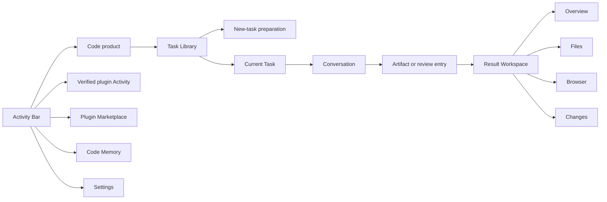
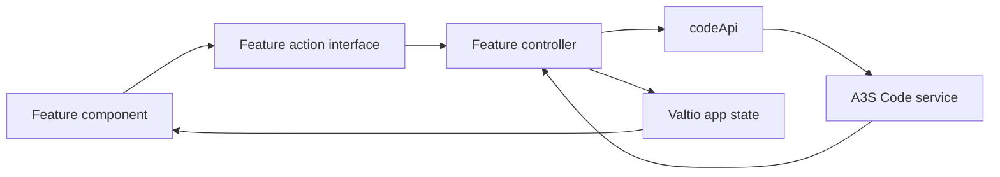
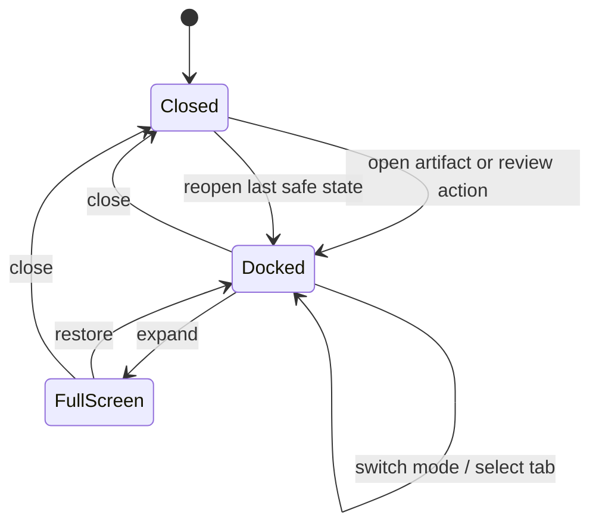
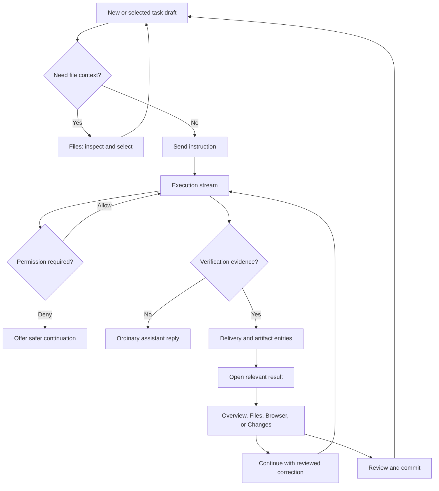
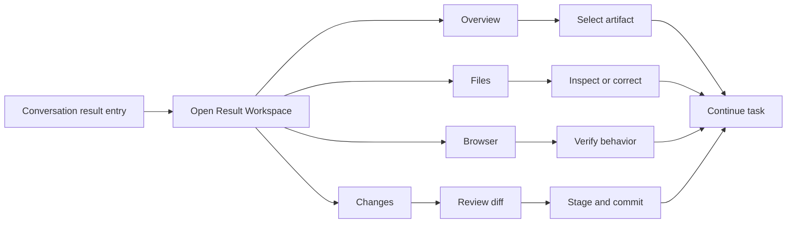

# A3S Code Product Architecture

## Scope

This architecture implements the A3S Code journey defined in
[PRODUCT_BLUEPRINT.md](PRODUCT_BLUEPRINT.md). It includes the owned Memory
exploration journey and excludes future super-app products and disconnected
backend capability browsers.

## Shell and navigation model



Navigation state has four distinct levels:

| Level | Owner | Examples |
| --- | --- | --- |
| Product / system | `ActivityBar` | Code Tasks, verified plugin Activities, Code Memory, Marketplace, Settings |
| Object | `TaskLibrary` | New task, selected task |
| Supporting plane | `ResultWorkspace` | Closed, docked, full screen |
| Result mode and artifact | `WorkspaceModeSwitcher`, `ArtifactTabs` | Overview, Files, Browser, Changes, selected tab |

Product navigation never owns task actions. Opening a result never changes the
selected task. Result modes are not routes and do not replace Conversation.
Overlays never become hidden page-level navigation.

## Runtime layout

```text
AppShell
├── ActivityBar                         fixed product rail
└── ProductWorkspace
    ├── PluginHostPage                  sandboxed package Activity
    ├── PluginMarketplacePage           signed lifecycle review
    ├── TasksPage
    │   ├── TaskLibrary                 Code-local object list
    │   └── TaskSurface
    │       ├── NewTaskPreparation
    │       │   ├── NewTaskWelcome
    │       │   ├── TaskStarters
    │       │   └── TaskComposer
    │       └── ActiveTask
    │           ├── TaskHeader
    │           └── ActiveTaskLayout
    │               ├── Conversation
    │               │   ├── ExecutionStream
    │               │   ├── ArtifactEntries
    │               │   └── TaskComposer
    │               └── ResultWorkspace       optional, resizable
    │                   ├── ResultWorkspaceHeader
    │                   │   └── ArtifactTabs
    │                   ├── WorkspaceModeSwitcher
    │                   └── ResultWorkspaceBody
    │                       ├── ModeNavigator
    │                       └── ArtifactViewport
    └── MemoryPage
        ├── MemoryFiltersPanel
        ├── MemoryGraph / MemoryTimeline
        ├── MemoryInspector
        └── EvolutionWorkbench
```

The active mode supplies the navigator and viewport content:

```text
Overview → ResultNavigator      + OverviewViewport
Files    → FileNavigator        + FileViewport
Browser  → PreviewNavigator     + BrowserViewport
Changes  → ChangedFileNavigator + DiffViewport
```

Search, dialogs, mode selection, and the command and file palettes are
transient support surfaces. Task parameters remain inside `TaskComposer`. New-task preparation
does not instantiate empty active-task or result components.

At wide desktop sizes, Result Workspace is a resizable peer of Conversation.
Around 1024 px it becomes an overlay. Full screen promotes the same workspace
instance; it does not mount another editor or duplicate state. The obscured
Conversation becomes inert until the task-scoped presentation returns to
docked, including through Escape or panel close.

## Feature boundaries

### `features/tasks`

Owns task selection, drafts, messages, semantic execution, inline operational
detail, follow-up queue, task controls, artifact entries, delivery, and recovery.

It does not own repository or preview truth. It opens an addressable result but
cannot claim that workspace-wide changes were authored by the task.

### `features/result-workspace`

Owns the supporting-plane lifecycle, mode selection, artifact tabs, focus,
resizing, full-screen state, task-scoped restoration, and composition of result
modes.

It does not fetch domain data or implement file, preview, or Git mutations. It
adapts typed mode contracts into one stable workspace shell.

The existing `features/workspace` implementation should evolve into this
boundary rather than coexist with a duplicate right-panel system.

### `features/files`

Owns workspace tree state, the authoritative file/diff tab model, per-file dirty
content, Monaco model identity, search scope, file conflicts, replacement, and
configuration validation. Directory reads use newest-request-wins publication;
confirmed rename and delete operations optimistically reconcile loaded subtree
keys and rows before refresh. The service remains authoritative about disk
content. Every asynchronous workspace read or mutation captures the active task
generation and workspace root before it starts; a late response may update only
the same task context and cannot publish into a subsequently selected task.
Initial Monaco model identity combines a stable task scope with the normalized
document path, so two tasks may open the same file without sharing undo history
or view state. Because Monaco URIs are immutable, the model registry rebinds a
renamed document's new logical path to its existing URI before tab paths change;
an old path reopened concurrently receives a collision-free identity. One
editor instance switches among those models. The registry owns view-state
capture and deterministic disposal: active tabs and inactive task snapshots
form the complete retention set, a cancelled dirty close remains in that set,
and confirmed close or snapshot removal releases any unreferenced model.
Explicit navigation coordinates are transient commands rather than persistent
model state.

### `features/preview`

Owns backend-provided preview targets, lifecycle state, selected target,
refresh, bounded navigation, diagnostics, and retry. It is absent when the
service exposes no usable target.

### `features/changes`

Owns authoritative workspace Git status, changed-file metrics, complete
original/modified diff documents, stage, unstage, commit, and commit receipts.
It never infers task provenance.

### `features/memory`

Owns paged overview loading, refresh authority, Memory UI state, whole-store
filtering, bounded connected 3D graph projection, timeline grouping, and
memory/entity inspection. It also adapts the typed Evolution overview and
review mutations into the Learning tab; candidate inference remains in the
LLM-backed CLI service. The first page owns graph topology; later pages add
entries without repeating that payload. The Three.js renderer is a lazy
boundary and never enters the initial shell bundle. A failed refresh keeps the
last successful snapshot, and only the latest non-aborted request may settle
shared state.

Memory exploration is read-only and independent of task-scoped Result Workspace
state. Learning review may materialize or roll back versioned derived assets,
but does not mutate source memories. The feature does not own extraction,
candidate classification, consolidation, pruning, or configuration mutation.

### `features/settings`

Owns account connection, model defaults, theme, updates, and service
information. It renders as a shell-level dialog that preserves the current
product surface and underlying route. Failed mutations retain the last
authoritative value.

### `features/code`

Composes controllers and bootstraps authoritative service, account, model,
session, task-control, message, artifact, filesystem, preview, and Git state. It
does not contain visual components for unrelated future products.

### `design-system/primitives`

Contains interaction primitives only: buttons, icon buttons, dialogs, tabs,
popovers, status, split handles, and model combobox. Domain meaning stays in
feature components.

## Result-mode contract

Every mode implements a typed contract equivalent to:

```typescript
interface ResultModeDefinition {
  id: "overview" | "files" | "browser" | "changes";
  label: string;
  isAvailable: boolean;
  navigator: ResultNavigatorDescriptor;
  openArtifact(artifact: ArtifactReference): ResultTab;
  getEmptyState(): ResultEmptyState;
}
```

The actual types may follow local conventions, but the ownership constraints
are required:

- availability is derived from useful data or service capability;
- an artifact has a stable identity, type, task reference, and workspace
  reference where applicable;
- opening the same artifact focuses one tab rather than duplicating it;
- mode components do not own docked/full-screen/close state;
- the shell does not interpret file, preview, diff, or verification content.

## State flow



State ownership:

- service responses own sessions, messages, controls, output, filesystem,
  preview capability, preview lifecycle, Git truth, and Memory store truth;
- `appState` owns the current authoritative snapshot plus selected task and
  shared Result Workspace and Memory UI state;
- per-task client state owns selected mode, tabs, selected artifact, navigator
  width, workspace width, scroll restoration keys, and drafts;
- local storage is best-effort for safe UI continuity only;
- component-local state owns bounded popover, dialog input, and focus state;
- local-storage failure degrades to in-memory continuity and reports one useful
  warning.

Controllers update authoritative UI state only after a successful mutation or
an explicit optimistic operation with rollback. Reconnect uses the same
bootstrap path as initial load so health-only success cannot produce a false
connected state.

## Result Workspace state machine



An unresolved dirty artifact guards only transitions that would discard or
overwrite its draft. Switching tasks is non-destructive: it stores the current
task's tabs, dirty drafts, active selection, mode, explorer/search state, and Git
review state, then restores the destination task's snapshot. It never transfers
the selected artifact by position, even when both tasks use the same repository.
The same snapshot model is persisted with a versioned browser-local envelope.
Writes are debounced during interaction and flushed on `pagehide`; restoration
normalizes transient loading/saving flags, rejects malformed entries, and falls
back to dirty-draft-first recovery when full caches exceed storage capacity.

## Core task workflow



While running, a new instruction enters the task's visible queue. Stop and
Queue remain separate. Stopping does not silently execute queued work.

## Result review workflows



Search retains its searched query, line, and column. Replace is blocked when the
input no longer matches the result set or an affected file has unsaved content.
Explorer and quick open consume the same service-owned binary classification;
binary files never enter the text read or save path regardless of which entry
point opened them. Preview navigation remains within the service-defined target
boundary. Git mutations preserve review context on failure.

Text file state carries a content-derived revision from the workspace service to
the task-owned editor tab. Normal saves are conditional writes against that
revision and do not perform a browser-side read-before-write sequence. Legacy
persisted tabs fall back to comparing their saved content. A precondition
mismatch leaves disk bytes untouched, returns HTTP 412, and moves the editor into
the existing conflict state; reload refreshes both content and revision, while
explicit overwrite is the only unconditional write path.

## Overlay and focus rules

- Only one modal dialog owns focus at a time.
- Dialogs restore focus to their trigger and support Escape unless a mutation
  is in progress.
- The command palette lists only actions valid for the current task state.
- The mode switcher is a non-modal popover and restores focus to its trigger.
- Search is a Files-mode support surface, not a global product view.
- Permission decisions live in the execution that they block.
- Full screen preserves the same Result Workspace focus and state graph.
- Closing the Result Workspace returns focus to the artifact entry or header
  action that opened it.
- A failed action keeps the relevant surface open with an inline retry path.

## API boundary

`src/lib/api.ts` contains only endpoints exercised by the current product.
Backend availability is not sufficient reason to add a client wrapper. New API
methods are added together with an owned controller action, visible journey
step, error state, and test.

Memory overview responses expose offset pagination and an `includeGraph`
switch. The client follows every page and requests graph topology on the first
page only; the detail endpoint is not wrapped while overview data already owns
the inspector journey.

## Target source structure

```text
src/
├── components/                    shell and cross-feature composition
├── design-system/primitives/      reusable interaction primitives
├── features/
│   ├── code/                      bootstrap and product composition
│   ├── tasks/                     task and Conversation journey
│   ├── result-workspace/          shared right-workspace shell
│   ├── files/                     file tree, editor, search, validation
│   ├── preview/                   managed browser preview
│   ├── changes/                   Git review and commit
│   ├── memory/                    Memory exploration and projection
│   ├── settings/                  global settings dialog and preferences
│   └── help/                      product guidance
├── lib/                           API transport
├── state/                         shared application state
├── styles/                        tokens and feature styles
└── types/                         service contracts
```

Migration must move existing ownership rather than duplicate it. Components do
not call `fetch` or construct service clients. Files split when they own more
than one journey concern, not merely to create more component names.

## Acceptance boundary

A component is product-complete only when:

- it has a clear previous and next journey step;
- loading, empty, success, failure, reconnect, and disabled states are honest;
- keyboard and focus behavior are defined;
- repeated submission and stale state are guarded;
- destructive or irreversible effects are scoped and explicit;
- it remains usable at 1440 px and compact desktop around 1024 px;
- its removal would leave a named gap in the core journey.
