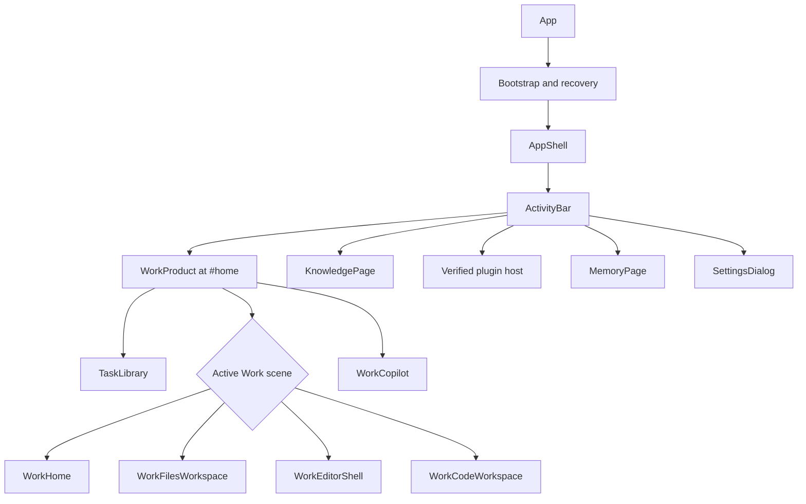
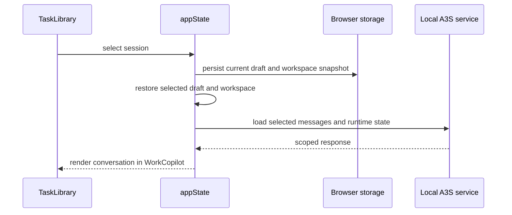
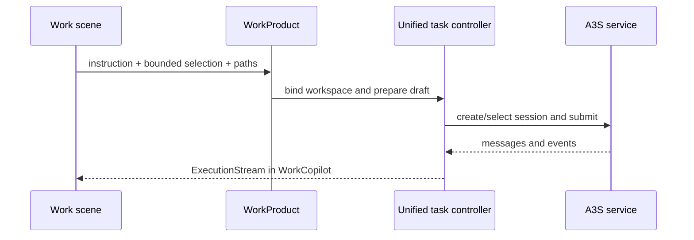

# A3S Web Product Architecture

## Scope

This architecture implements the unified Work journey defined in
[PRODUCT_BLUEPRINT.md](PRODUCT_BLUEPRINT.md) and the cross-product boundaries in
[SUPER_APP.md](SUPER_APP.md).

## Shell and navigation


```mermaid
flowchart TB
    App --> Boot[Bootstrap and recovery]
    Boot --> Shell[AppShell]
    Shell --> Bar[ActivityBar]
    Bar --> Work[WorkProduct at #home]
    Bar --> Knowledge[KnowledgePage]
    Bar --> Plugins[Verified plugin host]
    Bar --> Memory[MemoryPage]
    Bar --> Settings[SettingsDialog]
    Work --> Sessions[TaskLibrary]
    Work --> Scene{Active Work scene}
    Scene --> Home[WorkHome]
    Scene --> Files[WorkFilesWorkspace]
    Scene --> Office[WorkEditorShell]
    Scene --> Code[WorkCodeWorkspace]
    Work --> Assistant[WorkCopilot]
```

`ProductId` contains Work, Memory, Knowledge, Marketplace, and a plugin host.
It does not contain Code. Work scenes are local state owned by `WorkProduct` and
all use `#home`.

## Runtime layout

```text
App
├── CodeBootScreen
└── AppShell
    ├── ActivityBar
    ├── WorkProduct
    │   ├── TaskLibrary
    │   ├── WorkHome / WorkFilesWorkspace / WorkEditorShell / WorkCodeWorkspace
    │   ├── WorkCopilot
    │   └── WorkspaceQuickOpen
    ├── KnowledgePage / MemoryPage / PluginHostPage / Marketplace
    └── SettingsDialog / CommandPalette / service banner
```

Internal names inherited from the earlier implementation, such as
`CodeActions` or `CodeBootScreen`, do not create user-visible product identity.
They can be renamed incrementally after ownership is stable.

## Feature boundaries

### `features/work`

Owns:

- AI-native home and managed artifact library;
- real-files workspace, preferences, selection, clipboard, drag and drop,
  context menus, Quick Look, and knowledge source packaging;
- Office, spreadsheet, presentation, and PDF handlers;
- code/text scene and local tab controller;
- Work-level AI request preparation and structured editor proposals.

### `features/tasks`

Owns:

- unified session catalog and active-session persistence;
- drafts, context files, Skills, model, effort, execution mode, and queues;
- conversation projection, execution stream, tool decisions, recovery,
  evidence, artifacts, and delivery summaries;
- async session creation correlation and stale-response protection.

It does not own a mounted task page or product route.

### `features/workspace`

Provides reusable local workspace APIs, code intelligence, Monaco components,
file catalog search, and persistence helpers. Work's code scene is the mounted
consumer. Earlier Result Workspace components are not reachable from shell
navigation and must not be used for new flows.

### `features/knowledge`

Owns knowledge-base identity, source packages, compilation policy, generations,
tree/editor state, and local search.

### `features/memory`

Owns complete-store retrieval, filters, graph/timeline projection, inspector,
and evolution review at `#memory`.

### `features/plugins`

Owns verified catalog loading, isolated content, lifecycle recovery, and
reviewed context handoff.

### `features/settings`

Owns route parsing for canonical Settings tabs, independently loaded drafts,
validation, saving, update state, Help, and Channels.

### `design-system`

Owns primitives and tokens only. Product components remain in their feature
directories.

## Work scene state

`WorkProduct` selects scenes by concrete state:

1. an active managed artifact renders `WorkEditorShell`;
2. one or more open local code tabs render `WorkCodeWorkspace`;
3. otherwise the persisted `files` or `library` surface renders.

The scene is not serialized into the URL. The file root and assistant-open
preference are persisted locally. Leaving Work for Knowledge, Memory, or a
plugin does not fork task state.

## Unified session state

New writes use:

- one session catalog;
- one active-session storage key;
- one new-conversation draft key;
- one workspace snapshot namespace;
- `agentId=default` for new sessions.

Legacy Code/Work storage keys may be read to recover user data, then normalized
into the unified model. They are not used to choose a product or write new
state.

### Session switch


```mermaid
sequenceDiagram
    participant UI as TaskLibrary
    participant State as appState
    participant Store as Browser storage
    participant API as Local A3S service
    UI->>State: select session
    State->>Store: persist current draft and workspace snapshot
    State->>State: restore selected draft and workspace
    State->>API: load selected messages and runtime state
    API-->>State: scoped response
    State-->>UI: render conversation in WorkCopilot
```

Responses carry session and workspace context guards. A response for an old
selection cannot mutate the visible conversation or editor.

## File opening boundary

All mounted entry points delegate to Work:

- file grid/list double click;
- Quick Look “Open”;
- command palette and Cmd/Ctrl+P quick open;
- AI tool file entries and artifacts;
- editor semantic navigation.

Work routes each entry by type:

- non-binary non-Office → `WorkCodeWorkspace`;
- supported Office/PDF → `WorkEditorShell`;
- directory → file navigation;
- unsupported binary → truthful unsupported state.

No entry point opens a retired Result Workspace.

## AI request flow


```mermaid
sequenceDiagram
    participant Scene as Work scene
    participant Product as WorkProduct
    participant Task as Unified task controller
    participant API as A3S service
    Scene->>Product: instruction + bounded selection + paths
    Product->>Task: bind workspace and prepare draft
    Task->>API: create/select session and submit
    API-->>Task: messages and events
    Task-->>Scene: ExecutionStream in WorkCopilot
```

Scene actions prepare drafts unless the user explicitly submits. Structured
editor proposals are parsed, displayed, selected, revalidated, and applied by
the owning editor.

## File mutation boundary

- Reads and mutations are scoped to the selected root.
- Reversible names are edited inline.
- Copy and cut use an in-product clipboard with collision-safe destinations.
- External drops are bounded by file, byte, and tree limits and roll back roots
  created by a failed import.
- Local deletion is permanent and confirmed.
- Office save-back validates the source fingerprint and compatibility report.
- Text/code save detects external changes before overwrite.

## Knowledge compilation boundary

Work creates a source package and calls Knowledge base creation. It does not
compile Office/PDF content in the browser. The independent compiler consumes
the package, stages OKF Markdown, validates it, and promotes a generation only
after success.

Automatic compilation is a policy decision owned by Knowledge and triggered
only after stability, quiet, interval, retry, and bulk-change gates.

## Routing state machine

```text
unknown/empty ───────────────→ #home / Work
#home ───────────────────────→ Work
#memory ─────────────────────→ Memory
#knowledge ──────────────────→ Knowledge
#plugins ────────────────────→ Marketplace
#plugin/<verified key> ──────→ Plugin host
#settings/<canonical tab> ───→ Settings over current product
```

Removed or malformed hashes normalize to `#home`. Settings closes to the
canonical route of the underlying product.

## Overlay and focus rules

- Settings, command palette, and quick open trap focus and restore the invoker.
- Escape closes the top recoverable overlay unless an update or mutation is in
  a non-dismissible phase.
- Quick open is rendered by `WorkProduct` so file selection reaches the current
  Work handler.
- Compact AI Assistant mode overlays the Work pane and retains a visible close
  action.

## API boundary

The browser consumes typed local APIs for bootstrap, sessions, messages,
workspace reads and writes, file catalogs, code intelligence, Git metadata,
Office binaries, knowledge bases, memory, plugins, Settings, and channels.

The browser does not receive provider secrets, raw channel credentials, or
compiler-internal source extraction authority.

## Acceptance boundary

- No shell path mounts a separate Code or Office product.
- Every file-opening action reaches a mounted Work scene.
- Scene changes preserve the active session and draft.
- Async task and workspace responses are context guarded.
- Canonical route tests, focused feature tests, the full suite, type checking,
  lint, formatting, production build, and browser regression pass.
