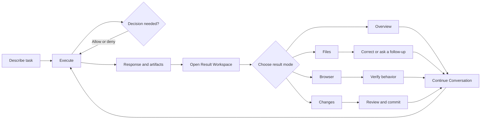

# A3S Code Product Blueprint

## Product definition

A3S Code Web is a desktop task workspace for completing coding work with an
agent. It is not a browser copy of the TUI, a generic chat client, or a complete
browser IDE.

The product organizes one continuous loop:

```text
Describe → execute → decide → inspect results → correct → verify → commit
        ↑______________________________________________________________|
```

The task is the primary product object. Conversation is the continuous work
surface. Code, files, previews, diffs, and verification are task results that
open in an on-demand Result Workspace beside the Conversation.

## User outcome

A developer should be able to answer five questions without reconstructing raw
events or leaving the task:

1. What is A3S doing now?
2. What decision does it need from me?
3. What did it create or change?
4. How can I inspect and verify the result?
5. What is the safest useful next action?

## Current product boundary

The Activity Bar reserves the A3S super-app structure. A3S Code is the only
available product in this release. Work and Science remain visible as
coming-soon destinations and do not open placeholder products.

A3S Code owns:

- a task library and a persistent new-task draft;
- natural-language execution with explicit file context;
- plan, execution, permission, recovery, and verification presentation;
- task-scoped follow-up instructions while execution is running;
- task-specific model, effort, goal, and permission settings;
- an on-demand Result Workspace with Overview, Files, Browser, and Changes
  modes;
- file inspection, direct correction, search, conflict protection, and
  configuration validation;
- browser preview when a preview target is available;
- workspace-wide Git review, staging, and commit;
- account, model, appearance, update, and help settings.

Operational task activity belongs to the semantic execution stream. It does not
occupy an independent right-side page. Capabilities outside this list do not
receive placeholder controls or unused API clients.

## Primary product objects

| Object | Product meaning |
| --- | --- |
| Task | Durable user intent and its continuing Conversation |
| Turn | One instruction and the resulting agent work |
| Artifact | A file, diff, preview, report, or verification result produced or referenced by a task |
| Result Workspace | The task-scoped inspection state for artifacts |
| Workspace | The served local project and its authoritative files and Git state |
| Verification | Evidence supporting a delivery claim |
| Commit receipt | Authoritative record of a successful Git commit |

Workspace-wide changes are never presented as proof that the selected task
authored them. An Artifact may point to workspace truth without duplicating it.

## Product principles

1. **One task, one continuous journey.** Task selection establishes the context
   for Conversation and its Result Workspace.
2. **Conversation drives, results expand.** The right workspace opens from a
   concrete artifact or review action; it is not an empty permanent panel.
3. **One workspace shell, four result modes.** Overview, Files, Browser, and
   Changes share the same header, mode switcher, tabs, close, and full-screen
   behavior.
4. **Progressive disclosure.** Configuration, file navigation, previews, diffs,
   and operational detail appear only when relevant.
5. **Evidence before claims.** Delivery language comes from verification
   evidence, not assistant prose or Git status.
6. **State survives navigation.** Drafts, queues, selected artifacts, open tabs,
   panel size, and unsaved edits are preserved in the correct task scope.
7. **Every action explains its consequence.** Stop, queue, permission, replace,
   discard, stage, and commit controls state what happens next.
8. **No command-language dependency.** Discoverable Web interactions are the
   primary path; slash commands are not required.

## Information architecture

```text
A3S Super App
├── Work                                      coming soon
├── Code                                      available
│   ├── Task Library
│   └── Current Task
│       ├── Conversation                      always primary
│       │   ├── Turns
│       │   ├── Execution and decisions
│       │   ├── Delivery and artifact entries
│       │   └── Composer and follow-up queue
│       └── Result Workspace                  optional, task-scoped
│           ├── Overview
│           ├── Files
│           ├── Browser
│           └── Changes
├── Science                                   coming soon
└── Settings
```

The Result Workspace is a supporting plane, not a second product or a route
that replaces the task. Search is a Files-mode capability. Git stage and commit
are Changes-mode capabilities. Detailed execution activity stays with the turn
that produced it.

## Core journey



## Desktop layout

### New-task preparation

```text
┌──────┬──────────────────┬────────────────────────────────────────────┐
│ A3S  │ Task Library     │                                            │
│ Work │ + New task       │                                            │
│ Code │ Search tasks     │          Task-oriented welcome             │
│ Sci. │ Recent tasks     │     Fix · Implement · Explain · Review     │
│ Fin. │                  │                                            │
│      │                  │             Composer                       │
│ Set. │                  │      Workspace · Permission · Model        │
└──────┴──────────────────┴────────────────────────────────────────────┘
```

The preparation state contains one dominant Composer, concise guidance, and
editable Code starters. It does not instantiate an empty transcript, Result
Workspace, context meter, or delivery status.

### Active task without an open result

```text
┌──────┬──────────────────┬────────────────────────────────────────────┐
│ A3S  │ Task Library     │ Task title                      Results    │
│      │                  ├────────────────────────────────────────────┤
│ Work │ + New task       │                                            │
│ Code │ Search tasks     │ Continuous Conversation                    │
│ Sci. │ Recent tasks     │ plan · execution · decisions · delivery    │
│ Fin. │                  │                                            │
│      │                  ├────────────────────────────────────────────┤
│ Set. │                  │ Composer                                   │
└──────┴──────────────────┴────────────────────────────────────────────┘
```

The Conversation uses the full product workspace until the user opens a
specific result. Accepting the first instruction reveals task identity without
moving the Composer into an unrelated page or window.

### Active task with Result Workspace

```text
┌──────┬──────────────┬──────────────────────┬─────────────────────────┐
│ A3S  │ Task Library │ Conversation         │ Result Workspace        │
│      │              │                      │ tabs       full  close  │
│ Work │ Tasks        │ turns and execution  ├──────────┬──────────────┤
│ Code │              │                      │ mode     │ artifact      │
│ Sci. │              │                      │ navigator│ viewport      │
│ Fin. │              │                      │          │               │
│      │              ├──────────────────────┤          │               │
│ Set. │              │ Composer             │          │               │
└──────┴──────────────┴──────────────────────┴──────────┴──────────────┘
```

At wide desktop sizes, Conversation and Result Workspace are resizable peers,
with Conversation remaining the task anchor. Around 1024 px, the Result
Workspace overlays Conversation instead of reducing either surface below its
usable width. Mobile is not supported.

## Result Workspace contract

### Entry and exit

The workspace opens only from a meaningful action:

- select an artifact or file card in a response;
- choose “view all artifacts” or “view changes”;
- open a browser preview;
- reopen the last Result Workspace state from the task header.

Opening an entry selects its corresponding mode and artifact. Closing returns
Conversation to full width without losing mode, open tabs, selection, scroll,
or panel size. Full screen is reversible and keeps the same state.

The product does not open a blank workspace automatically just because a task
exists. It may announce newly available artifacts in Conversation, but the
user controls whether the workspace expands.

### Shared shell

Every mode uses the same structure:

```text
ResultWorkspace
├── Header
│   ├── Artifact tabs
│   ├── Full-screen action
│   └── Close action
├── Mode switcher                    compact popover trigger
├── Navigator                        mode-specific, collapsible
└── Artifact viewport                dominant content surface
```

The mode switcher is one compact labelled control. The four modes are not
rendered as a permanent toolbar. Tabs represent open artifacts, not product
navigation. Selecting a mode does not discard tabs from another mode.

### Mode definitions

| Mode | User question | Navigator | Viewport | Primary next action |
| --- | --- | --- | --- | --- |
| Overview | What did this task produce and how was it verified? | Result groups | Delivery, verification, artifact summaries | Open a result or continue |
| Files | What file exists and what does it contain? | Workspace file tree and search | Text, code, binary metadata, or direct correction | Save or attach a correction |
| Browser | Does the result behave correctly? | Preview targets and recent pages | Managed local preview with status | Refresh, inspect, or report a problem |
| Changes | What changed and what should be accepted? | Changed files with status and line counts | Diff or selected file | Stage, commit, or request correction |

Browser mode appears only when a valid preview target exists. Until preview
lifecycle support is implemented, no disabled Browser placeholder is rendered.
Overview is available after the task has a delivery or artifact. Files is
available when the served workspace can be read. Changes is available for a Git
workspace, including its useful clean state.

### Selection and tabs

- Opening an artifact focuses an existing tab for the same identity or creates
  one new tab.
- Selecting a tab activates the mode that owns that artifact.
- Switching modes focuses that mode's most recent tab or its useful empty state;
  it does not close tabs owned by other modes.
- Closing the selected tab activates the nearest remaining tab or the mode's
  useful empty state.
- Changed-file entries show status and additions/deletions without claiming
  task provenance.
- Dirty file tabs cannot close, switch task, or reload destructively without an
  explicit resolution.
- A task switch restores that task's last safe workspace state and never
  transfers another task's selected artifact.

## Functional modules and delivery order

| Order | Module | User outcome | Main product components |
| --- | --- | --- | --- |
| 1 | Task foundation | Create, find, select, and continue a coding task | `TaskLibrary`, `NewTaskPreparation`, `TaskHeader` |
| 2 | Conversation and execution | Understand progress, decisions, recovery, and next action | `ExecutionStream`, `ExecutionDetails`, `PermissionDecision`, `TaskComposer`, `FollowUpQueue` |
| 3 | Result Workspace shell | Open a result beside the task without losing context | `ResultWorkspace`, `ResultWorkspaceHeader`, `WorkspaceModeSwitcher`, `ArtifactTabs` |
| 4 | Overview and Files | Understand delivery, inspect files, and make bounded corrections | `OverviewMode`, `FilesMode`, `WorkspaceNavigator`, `ArtifactViewport` |
| 5 | Changes | Review authoritative Git changes and commit safely | `ChangesMode`, `ChangedFileList`, `DiffViewer`, `CommitDialog` |
| 6 | Browser | Verify a runnable result in a managed preview | `BrowserMode`, `PreviewNavigator`, `BrowserViewport` |
| 7 | Product hardening | Restore state and handle disconnects, conflicts, compact desktop, keyboard, and accessibility | recovery states across every owning component |

This order defines product dependencies, not permission to render placeholders.
A later module appears only when its full entry, useful state, recovery, and next
action are implemented.

## Continuity requirements

- Selecting file context returns to the same task and draft.
- Switching away from a running task does not transfer its running state.
- Follow-up instructions queue only for the running task.
- Result Workspace state is task-scoped; repository truth remains
  workspace-scoped.
- Opening an artifact preserves Conversation scroll and Composer content.
- Closing or resizing the Result Workspace never discards open tabs or edits.
- A failed file read keeps the previously opened artifact intact.
- A failed search result open keeps the query, results, target, and retry action.
- Unsaved content blocks destructive navigation, replacement, reload, and task
  switching until resolved.
- A failed preview retains its target and gives one useful retry or diagnostic.
- A failed Git mutation preserves selection, diff, staging context, and retry.
- Editing a queued follow-up never replaces the Composer draft.
- Service disconnects are explicit and never presented as successful progress.

## Deferred products and capabilities

Work and Science require separate product discovery before
implementation. Task branching, long-term memory, knowledge bases,
plugin management, automation authoring, remote workspaces, team collaboration,
and mobile layouts are outside the current Code boundary.

Any future capability must first identify:

1. the user outcome it enables;
2. the journey step it extends or the complete new journey it creates;
3. its authoritative domain object and recovery behavior;
4. why it belongs in Web rather than remaining a CLI/TUI operation;
5. which existing controls it replaces or simplifies.
