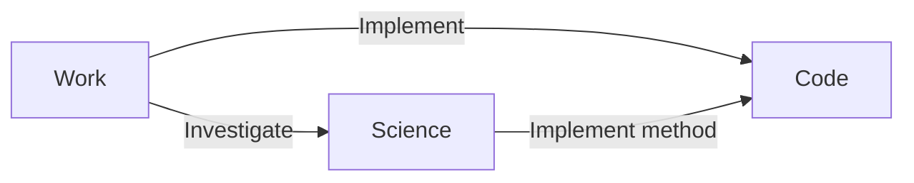

# A3S Web Super-App Product Architecture

> Strategic direction. The current release activates A3S Code only. Work and
> Science remain visible in the Activity Bar as coming-soon
> destinations without empty product pages.

## Product decision

A3S Web is one desktop super app with three outcome-oriented products:

```text
A3S Web
├── A3S Work       办公
├── A3S Code       编码
└── A3S Science    科学
```

The classification follows durable user domains rather than backend modules,
agent types, protocols, or technical capabilities. Evidence research is part
of Science. Infrastructure automation is not a standalone Web product in the
current architecture.

## Shell and product boundary

The A3S shell and each product own different navigation levels:

```text
Activity Bar     chooses a product
Product sidebar chooses objects inside that product
Primary surface completes the selected object's workflow
```

The fixed 52 px Activity Bar uses this order:

1. A3S Work — 办公
2. A3S Code — 编码
3. A3S Science — 科学

One Settings button remains pinned to the bottom. Account management is a
Settings section instead of a separate Activity Bar destination. Product order
is stable because it communicates the A3S product model.

WorkBuddy is the primary UX reference for task preparation and task interaction
inside a product. It does not replace the Activity Bar, product identities, or
cross-product handoff model. A3S OS remains authoritative for brand identity,
color, account, and shared platform state.

## Shared experience rules

Every product follows the same high-level interaction grammar:

- a calm preparation state with one dominant Composer;
- natural-language intent supported by editable scenario starters;
- advanced parameters disclosed only when relevant;
- durable objects in the product-local sidebar;
- continuous execution and evidence instead of raw event logs;
- explicit permission, recovery, and delivery states;
- direct Chinese product language rather than slash-command discovery;
- A3S Activity Bar always visible on desktop.

Product-specific work surfaces may become dense after work begins. Code may use
an editor and diff. Science may use a notebook and evidence table. These
surfaces still return to the same task or object instead of becoming
disconnected tools.

## A3S Work — 办公

### Outcome

Turn everyday knowledge work into reviewed deliverables.

### Primary objects

- task;
- document;
- presentation;
- spreadsheet;
- meeting and decision record;
- project workspace.

### Core journey

```text
Describe outcome → add files or sources → draft → revise
→ review → export or share → continue in the same task
```

### Product boundary

Work owns general productivity and coordination. It may request implementation
from Code or evidence from Science. It does not embed those specialist
workbenches.

## A3S Code — 编码

### Outcome

Complete a coding task with explicit context, execution visibility, review, and
verification while keeping Conversation and produced results in one continuous
task.

### Primary objects

- task;
- turn and artifact;
- workspace;
- instruction and follow-up queue;
- file and change;
- managed preview target;
- validation evidence;
- commit receipt.

### Core journey

```text
Describe coding task → add workspace context → execute
→ decide permissions → open the relevant result
→ inspect files, preview, or changes → validate → commit
→ continue in the same task
```

### Current status

Code is the only active product. Its internal UX follows a Conversation-led
WorkBuddy task model: task results open in an on-demand Result Workspace with
Overview, Files, Browser, and Changes modes. A3S-specific execution,
permissions, verification, workspace, and Git truth remain authoritative.

## A3S Science — 科学

### Outcome

Investigate questions, evaluate evidence, run reproducible studies, and produce
cited conclusions.

### Primary objects

- investigation;
- source and evidence set;
- hypothesis;
- study and protocol;
- dataset;
- notebook and analysis;
- reproducibility package.

### Core journey

```text
Define question → collect and assess evidence → form hypothesis
→ design study → run analysis → evaluate → reproduce → publish findings
```

### Product boundary

Science includes literature and web research because evidence gathering and
experimental validation belong to one knowledge workflow. It may hand
implementation to Code.

## Shared platform objects

Products share identity and handoff contracts without sharing presentation
state:

| Object | Meaning | Typical products |
| --- | --- | --- |
| Workspace | Bounded files, sources, and policy context | All |
| Task | Executable unit of user intent | All |
| Thread | Human and agent communication for one object | All |
| Artifact | Versioned user-visible deliverable | All |
| Source | Evidence or authoritative input identity | Work, Science, Code |
| Approval | Scoped human decision with consequence | Code, Science |
| Receipt | Evidence that a consequential action completed | Code |
| Handoff | Typed transfer between products | All |

Shared objects do not imply a universal page. Each product presents the object
according to its workflow and density.

## Cross-product handoffs

A handoff creates a draft in the destination product and preserves provenance.
It never executes work automatically.



Every handoff includes:

- source product and object;
- requested outcome;
- selected context and attachments;
- assumptions and unresolved questions;
- permissions that do not automatically transfer;
- a destination draft that the user reviews before sending.

## Product-local layout

All products use the same shell geometry:

```text
┌──────┬──────────────────┬────────────────────────────────────────────┐
│ A3S  │ Product sidebar  │ Product workspace                          │
│ Work │                  │                                            │
│ Code │ Objects          │ Preparation, active task, or artifact      │
│ Sci. │ Search           │ Product-specific primary work surface      │
│      │                  │                                            │
│ Set. │                  │                                            │
└──────┴──────────────────┴────────────────────────────────────────────┘
```

Mobile is not a supported target. Compact desktop may collapse the product
sidebar, but the Activity Bar and primary action remain available.

## Current release boundary

The current implementation activates Code only:

- Work and Science buttons remain visible and announce coming soon;
- Science's first-party capability catalog is maintained in
  `packages/science`, while its interactive workspace remains roadmap work;
- future products do not navigate to placeholder workspaces;
- Settings is the only shared shell destination in the Activity Bar;
- Account remains available inside Settings;
- no Code page may accumulate a future product's disconnected controls merely
  because the backend exposes an endpoint.

## Delivery order

1. **Code** proves task execution, review, permissions, and local workspace
   integration.
2. **Work** establishes general deliverables and cross-product handoffs.
3. **Science** combines evidence research with reproducible studies.

Each product requires its own discovery, domain model, core journeys, component
contracts, and acceptance tests before activation. A visible coming-soon button
does not authorize placeholder features.
