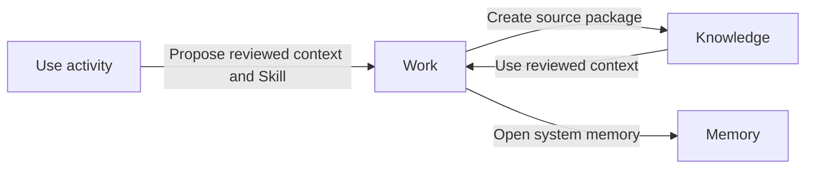

# A3S Web Super-App Product Architecture

## Product decision

A3S Web uses one horizontal product shell and one canonical Work workbench:

```text
A3S Web
├── Work             home, conversations, files, Office, code, AI
├── Knowledge        local knowledge bases and compilation lifecycle
├── Use activities   verified vertical plugin contributions
└── System
    ├── Memory
    ├── Plugin Marketplace
    └── Settings
```

Work is the first and default Activity Bar entry. It owns `#home` for task
preparation and `#conversation/<opaque-session-key>` for each durable task.
Coding is a file-handling scene inside Work. It is not a second product, route
tree, sidebar, or session store.

## Shell and product boundary

The Activity Bar order is:

1. Work;
2. Knowledge;
3. enabled and verified A3S Use activity contributions in manifest order;
4. Memory, Plugin Marketplace, and Settings in the pinned system section.

Research, Finance, and future vertical capabilities are package contributions,
not hardcoded empty destinations. Messaging channels live inside Settings.

The shell owns:

- product selection and canonical routes;
- plugin contribution discovery and verification;
- the global settings, update, and service-recovery surfaces;
- consistent activity icons, tooltips, focus, and compact behavior.

The shell does not own file mutations, editor commands, domain-specific
research behavior, or knowledge compilation.

## Shared experience rules

- The user chooses an outcome before implementation detail.
- Work keeps one conversation list visible across home, files, Office, and
  code scenes.
- A durable conversation is a canonical page, not a transient assistant pane.
- The contextual AI Assistant appears only when a file, Office document, PDF,
  or code editor is the primary object.
- Product changes preserve the current Work session and draft.
- Reversible naming and row actions remain inline.
- Sensitive, destructive, conflicting, or compatibility-sensitive actions
  require explicit review.
- Context handoffs identify their source, scope, and intended destination.
- A plugin cannot silently mutate another product's state.
- Every enabled control has a useful success path and a recoverable failure
  state.

## Work

### Outcome

Turn goals and real local files into reviewed, editable, and deliverable work
without making the user choose between an Office app and a coding app.

### Primary objects

- conversation;
- local workspace and filesystem entry;
- managed artifact and folder;
- Office, PDF, code, text, and Markdown editor state;
- task instruction, execution, decision, evidence, and proposal;
- knowledge source package.

### Core journey

```text
Open #home
→ describe an outcome or open a file
→ select visible context
→ submit into #conversation/<session>
→ supervise execution, decisions, and recovery on the conversation page
→ inspect evidence or a structured proposal
→ edit or approve explicitly
→ save and validate
→ optionally create a knowledge base
```

### Boundary

Work owns the Finder-inspired filesystem, managed artifact compatibility
library, Office and PDF handlers, code/text editor, unified conversations, and
AI Assistant. The local filesystem is the primary file identity. Managed
artifacts provide autosave, recovery, compatibility, and versioning where
needed; they do not become a competing filesystem.

## Knowledge

### Outcome

Turn selected or imported source material into a local, searchable, editable
knowledge base with explicit provenance and safe generation promotion.

### Boundary

Knowledge owns knowledge-base identity, source manifests, Markdown wiki output,
search state, compilation policy, and generation status. Creating a base does
not compile it. Compilation occurs only on user request or an enabled per-base
automatic policy after stability and frequency safeguards pass.

## Memory

Memory is a system surface at `#memory`. It visualizes the complete local memory
store, entities, relationships, timeline, retention, and evolution candidates.
Opening Memory does not switch or duplicate the active Work conversation.

## A3S Use activities

Vertical products are signed package contributions. A contribution owns its
isolated content and can propose a reviewed handoff back to Work. It does not
receive task credentials, filesystem authority, or direct access to another
product's state.

Examples:

- Research can hand selected evidence to Work for synthesis or implementation.
- Finance can hand a reviewed dataset or assumption set to Work.
- Any vertical activity can attach its verified Skill when the user accepts the
  handoff.

## Shared platform objects

| Object | Meaning | Consumers |
| --- | --- | --- |
| Conversation | Durable AI work and execution history | Work |
| Workspace | Bounded local files and policy context | Work, Knowledge |
| Artifact | User-visible output with stable identity | Work, plugin handoffs |
| Source | Evidence or authoritative input identity | Knowledge, plugins, Work |
| Proposal | Reviewable requested change | Work editors |
| Approval | Scoped human decision with consequence | Work, plugins |
| Receipt | Evidence that a consequential action completed | Work, Knowledge |
| Skill | Versioned behavior attached explicitly | Work, plugins |

## Cross-product handoffs


```mermaid
flowchart LR
    Work -->|Create source package| Knowledge
    Knowledge -->|Use reviewed context| Work
    Plugin[Use activity] -->|Propose reviewed context and Skill| Work
    Work -->|Open system memory| Memory
```

Every handoff records:

- source product and object;
- selected scope;
- human-readable summary;
- destination action;
- whether a Skill will be attached;
- approval, failure, and retry state.

## Layout contract

```text
┌──────┬────────────────────┬──────────────────────────────────────┐
│ Bar  │ Product sidebar    │ Active product workspace             │
│      │                    │                                      │
│ Work │ Work conversations │ Home / conversation / files / editors│
│ Know │ Knowledge tree     │ Knowledge editor / reader            │
│ Use  │ Activity objects   │ Verified plugin host                 │
└──────┴────────────────────┴──────────────────────────────────────┘
```

Work always uses the conversation sidebar. A file scene may add its own local
explorer inside the center workspace, but it never replaces the conversation
collection with a second product sidebar.

## Route contract

- `#home` — Work;
- `#conversation/<opaque-session-key>` — durable Work task conversation;
- `#knowledge` — Knowledge;
- `#memory` — Memory;
- `#plugins` — Marketplace;
- `#plugin/<key>` — verified contribution;
- `#settings/<tab>` — Settings.

File and editor scene state is not encoded as a product-prefixed hash. The
durable conversation route is the one intentional Work subroute. Unknown,
empty, or malformed routes normalize to `#home`.

## Delivery order

1. Keep Work coherent: one canonical route family, one conversation list, and
   working file handlers.
2. Improve file management, inline operations, context transfer, and review.
3. Complete knowledge creation and independent compilation workflows.
4. Add vertical capabilities through verified packages and explicit handoffs.
5. Expand Memory and orchestration without weakening local-first safety.
