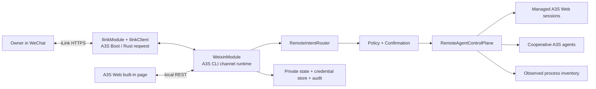
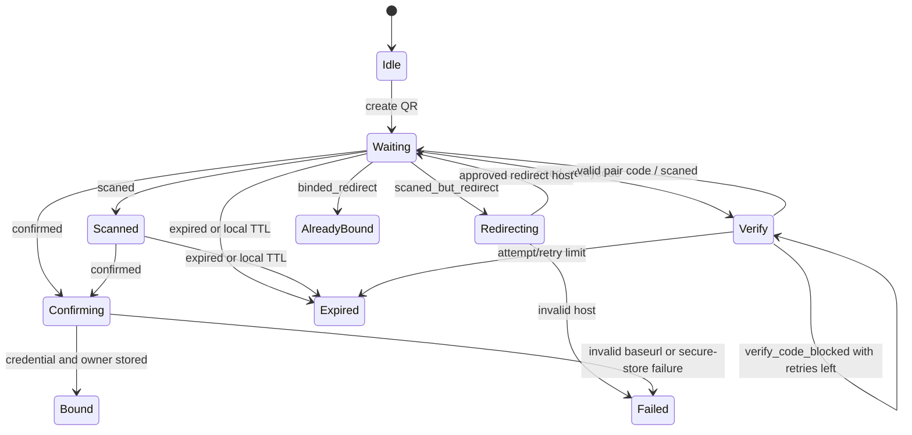
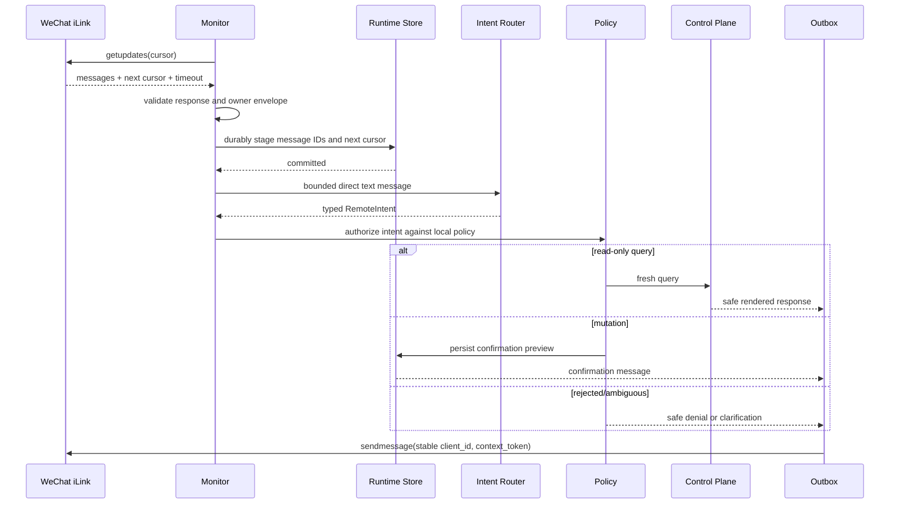
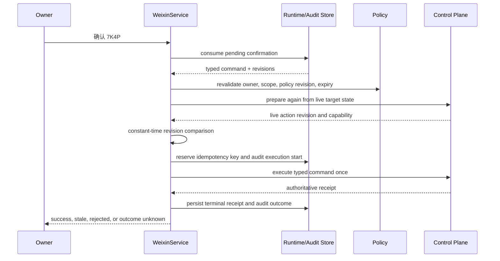

# WeChat Remote Management: Product and Native Rust iLink Architecture

**Status:** Native Boot protocol client and live QR entry implemented
**Last updated:** 2026-07-23
**Decision owner:** A3S Code
**Production release status:** Built-in QR/read-only monitoring is enabled by
default; owner-confirmed binding and mutation phases retain their separate
security gates

## Executive decision

A3S Web should provide built-in WeChat Remote Management backed by a native
Rust `IlinkModule` and `IlinkClient` inside A3S Boot. The CLI-owned
`WeixinModule` composes those protocol providers with credential storage,
browser-safe controllers, and the A3S remote-agent projection. The runtime uses
Tokio and `reqwest` directly. It does not launch Node.js, load OpenClaw, embed
the OpenClaw plugin, or proxy control through a sidecar.

Product-facing English uses **WeChat Remote Management**. In the Chinese UI,
the channel is labeled **微信** in the internal tab bar of **设置 → 渠道**. The
`weixin` spelling is retained only for stable internal Rust types, source paths,
REST routes, compatibility hashes, and protocol evidence such as
`ilinkai.weixin.qq.com`; those identifiers are not renamed for marketing
terminology.

WeChat/Weixin iLink is a transport and a source of owner identity. It is not an
A3S authorization system. A3S remains the sole owner of agent inventory, session
state, permission policy, confirmations, execution, and audit records. Every
inbound message is converted into a typed `RemoteIntent`; untrusted chat text
never becomes a shell command, process signal, tool invocation, or control
request directly.

The phrase “all agents on this machine” has three intentionally different
truth levels:

| Target level | Evidence | Remote capability |
| --- | --- | --- |
| `managed` | An A3S Web session owned by the current Code Web runtime | Full supported session lifecycle, subject to local policy and confirmation |
| `cooperative` | A fresh, exact A3S agent heartbeat with currently advertised actions | Read status and invoke only the advertised, freshly revalidated action |
| `observed` | Process discovery only | Read-only, coarse process presence; no stdin injection, PID kill, or claimed task state |

The first production release supports one bound owner, one bot account, direct
text chats, read-only inventory by default, and locally enabled, step-up
confirmed mutations. Group chats, arbitrary shell access, permanent remote
deletion, and remote “approve always” are out of scope.

## Product definition

### User problem

An A3S user may leave a workstation while several sessions or child agents are
working. Today the user must return to A3S Web or a terminal to answer a waiting
agent, inspect progress, start a follow-up, or stop work. The WeChat connection
should provide a narrow, trustworthy remote control surface without turning a
chat message into general remote code execution.

### Product goals

- Bind WeChat by scanning a QR code from an A3S Web page.
- Show a truthful inventory of managed, cooperative, and observed agents.
- Answer conversational questions about task progress, execution state,
  attention requirements, and recent safe summaries.
- Let the owner select a target and, when locally allowed, send a message,
  create a managed session, queue a turn, stop or cancel cooperative work, and
  archive a managed session.
- Notify the owner about bounded events such as completion, failure, waiting
  for input, or waiting for approval.
- Preserve the local A3S permission model and provide an audit trail for every
  remote decision.
- Fail closed when identity, protocol state, target state, or action freshness
  is uncertain.

### Non-goals

- A generic WeChat bot framework or an OpenClaw compatibility layer.
- Running an OpenClaw or Node.js process beside A3S.
- Controlling an arbitrary process because its command line resembles an
  agent.
- Sending signals to arbitrary PIDs or injecting bytes into a TTY/stdin.
- Executing arbitrary shell, file, Git, MCP, or tool calls from chat text.
- Treating a detected Codex, Claude, Gemini, Cursor, or similar process as a
  cooperatively controlled agent.
- Group chats, multiple owners, shared family/team access, or multi-account
  routing in the first release.
- Remote permanent purge, remote security-policy changes, or remote
  `ApproveAlways`.
- File, image, video, or voice transfer in the first release.
- Exposing complete transcripts, raw tool output, environment variables,
  command lines, absolute paths, secrets, or protocol tokens by default.

### Primary persona

The initial persona is a single developer who owns both the workstation and
the WeChat account used for QR binding. Team administration and delegated
access require a separate multi-principal authorization design and are not an
extension of this owner-only model.

## Product surface

### Placement

The feature is a trusted A3S Web product surface, not a sandboxed Web plugin.
It needs privileged access to local policy and sanitized control-plane data;
placing it in a plugin iframe would either make it ineffective or violate the
plugin security boundary.

The shell exposes one **Settings → Channels** menu item. The Channels page owns
an internal tab bar containing WeChat and Feishu; neither channel appears as a
separate Settings navigation item. Feishu displays only “Coming soon” until its
native adapter exists. The canonical WeChat route is
`#settings/channels/weixin`; the legacy `#settings/weixin` and `#weixin` deep
links open the same internal tab. The canonical Feishu route is
`#settings/channels/feishu`. Channels are not top-level Activity Bar products
and do not extend `ProductId`. The WeChat tab remains available in an
“Unavailable” state when the operator explicitly disables the channel or local
storage/runtime initialization fails, so the reason is visible rather than
silently hiding the feature.

### Page layout

```text
SettingsDialog
└── ChannelSettingsPage
    ├── ChannelTabList
    │   ├── WeChat
    │   └── Feishu
    ├── WeixinRemotePage (embedded tab panel)
    └── FeishuChannelPage (inactive tab panel)

WeixinRemotePage
    ├── ConnectionCard
    │   ├── protocol and runtime health
    │   ├── bound owner/account summary
    │   ├── connect, pause/resume, and remove-from-this-machine actions
    │   └── last successful update and last error
    ├── QrLoginDialog
    │   ├── QR image, countdown, and scan state
    │   ├── optional pair-code challenge
    │   └── explicit owner/scope confirmation
    ├── RemoteAccessPolicyCard
    │   ├── locally editable scopes
    │   ├── confirmation rules
    │   ├── workspace allowlist aliases
    │   └── notification preferences
    ├── RemoteVisibleTargetsCard
    │   └── exact preview of what WeChat can currently see and do
    ├── DiagnosticsCard
    │   └── monitor, credential-store, cursor, and upstream status
    └── RemoteAuditList
        └── paged, sanitized decisions and outcomes
```

The page never renders or receives `bot_token`, `context_token`, QR polling
identifiers, the effective authenticated base URL, control-grant tokens, or
unmasked WeChat user identifiers. QR display content is the only ephemeral
protocol material intentionally sent to the browser. A pair code remains only
in component memory until submission and must be cleared immediately.

### Connection states

| UI state | Meaning | Available local action |
| --- | --- | --- |
| `unavailable` | The channel is explicitly disabled or secure runtime initialization failed | Read release-blocker guidance |
| `unbound` | The built-in channel is ready but no local credential exists | Start QR binding |
| `qr_pending` | QR is valid and awaiting scan | Cancel or wait |
| `scanned` | WeChat scanned the QR | Wait for confirmation |
| `verification_required` | Tencent requests a pair code | Submit a bounded pair code |
| `connecting` | Credential was received and is being stored/validated | Wait; no duplicate bind |
| `active` | Monitor is polling successfully | Preview policy, pause, or disconnect |
| `degraded` | Transient upstream, storage, or protocol problem | Retry or inspect diagnostics |
| `stale_credential` | iLink returned stale-token error `-14` | Rebind; monitor remains paused |
| `paused` | The local owner paused remote access | Resume locally or disconnect |

“Remove from this machine” must be used unless Tencent exposes and authorizes a
server-side revoke API. Deleting local credentials does not claim to invalidate
a token at Tencent.

### Chat experience

The owner can use concise commands or natural language. Deterministic commands
are always available as a recovery path:

| Example | Typed result |
| --- | --- |
| `帮助` | Show supported commands and current permission scopes |
| `智能体` | List remote-visible targets with truth level and attention state |
| `选择 2` | Select a target in the owner’s remote conversation context |
| `进度` | Query selected target status and child-agent summary |
| `会话` | List managed sessions using safe titles/workspace aliases |
| `最近回复` | Return a bounded excerpt only when content-read scope is enabled |
| `回复 请先运行测试` | Draft a message/turn for the selected controllable target |
| `新建 web 修复登录问题` | Draft a managed session in the locally allowed `web` workspace alias |
| `停止` | Draft a supported managed/cooperative stop action |
| `归档` | Draft recoverable archive of the selected managed session |
| `确认 7K4P` | Confirm one exact, unexpired mutation preview |
| `取消确认` | Cancel pending previews without executing them |

Read-only queries return immediately. A mutating intent returns an exact
preview containing the target, workspace alias, action, bounded text excerpt,
risk explanation, expiry, and one-time confirmation code. The owner must send a
second message to confirm. Confirmation never changes the requested action.

Ambiguous references produce a numbered disambiguation list. Unknown commands
produce help or one clarifying question; they never fall through to a default
agent or shell.

### Core journeys

#### Bind an owner

1. The local user opens WeChat Remote and reviews the warning that remote
   access can control this machine.
2. A3S verifies secure credential storage, loopback/admin protection, and the
   single-monitor lock.
3. A3S creates one in-memory QR attempt and displays the returned QR content.
4. The user scans with WeChat. If Tencent requests a pair code, the local page
   accepts a bounded code and sends it only to the Rust backend.
5. On confirmation, A3S validates the returned hosts, stores the credential,
   binds the scanning `ilink_user_id` as the sole owner, and starts the monitor.
6. Mutating scopes remain disabled until the user enables each one locally.

#### Check work away from the machine

1. The owner sends “哪些智能体还在工作？”
2. A3S authenticates the sender, deduplicates the update, and parses a
   `ListTargets` query.
3. A3S obtains a fresh normalized snapshot and clearly labels exact versus
   inferred evidence.
4. A bounded renderer replies with status, attention, safe workspace aliases,
   and freshness. It does not send raw process commands or absolute paths.

#### Reply to a waiting agent

1. The owner selects an exact managed or cooperative target.
2. “回复 使用方案 B” becomes a typed draft, not an immediate execution.
3. Policy verifies the local scope and target capability, then returns a
   one-time preview.
4. On confirmation, A3S fetches a fresh target snapshot, compares its stable
   action revision, obtains any current short-lived control grant internally,
   and executes exactly once or fails closed.
5. A receipt states whether the message ran, queued, was rejected as stale, or
   has an unknown outcome after a crash.

#### Create and archive a session

Session creation accepts a local workspace alias, never an arbitrary path from
WeChat. The initial prompt is a separately visible field in the confirmation
preview. Archive is recoverable and does not call the existing permanent
delete path. Permanent purge remains a local-only operation.

## Protocol evidence and compatibility boundary

### Evidence reviewed

The protocol observations in this document were derived from the published,
MIT-licensed `@tencent-weixin/openclaw-weixin` package version `2.4.6`, inspected
on 2026-07-22. The inspected npm artifact has SHA-1
`c7744c5b2d0232703c886b2f4e71681b0170695d` and integrity
`sha512-qw9k3PLTiMWGNjjsknHgcTManH1w4j+Ji1ArWIaYLKCq3aFRsVwcqnPi127bvOoVMJGW4dbyJ8NECEMgoO+iRw==`.
The source was cross-checked against Tencent's MIT-licensed
`Tencent/openclaw-weixin` repository at commit
`cef0bfc390393f716903e16d50408118047f87e0` (release v2.4.6). The fixed
`iLink-App-Id: bot` and `bot_type=3` values are part of that published channel
contract. A3S uses those protocol values while declaring `A3S/<version>` as its
own `bot_agent`; it does not identify itself as OpenClaw.

Observed QR behavior:

- fixed initial host `https://ilinkai.weixin.qq.com`;
- `POST ilink/bot/get_bot_qrcode?bot_type=3`;
- `GET ilink/bot/get_qrcode_status?qrcode=...&verify_code=...`;
- QR creation uses the normal JSON POST headers, while QR polling uses only the
  application identity headers and does not send bearer authentication;
- approximately five-minute local attempt lifetime and 35-second QR polling;
- states `wait`, `scaned`, `confirmed`, `expired`,
  `scaned_but_redirect`, `need_verifycode`, `verify_code_blocked`, and
  `binded_redirect` (spelling preserved from the wire protocol);
- confirmation fields including `bot_token`, `ilink_bot_id`, `baseurl`, and the
  scanning `ilink_user_id`;
- an optional `redirect_host` while scanning; and
- `local_token_list` in QR creation for already-bound detection.

Observed authenticated behavior:

- `AuthorizationType: ilink_bot_token`;
- bearer token authentication;
- a random uint32 decimal string encoded as base64 in `X-WECHAT-UIN`;
- `iLink-App-Id` and a packed `iLink-App-ClientVersion` header;
- endpoints `getupdates`, `sendmessage`, `getuploadurl`, `getconfig`,
  `sendtyping`, `msg/notifystart`, and `msg/notifystop` under `ilink/bot/`;
- `sendmessage` carries `base_info` beside the top-level `msg` object;
- durable `get_updates_buf` cursor semantics;
- server-provided `longpolling_timeout_ms`;
- stale-token error `-14`; and
- per-message `context_token`, which must be echoed in replies.

The message model exposes `message_id`, `client_id`, `seq`, `from_user_id`,
`to_user_id`, `group_id`, `message_type`, `item_list`, `context_token`, and
`run_id`. Text is item type `1`; user and bot messages are separate message
types. Media uses Tencent CDN metadata and AES-128-ECB in the observed package,
which is one reason media is deferred.

### Compatibility and release checks

The built-in protocol client is active by default. Release work must still
track:

1. protocol changes after Tencent `openclaw-weixin` v2.4.6;
2. regional `baseurl` and `redirect_host` suffixes before broadening the
   current HTTPS Tencent-domain policy;
3. rate limits, cursor retention, message/client ID idempotency, token
   lifecycle, and revocation behavior;
4. stale-token error `-14` and user-facing rebind behavior; and
5. privacy and confirmation policy before any write scope is enabled.

Unit and integration tests use recorded, secret-free fixtures and local mock
servers. A separate live smoke check may create a temporary QR session and
verify the `wait` state without scanning, persisting credentials, or logging
protocol secrets.

### Activation configuration

No app ID, bot type, client version, hostname, or token is accepted from the
browser or required in local configuration. The optional ACL block controls
only whether the channel is enabled:

```acl
channels {
  weixin {
    enabled = true
  }
}
```

The block may be omitted. `enabled = false` is an explicit local kill switch.
A3S Boot pins the QR origin, `iLink-App-Id: bot`, `bot_type=3`, protocol version
`2.4.6`, and the Tencent hostname policy. The CLI supplies only the
product-specific `A3S/<version>` bot agent.

### Compatibility rules

- The protocol is implemented and exported by A3S Boot behind
  `IlinkLoginTransport` and `IlinkMessagingTransport`; no iLink DTO escapes
  into the A3S control-plane domain.
- Unknown response states and enum values deserialize safely but fail closed at
  the application boundary.
- Response bodies and arrays have explicit size/count limits.
- Authenticated requests never follow redirects automatically.
- Returned hosts are normalized and checked on every use: HTTPS only, no
  userinfo, no non-approved port, no IP literal, and an exact Tencent-approved
  hostname or approved subdomain suffix.
- Test-only endpoint injection is compiled or constructed separately; a
  production user cannot configure an arbitrary base URL in ACL.
- QR creation supports at most ten server-side `local_token_list` values, in
  line with the official SDK. Tokens never pass through the browser.
- Protocol request/response bodies and authentication headers are never logged.

## Native Rust architecture

### System context



There is no HTTP loopback from `WeixinService` to existing controllers. A3S
Boot owns the iLink wire protocol; the CLI channel runtime calls narrow
application ports directly so validation, policy, idempotency, and error types
remain explicit.

### Module placement

The protocol and product-channel layers are deliberately separate:

```text
crates/boot/src/ilink/
├── mod.rs                 # IlinkModule, defaults, public protocol API
├── client.rs              # identity, headers, errors
├── transport.rs           # reqwest client and transport traits
├── auth.rs                # secret values and version packing
├── url_policy.rs          # Tencent endpoint validation
├── types.rs               # wire DTOs
├── login.rs               # QR create/poll
├── updates.rs             # updates, config, typing, lifecycle
└── messages.rs            # outbound text

crates/cli/src/api/code_web/weixin/
├── module.rs              # imports Boot IlinkModule
├── channel_config.rs      # optional enabled kill switch
├── service.rs             # channel use-case facade
├── login_coordinator.rs   # QR attempt and credential binding
├── credential_store.rs
├── runtime_store/
├── monitor/
├── remote_handler.rs
└── *_controller.rs        # browser-safe local REST API
```

No `ilink/` protocol implementation remains under the CLI. Media handlers are
deliberately absent until the media phase.

The frontend belongs under `apps/web/src/features/weixin-remote/` with a thin
page, controller hook, typed API adapter, and state-specific components. It is
registered in the trusted application shell, never in plugin manifests.

### Boot and channel provider graph

The implemented provider boundary is:

| Provider | Responsibility |
| --- | --- |
| Boot `IlinkModule` | Constructs and exports the validated Tencent-compatible protocol client |
| Boot `IlinkClient` | Fixed protocol identity/version, `reqwest` calls, DTO mapping, headers, timeouts, redaction, and URL enforcement |
| Boot `IlinkLoginTransport` | Object-safe QR create/poll boundary used by the CLI coordinator and test doubles |
| Boot `IlinkMessagingTransport` | Object-safe update/send/config/typing/lifecycle boundary used by the CLI monitor and test doubles |
| CLI `WeixinChannelConfig` | Optional local `enabled` kill switch; it does not supply protocol identity |
| `WeixinLoginCoordinator` | One active QR attempt, polling, verification challenge, owner binding, and expiry |
| `WeixinCredentialStore` | Server-only secret envelope in validated private storage |
| `WeixinRuntimeStore` | Cursor, inbox deduplication, outbox, selection, page-local opaque list context, and command receipts |
| `WeixinMonitorSupervisor` | Single-account long poll, cancellation, backoff, ingress/outbox workers, and health |
| `RemoteAgentReadService` and `RemoteReadHandler` | Sanitized target inventory and closed read-only conversation handling |
| `WeixinService` | Thin use-case facade for controllers and monitor |

`WeixinModule::on_application_bootstrap` resolves the supervisor and starts it
only when binding, policy, secure storage, and the single-monitor lock are
valid. `on_application_shutdown` cancels in-flight long polls, stops new
intents, persists the final cursor/runtime checkpoint, sends a bounded
`notifystop`, and joins the monitor task.

The monitor uses `CancellationToken` and a supervised `JoinHandle`. There must
be no detached forever-task and no blocking keychain, filesystem, or database
call in an async executor thread. Any platform API that is inherently blocking
runs in a bounded `spawn_blocking` call.

### Existing A3S integration

The control plane must adapt existing sources rather than duplicate them:

- `KernelService` remains the single source of truth for managed Web sessions,
  messages, turn queues, controls, goals, and child agents.
- `system_agents` remains the source for exact cooperative presence and
  inferred process evidence.
- the existing one-shot cooperative-control request protocol remains the only
  route for stop, cancel, deny, or reply actions advertised by a TUI.
- process discovery remains read-only evidence and never becomes a process
  controller.

The Kernel and process modules should export narrow Rust ports through A3S Boot,
for example `ManagedSessionControl` and `SystemAgentControl`, instead of making
the WeChat adapter depend on controller JSON or the full `CodeWebState`. This
keeps `WeixinModule` as an adapter and prevents two session implementations.

Managed remote archive requires a new recoverable archive operation. It must
not call the current session `DELETE` endpoint if that endpoint permanently
removes state. Managed message submission uses the existing turn queue: run
when idle, queue when running, and return an authoritative receipt.

### Protocol port

Boot exposes two object-safe ports so login and authenticated messaging can be
injected independently in tests:

```rust
pub trait IlinkLoginTransport: Send + Sync {
    async fn create_qr(&self, local_tokens: &[SecretValue])
        -> Result<CreateQrResponse, IlinkError>;
    async fn poll_qr(
        &self,
        base_url: &ValidatedBaseUrl,
        qrcode: &SecretValue,
        verify_code: Option<&SecretValue>,
    ) -> Result<PollQrResponse, IlinkError>;
}

pub trait IlinkMessagingTransport: Send + Sync {
    async fn get_updates(
        &self,
        auth: &IlinkAuth,
        update_cursor: &str,
        long_poll_timeout: Duration,
    ) -> Result<GetUpdatesResponse, IlinkError>;
    async fn send_text(
        &self,
        auth: &IlinkAuth,
        recipient: &SecretValue,
        context_token: Option<&SecretValue>,
        client_id: &str,
        run_id: Option<&str>,
        text: &str,
    )
        -> Result<SendMessageResponse, IlinkError>;
    async fn get_config(
        &self,
        auth: &IlinkAuth,
        owner_id: Option<&SecretValue>,
        context_token: Option<&SecretValue>,
    )
        -> Result<GetConfigResponse, IlinkError>;
    async fn send_typing(
        &self,
        auth: &IlinkAuth,
        owner_id: &SecretValue,
        typing_ticket: &SecretValue,
        status: i32,
    )
        -> Result<SendTypingResponse, IlinkError>;
    async fn notify_start(&self, auth: &IlinkAuth)
        -> Result<NotifyResponse, IlinkError>;
    async fn notify_stop(&self, auth: &IlinkAuth)
        -> Result<NotifyResponse, IlinkError>;
}
```

`get_upload_url` is added only with the media phase. The production transport
accepts validated endpoint classes, not arbitrary URL strings. The mock
transport may use a local origin supplied by test construction.

`reqwest::Client` is built once with Rustls, automatic redirects disabled,
bounded responses, and proxy inheritance disabled for authenticated traffic.
Normal calls have bounded timeouts; QR creation follows the official no-fixed-
timeout behavior. Long polls use the validated server-advised timeout up to 60
seconds, and an ordinary client timeout becomes an empty healthy poll rather
than a degraded-channel error.

### Control-plane contract

The protocol-independent application port should expose typed methods such as:

```rust
pub trait RemoteAgentControlPlane: Send + Sync {
    async fn snapshot(&self, scope: RemoteReadScope) -> Result<RemoteSnapshot>;
    async fn inspect(&self, target: RemoteTargetId) -> Result<RemoteTargetDetail>;
    async fn latest_reply(&self, target: RemoteTargetId) -> Result<SafeReplyExcerpt>;
    async fn prepare(&self, command: RemoteCommand) -> Result<PreparedRemoteCommand>;
    async fn execute(
        &self,
        prepared: PreparedRemoteCommand,
        idempotency_key: RemoteCommandId,
    ) -> Result<RemoteCommandReceipt>;
}
```

`prepare` resolves stable identities and returns a safe preview plus an opaque
`action_revision`; it does not expose a one-shot agent-control token. `execute`
retrieves live state again and compares the revision before acting.

The current cooperative grant TTL is approximately 10–12 seconds, shorter than
a realistic WeChat confirmation flow. Therefore pending confirmations must
never retain those tokens. On confirmation the adapter:

1. resolves the same target and activity by stable logical IDs;
2. verifies fresh exact heartbeat evidence;
3. verifies that the action and sanitized context still match the stored
   `action_revision`;
4. obtains the current unexpired grant token internally;
5. writes one bounded one-shot request; and
6. reports a stale-action error if any check races or fails.

An `action_revision` is an opaque digest/HMAC over semantic target state and
available action context, excluding the short-lived token and expiry. The
browser and WeChat see only the opaque revision or, preferably, no revision at
all.

## Domain model

### Remote targets

```rust
pub enum RemoteTargetKind {
    ManagedSession,
    CooperativeAgent,
    ObservedProcess,
}

pub enum RemoteCapability {
    ReadStatus,
    ReadChildren,
    ReadSafeReply,
    SendMessage,
    CreateSession,
    ArchiveSession,
    Stop,
    Cancel,
    Reply,
    ApproveOnce,
    Deny,
}
```

Each normalized target contains an opaque `RemoteTargetId`, kind, display name,
safe workspace alias, state, evidence confidence, freshness timestamp, parent
relationship where exact, and current capabilities. It never uses a PID as a
mutation identifier.

Observed processes always have only `ReadStatus`. Their status text must say
that the process is detected and execution state is unknown. Command-line text,
environment, raw cwd, and inferred task descriptions are not remotely exposed.

### Remote intents

`RemoteIntent` is a closed enum divided into queries, drafts, confirmations,
and conversation-context operations:

- queries: help, list targets, inspect target, list sessions, get progress, and
  get latest safe reply;
- context: select or clear a target and manage notification subscriptions;
- command drafts: submit/queue a message, create a managed session, archive a
  session, stop, cancel, cooperative reply, approve once, or deny;
- confirmation: confirm or cancel one pending command.

There is no `Shell`, `KillPid`, `WriteFile`, `RunTool`, `ApproveAlways`, or
`PurgeSession` variant. Unsupported intent cannot be smuggled through an
untyped map.

The parser follows this order:

1. validate message envelope, owner, direct-chat shape, text type, and bounds;
2. match deterministic commands;
3. optionally use a locally configured LLM to produce a schema-constrained
   intent from a closed enum;
4. validate every field and resolve user-facing references against current
   safe candidates; and
5. return clarification when confidence or resolution is insufficient.

The LLM never receives protocol tokens, control grants, absolute paths, secrets,
or raw process commands. An LLM-proposed mutation is still only a draft and
always passes policy and confirmation.

Read-only inventories use deterministic 12-item pages. After rendering a page,
the runtime journal records its kind, page number, timestamp, and only the
opaque target IDs shown on that page. A later numeric selection resolves from
that durable page-local context and then revalidates the ID against a fresh
snapshot. It never maps the number onto a newly ordered global list. Missing or
disappeared targets clear stale context, while duplicate safe titles produce a
new bounded disambiguation context.

### Local permission scopes

| Scope | Default after bind | Confirmation | Notes |
| --- | --- | --- | --- |
| `agents.read` | On | No | Safe normalized inventory only |
| `sessions.read` | On | No | Metadata, state, goal, queue, and safe summaries |
| `sessions.content.read` | Off | No | Bounded latest reply; no raw tool output |
| `sessions.message.write` | Off | Always in v1 | Submit or queue one user-reviewed message |
| `sessions.create` | Off | Always | Workspace must be a local allowlist alias |
| `sessions.archive` | Off | Always | Recoverable archive only |
| `agents.control` | Off | Always | Only managed or freshly cooperative actions |
| `approvals.decide_once` | Off | Always | Later phase; exact risk preview; no “always” |
| `notifications.receive` | Off | Locally configured | Completion/failure/attention events only |

Scopes and workspace aliases are editable only from the local Web page. No
WeChat intent can grant, broaden, or persist its own permissions.

### Confirmation record

A pending confirmation contains:

- random confirmation ID and short display code;
- owner and direct-chat binding;
- exact typed command and sanitized preview;
- resolved target ID and `action_revision`;
- policy revision and required scope;
- creation/expiry timestamps (two minutes by default);
- inbound message idempotency key; and
- state `pending`, `executing`, `succeeded`, `failed`, `cancelled`, `expired`, or
  `outcome_unknown`.

It is one-time, cannot be edited, and is invalidated by owner mismatch, target
change, policy change, expiry, or successful consumption. At most three pending
confirmations exist for the owner; older drafts expire first.

## State machines and flows

### QR login



Only one QR attempt exists. Starting another attempt cancels the previous local
state. `qrcode`, pending pair code, and polling host live in memory and are
zeroized/dropped at terminal state. Unknown states fail the attempt visibly.

### Inbound update pipeline



Cursor advancement and staged message identities are persisted before any
side effect. A malformed message is quarantined with a reason and the batch may
advance; one poison message cannot create an infinite poll loop.

An inbound mutation requires a stable protocol identity. Prefer `message_id`;
otherwise use a documented `client_id`/`seq` composite. If Tencent cannot
guarantee a stable identity, A3S may answer read-only queries but refuses the
mutation.

### Confirmed mutation



If the process crashes after the durable `executing` reservation but before a
terminal receipt, restart marks the command `outcome_unknown` and does not
automatically replay it. The owner can inspect current state and create a new
command. This prefers a possible missed action over duplicate message/session
creation or repeated control.

## Local REST API

Controllers are thin A3S Boot controllers and delegate to `WeixinService`.
Suggested endpoints are:

| Method | Path | Purpose |
| --- | --- | --- |
| `GET` | `/api/v1/weixin/capability` | Built-in protocol availability, current state, supported scopes, and release blockers |
| `GET` | `/api/v1/weixin/account` | Masked connection and monitor health |
| `POST` | `/api/v1/weixin/login-attempts` | Start the sole QR attempt |
| `GET` | `/api/v1/weixin/login-attempts/{attemptId}` | Read sanitized login state |
| `POST` | `/api/v1/weixin/login-attempts/{attemptId}/verification` | Submit pair code |
| `DELETE` | `/api/v1/weixin/login-attempts/{attemptId}` | Cancel attempt |
| `POST` | `/api/v1/weixin/account/pause` | Pause local monitor |
| `POST` | `/api/v1/weixin/account/resume` | Resume after local checks |
| `DELETE` | `/api/v1/weixin/account` | Stop and remove local binding/secret |
| `GET` | `/api/v1/weixin/policy` | Read effective remote scopes and aliases |
| `PATCH` | `/api/v1/weixin/policy` | Change local-only scopes/preferences |
| `GET` | `/api/v1/weixin/targets` | Preview exact remote-visible inventory |
| `GET` | `/api/v1/weixin/audit` | Cursor-paged sanitized audit records |

All responses use the repository-wide wrapper. For example:

```json
{
  "code": 200,
  "message": "Success",
  "data": {
    "state": "active",
    "ownerLabel": "WeChat owner ••••42",
    "mutationsEnabled": false,
    "lastUpdateAt": "2026-07-22T08:00:00.000Z"
  },
  "requestId": "uuid",
  "timestamp": "2026-07-22T08:00:01.000Z"
}
```

Business error codes include `WEIXIN_CHANNEL_UNAVAILABLE`, `WEIXIN_NOT_BOUND`,
`WEIXIN_LOGIN_EXPIRED`, `WEIXIN_VERIFICATION_REQUIRED`,
`ILINK_STALE_CREDENTIAL`, `ILINK_PROTOCOL_CHANGED`,
`ILINK_UPSTREAM_UNAVAILABLE`, `REMOTE_SCOPE_DISABLED`,
`REMOTE_CONFIRMATION_EXPIRED`, `REMOTE_TARGET_CHANGED`,
`REMOTE_ACTION_NOT_AVAILABLE`, and `REMOTE_ACTION_OUTCOME_UNKNOWN`.

Login, credential removal, policy mutation, and audit endpoints require the
same local administrator protection as other privileged A3S configuration.
The feature refuses binding or mutation enablement when A3S Web is listening on
a non-loopback interface without authenticated, origin-protected admin access.
Default loopback binding is necessary but is not treated as a substitute for
careful Origin/CSRF validation.

## Security, operations, testing, and delivery

The detailed persistence design, threat model, failure recovery, privacy rules,
service objectives, test matrix, phased rollout, and acceptance gates are
maintained in the companion
[WeChat Remote Management Operations Plan](WEIXIN_REMOTE_CONTROL_OPERATIONS.md).
Both documents form one implementation decision and must be reviewed together.

## Final architectural boundary

The implementation is not “WeChat can operate the machine.” It is “an
authenticated owner can ask A3S to execute a small, typed, locally authorized
set of control-plane operations through WeChat.” That distinction is the core
security and product contract and must remain visible in code ownership, API
types, UI copy, tests, and release review.
