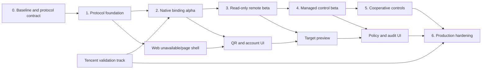

# WeChat Remote Management (Weixin iLink) Development Plan

**Status:** Built-in Boot protocol, live QR entry, and read-only runtime implemented; release validation remains
**Last updated:** 2026-07-23
**Architecture:** [Product and Native Rust Architecture](WEIXIN_REMOTE_CONTROL.md)
**Security and release gates:** [Security, Operations, and Delivery](WEIXIN_REMOTE_CONTROL_OPERATIONS.md)

## Purpose

This plan turns the approved product and architecture boundaries into an
executable backlog for a native Rust iLink integration in A3S Web. It defines
work packages, dependencies, file ownership, estimates, test gates, merge
order, and release criteria. It does not expand the v1 scope.

The plan separates deterministic protocol work against a local mock iLink
server from optional live Tencent validation. The official channel identity is
part of the published protocol contract; A3S supplies its own `A3S/<version>`
product identity through `bot_agent`.

## Implementation checkpoint — 2026-07-23

The native Rust protocol foundation, the local disabled/mock Milestone 2 Alpha,
and the local/mock Milestone 3 read-only Beta are implemented:

- `IL-101` through `IL-107`: A3S Boot exports the feature-gated
  `IlinkModule`, `IlinkClient`, typed secrets, strict URL policy, QR, update,
  text, config, typing, and lifecycle transports. Local Axum contract tests
  cover official request shapes and headers, cursor/context behavior, error
  `-14`, Tencent IDC redirects, response bounds, normal long-poll timeouts, and
  fail-closed unknown QR states;
- `BE-101`: CLI `WeixinModule` is imported by `CodeWebModule` and imports Boot
  `IlinkModule`. Boot pins the official `iLink-App-Id: bot`, `bot_type=3`, and
  protocol version `2.4.6`; CLI contributes `bot_agent=A3S/<version>`.
  No environment variable or ACL identity injection is required. Missing
  configuration enables the channel, while `enabled = false` is the explicit
  local kill switch;
- `ST-201` through `ST-203`: the credential-store interface and fake, a
  zeroizing private-file implementation, and the versioned single-writer
  runtime journal/snapshot are implemented with private permissions, symlink
  rejection, atomic replacement, corruption quarantine, and account locking.
  Operating-system credential-vault adapters and cross-platform validation
  remain production release work;
- `LG-201`, `MN-201`, `MN-202`, `API-201`, and the local integration portion of
  `QA-201`: the one-attempt login coordinator, verification/redirect flow,
  cancellation-aware monitor, durable cursor/inbox/outbox behavior, bounded
  backoff, stale-credential handling, account/login/pause/resume/disconnect
  endpoints, Boot lifecycle, and secret-negative API tests are implemented;
- `FE-201` through `FE-204`: A3S Web now exposes one **Settings → Channels**
  navigation item with internal tabs for **WeChat** and the planned **Feishu**
  adapter, uses
  `#settings/channels/weixin` as the canonical WeChat route, maps the legacy
  `#settings/weixin` and `#weixin` deep links to that sub-tab, and no longer
  consumes an Activity Bar product slot. The Feishu route is
  `#settings/channels/feishu`, displays only “Coming soon”, and explicitly
  performs no credential or network activity. Older-backend 404 fallback,
  typed API/state and controller code,
  unavailable/account views, QR countdown and verification, pause/resume, local
  disconnect confirmation, accessibility, and compact layout coverage remain;
- `CP-301` through `CP-304`: the protocol-independent remote domain, narrow
  managed-session read port, exact cooperative/observed process projection,
  managed child-agent projection, goals, queue state, attention, freshness, and
  opaque identifiers are implemented. The local `/api/v1/weixin/targets`
  response exposes no raw session IDs, task IDs, presence IDs, PIDs, or full
  workspace paths;
- `RI-301`, `RI-302`, `RD-301`, `IN-301`, and `QA-301`: the closed
  deterministic Chinese parser runs before an optional schema-constrained
  default-model router. Model input is sanitized, generation has a two-second
  hard timeout and no repair attempts, and only the closed read-only intent
  schema can be admitted. Shell output, extensible JSON, uncertain output, and
  invalid references fail closed. Owner-only direct-message handling, rate
  limiting, stable inbox/outbox identity, replay/deduplication, and source-order
  preservation remain enforced;
- target and session inventories use deterministic 12-item pages. The runtime
  journal persists only the page-local opaque target IDs, page number, and list
  kind, so `选择 1` retains its meaning across restart and never retargets by a
  changed global list position. Full opaque IDs, short references, exact safe
  titles, duplicate-title disambiguation, stale-target clearing, and schema-v1
  snapshots without list context are covered by tests;
- safe renderers bound and redact every reply. `sessions.content.read` remains
  default-off, while its enabled monitor path has a positive end-to-end test
  proving that paths and common secret forms are removed. A 20-message local
  mock assertion enforces read-response p95 below three seconds after update
  delivery;
- `FE-301`: the Settings sub-tab previews a bounded set of managed sessions,
  authoritative managed child agents, cooperative agents, and observed
  processes. It labels evidence confidence and stale/degraded state, and always
  identifies observed processes as read-only with unknown execution state; and
- the inspected protocol artifact is pinned in the architecture document by
  package version, commit, SHA-1, and npm integrity value. Automated tests use
  synthetic/local mocks. A separate non-binding live smoke check received an
  actual Tencent QR payload and repeatedly observed the `wait` state without
  scanning or persisting credentials.

The local/mock Milestone 3 exit gate and the built-in production construction
path are complete. The default capability is `state=unbound` and
`protocolMode=tencent`; there is no entitlement or configurable protocol
identity field. Automated tests make no Tencent request. Cross-platform
credential storage, security review, and mutation-policy gates remain release
work.

Focused verification at this checkpoint:

```text
cd crates/cli
cargo fmt --all -- --check
cargo test --bin a3s api::code_web::remote -- --nocapture
cargo test --bin a3s weixin_ -- --nocapture
cargo test --bin a3s remote_handler -- --nocapture
cargo test --bin a3s system_agents -- --nocapture
cargo test --bin a3s complete_code_web_module_builds_with_nested_remote_kernel_imports -- --nocapture

cd apps/web
bun run test
bun run build
bun run format:check
bun run lint:check
bun run typecheck
```

The 2026-07-23 protocol migration passes 15 focused Boot iLink tests,
`cargo check --all-features`, a minimal `--no-default-features --features
ilink` check, CLI `cargo check -p a3s`, and 38 focused CLI Weixin tests. Existing
unrelated workspace changes remain untouched.

## Locked implementation constraints

- iLink runs in the `a3s` Rust process as Boot `IlinkModule`/`IlinkClient`,
  composed by CLI `WeixinModule`.
- Tokio and Rust `reqwest` provide all network I/O. Node.js and OpenClaw are not
  build, runtime, or test dependencies.
- The production client uses Tencent's published fixed
  `iLink-App-Id: bot`, `bot_type=3`, and protocol version `2.4.6`, while
  `bot_agent=A3S/<version>` identifies the host product.
- The browser calls only local `/api/v1/weixin/*` endpoints and never receives
  a bot token, context token, owner ID, cursor, control grant, or authenticated
  upstream base URL.
- A3S remains the only session, authorization, confirmation, policy, and audit
  authority.
- Observed processes are read-only. No PID kill, signal, TTY, or stdin fallback
  may be introduced.
- Every v1 mutation is locally enabled, previewed, confirmed by a second owner
  message, freshly revalidated, idempotency-reserved, and audited.
- Remote deletion means recoverable archive. Permanent purge stays local.
- V1 supports one account, one owner, direct text messages, and no media.
- `ApproveAlways`, arbitrary shell, inferred-process control, group chat, and
  multi-owner access are not backlog items for this release.

## Delivery assumptions and estimate

### Team assumption

The recommended delivery team is:

- one senior Rust engineer owning iLink, Boot lifecycle, storage, and monitor;
- one engineer comfortable in Rust and React owning the control-plane adapters,
  local API, and Web product surface;
- a security reviewer and QA engineer available part-time from the binding
  milestone onward; and
- one product/engineering contact responsible for Tencent protocol monitoring
  and optional live-test coordination.

With this staffing, the production-safe v1 has a base estimate of approximately
**105 engineer days**, a planning range of **95–120 engineer days**, and a
target of **10–12 calendar weeks**, excluding Tencent approval wait time. The
upper-risk case may extend to 13 weeks. A single engineer should plan for 19–24
weeks. A mock-only protocol build appears in the first two weeks, and a
read-only beta is targeted around weeks 5–6.

These are planning ranges, not commitments. Cross-platform credential-vault
behavior, Tencent protocol changes, and crash-consistency findings may move the
upper bound.

### Supported-platform order

Development and manual alpha validation start on macOS because it is the
current development environment. The interfaces and automated tests remain
platform-neutral. Linux Secret Service/headless fallback and Windows
Credential Manager validation are release gates unless the product explicitly
narrows the first public release to macOS.

### Current workspace constraint

The current root and `crates/cli` submodule worktrees contain substantial user
changes. Several future integration files are already modified, including
`app-shell.tsx`, `app-state.ts`, `lib/api.ts`, and `types/api.ts`.

Before implementation begins:

1. Record root and submodule status plus the current commit IDs.
2. Do not use `git stash pop`, reset, checkout-discard, or automatic rewrites.
3. Establish a user-approved clean baseline or explicitly coordinate edits to
   overlapping files.
4. Keep backend commits in the `crates/cli` repository and root Web/docs
   commits in the root repository; update the CLI gitlink only after its commit
   exists.

This preparation is a scheduling dependency, not permission to modify or
commit unrelated user work.

## External validation track

These items run in parallel with mock-based engineering. They do not block
built-in QR creation unless a row explicitly names that capability.

| ID | Required answer or artifact | Status | Blocks |
| --- | --- | --- | --- |
| `EXT-01` | Published iLink identity/version contract | Resolved from Tencent v2.4.6: `bot`, `3`, `2.4.6` | Future compatibility updates |
| `EXT-02` | Product/legal review for the machine-control use case | Open | Broad public enablement |
| `EXT-03` | Observed `baseurl`, `redirect_host`, and future CDN hostname inventory | Partially covered by strict Tencent-domain policy | New regions and media |
| `EXT-04` | Approved test account or live-test procedure | QR wait smoke complete; bound-account matrix open | Authenticated live integration tests |
| `EXT-05` | Rate limits, maximum message sizes, cursor retention, and long-poll timeout bounds | Open | Monitor production tuning |
| `EXT-06` | `message_id` and outbound `client_id` idempotency guarantees | Open | Mutation and outbound retry policy |
| `EXT-07` | Token expiry, error `-14`, unbind, and server-side revocation semantics | Open | Recovery and disconnect copy |

If an answer remains unavailable, the corresponding higher-risk capability
stays disabled. A3S must not claim the `OpenClaw` bot agent or broaden the
hostname allowlist to bypass validation.

## Release train and dependencies



No operator-provisioned entitlement is required. Protocol fixtures, mock
transport, domain modeling, storage work, page states, and policy tests remain
offline. Live authenticated validation requires a deliberately bound test
account.

## Milestone 0 — baseline, decisions, and contracts

**Target:** days 1–3 plus the independent external track.
**Deliverable:** reviewable implementation contract with no production traffic.

| ID | Work item | Dependency | Estimate |
| --- | --- | --- | --- |
| `M0-01` | Capture root/submodule baselines and identify overlapping user files | None | 0.5 day |
| `M0-02` | Freeze v1 non-goals, error codes, capability schema, and feature states | Architecture docs | 1 day |
| `M0-03` | Record protocol evidence provenance and fixture-sanitization rules | Published package evidence | 0.5 day |
| `M0-04` | Pin the official production identity and isolate mock-only origin injection | `EXT-01` | 1 day |
| `M0-05` | Create a threat-model checklist and name reviewers for later gates | Security architecture | 0.5 day |

The capability contract is versioned from its first commit:

```text
schemaVersion: 2
state: unavailable | unbound | binding | active | paused | degraded | staleCredential
protocolMode: disabled | mock | tencent
supportedScopes: RemoteScope[]
releaseBlockers: SafeBlocker[]
```

An older backend returning 404 must be interpreted by the Web client as
“WeChat capability unavailable,” not as a global A3S service disconnect.

### Exit gate

- Product, security, and API reviewers accept the closed v1 scope.
- Test-mode endpoint injection cannot be activated by a production Web request
  or ordinary ACL value.
- The implementation can begin without an OpenClaw identifier.
- Overlapping worktree files have an explicit coordination owner.

## Milestone 1 — Rust protocol foundation and mock harness

**Target:** weeks 1–2.
**Effort:** 9–12 engineer days.
**Deliverable:** Boot `IlinkModule`, CLI channel composition, and complete
text-protocol contract tests.

### Work packages

| ID | Work item | Dependency | Estimate |
| --- | --- | --- | --- |
| `IL-101` | Add `crates/boot/src/ilink` module boundaries and typed protocol errors | `M0-02` | 1 day |
| `IL-102` | Add bounded Serde DTOs for QR states, updates, text messages, config, typing, notify start/stop | `IL-101` | 1.5 days |
| `IL-103` | Implement application/client-version packing, random UIN, base info, and centralized secret redaction | `IL-101` | 1 day |
| `IL-104` | Implement strict HTTPS host validation, redirect rejection, response limits, and timeout classes | `IL-101`, `EXT-03` policy shape | 1.5 days |
| `IL-105` | Implement QR create/poll transport methods including verification and validated redirect state | `IL-102`–`IL-104` | 1 day |
| `IL-106` | Implement `getupdates`, `sendmessage`, `getconfig`, typing, notify start/stop | `IL-102`–`IL-104` | 1.5 days |
| `IL-107` | Add synthetic golden fixtures and local mock iLink HTTP server | `IL-102` | 1.5 days |
| `BE-101` | Import Boot `IlinkModule` from CLI `WeixinModule` and expose `/api/v1/weixin/capability` | `M0-02`, `IL-101` | 1 day |

### Backend file scope

```text
crates/boot/src/ilink/
├── mod.rs
├── transport.rs
├── client.rs
├── auth.rs
├── types.rs
├── url_policy.rs
├── login.rs
├── updates.rs
├── messages.rs
└── tests.rs

crates/cli/src/api/code_web/
├── module.rs                         import CLI WeixinModule
└── weixin/
    ├── mod.rs
    ├── module.rs                     import Boot IlinkModule
    ├── dto.rs
    └── capability_controller.rs
```

No account token or real endpoint is needed in this milestone. `getuploadurl`
and media DTOs are excluded unless a shared wire type is strictly necessary to
deserialize and reject media safely.

### Test-first sequence

1. Write fixture-deserialization failures for unknown/oversized/invalid data.
2. Write URL attack cases before implementing the validator.
3. Write exact request snapshot tests with canary tokens and redacted debug
   output.
4. Write mock-server flows for every QR state, cursor response, `-14`, 5xx,
   timeout, and outbound text.
5. Implement until focused tests pass.

### Exit gate

- CI makes no Tencent request.
- Unknown QR/message states fail closed and do not panic.
- Authenticated requests cannot reach an HTTP, IP-literal, redirected, or
  unapproved host.
- Canary tokens are absent from logs, errors, snapshots, and capability DTOs.
- Boot starts and stops with the feature disabled without spawning a task.

## Milestone 2 — native QR binding, storage, and monitor alpha

**Target:** weeks 2–4.
**Effort:** 24–28 engineer days, with Rust and frontend work in parallel.
**Deliverable:** local Web QR flow and a supervised text monitor; no agent
commands yet.

**Implementation status:** the mock Alpha and built-in production wiring are
complete as of 2026-07-23. `FE-201` through `FE-204`, the Rust mock path, Boot
protocol provider, QR exposure, optional enable switch, and private runtime
initialization are covered by focused tests. Live QR creation has been smoke
tested; bound-account, operating-system credential-vault, and cross-platform
release validation remain open gates.

### Rust work packages

| ID | Work item | Dependency | Estimate |
| --- | --- | --- | --- |
| `ST-201` | Define `WeixinCredentialStore` and fake store; evaluate cross-platform keyring adapter | `M0-04` | 2 days |
| `ST-202` | Implement explicit private-file fallback, permissions, symlink rejection, and zeroizing secret envelope | `ST-201` | 1.5 days |
| `ST-203` | Implement versioned runtime journal, atomic snapshot, corruption quarantine, and `fs2` account lock | `IL-107` | 3 days |
| `LG-201` | Implement one-attempt `WeixinLoginCoordinator`, TTL, pair-code retry, redirect, and already-bound states | `IL-105`, `ST-201` | 2 days |
| `MN-201` | Implement cancellation-aware `WeixinMonitorSupervisor` and Boot lifecycle hooks | `IL-106`, `ST-203` | 3 days |
| `MN-202` | Add cursor staging, bounded inbox/outbox, backoff, stale-token state, and stable outbound client IDs | `MN-201`, `ST-203` | 3 days |
| `API-201` | Add account, login-attempt, pause/resume, and local-disconnect controllers | `LG-201`, `MN-201` | 1.5 days |
| `QA-201` | Add restart, lock-contention, shutdown, and crash-point integration tests | `ST-203`, `MN-202` | 2 days |

### Frontend work packages

| ID | Work item | Dependency | Estimate |
| --- | --- | --- | --- |
| `FE-201` | Add one Channels Settings page with internal WeChat/Feishu tabs, canonical `#settings/channels/weixin` navigation, inactive Feishu panel, legacy WeChat route compatibility, and capability fallback | `BE-101` | 1.5 days |
| `FE-202` | Add typed API client/state/controller for capability, account, and login attempts | `API-201` contract | 1.5 days |
| `FE-203` | Build connection card, unavailable state, QR dialog/countdown, verification challenge, pause, and disconnect | `FE-202` | 3 days |
| `FE-204` | Add browser-storage/token-negative tests, accessibility, compact layout, and connection recovery | `FE-203` | 1.5 days |

Likely frontend integration files include `code-state.ts`, `app-state.ts`,
`activity-bar.tsx`, `app-shell.tsx`, `lib/api.ts`, and `types/api.ts`, plus the
new `features/weixin-remote/` boundary. These are known overlap points and must
be merged intentionally with current user work.

### Alpha behavior

- Production identity missing or invalid: page explains the blocker and makes
  no upstream request.
- Production identity configured: page exposes QR binding and the supervised
  read-only monitor with `protocolMode=tencent`.
- Mock mode: full QR state machine can be demonstrated locally.
- Tencent sandbox available: QR may bind one owner, then the monitor receives
  text but returns only a fixed “remote commands not enabled” response.
- All mutation scopes remain structurally unavailable.
- Local disconnect deletes A3S-held secrets and does not claim server revocation.

### Exit gate

- QR, verification, expiry, invalid redirect, and already-bound flows are
  covered in Rust and Web tests.
- Restart resumes from the durable cursor without processing a staged message
  twice.
- Shutdown cancels long polling and joins all tasks within 10 seconds.
- Two A3S Web instances cannot monitor one account simultaneously.
- Tokens, context, owner ID, cursor, and base URL do not cross the local REST
  boundary or browser storage.
- A secure-store failure prevents binding rather than silently downgrading.

## Milestone 3 — truthful read-only remote-control beta

**Target:** weeks 4–6.
**Effort:** 17–20 engineer days.
**Deliverable:** the bound owner can ask which agents/sessions exist and obtain
truthful, privacy-bounded progress through WeChat.

**Implementation status:** the local/mock read-only Beta and its exit-gate
tests are complete as of 2026-07-22. Production binding and Tencent traffic
remain disabled pending the external and production-hardening gates.

### Work packages

| ID | Work item | Dependency | Estimate |
| --- | --- | --- | --- |
| `CP-301` | Add protocol-independent `RemoteTarget`, confidence, capability, query, and receipt domain types | `M0-02` | 2 days |
| `CP-302` | Export a narrow managed-session read port from `KernelModule` | `CP-301` | 1.5 days |
| `CP-303` | Adapt exact `system_agents` presence and inferred process evidence into cooperative/observed targets | `CP-301` | 2 days |
| `CP-304` | Normalize goals, queue, child-agent status, attention, and freshness without exposing raw state | `CP-302`, `CP-303` | 1.5 days |
| `RI-301` | Implement deterministic Chinese command parser, selection context, and reference disambiguation | `CP-301` | 2 days |
| `RI-302` | Add schema-constrained natural-language routing with deterministic fallback | `RI-301` | 2 days |
| `RD-301` | Implement safe bounded renderers, pagination, path aliases, and content-redaction rules | `CP-304` | 1.5 days |
| `IN-301` | Enforce owner/direct-text envelope, stable message identity, deduplication, rate limits, and quarantine | `MN-202`, `RI-301` | 2 days |
| `FE-301` | Add remote-visible target preview and monitor diagnostics to the Web page | `CP-304` local API | 1.5 days |
| `QA-301` | Add non-owner, group, replay, prompt-injection, privacy, and observed-read-only tests | All above | 1.5 days |

The parser supports `帮助`, `智能体 [页码]`, `选择`, `进度`, `会话 [页码]`,
`最近回复`, and `清除选择`. Deterministic commands bypass the model. Other
language may use the configured default model only through a sanitized,
schema-constrained classifier with a two-second hard timeout and zero repair.
It may return only a closed `RemoteIntent`; uncertain or invalid output asks for
clarification. No arbitrary JSON map or default agent dispatch is accepted.

`sessions.content.read` remains default-off. Without it, replies contain
metadata and generated safe summaries only. With it, only a bounded latest
assistant excerpt is available; raw tool messages remain excluded.

### Backend integration decisions

- Add narrow exported providers rather than exporting the full `KernelService`
  or calling its HTTP controllers.
- Keep `ProcessesService::top` JSON out of the remote domain; adapt source types
  before rendering.
- Do not place protocol DTOs in `CodeWebState`.
- Never use a PID as `RemoteTargetId` or accept a PID from a chat command.

### Exit gate

- Managed, cooperative, and observed targets are distinguishable in every DTO
  and rendered response.
- An observed process has no code path to a mutation capability.
- Non-owner and group messages return no inventory and execute no query.
- Duplicate/replayed updates produce at most one outbound response record.
- Read-only response p95 is under 3 seconds after mock update delivery.
- Privacy snapshots contain no full cwd, command, tool content, or secret.

This milestone is the first externally useful beta and can ship behind a
read-only capability gate before mutation work is complete.

The exit gate above is verified against local synthetic/mock traffic. Shipping
it to real WeChat users still requires the applicable `EXT-*` and production
release gates; the current binary remains fail-closed and disabled.

## Milestone 4 — managed-session control beta

**Target:** weeks 6–9.
**Effort:** 27–31 engineer days.
**Deliverable:** locally enabled, two-step confirmed management of A3S Web
sessions through WeChat.

### Policy and safety work packages

| ID | Work item | Dependency | Estimate |
| --- | --- | --- | --- |
| `PL-401` | Implement versioned local scopes, workspace aliases, notification policy, and policy revision | Read-only beta | 2 days |
| `CF-401` | Implement mutation previews, one-time codes, expiry, owner/chat binding, and pending limits | `PL-401` | 2 days |
| `CF-402` | Implement semantic `actionRevision` and confirmation-time target/policy revalidation | `CF-401`, `CP-301` | 2 days |
| `ID-401` | Implement durable idempotency reservation and `outcome_unknown` recovery | `ST-203`, `CF-401` | 2.5 days |
| `AU-401` | Implement sanitized execution-start/outcome audit and fail-closed storage behavior | `ST-203`, `ID-401` | 2.5 days |

### Managed-session work packages

| ID | Work item | Dependency | Estimate |
| --- | --- | --- | --- |
| `KS-401` | Add backward-compatible `archivedAt` metadata and exclude archived sessions from active lists | Kernel read port | 1.5 days |
| `KS-402` | Add recoverable archive/unarchive operations without deleting core/timeline/context data | `KS-401` | 1.5 days |
| `KS-403` | Export typed create, submit-or-queue, cancel/stop, and archive methods with idempotency keys | `ID-401`, `KS-402` | 3 days |
| `RC-401` | Add `RemoteCommand` prepare/execute pipeline and authoritative receipts | `CF-402`, `KS-403`, `AU-401` | 2 days |
| `NT-401` | Add coalesced completion/failure/waiting-input notifications | `RC-401`, valid context token | 1.5 days |

`archivedAt` defaults to `None` when older session metadata is loaded. Archive
must close/cancel active work safely and persist the new metadata without
calling `delete_session`. Local unarchive restores visibility. Permanent delete
behavior and endpoints are not changed by the remote adapter.

### Frontend and QA work packages

| ID | Work item | Dependency | Estimate |
| --- | --- | --- | --- |
| `FE-401` | Build local scope editor, dangerous-scope warnings, and workspace alias editor | `PL-401` API | 2.5 days |
| `FE-402` | Build exact remote-visible capability preview and audit list | `AU-401` API | 1.5 days |
| `QA-401` | Fault-inject every write around confirmation, audit, archive, create, and message execution | All backend packages | 2.5 days |
| `QA-402` | Verify duplicate confirmation, target change, policy change, expiry, and crash recovery | `CF-402`, `ID-401` | 1.5 days |

### Supported managed commands

- submit a message immediately when the managed session is idle;
- place the message in the existing visible turn queue when it is running;
- create a session only in a locally configured workspace alias;
- stop or cancel through the typed managed-session port;
- archive a session recoverably; and
- retrieve the prior command receipt without replaying the command.

Every command is a preview on the first owner message. Only a second, exact,
unexpired confirmation can invoke `execute`.

### Exit gate

- Mutating scopes are off by default and cannot be changed through WeChat.
- No mutation executes without a durable audit-start record and idempotency
  reservation.
- Duplicate confirmations cause one execution and return the same receipt.
- A crash after reservation never automatically replays the command.
- Arbitrary paths cannot escape the locally configured workspace aliases.
- Archive is reversible and no remote code path reaches permanent deletion.
- Existing Web session and turn-queue behavior remains covered by regression
  tests.

## Milestone 5 — cooperative A3S process controls

**Target:** weeks 9–10.
**Effort:** 7–9 engineer days.
**Deliverable:** stop, cancel, or reply only when a fresh cooperative A3S
heartbeat advertises the action.

| ID | Work item | Dependency | Estimate |
| --- | --- | --- | --- |
| `SA-501` | Add stable semantic activity revision excluding grant token/expiry | `CF-402`, `system_agents` | 1.5 days |
| `SA-502` | Add internal lookup that re-fetches current exact activity and fresh grant at confirmation | `SA-501` | 2 days |
| `SA-503` | Adapt advertised stop, cancel, reply, and deny where product policy permits | `SA-502`, `PL-401` | 1.5 days |
| `SA-504` | Add expiry/race/replay tests around the existing 10–12 second grants | `SA-503` | 1.5 days |
| `QA-501` | Prove no observed-process PID/TTY fallback and no stale retargeting by list position | All above | 1 day |

Pending confirmations store the semantic activity reference and revision only.
They never retain the current one-shot token. Confirmation re-reads the
activity, compares context/actions/revision, obtains a fresh token internally,
and writes one bounded control request. A race returns
`REMOTE_ACTION_NOT_AVAILABLE` and requires a new draft.

Remote `ApproveOnce` is not part of this milestone. It requires a separate
post-v1 risk-rendering review. `ApproveAlways` remains prohibited.

### Exit gate

- Fresh-grant races fail closed in deterministic tests.
- A cooperative reply is accepted only while `Reply` is currently advertised.
- Expired or changed activities cannot be controlled by an old confirmation.
- Observed Codex/Claude/etc. processes remain read-only under every parser and
  policy combination.

## Milestone 6 — production hardening and release candidate

**Target:** weeks 10–12 after required validation gates are available.
**Effort:** 13–16 engineer days.
**Deliverable:** built-in read-only release candidate with every mutation still
locally gated, followed by staged enablement after review.

| ID | Work item | Dependency | Estimate |
| --- | --- | --- | --- |
| `SEC-601` | Complete threat-model review, canary-secret scan, URL/parser fuzzing, and local exposure tests | All features | 2.5 days |
| `REL-601` | Run journal corruption/crash matrix, sleep/wake, network loss, stale token, and two-instance tests | All backend features | 2.5 days |
| `PLAT-601` | Validate macOS Keychain, Linux Secret Service/headless fallback, and Windows credential behavior | `ST-201` | 3–4 days |
| `TX-601` | Run bound-account QR, cursor, timeout, rate-limit, context-token, and outbound idempotency tests | `EXT-03`–`EXT-07` | 2 days |
| `OBS-601` | Finalize secret-free metrics, diagnostics, alerts, and audit retention | Monitor/control beta | 1.5 days |
| `DOC-601` | Update README, roadmap, user docs, troubleshooting, privacy copy, and protocol provenance | All behavior final | 1 day |
| `REL-602` | Build signed release candidate, execute rollback drill, and record go/no-go review | All gates | 1 day |

### Staged rollout

1. **Built-in shell:** page and capability endpoint expose the Boot protocol;
   operators may still disable it locally.
2. **Internal mock alpha:** developers exercise complete flows against the mock
   server.
3. **Bound-account alpha:** binding and read-only queries for named testers.
4. **Read-only beta:** owner binding with all mutations disabled.
5. **Managed-control beta:** selected testers locally enable managed scopes.
6. **Cooperative-control beta:** fresh advertised TUI actions are enabled.
7. **General availability:** only after security, privacy, protocol, and
   reliability gates sign off.

Every build retains a local kill switch that stops the monitor and makes the
capability unavailable without deleting ordinary A3S sessions. Storage/audit
failure automatically downgrades mutations to read-only.

### Release gate

- All `EXT-*` items required by enabled capability are resolved in writing.
- Fixed wire identifiers match Tencent's official SDK, while `bot_agent`
  continues to identify A3S rather than OpenClaw.
- The security review has no unresolved high-severity issue.
- The complete crash matrix has no automatic duplicate mutation.
- The real sandbox confirms cursor, context token, host, timeout, and
  idempotency assumptions.
- Disconnect/rebind and rollback procedures are documented and rehearsed.
- Rust, frontend, integration, and platform checks pass from their owning
  directories.

## Verification commands

Run Rust checks from `crates/cli`, not the monorepo root:

```bash
cargo fmt --all -- --check
cargo test weixin
cargo test system_agents
cargo test --test web_weixin
cargo check --all-targets
cargo clippy --all-targets -- -D warnings
```

The focused filters and integration-test target are added with their owning
milestones. Before release, also run `cargo test --all-targets` when the current
CLI branch is stable enough for the full suite.

Run frontend checks from `apps/web`:

```bash
bun run format:check
bun run lint:check
bun run typecheck
bun run test
bun run build
```

CI and normal local tests use the mock transport only. Tencent sandbox tests
are explicit, credential-gated, non-CI commands that redact output and never
run against a developer's personal production account by default.

## Review and merge plan

Backend work lives in the `crates/cli` Git repository; Web and these planning
documents live in the root repository. Use small logical changes and preserve
cross-version compatibility.

Recommended review sequence:

1. **CLI PR A:** protocol DTOs, secure transport, mock server, disabled
   capability endpoint.
2. **Root PR A:** unavailable/page shell and older-backend 404 handling.
3. **CLI PR B:** credential/runtime stores, QR coordinator, monitor, account
   APIs.
4. **Root PR B:** QR/account UI and CLI gitlink update.
5. **CLI PR C:** read-only target ports, intent routing, rendering, ingress.
6. **Root PR C:** target preview/diagnostics and CLI gitlink update.
7. **CLI PR D:** policy, confirmation, audit, archive, and managed commands.
8. **Root PR D:** policy/audit UI and CLI gitlink update.
9. **CLI PR E:** cooperative controls, hardening, and release gates.
10. **Root PR E:** final documentation, compatibility verification, and
    release gitlink.

The frontend must tolerate the preceding backend version and the backend must
not require the new page to remain safe. Feature state is server-authoritative.

## Risk register

| Risk | Impact | Mitigation and gate |
| --- | --- | --- |
| Tencent does not authorize A3S identity | No production iLink release | Keep mock/read-only work isolated; do not impersonate; stop at unavailable state |
| Protocol changes without versioning | Binding or messaging breaks | Bounded DTOs, fixtures, safe unknown states, protocol-degraded mode |
| Returned host leaks bearer token | Credential compromise | Compiled exact host policy, HTTPS only, no redirects, URL fuzz tests |
| Keychain is unavailable or prompts unexpectedly | Monitor cannot start reliably | Injectable store, platform spike, explicit private fallback, clear UI state |
| Cursor crash loses or repeats a message | Missed or duplicate action | Stage inbox/cursor durably; idempotency reservation; fault injection |
| Outbound result is unknown | Duplicate reply or misleading receipt | Stable client ID; do not blindly retry until Tencent semantics are confirmed |
| Confirmation outlives a TUI grant | Stale cooperative control | Store semantic revision only; fetch fresh grant on confirmation |
| Archive changes old session persistence | Session regression/data loss | Backward-compatible optional metadata, migration tests, never reuse delete path |
| Natural language resolves the wrong target | Wrong session mutation | Stable selection, disambiguation, exact preview, second confirmation, live revision |
| Same-user local malware forges state | False cooperative evidence | Private directories and one-shot grants; document local-compromise boundary |
| Existing dirty work overlaps integration files | User changes are lost or tangled | Baseline and explicit coordination; no stash/reset; scoped PRs |
| Cross-repository versions drift | Page/backend incompatibility | Versioned capability schema, 404 fallback, ordered CLI/root PRs |

## Definition of done for every work package

A work package is complete only when:

- its public behavior and failure modes are represented by typed interfaces;
- tests were added or updated before/with implementation and cover the changed
  behavior;
- no production panic, unbounded queue/body, secret-bearing debug output, or
  generic execution escape was introduced;
- async code is cancellation-aware and performs no blocking I/O on Tokio
  executor threads;
- errors carry safe contextual codes without upstream bodies or tokens;
- focused formatting, tests, and checks pass in the owning application/crate;
- obsolete code and tests are removed instead of left as parallel paths; and
- relevant architecture, user, API, and troubleshooting documentation is
  updated in the same milestone.

## Explicit post-v1 backlog

The following items require new product and threat-model approval and are not
allowed to delay or silently enter v1:

- remote `ApproveOnce` or `Deny` for tool permissions;
- images, files, voice, video, CDN upload/download, or AES media handling;
- multiple bot accounts, multiple owners, group chats, or delegated access;
- arbitrary natural-language tool/shell execution;
- remote permanent session purge;
- control adapters for Codex, Claude, or other agents without a cooperative A3S
  capability protocol; and
- proactive messages without a valid owner context token.

## First execution slice

Once the worktree baseline and `M0` decisions are accepted, implementation
starts with this exact sequence:

1. Add failing tests for protocol types, QR states, URL validation, and secret
   redaction.
2. Add `crates/boot/src/ilink` and make those tests pass.
3. Add the local mock iLink server and end-to-end QR/update/send fixtures.
4. Compose Boot `IlinkModule` from CLI `WeixinModule` and add the versioned
   capability endpoint.
5. Add the Web unavailable state with graceful older-backend 404 behavior.

This slice is independently reviewable, contacts no production service, and
creates the stable seam required by every later milestone.
