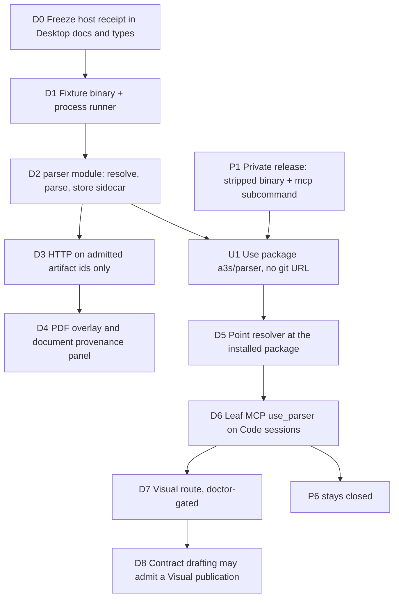

# Desktop Parser Integration Execution Plan

Status: execution baseline (2026-09-13)

Contract: [desktop-parser-integration-roadmap.md](./desktop-parser-integration-roadmap.md)

This plan says how to carry that roadmap out. It does not authorize compiling
Parser into Desktop, and it does not treat the existing `crates/parser`
submodule as the engine to ship.

## Binding decisions

These are closed. A later shortcut that breaks one of them is a failed
execution, not a phase acceleration.

1. **Do not integrate through `crates/parser`.** That submodule is
   `github.com/A3S-Lab/Parser` (`a3s-parser` 0.1.0, `a3s-code-core` 6.7). It is
   a source tree. Retargeting its gitlink at
   `git@github.com:contra-sense/agentic-parser.git`, or adding it to the
   Desktop Cargo graph, puts private engine source in the public checkout.
   Leave the submodule alone.
2. **Do not `cargo` the private repository.** A git dependency on
   `contra-sense/agentic-parser`, including the runtime-free publication
   crate, fetches the engine `src/` tree. Desktop must not do that.
3. **The installed binary is the schema authority.** Desktop stores canonical
   JSON as opaque bytes and extracts only a host receipt. It asks
   `a3s-parser validate` to accept the graph. It does not vendor Parser Rust
   types.
4. **Public CI never clones or downloads the private engine.** Tests spawn a
   fixture executable that prints a frozen receipt. The real binary is a local
   or release-job input, matched by SHA-256.
5. **Copy the Office package seam, not the Office editor.** Resolution and
   session attach follow
   `apps/desktop/src-tauri/src/backend/modules/task_execution/infrastructure/office_capability.rs`.
   The Use ACL shape follows
   `packages/office/integrations/a3s-use/a3s-use-extension.acl`, except the
   Parser package must not publish a `repository.url` that clones the private
   git remote.
6. **A new Boot module, not a method on PDF import.** Office already owns
   admitted bytes (`OfficePdfUseCases`, `MAXIMUM_OFFICE_PDF_BYTES` = 32 MiB).
   Parser owns publications of those bytes. Do not fold parse into
   `OfficePdfUseCases::import`.

## What "done" means for the first slice

A user who has the `a3s/parser` package can open an already admitted digital
PDF or DOCX, run Fast, and see disposition plus an overlay on the existing
surface. The Office editor snapshot is unchanged. A machine without the
package sees a stable unavailable error and the same viewer it has today.
Public CI proves that with a fixture binary and never sees Parser source.

Visual OCR, contract-drafting scan admission, and Balanced/Deep/Planned stay
behind their own exits. They are in this plan so they are not silently pulled
into the first slice.

## Work order



D0–D4 land in the public Desktop repo with no private artifact. P1 and U1
happen in the private repository and the Use registry. D5 is the first time a
developer machine runs the real binary, and only through an absolute path or
package root, never through `cargo`.

---

## D0 — Freeze the host receipt

**Owner:** Desktop. No Parser checkout required.

Add a checked-in receipt, not a Parser crate:

- `apps/desktop/src-tauri/src/backend/modules/parser/domain/receipt.rs`
- `apps/desktop/src/features/office/parser/receipt.ts`

Fields the webview and the model are allowed to see:

| Field | Rule |
| --- | --- |
| `schemaVersion` | Integer. Unknown versions fail closed. |
| `disposition` | `complete`, `partial`, `unsupported`, `failed`, `unavailable` |
| `limitationCodes` | Closed strings. No provider logs. |
| `sourceFingerprint` | SHA-256 of the admitted Office bytes. Must match the store. |
| `coordinateBasis` | Must be `1000000` or the receipt is rejected. |
| `profile` | `fast` in this slice. `visual` rejected until D7. |
| `previewMarkdown` | Bounded. Reuse the 4 MiB Code projection ceiling, and send a shorter slice to the model. |
| `publicationId` | Desktop-issued. Not a filesystem path. |

Canonical JSON stays on disk. The receipt is the only JSON the HTTP API
returns besides an overlay projection that contains region ids, page index,
and boxes. No node text dump in the overlay list response.

**Exit:** A unit test rejects a receipt whose `sourceFingerprint` does not
match the admitted PDF, a non-`1000000` basis, a host path, and `profile =
balanced`.

## D1 — Fixture process, not the engine

**Owner:** Desktop tests.

Add `apps/desktop/src-tauri/tests/fixtures/parser_fake.rs` (or a tiny checked-in
script) that implements only:

```text
a3s-parser doctor
a3s-parser parse <file> --state-dir <dir> --output <file> --profile fast
a3s-parser project <canonical> --format overlay-json|markdown --output <file>
a3s-parser validate <canonical>
```

The fixture writes a golden publication whose source SHA-256 is computed from
the input file. It must not link `a3s-parser`, `a3s-office`, or `a3s-use-ocr`.

The production runner lives in
`apps/desktop/src-tauri/src/backend/modules/parser/infrastructure/process.rs`:

- spawn with an explicit argv, never a shell;
- timeout and stdout/stderr byte caps;
- child receives the admitted file path and a state directory under
  `$A3S_DESKTOP_STATE_DIR/parser/`;
- the parent never puts that path in the receipt, logs that the webview can
  read, or the Code tool result;
- non-zero exit maps to `parser.run-failed`, missing executable maps to
  `parser.capability-unavailable`.

**Exit:** The runner test uses the fixture. It fails if `command` contains
`bash`, `sh`, or `cmd`.

## D2 — Publication use case

**Owner:** Desktop backend. New Boot module `desktop-parser`.

```text
apps/desktop/src-tauri/src/backend/modules/parser/
├── mod.rs
├── domain/
│   ├── receipt.rs
│   └── publication.rs
├── application/
│   └── parse_admitted.rs
└── infrastructure/
    ├── process.rs
    └── store.rs
```

`ParseAdmittedSource` takes an Office artifact kind and id. It loads bytes
through the existing Office repository. It does not accept a path from the
caller. It refuses bodies over the Office ceiling already enforced at import
(PDF and DOCX: 32 MiB). It writes:

```text
$A3S_DESKTOP_STATE_DIR/parser/publications/v1/<publicationId>/
  canonical.json          # opaque, mode 0600
  receipt.json
  overlay.json            # projection only
```

Atomic write, then a fingerprint check that the canonical bytes still hash to
the receipt. Deleting the Office artifact deletes the publication. Editing the
Office snapshot does not rewrite the publication; the panel shows
source-fingerprint mismatch and offers a new Fast run.

Register the module beside `OfficeModule`. Do not add Parser providers to
`OfficeModule`.

**Exit:** Parse of an admitted PDF stores a sidecar. The PDF revision and
editor bytes are unchanged. A second parse of the same fingerprint returns the
existing publication instead of spawning again.

## D3 — HTTP

**Owner:** Desktop presentation.

Controller prefix: `/api/v1/parser`. Do not add routes under
`/api/v1/office/pdfs`. Office routes stay byte admission
(`apps/desktop/src-tauri/src/backend/modules/office/presentation/pdfs.rs`).

| Method | Path | Body | Result |
| --- | --- | --- | --- |
| `GET` | `/api/v1/parser/capabilities` | none | doctor receipt, or `parser.capability-unavailable` |
| `POST` | `/api/v1/parser/publications` | `{ artifactKind, artifactId, profile }` | host receipt |
| `GET` | `/api/v1/parser/publications/{id}` | none | host receipt |
| `GET` | `/api/v1/parser/publications/{id}/overlay` | none | overlay projection |

Reject `artifactPath`, `budget`, `model`, `pdfiumLibrary`, and any extra
field (`deny_unknown_fields`). `profile` other than `fast` returns
`parser.profile-closed` until D7.

Frontend client:
`apps/desktop/src/features/office/parser/client.ts`, using the same
`fetchApiData` wrapper as `src/features/office/pdf/client.ts`.

**Exit:** An HTTP test that posts a filesystem path receives 400 and does not
spawn. Missing fixture binary returns 503 `parser.capability-unavailable`.

## D4 — Existing surfaces

**Owner:** Desktop Office UI.

PDF: keep embedpdf and `vendor/embedpdf/pdfium.wasm`
(`apps/desktop/rsbuild.config.ts`). Add an overlay layer in
`apps/desktop/src/features/office/pdf/` that scales boxes with
`left / 1000000 * displayedWidth`. Clicking a region scrolls and highlights.
It does not call Code and does not fetch `canonical.json`.

Documents: a provenance strip next to the existing compatibility report in
the Office document surface. It shows disposition and limitation codes. It
must not replace the structured snapshot or the Markdown projection used for
editing.

**Exit:** A frontend test feeds a fixture overlay and asserts the scaled box.
A document test asserts the saved snapshot bytes are identical before and
after a mocked parse.

## P1 — Private binary release

**Owner:** `contra-sense/agentic-parser`. Not this repository.

1. Add `a3s-parser mcp` stdio that exposes only
   `parser_capabilities`, `parser_parse`, `parser_project`, and
   `parser_validate`. Do not register `parser_inspect`,
   `parser_extract_structure`, `parser_ocr_artifact`, or the other internal
   tools on that server.
2. Release with `strip = "symbols"` and `--remap-path-prefix` so panic paths
   do not contain the private checkout.
3. Publish the binary and asset manifests by SHA-256. Do not publish a source
   crate. Do not add the git URL to a public workflow `cargo install`.

**Exit:** `a3s-parser mcp` tool list is exactly those four names. A strings
scan of the binary does not contain the private checkout path.

## U1 — Use package

**Owner:** Use registry, fed by the private release. Public ACL may live next
to other extensions only if it contains no clone URL and no engine bytes.

Mirror `packages/office/integrations/a3s-use/a3s-use-extension.acl`:

```acl
extension "a3s/parser" {
  schema_version = 2
  version        = "0.1.1"
  route          = "parser"
  actions        = ["read", "execute"]

  cli {
    executable  = "bin/a3s-parser"
    json_output = true
  }

  mcp {
    executable = "bin/a3s-parser"
    args       = ["mcp"]
    transport  = "stdio"
  }

  skill {
    path = "skills/a3s-parser/SKILL.md"
  }
}
```

Omit `repository { url = "..." }`. The Skill file describes the four host
tools and the fail-closed dispositions. It does not include engine layout,
model paths, or checkpoint format.

Install stays on `PluginManagerService`. Desktop Plugins UI does not grow a
second installer.

**Exit:** Package file list has `bin/a3s-parser` and the Skill, and no `.rs`
files. The receipt stores the binary SHA-256.

## D5 — Resolve the real package

**Owner:** Desktop. File:
`apps/desktop/src-tauri/src/backend/modules/parser/infrastructure/package.rs`.

Resolution order, copied from Office and stopped before a shell fallback:

1. Explicit absolute override.
2. `A3S_PARSER_PACKAGE_ROOT` containing `bin/a3s-parser`.
3. Installed Use package root containing `bin/a3s-parser`.

Do not search `PATH` for an arbitrary `a3s-parser`. Do not grant
`Bash(a3s-parser*)`. Do not read `crates/parser`.

Optional packaged resource tree, same shape as
`apps/desktop/src-tauri/src/box_paths.rs`, is allowed only when the Desktop
release job downloaded a blob by expected SHA. The job must not `git clone`.

**Exit:** With the fixture package root set, capabilities succeed. With the
variable unset and no install, the API returns
`parser.capability-unavailable` and the PDF viewer still opens.

## D6 — Leaf session tool

**Owner:** Desktop session admission.

Add `parser_capability.rs` beside `office_capability.rs`. Attach MCP the same
way `office_mcp_config` does: stdio, `args: ["mcp"]`, server name
`use_parser`, no Bash. Tool arguments the model may send are publication or
artifact ids already in the host receipt. The tool wrapper rejects path-like
strings before they reach the process.

Do not attach `use_parser` when the package is missing. Document-expert tasks
fail closed only when their metadata declares a parse dependency; ordinary
sessions omit the tool.

**Exit:** A session test lists `mcp__use_parser__parser_parse` and does not
list `parser_extract_structure`. A test that injects a path argument is
denied. No permission rule allows `Bash` for the binary.

## D7 — Visual

**Owner:** Private package for PDFium and OCR assets; Desktop only for the
gate.

`doctor` must report OCR `ready` before `profile = visual` is accepted. Host
PDFium is a package file next to the binary, addressed by the package manifest
SHA. Never pass `vendor/embedpdf/pdfium.wasm` as `--pdfium-library`.

`model-missing` and `configuration-required` are returned as limitation codes.
They do not fall through to Fast text, viewer text, or `lopdf`.

**Exit:** Fixture doctor that reports `model-missing` produces no publication
and no body text. A ready Visual fixture may publish an overlay. Balanced is
still `parser.profile-closed`.

## D8 — Contract drafting

**Owner:** Desktop
`apps/desktop/src/features/office/contract-review/admit.ts`.

Today a PDF is admitted as a viewer artifact and is not turned into evidence
segments (`model.ts` records that PDF has no local text extract). Change that
only after D7: if a Visual publication for that artifact is `complete` or
`partial`, cut evidence segments from the bounded Markdown projection. If the
package is missing or OCR is not ready, keep the current refusal and tell the
user to use DOCX or TXT.

**Exit:** A test with no parser package still refuses scan body text. A test
with a Visual fixture publication creates segments and does not send canonical
JSON to the review runner.

## P6 — Do not schedule

No Desktop issue, default, or feature flag may select Balanced, Deep, or
Planned. The private `mcp` server must not advertise them. Revisit only after
D6 has a test that a nested Code session cannot see `use_parser`.

---

## Files this repository will gain

| Piece | Path | Phase |
| --- | --- | --- |
| Receipt types | `apps/desktop/src-tauri/src/backend/modules/parser/domain/receipt.rs` | D0 |
| Process runner | `.../parser/infrastructure/process.rs` | D1 |
| Fixture | `apps/desktop/src-tauri/tests/fixtures/parser_fake.rs` | D1 |
| Use case and store | `.../parser/application/parse_admitted.rs`, `.../infrastructure/store.rs` | D2 |
| HTTP | `.../parser/presentation/publications.rs` | D3 |
| Client and overlay | `apps/desktop/src/features/office/parser/` | D3–D4 |
| Package resolver | `.../parser/infrastructure/package.rs` | D5 |
| Session MCP | `.../task_execution/infrastructure/parser_capability.rs` | D6 |

This repository will not gain Parser `src/`, a submodule URL change for
`crates/parser`, a `Cargo.toml` git dependency, or Parser HTML.

## Verification commands

Run from `apps/desktop`, not the monorepo root:

```bash
cargo test -p a3s-desktop -- parser
npm test -- office/parser
```

Adjust the package name to the Tauri crate name in
`apps/desktop/src-tauri/Cargo.toml` when the tests are added. The fixture
tests are the public gate. A real-binary smoke is manual:

```bash
A3S_PARSER_PACKAGE_ROOT=/path/to/installed/a3s/parser \
  cargo test -p <desktop-crate> -- --ignored parser_real_binary
```

That ignored test is not required for public CI, and it must skip when the
environment variable is unset.

## Explicit non-starts

- Implementing D4 overlay before D1 fixture tests pass.
- Calling `a3s-parser serve` from Tauri.
- Importing `crates/parser` to "save time" on the receipt types.
- Putting `repository.url = "git@github.com:contra-sense/agentic-parser.git"`
  in a public ACL or workflow.
- Enabling Visual because a feature flag compiled. Readiness comes from
  `doctor` on the installed binary.
