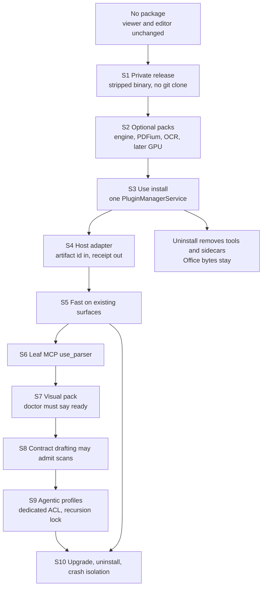

# Desktop Parser Complete Integration Path

Status: planning baseline (2026-09-13)

This is the full path from "Desktop has no Parser" to "a local user can read,
locate, and hand admitted documents to A3S Code," including the later profiles
that the first slice keeps closed.

Narrower contracts:

- [Roadmap](./desktop-parser-integration-roadmap.md) — invariants and phase exits.
- [Execution plan](./desktop-parser-integration-execution.md) — files and gates
  for the first public slice (D0–D4) and the closed follow-ons.

## First principles

Desktop exists so one person can produce inspectable local work through one
A3S Code kernel, while keeping the Office editor snapshot and the security
model they already have. Parser serves that only as evidence about an already
admitted source.

A complete path is not "enable every Parser profile." A step belongs on the
path only if it makes that evidence available without a second runtime, a
second installer, or a source leak. If a later profile cannot be added without
breaking those constraints, it stays off the path.

## What industry practice actually transfers

The useful precedents are process boundaries and optional capability packs,
not in-process document SDKs.

| Practice | What it protects | A3S mechanism |
| --- | --- | --- |
| Language Server Protocol, and MCP after it | The editor does not embed the compiler. A sidecar owns the language. Crash and upgrade stay outside the UI process. | Tauri/Boot spawns `a3s-parser`. The webview never loads the engine. |
| VS Code optional language packs, Ollama and Whisper model packs | The base app stays small. Large or licensed assets install only when the user needs that route, and are checksummed. | Use package `a3s/parser` plus separate digest-pinned asset packs. Not the Tauri app updater. |
| Document AI hosts (Azure Document Intelligence, Google Document AI, Docling as a library behind an API) | The host renders normalized geometry and confidence. It does not treat Markdown, or the model's internal tensors, as the document. | Canonical JSON stays on disk. Overlay basis is `1000000`. Markdown and HTML are projections. |
| Signed supply with one mutation path (extension marketplaces, OCI digests) | Install, upgrade, and remove cannot be a second package manager hiding in the host. | Existing `PluginManagerService`. Plugins UI stays a client. |
| Readiness probes (`docker info`, language-server initialize) | A compiled feature is not runtime support. Missing native libraries fail closed with an actionable state. | `a3s-parser doctor`. Codes stay `capability-unavailable`, `model-missing`, `configuration-required`. |
| Local-first document privacy | Cloud OCR by default is a data-handling decision, not a performance optimization. Transfer is explicit. | Fast and Visual do no model call and no inference-time network. Off-device transfer waits for a later profile and a confirmation policy. |

Practices that do not transfer:

- Linking a closed SDK into the host process. That is how source, crash domains,
  and ABI cycles leak. Parser already depends on `a3s-code-core`.
- Shipping the engine inside the Desktop updater artifact. Desktop's updater
  replaces the signed app transaction. It is the wrong channel for a private
  engine and for OCR weights. `a3s-box` is bundled because the workbench shell
  needs that CLI. Parser is an optional document capability.
- Iframing the vendor workbench. Parser `serve` is a second UI with a wider
  trust boundary than the webview is allowed.
- Silent fallback to a weaker extractor (`lopdf`, viewer text layer) while
  keeping the same result type. Document products that do this train users to
  trust geometry that was never produced.
- `cargo install --git` or a public ACL `repository.url` that clones
  `contra-sense/agentic-parser`. That is source distribution.

`crates/parser` (`A3S-Lab/Parser`) stays untouched. It is a public source tree,
not this path's engine.

## The path

Each stage has one owner and one exit. A later stage must not widen an earlier
boundary to "finish faster."

### S1 — Private release is the only engine artifact

**Owner:** `contra-sense/agentic-parser`.

Build a stripped `a3s-parser` with path remapping. Add `mcp` that exposes only
`parser_capabilities`, `parser_parse`, `parser_project`, and
`parser_validate`. Publish the blob and its SHA-256. Do not publish a source
crate and do not add the git remote to a public workflow.

**Exit:** The MCP tool list is exactly those four names. A strings scan of the
binary does not contain the private checkout path.

### S2 — Optional packs, not one fat installer

**Owner:** Parser release for contents; Use for how they are addressed.

Industry packs stay independent so a Word-only user does not download OCR
weights, and an OCR update does not force a Desktop release.

| Pack | Contents | Unlocks | Client machine |
| --- | --- | --- | --- |
| Engine | `bin/a3s-parser`, public Skill text | DOCX / XLSX / PPTX Fast | Same OS and CPU as Desktop. No GPU, no model, no extra native library. |
| PDF native | Host PDFium plus font-manifest SHA-256 | Digital PDF Fast, and later scanned-PDF render | Native library. Not `vendor/embedpdf/pdfium.wasm`. Evidence pin is PDFium Chromium/7881 until a newer pin is reviewed. |
| OCR text | PP-OCRv6 bundle, digest-pinned | Image Visual, and scanned PDF Visual once the PDF pack is present | Local weights. No download at inference time. CPU is valid and slow. |
| OCR device | CUDA or Metal runtime, only if that binary was built with the matching feature | Faster Visual. Never a requirement. | Matching GPU and the matching build. Do not advertise the 12 pages/s diagnostic as an SLA. |
| Agentic slot | No weights. A Desktop-held ACL path that names one model. | S9 only | See S9. |

OOXML Visual stays off this table. The bundled CLI returns
`parser.office_visual_input_required` until a caller injects visual artifacts.
Desktop does not invent that injector in S2.

**Exit:** Each pack has its own SHA. Installing the engine pack does not
imply the PDF or OCR pack is present. `doctor` reports them separately.

### S3 — One installer

**Owner:** Use `PluginManagerService`. Desktop Plugins UI is a client, as in
[desktop-applet-plugin-path.md](./desktop-applet-plugin-path.md).

Package id `a3s/parser`. ACL matches
`packages/office/integrations/a3s-use/a3s-use-extension.acl` except it has no
`repository.url`. Skill text describes the four host tools and the fail-closed
dispositions. It does not describe engine layout or checkpoint format.

Resolution on the machine, and nowhere else:

1. Explicit absolute override.
2. `A3S_PARSER_PACKAGE_ROOT`.
3. Installed Use package `bin/a3s-parser`.

No `PATH` search. No `Bash(a3s-parser*)`.

**Exit:** Install, upgrade, and remove go through one plan/apply. A package
listing contains no `.rs` engine files. The receipt binds the binary SHA-256.

### S4 — Host adapter

**Owner:** Desktop. File-level gates are the execution plan's D0–D3.

The webview sends an Office artifact id that already passed admission,
including the 32 MiB PDF and DOCX ceilings. The backend spawns the binary with
an argv, writes state under `$A3S_DESKTOP_STATE_DIR/parser/`, and returns a
host receipt. Canonical JSON is opaque bytes. `a3s-parser validate` is the
schema authority, because a Cargo dependency on the private repo would fetch
`src/`.

Long parses follow the document-API practice of a job plus a receipt, not a
webview thread blocked on OCR. Progress is disposition and counts. It does not
stream page text into the model.

**Exit:** A path in the HTTP body does not spawn. A missing binary is
`parser.capability-unavailable`. Public CI uses a fixture executable and never
clones the private repository.

### S5 — Fast on surfaces that already exist

**Owner:** Desktop Office and PDF UI.

PDF viewing stays embedpdf. After a Fast publication, draw overlay regions
from basis `1000000`. Office import stays on `@a3s-lab/office`. Parse evidence
sits beside the compatibility report and is not written back into the editor
snapshot.

**Exit:** Editor snapshot bytes are unchanged by parse. A missing PDF pack
still opens the viewer. It does not extract text and call it a parse.

### S6 — Leaf tool on the Code session

**Owner:** Desktop session admission, same shape as `office_capability.rs`.

Server name `use_parser`. Attach only when the engine pack is installed.
Ordinary sessions omit the tool when it is absent. Document-expert tasks fail
closed only when they declare a parse dependency.

The model may pass artifact or publication ids. The wrapper rejects path-like
arguments before the process sees them. The model does not receive canonical
JSON, source paths, or credentials.

**Exit:** The session tool list contains `mcp__use_parser__parser_parse` and
does not contain `parser_extract_structure`.

### S7 — Visual, gated by doctor

**Owner:** OCR pack plus Desktop gate.

Accept `profile = visual` only when `doctor` reports OCR ready, and for PDF
only when the PDF pack is also ready. `model-missing` produces no body text
and does not fall through to Fast, viewer text, or `lopdf`.

GPU packs stay optional. Fine parse (table, seal, font) stays off the path
while Parser reports `fine_parse_ready = false`. Those bundles are a later
pack, not a silent upgrade of PP-OCRv6 text.

**Exit:** A scanned PDF with the OCR pack missing yields no publication. A
ready Visual run publishes page-owned regions. Balanced is still
`parser.profile-closed`.

### S8 — Contract drafting may admit scans

**Owner:** Desktop `contract-review` admit path.

Only after S7. A `complete` or `partial` Visual publication may be cut into
evidence segments from the bounded Markdown projection. Otherwise keep today's
DOCX or TXT refusal. Do not send canonical JSON into the review runner.

**Exit:** No parser package still refuses scan body text.

### S9 — Agentic profiles, last and still conditional

**Owner:** Parser for the nested session. Desktop only holds a dedicated ACL
slot.

Balanced, Deep, and Planned are on the path only after S6 has a test that the
nested Code session cannot see `use_parser`, host MCP, or the user's skill
roots. The bundled CLI cannot enable Balanced or Deep by itself. It has no
caller-supplied Office visual provider.

| Policy | What the machine must have | What it must not do |
| --- | --- | --- |
| `LocalOnly` | An on-device model. A name is not residency. | Network transfer of source or page images. |
| `AllowOffDevice` | Network and a credential in that dedicated ACL. | Inherit the user session's keys, MCP, or skills. |
| `RequireConfirmation` | The existing A3S Code HITL hook. | Treat a confirmation skip as a performance setting. |

Planned needs `--code-config` with a real `default_model`. The model receives
a path-free task capsule. Deep may withhold publication as `review-pending`.
Desktop must show that as an unresolved review, not as a failed parse and not
as a complete document.

**Exit:** A default Desktop profile still cannot select these. A nested
session test shows `use_parser` absent. Off-device transfer without
confirmation does not run.

### S10 — Lifecycle

**Owner:** Use for package generations. Desktop for local sidecars.

This is the same generation rule as applet install. An upgrade republishes
the package. In-flight parses keep the binary SHA they started with. New
parses use the new generation. A publication is valid only while its binary
SHA, pack SHAs, and source fingerprint still match. Mismatch offers a new
run. It does not reinterpret old canonical JSON with a new engine in place.

Uninstall removes the MCP tool and the parser sidecars. It does not delete
Office documents or PDF bytes.

A sidecar crash or timeout returns `parser.run-failed` and leaves the editor
open. Restart does not resume by guessing. Resume is allowed only when the
source SHA, profile, and run-policy digest match, which is Parser's existing
resume contract.

Disk stays bounded by Desktop ceilings plus an explicit sidecar budget.
Parser's 512 MiB checkpoint discovery cap is a read limit, not a promise that
the client must reserve 512 MiB.

**Exit:** Upgrade does not hot-swap a running parse. Uninstall leaves Office
bytes and removes parser tools. A killed sidecar does not take down the
webview.

## What the client machine needs, by stage

| Stage | Extra machine requirement |
| --- | --- |
| Before S3 | None. Current Desktop is the product. |
| S5 engine only | Packaged `a3s-parser` for OOXML Fast. CPU. No network. |
| S5 with PDF pack | Host PDFium and font-manifest SHA. Still no GPU and no model. |
| S7 | PP-OCRv6 weights on disk. CPU works. GPU pack is optional and unsigned as an SLA. |
| S9 | A dedicated model, local or confirmed off-device. Not the user's live session. |

No stage requires the Parser source tree, a Rust toolchain, or the viewer's
WASM PDFium as a substitute renderer.

## Non-goals, including ones that look complete

- Vendoring or retargeting `crates/parser`.
- Putting Parser or OCR weights in the Tauri updater payload.
- Embedding `serve` or copying its HTML into an applet.
- A second editor, or replacing `@a3s-lab/office` import.
- Enabling Balanced, Deep, Planned, or OOXML Visual before their exits.
- Advertising fine-parse, GPU page rates, or a 500-pages-per-second Desktop SLA.
- Fetching remote documents inside the parse.
