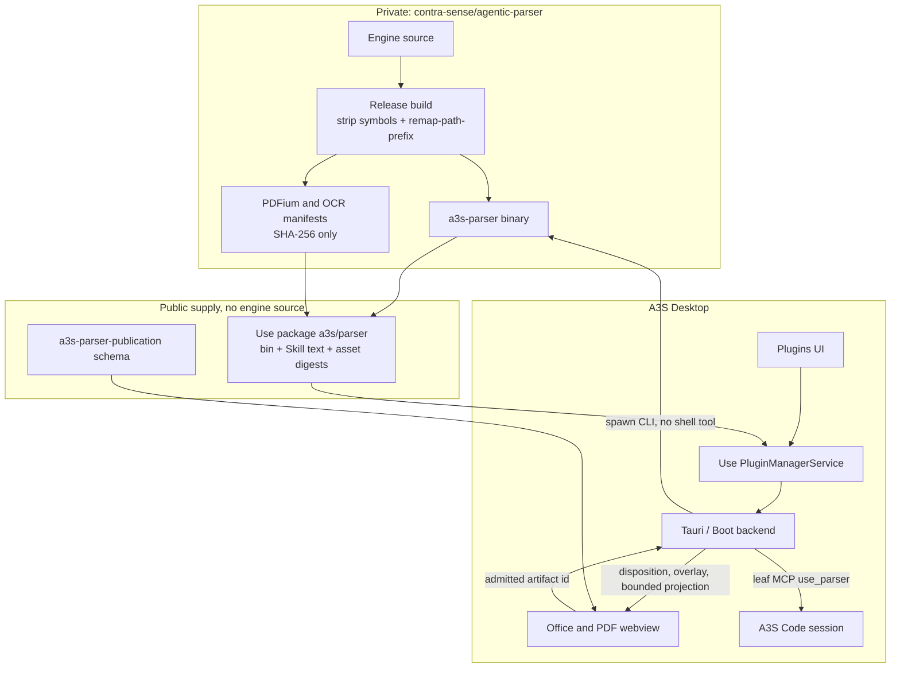
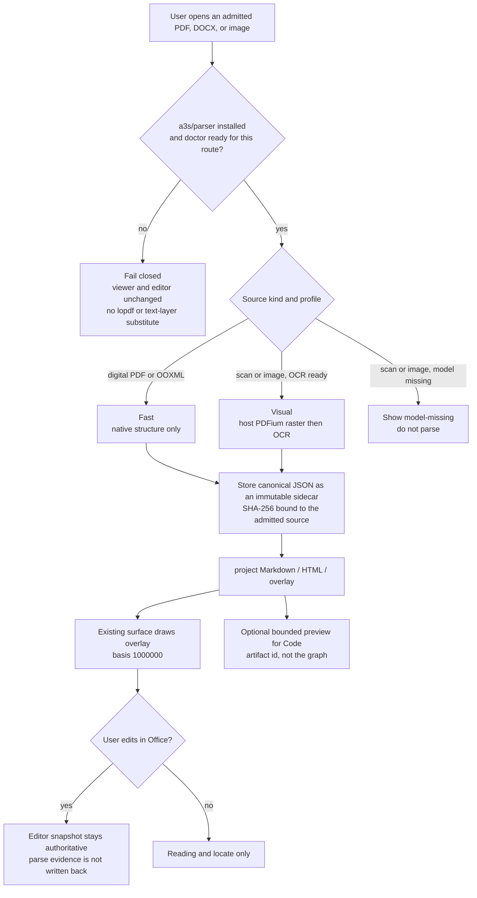

# Desktop Parser Integration Roadmap

Status: planning baseline (2026-09-13)

## Objective

Integrate [A3S Parser](https://github.com/contra-sense/agentic-parser)
(`a3s-parser` 0.1.1, private) into A3S Desktop so an admitted Office, PDF, or
image source can produce inspectable, source-grounded reading evidence.

The engine source must not enter the Desktop repository, the Desktop build
graph, the webview, or a second installer. Parser remains a downstream
process. Desktop remains the workbench.

Related:

- [Desktop product](../apps/desktop/PRODUCT.md) — one Office/Code workbench, one
  A3S Code kernel, local-first.
- [Office documents](../apps/desktop/docs/office-documents.md) — editable
  snapshot is authoritative for Word; Markdown is a review projection.
- [Contract drafting applet](../apps/desktop/docs/contract-review-applet.md) —
  PDF is view-only today; scans are not admitted as body text.
- [Applet plugin path](./desktop-applet-plugin-path.md) — Use is the only
  package mutation path.
- Desktop already resolves installed binaries without compiling them:
  `a3s-office` via plugin MCP, `a3s-box` via a packaged resource tree.
- [Execution plan](./desktop-parser-integration-execution.md) — work packages,
  files, and gates for carrying this roadmap out without a source dependency.
- [Complete integration path](./desktop-parser-integration-path.md) — supply,
  optional packs, product surfaces, and later profiles as one chain.

---

## First principles

Derive the system, then assign owners. If an invariant is owned by the wrong
layer, Desktop either leaks the private engine or grows a second document
runtime.

### What must stay true

1. Desktop's job is inspectable local work through one A3S Code kernel. Parser
   serves that job only by turning an already admitted source into evidence
   the user can read, locate, and optionally hand to Code.
2. The gap is real. PDF viewing uses embedpdf and `pdfium.wasm`. DOCX import
   uses `@a3s-lab/office` and keeps a compatibility report. Contract drafting
   refuses scanned PDF body text. None of those surfaces own a canonical
   document graph, normalized geometry, or OCR provenance.
3. A simpler substitute fails the product. `lopdf` text extraction and the
   viewer text layer have no geometry, disposition, or reconciliation. They
   must not impersonate a parse.
4. In-process linking fails the architecture. Parser already depends on
   `a3s-code-core`. A Desktop or Code dependency on Parser is a cycle, and it
   puts private Rust sources into the public checkout and CI.
5. Parser's loopback `serve` workbench is a host UI over Parser contracts, not
   an API for Desktop. The webview must not open it, upload to it, or learn
   host paths, PDFium libraries, model paths, or credentials.

### Invariants

| Id | Invariant | Owner |
| --- | --- | --- |
| I1 | Engine source, adapters, checkpoints, and model weights never appear in the Desktop git tree, `Cargo.lock`, webview bundle, or applet HTML. | Parser release + Desktop CI |
| I2 | One installer. Desktop Plugins UI stays a client of Use `PluginManagerService`. | Use |
| I3 | Only the Tauri/Boot backend spawns `a3s-parser`. The webview sends an admitted artifact id, never a host path or budget. | Desktop backend |
| I4 | Canonical JSON is parse authority. Markdown, HTML, and overlays are projections and must not be written back as the Office editor snapshot. | Parser publishes; Desktop stores and renders |
| I5 | Missing binary, PDFium, or OCR model fails closed (`capability-unavailable`, `model-missing`, `configuration-required`). No silent fallback to viewer text or `lopdf`. | Desktop backend |
| I6 | Host Code sessions see a leaf MCP. Parser's own nested Code session, if it ever exists, must not receive that MCP. | Desktop session admission |
| I7 | Viewer `pdfium.wasm` displays pages. Parser's host PDFium renders exact page rasters for OCR. They are not interchangeable. | Desktop UI vs Parser package |
| I8 | Desktop byte ceilings stay Desktop-owned. Current Office PDF and DOCX caps are 32 MiB. Parser's 128 MiB workbench upload limit does not apply. | Desktop Office domain |

### What each repository owns

| Repository | Owns here | Does not own |
| --- | --- | --- |
| A3S Parser (private) | Admission, profiles, reconciliation, canonical graph, CLI, stripped binary | Desktop chrome, Office editing, plugin install, session policy |
| `a3s-parser-publication` | Runtime-free canonical envelope (Serde, JSON, SHA-256) | Engine, Office, OCR, Code |
| A3S Use | Signed package supply, install/upgrade/remove, binary SHA receipt | Parse semantics, overlay rendering |
| A3S Desktop | Resolve the installed binary, invoke it on admitted artifacts, store the publication, draw overlays, project bounded context into Code | Parser source, a second document editor, Parser's `serve` UI |
| A3S Code | Existing MCP client, permissions, traces | Document graph, Parser checkpoints |
| A3S Office | Deterministic structure and the Desktop editor snapshot | Agent policy, OCR, Parser reconciliation |

---

## Frozen host contract

These names are the integration surface. They are not Parser's internal tool
set (`parser_inspect`, `parser_extract_structure`, `parser_ocr_artifact`, and
the rest). The model and the webview never see that set.

| Host tool | CLI behind it | Model-visible result |
| --- | --- | --- |
| `parser_capabilities` | `doctor` / `capabilities` | Compiled route and readiness. No run state. |
| `parser_parse` | `parse` | Disposition, limitation codes, counts, opaque artifact id, bounded preview. |
| `parser_project` | `project` | Markdown, HTML, or JSONL from canonical JSON already stored by Desktop. |
| `parser_validate` | `validate` | Validation receipt. No new parse. |

MCP server id: `use_parser`. Tool prefix: `mcp__use_parser__*`.

Inputs are Desktop-issued artifact ids. Outputs never include source paths,
artifact paths, provider configuration, credentials, or the full canonical
graph. Overlay geometry uses Parser's published `0..=1_000_000` basis. Desktop
scales boxes to the displayed page; it does not invent finer boxes.

Profiles in the first shippable slice: **Fast** and **Visual** only.
Balanced, Deep, and Planned stay closed until P6. Those profiles start a
nested A3S Code session and would recurse if that session could call
`use_parser`.

---

## Flow

### Supply and authority

Parser source stays in the private repository. Desktop and Use only carry a
stripped binary, a public publication schema, and a SHA receipt.

### Runtime: open, parse, read

The user never leaves the existing Office or PDF surface. Parse evidence is
attached beside the admitted source. It does not replace the editable
snapshot.

---

## Phases

Each phase has one exit. Later phases must not start by widening an earlier
boundary.

### P0 — Freeze the host contract

**Owner:** Desktop planning, against the Parser publication surface.

No binary, no UI, no session tool.

**Mechanisms:**

1. Pin the publication schema version Desktop will accept. Unknown envelopes
   fail closed.
2. Lock the four host tools, the `use_parser` server id, and the artifact-id
   rule above.
3. Lock I1–I8 in this document. Reject vendor, submodule, `serve` iframe, and
   `Bash(a3s-parser*)` in review.

**Exit:** This roadmap is the contract. A later change that adds a host path,
credential, or internal Parser tool to the webview or model schema fails the
gate.

### P1 — Private binary, public package

**Owner:** Parser release, then Use supply.

**Mechanisms:**

1. Release a stripped `a3s-parser` with path remapping so panic locations do
   not contain the private checkout path.
2. Ship host PDFium and OCR bundles as separate digest-pinned assets, not as
   objects linked into `code-core` or Desktop.
3. Publish Use package `a3s/parser`: `bin/a3s-parser`, public Skill text, asset
   digest manifest. Package inspection must show no Rust sources and no
   `src/`.
4. Desktop CI may download the binary by expected SHA. It must not `git clone`
   `contra-sense/agentic-parser`.

**Exit:** A package receipt binds the binary SHA. Installing it does not
require Parser git credentials on a Desktop developer machine beyond the Use
catalog token already used for other packages.

### P2 — Resolve and invoke, still no new chrome

**Owner:** Desktop backend.

Follow `office_capability.rs`, not a new installer. Resolution order:

1. Explicit absolute override.
2. `A3S_PARSER_PACKAGE_ROOT`.
3. Use plugin install directory (`bin/a3s-parser`).
4. Optional packaged resource tree, same shape as `a3s-box`, only if P1
   published a SHA-pinned artifact.

**Mechanisms:**

1. Spawn `parse` / `project` / `validate` / `doctor` as a bounded process.
   State directory: `$A3S_DESKTOP_STATE_DIR/parser/`.
2. Accept only an artifact id that already passed Office admission, including
   the 32 MiB PDF and DOCX ceilings.
3. Persist canonical JSON as an immutable sidecar bound to the source SHA-256.
4. Return disposition, limitation codes, counts, and projection handles. Do
   not return host paths.

**Exit:** Missing binary maps to a stable unavailable error. A webview request
with a filesystem path is rejected. A successful Fast parse of a digital PDF
or DOCX stores a validated publication without changing the editor snapshot.

### P3 — Read and locate on surfaces that already exist

**Owner:** Desktop Office/PDF UI.

**Mechanisms:**

1. PDF viewer keeps embedpdf. After a Fast publication, draw overlay regions
   from the published basis. Click locates; it does not inject the graph into
   the model.
2. Office document import stays on `@a3s-lab/office`. Show parse evidence as
   provenance beside the compatibility report. Never replace the structured
   snapshot with Parser HTML.
3. Cap the Markdown preview at the existing A3S Code projection ceiling
   (4 MiB) and prefer a shorter preview in the agent turn.

**Exit:** Overlay edges use `coordinateBasis = 1000000` only. Opening a parsed
document and editing it still round-trips the Office snapshot, not the
canonical graph.

### P4 — Visual route for scans and images

**Owner:** Desktop backend for gating; Parser package for OCR assets.

**Mechanisms:**

1. Call `doctor` before offering Visual. `model-missing` and
   `configuration-required` stay visible. Do not treat a compiled feature flag
   as runtime support.
2. Use the package's host PDFium for page rasters. Do not point Parser at
   `vendor/embedpdf/pdfium.wasm`.
3. Admit standalone images only as a parse source into the existing reading
   surface. Do not build an image editor.
4. Contract drafting may turn a Visual publication into evidence segments only
   when this phase is ready. Otherwise keep today's "DOCX or TXT" refusal.

**Exit:** A scanned PDF with OCR assets missing does not produce body text. A
ready Visual run publishes page-owned regions and a bounded reading
projection without enabling Balanced/Deep.

### P5 — Leaf tool on the Code session

**Owner:** Desktop session admission, using the existing MCP client.

**Mechanisms:**

1. When the package is installed, attach `use_parser` the same way
   `use_office` is attached. Tools operate on artifact ids issued in P2.
2. Ordinary sessions omit the tool when the package is absent. Document-expert
   tasks that declare a parse dependency fail closed with install guidance,
   matching Office package admission.
3. Do not grant `Bash` for the binary.
4. The ACL injected into any future Parser-owned session must not include
   `use_parser`.

**Exit:** A Code turn can call `parser_parse` / `parser_project` and receives
no source path. The host session cannot see Parser-internal tools.

### P6 — Agentic profiles, closed until the leaf is proven

**Owner:** Parser for the nested session; Desktop only for a dedicated ACL
slot.

Not part of the first integration. Balanced, Deep, and Planned require a
model, quality triage, and a nested A3S Code session. Enable them only when
P5 is in production and a test proves the nested session has no `use_parser`,
no host MCP, and no skill roots from the user session.

**Exit:** Not started. No Desktop default may select these profiles.

---

## Non-goals

- Vendoring, submodule, or Cargo-dependency of `agentic-parser` in
  `apps/desktop` or `crates/code`.
- Embedding Parser `serve`, or copying its HTML workbench into an applet.
- A second Office editor, DOCX regenerator, or spreadsheet engine.
- Replacing `@a3s-lab/office` import, compatibility reports, or PDF viewing.
- Treating viewer text, `lopdf`, or WASM PDFium as a parse result.
- Exposing Parser-internal tools, full canonical JSON, or host paths to the
  model or the webview.
- Balanced, Deep, or Planned profiles in the first slice.
- Fetching remote documents inside the parse. Admission stays on bytes Desktop
  already stored.
- Claiming Parser's development page-rate numbers as a Desktop SLA.

---

## Verification

The planning gate is this document plus the current Desktop boundaries it
cites. Implementation gates, in order:

| Phase | Evidence that must exist before the phase is called done |
| --- | --- |
| P0 | Host tool names and I1–I8 unchanged in review |
| P1 | Use receipt SHA; package file list has no `src/` or `.rs` engine files |
| P2 | Unavailable error without the binary; path injection rejected; sidecar SHA matches the admitted source |
| P3 | Overlay uses basis `1000000`; editor snapshot bytes unchanged by parse |
| P4 | Missing OCR model does not yield body text; contract drafting still refuses scans until Visual is ready |
| P5 | Session tool schema has no path or credential fields; no `Bash(a3s-parser*)` grant |
| P6 | Remains closed |
